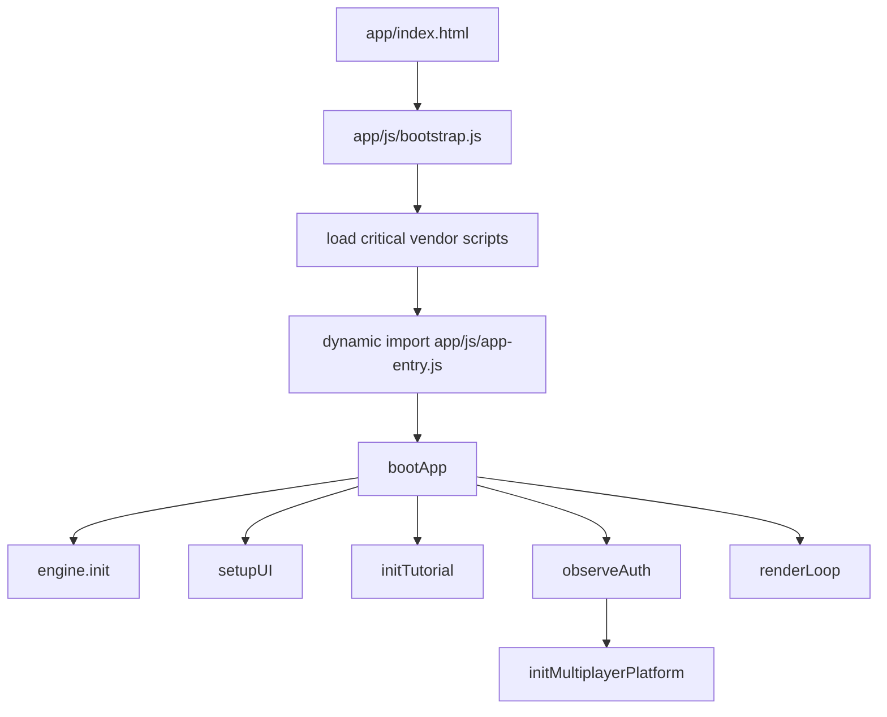
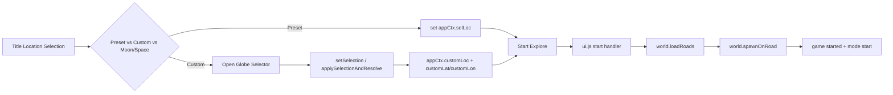
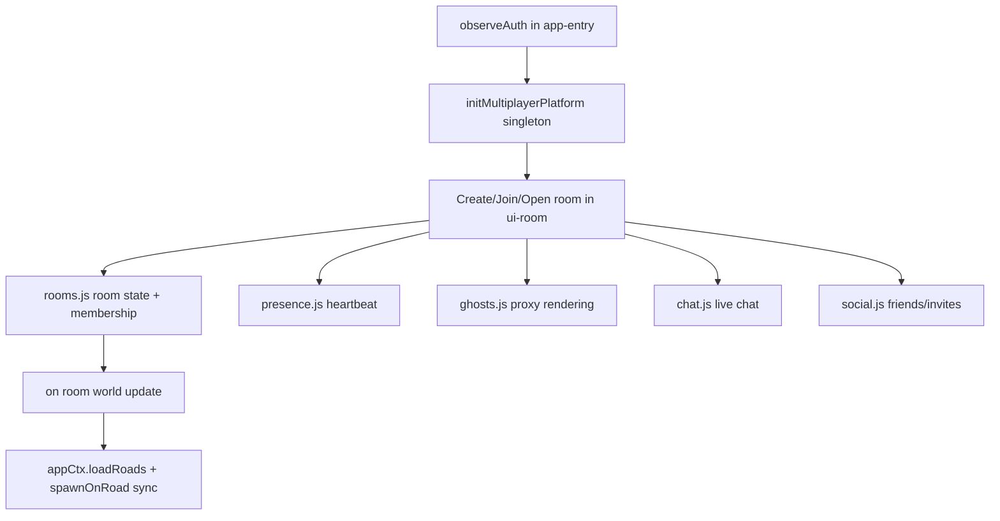

# Complete Feature and System Inventory Report

Date: 2026-03-11  
Repository: `WorldExplorer`  
Branch inspected: `world-explorer`  
Primary goal: AI-review-ready architecture inventory for improvement planning

This document is a source-first technical inventory of the runtime, backend, persistence, and operational systems currently present in this branch.

## 1. Scope and Method

### 1.1 Included surfaces

- Canonical runtime: `app/*`
- Legacy/shared support modules: `js/*` (auth, firebase init, entitlements, billing)
- Hosted mirror: `public/app/*`
- Backend/API: `functions/index.js`
- Security and indexes: `firestore.rules`, `firestore.indexes.json`
- Tooling and gates: `scripts/*`, `tests/*`, `package.json`
- Hosting/deploy topology: `firebase.json`

### 1.2 Excluded from active runtime scope

- `WorldExplorer3D-rdt-engine/`
- `_style_reference_worldexplorer3d/`
- `world-explorer-esm/`
- transient artifacts (`output/`, `results/`, `tmp/`, etc.)

### 1.3 Inventory approach

- Read direct runtime entrypoints and major system files.
- Trace import graph and shared-state contracts.
- Enumerate key data and network boundaries.
- Summarize high-risk coupling and improvement opportunities for AI-assisted refactors.

---

## 2. Deployment and Source-of-Truth Topology

## 2.1 Canonical edit path

- Canonical runtime source: `app/*`
- Production hosting root: `public/*`
- Mirror target for runtime: `public/app/*`

## 2.2 Mirror workflow

- Sync: `npm run sync:public`
- Parity check: `npm run verify:mirror`

`firebase.json` confirms hosting serves `public`, with Cloud Functions rewrites for billing/account APIs.

---

## 3. High-Level Runtime Architecture

## 3.1 Boot pipeline

## 3.2 Shared runtime contract model

The app uses a **shared mutable context bus**:

- `app/js/shared-context.js` exports `ctx` (`appCtx`)
- Most modules are side-effect imports and call `Object.assign(appCtx, {...})`
- Cross-module calls happen through `appCtx` function/state attachment rather than direct imports

Implication: import order is a functional dependency in `app/js/app-entry.js`.

## 3.3 Environment state model

`app/js/env.js` centralizes environment states:

- `EARTH`
- `SPACE_FLIGHT`
- `MOON`

Legacy booleans (`onMoon`, `spaceFlight.active`, etc.) are kept in sync for backward compatibility.

---

## 4. File/Module Inventory Snapshot

## 4.1 Runtime module counts

- `app/js` JavaScript files: 41
- `app/js/multiplayer`: 10
- `app/js/ui`: 1 (`globe-selector.js`)
- tests (`tests/*.mjs`): 2

## 4.2 Largest runtime files (complexity hotspots)

1. `app/js/world.js` (4275 lines)
2. `app/js/game.js` (2811)
3. `app/js/ui.js` (2616)
4. `app/js/multiplayer/ui-room.js` (2555)
5. `app/js/solar-system.js` (2416)
6. `app/js/engine.js` (2310)
7. `app/js/terrain.js` (1774)

These are primary refactor candidates due to size and coupling.

## 4.3 Key module responsibilities

| Module | Responsibility | Key links |
|---|---|---|
| `app/js/bootstrap.js` | Vendor load + module boot | loads `manifest.js`, imports `app-entry.js` |
| `app/js/app-entry.js` | Runtime orchestration | init engine/UI/tutorial/multiplayer + `renderLoop` |
| `app/js/state.js` | Core mutable state graph | seeds `appCtx` with runtime objects/flags |
| `app/js/ui.js` | Title/menu, launch, controls, share, overlays | uses `createGlobeSelector`, drives start flow |
| `app/js/ui/globe-selector.js` | Custom location picker and reverse lookup | updates `appCtx.customLoc`, callbacks to UI |
| `app/js/world.js` | OSM fetch, geometry build, fallback worlds, spawn/teleport | depends on terrain/perf/rdt and game state |
| `app/js/terrain.js` | Terrarium elevation streaming and terrain visuals | classifies snow/alpine/grass profiles |
| `app/js/engine.js` | Three.js renderer, quality/PBR setup, model loading | owns scene/camera/renderer bootstrap |
| `app/js/game.js` | game modes/objectives/panels/logic | uses world + multiplayer paint claims |
| `app/js/map.js` | minimap/large-map drawing and conversions | world-to-map link + room markers |
| `app/js/perf.js` | perf modes, adaptive budgets, overlays | consumed by world load/profile logic |
| `app/js/multiplayer/ui-room.js` | multiplayer UI platform and room lifecycle integration | composes rooms/presence/chat/social/ghosts |
| `app/js/multiplayer/rooms.js` | room CRUD/join/list/settings/home base | Firestore `rooms` + `users/*/myRooms` |
| `app/js/multiplayer/presence.js` | live player heartbeat and subscriptions | Firestore `rooms/{id}/players` |
| `app/js/multiplayer/chat.js` | room chat with moderation/rate controls | Firestore `rooms/{id}/chat` + `chatState` |
| `app/js/multiplayer/ghosts.js` | remote avatar proxy rendering | consumes presence snapshots |
| `app/js/tutorial/tutorial.js` | staged onboarding and persistence | listens to UI/runtime tutorial events |
| `js/firebase-init.js` | Firebase config discovery/init | used by auth, multiplayer, entitlements |
| `js/auth-ui.js` | auth APIs (Google, email, guest, token) | observed by `app-entry.js` |
| `js/entitlements.js` | plan/entitlement state normalization + subscription | used by multiplayer UI/account |
| `js/billing.js` | client wrappers for function endpoints | used by account/donation flows |

---

## 5. Critical System Linkages and Flows

## 5.1 Launch and location flow

## 5.2 Shared geolocation flow (Use My Location)

Implementation is centralized in `app/js/ui.js`:

- `requestCurrentPosition()` uses `navigator.geolocation.getCurrentPosition(...)`
- `runUseMyLocation(source)` is shared by both entry points:
  - title button `#titleUseMyLocationBtn`
  - globe selector callback `onUseMyLocation`
- On success: calls `globeSelector.applySelectionAndResolve(...)`
- On failure: human-readable status in title + globe selector status area
- Uses one-shot geolocation (`getCurrentPosition`), not `watchPosition`

## 5.3 Globe selector selection pipeline

`app/js/ui/globe-selector.js`:

1. click/search/manual input -> coordinate clamp
2. `setSelection(...)` updates marker/inputs/readouts
3. `applySelectionAndResolve(...)` updates `appCtx.customLoc` + hidden custom lat/lon fields
4. starts reverse lookup (non-blocking enrichment)
5. `Start Here` callback returns chosen selection to `ui.js`

Design characteristic: coordinate validity drives usability; naming is enhancement.

## 5.4 World generation / loading flow

`app/js/world.js` `loadRoads()`:

- resolves target location from preset/custom selection
- clears prior world meshes/state
- resets terrain streaming and load metrics
- computes RDT seed and adaptive budget profile
- issues Overpass query for roads/buildings/landuse/POIs
- applies tile-aware caps (`limitWaysByTileBudget`, `limitNodesByTileBudget`)
- builds meshes, colliders, water/landuse/poi layers
- finalizes spawn (`spawnOnRoad`) and LOD update
- fallback handling:
  - retry pass
  - sparse no-road mode
  - synthetic fallback world in specific game modes

## 5.5 Terrain/elevation and visual profile flow

`app/js/terrain.js`:

- elevation via Terrarium tiles (`TERRAIN_TILE_URL` in config)
- mesh height sampling (`terrainMeshHeightAt`)
- road/building conformance rebuild on terrain updates
- visual classification for terrain material profile:
  - `classifyTerrainVisualProfile(...)`
  - outputs `grass`, `snow`, or `snowRock`
  - uses latitude + elevation percentiles (`p75`, `p90`)
- applies texture/material profile through `applyTerrainVisualProfile(...)`

## 5.6 Multiplayer room activation flow

---

## 6. Data and Persistence Inventory

## 6.1 In-memory runtime graph

Main mutable graph is in `appCtx` with domains including:

- scene/render: `scene`, `camera`, `renderer`, `composer`, lighting
- world data: `LOC`, `roads`, `buildings`, `landuses`, `waterAreas`, `pois`
- player/modes: `car`, `drone`, `Walk`, `gameMode`, `droneMode`
- systems: `perf`, `terrain`, `tutorial`, `multiplayerMapRooms`

## 6.2 Local browser storage keys

Observed keys used by canonical runtime/support modules:

- `worldExplorer3D.lastLocation.v1`
- `worldExplorer3D.globeSelector.savedFavorites`
- `worldExplorer3D.tutorialState.v1`
- `worldExplorer3D.memories.v1`
- `worldExplorer3D.memories.test`
- `worldExplorer3D.buildBlocks.v1`
- `worldExplorer3D.buildBlocks.test`
- `worldExplorer3D.paintTown.color.{userKey}`
- `worldExplorer3D.flowerChallenge.playerName`
- `worldExplorer3D.flowerChallenge.localLeaderboard.v1`
- `worldExplorer3D.paintTown.localLeaderboard.v1`
- `worldExplorer3D.firebaseConfig`
- `worldExplorerRenderQualityLevel`
- `worldExplorerSsaoEnabled`
- `attomApiKey`, `estatedApiKey`, `rentcastApiKey`, `realEstateEnabled`

## 6.3 URL/query state usage

- Multiplayer invite/open: `?room=XXXXXX&tab=multiplayer&invite=1`
- Share experience state: `loc/lat/lon/name/launch/mode/travel/cam/seed/ref/yaw/pitch` parameters

---

## 7. Backend + Security Inventory

## 7.1 Cloud Functions (`functions/index.js`)

Region: `us-central1`

Endpoints:

- `createCheckoutSession`
- `createPortalSession`
- `startTrial`
- `enableAdminTester`
- `getAccountOverview`
- `listBillingReceipts`
- `updateAccountProfile`
- `deleteAccount`
- `stripeWebhook`

Core backend responsibilities:

- CORS allowlist enforcement
- Firebase ID token verification
- Stripe checkout/portal/webhook integration
- plan normalization and room quota fields
- user data lifecycle cleanup on deletion

## 7.2 Firestore data model

Top-level collections:

- `users`
- `rooms`
- `flowerLeaderboard`
- `paintTownLeaderboard`
- `activityFeed`
- `explorerLeaderboard`

User subcollections:

- `friends`
- `recentPlayers`
- `incomingInvites`
- `myRooms`

Room subcollections:

- `players`
- `chat`
- `chatState`
- `artifacts`
- `blocks`
- `paintClaims`
- `state` (`homeBase`)

## 7.3 Firestore indexes

`firestore.indexes.json` contains two room indexes:

- `cityKey ASC, visibility ASC, createdAt DESC`
- `visibility ASC, featured ASC, createdAt DESC`

## 7.4 Firestore rules boundary

`firestore.rules` includes extensive validators for:

- user profile writes
- room ownership/membership permissions
- room create quota rules
- presence/chat schema + anti-spam constraints
- artifact/block/paint/homeBase payload validity
- invite/friends/recent player structure

Key design: write permissions are schema-driven and role/membership-gated.

---

## 8. External Dependencies and Service Boundaries

## 8.1 Rendering/runtime libs

- Three.js + example addons from CDN (`r128` family)
- DRACO decoders (JSDelivr)

## 8.2 Geospatial/data providers

- Overpass API endpoints (multiple)
- OSM vector tile endpoint (`shortbread_v1`) for water
- Terrarium elevation tiles (S3)
- Nominatim (search + reverse)
- BigDataCloud reverse geocode fallback
- OSM/ArcGIS map tiles

## 8.3 Platform services

- Firebase Auth / Firestore SDKs (gstatic CDN)
- Stripe (server-side in functions)

## 8.4 Optional content APIs

- Real-estate providers (Estated, ATTOM, Rentcast)
- Wikidata/Wikipedia enrichment

Operational note: several core world systems depend on third-party network reliability; fallback behavior exists but is not uniform across all providers.

---

## 9. QA, Validation, and Release Gates

Scripts in `package.json`:

- `npm run sync:public`
- `npm run verify:mirror`
- `npm run test`
  - `test:rules` via Firestore emulator
  - `test:runtime` via Playwright runtime invariants
- `npm run release:verify`

Additional testing utilities:

- `tests/painttown.integration.test.mjs`
- `scripts/capture-perf-overlay.mjs`

Release verifier enforces mirror + rules + runtime invariants in sequence.

---

## 10. Architectural Coupling and Risk Hotspots

## 10.1 High coupling patterns

- `appCtx` mutable bus + side-effect imports creates implicit contracts.
- Large files combine UI/domain/render/network concerns.
- Several systems depend on DOM IDs directly inside logic modules.

## 10.2 Runtime fragility hotspots

- `world.js` complexity and long control paths (load/fallback/mesh lifecycle).
- `ui.js` breadth (title, controls, sharing, launch, geolocation, mode toggles).
- `multiplayer/ui-room.js` merges UI rendering + backend orchestration.

## 10.3 Operational risks

- External provider instability (Overpass, geocoding, tiles).
- Mirror drift between `app/*` and `public/app/*` if sync is skipped.
- Cross-folder legacy overlap (`app/js/*` vs `js/*`) can confuse modification targets.

---

## 11. AI-Focused Improvement Opportunities

Prioritized, low-to-high effort recommendations.

## 11.1 High-impact / low-to-medium risk

1. Formalize `appCtx` contract surface.
   - Add a typed interface/spec document for required properties per module.
   - Catch missing linkage earlier during refactors.

2. Split `world.js` into domain modules.
   - Candidate slices: fetch/cache, feature selection budgets, geometry builders, spawn/teleport, LOD.

3. Split `ui.js` into focused controllers.
   - Title launch controller, in-game HUD/controller layer, sharing, and geolocation service module.

4. Add structured diagnostics mode for world-load failure causes.
   - Return reason codes for: fetch failure, no-road sparse area, geometry budget clipping, spawn fallback.

## 11.2 Medium-impact

5. Consolidate provider adapters.
   - Standardize timeout/retry/cache contracts for geocode/overpass/tile providers.

6. Add region-profile telemetry snapshot to perf overlay.
   - Expose terrain visual mode (`grass/snow/snowRock`), elevation stats, road/building density.

7. Harden multiplayer open/join handoff.
   - Add explicit room activation state machine transitions and user-facing failure states.

## 11.3 Higher effort / strategic

8. Introduce explicit service boundaries.
   - Replace cross-module `appCtx` mutation with subsystem service objects and event buses.

9. Add integration test matrix for remote/sparse locations.
   - Validate load + spawn + terrain profile for Antarctica, high mountain, desert, island, and dense city.

10. Build “provider health fallback matrix.”
    - Drive deterministic behavior when one or more external APIs fail.

---

## 12. AI Onboarding Guide (How to Work This Repo Safely)

1. Edit canonical runtime in `app/*` first.
2. After any runtime edits, run:
   - `npm run sync:public`
   - `npm run verify:mirror`
3. Run gates:
   - `npm run test`
   - `npm run release:verify`
4. For location/world issues, inspect in this order:
   - `app/js/ui.js` (launch and mode gates)
   - `app/js/ui/globe-selector.js` (selection and label pipeline)
   - `app/js/world.js` (fetch/budget/build/spawn)
   - `app/js/terrain.js` (elevation + terrain visual profile)
5. For multiplayer issues, inspect in this order:
   - `app/js/multiplayer/ui-room.js`
   - `app/js/multiplayer/rooms.js`
   - `app/js/multiplayer/presence.js`
   - `firestore.rules`

---

## 13. Targeted “Where To Improve Next” Backlog

- **World robustness:** unify sparse-region fallback quality and remove visual emptiness artifacts.
- **Terrain realism:** evolve snow/alpine/desert material profiles with stronger PBR blending and macro variation.
- **Spawn quality:** add terrain slope and collision-aware safe spawn scoring with fallback escalation.
- **HUD readability:** move long location metadata into compact/expand rows to reduce gameplay occlusion.
- **Multiplayer UX:** improve room open/join state transitions and permission diagnostics.
- **Mobile simplification:** reduce persistent button density with progressive disclosure and mode-aware controls.

---

## 14. Appendix: Key Runtime Entry Files

- `app/index.html`
- `app/js/bootstrap.js`
- `app/js/app-entry.js`
- `app/js/shared-context.js`
- `app/js/state.js`
- `app/js/ui.js`
- `app/js/ui/globe-selector.js`
- `app/js/world.js`
- `app/js/terrain.js`
- `app/js/multiplayer/ui-room.js`
- `functions/index.js`
- `firestore.rules`

