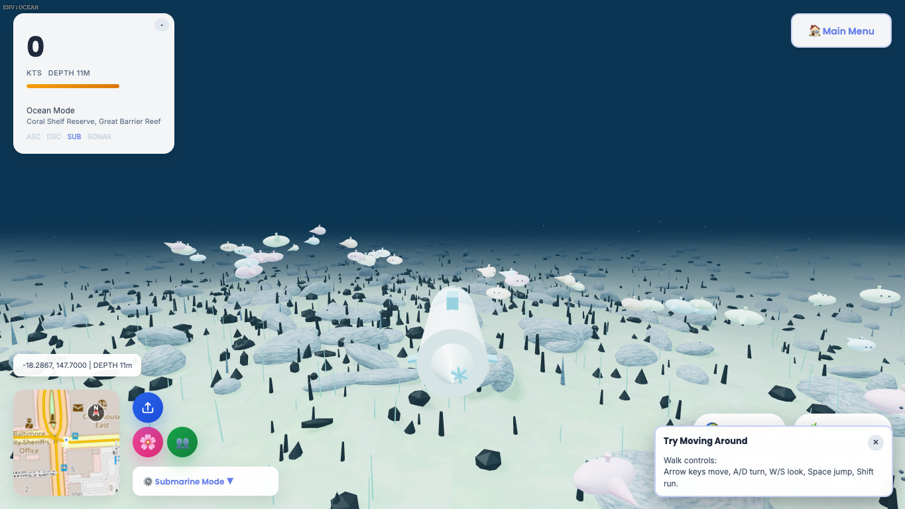

# World Explorer 3D

[](https://github.com/RRG314/WorldExplorer3D/actions/workflows/runtime-verify.yml)
[](https://github.com/RRG314/WorldExplorer3D/actions/workflows/deploy-pages-public.yml)
[](LICENSE)

World Explorer 3D is a browser-based 3D geospatial exploration application built around real-world map data, including OpenStreetMap-derived roads, buildings, land-use, water, and place context.

It is an interactive exploration app, not a flat map viewer and not a routing/navigation replacement. The focus is immersive place exploration across Earth, Moon, Space, and Ocean destination modes.

## Current Status

- Active and usable, with ongoing iteration.
- Canonical runtime source: `app/*`.
- Canonical landing/account sources: `index.html`, `account/index.html`.
- Hosting/runtime mirror: `public/*` (`public/app/*`, `public/index.html`, `public/account/index.html`).
- Includes geolocation launch flow and Ocean mode in the current branch.
- Core play, traversal modes, and the large map remain free; donations are optional recognition/support only.

## What It Does

- Launch from preset cities or custom coordinates.
- Use geolocation (`Use My Location`) in title and globe selector flows.
- Explore in 3D with driving, walking, drone, and rocket traversal.
- Route walk/drive/drone mode changes through one shared travel-mode controller so keyboard and UI transitions stay in sync.
- Keep traversal switches and custom/geolocation launches on safe ground: valid positions stay put, invalid positions resolve to the nearest safe road or ground spawn based on the active mode.
- Switch destinations (Earth, Moon, Space, Ocean) from title and in-game menus.
- Render map-informed world context (roads/buildings/land-use/water) for Earth scenes.
- Apply shared surface rules so polar regions resolve to snow/frozen water and arid regions resolve to sand terrain instead of defaulting everything to temperate grass.
- Add OSM-driven vegetation so forests, woods, parks, tree rows, and individual mapped trees make Earth scenes feel less empty without turning every tile into high-detail foliage.
- Use roads for drive routing and keep walking/navigation aligned to the core road-and-ground traversal network while the separate foot/cycle/rail rollout is paused for cleanup.
- Selectively support mapped building interiors when useful indoor OSM data exists, with entrance/exit interaction on `E` and no always-on global interior load.
- Show an enterable-buildings section in the large-map legend; it scans nearby full-footprint buildings on demand and lists mapped interiors that can actually be entered.
- Provide minimap/large-map overlays and runtime controls for exploration, with `M` for the large map.
- Add performance-conscious rooftop HVAC/detail and broader building color variation so dense cities read less flat/repetitive.
- Support multiplayer/social/account features when backend services are configured.

## Why Mapping/OSM Users May Care

- Uses OSM ecosystem data in a browser-native 3D interaction model.
- Demonstrates one practical path from OSM feature data to interactive WebGL world exploration.
- Keeps data attribution visible in both runtime UI and repository docs.

## Screenshots




## OpenStreetMap Data and Attribution

This project uses OpenStreetMap data and services in multiple runtime paths. Attribution and data usage notes are documented here:

- [DATA_SOURCES.md](DATA_SOURCES.md)
- [ATTRIBUTION.md](ATTRIBUTION.md)
- [ACKNOWLEDGEMENTS.md](ACKNOWLEDGEMENTS.md)

Required attribution string used by this project:

- `© OpenStreetMap contributors`

## Live and Local Usage

- Primary site: [worldexplorer3d.io](https://worldexplorer3d.io)
- Repository target: [RRG314/WorldExplorer3D](https://github.com/RRG314/WorldExplorer3D)

Local run:

```bash
npm install
cd functions && npm install && cd ..
npm run sync:public
python3 -m http.server --directory public 4173
```

Open:

- `http://127.0.0.1:4173/`
- `http://127.0.0.1:4173/app/`

## Test and Release Verification

```bash
npm run sync:public
npm run verify:mirror
npm run test
npm run test:world-matrix
npm run release:verify
```

`npm run sync:public` also mirrors the repository `CNAME` file into `public/CNAME`, so the published Pages artifact keeps the `worldexplorer3d.io` custom domain attached to the current build.

Targeted feature smoke:

```bash
npm run test:osm-smoke
npm run test:world-matrix
```

`npm run test:osm-smoke` now also checks Monaco water visibility plus shared polar/desert surface behavior using Arctic, Antarctica, and desert custom coordinates.

## Repository Structure (Top-Level)

- `app/` - Canonical browser runtime source (edit here first)
- `public/` - Hosting output roots, including `public/app/` runtime mirror
- `functions/` - Firebase backend functions (auth/social/billing/runtime support)
- `scripts/` - Verification and release gate scripts
- `tests/` - Rules/runtime tests
- `assets/` - Landing and documentation media assets
- `docs/` - Research and technical reference material

## Documentation Map

- [DOCUMENTATION_INDEX.md](DOCUMENTATION_INDEX.md)
- [QUICKSTART.md](QUICKSTART.md)
- [USER_GUIDE.md](USER_GUIDE.md)
- [TECHNICAL_DOCS.md](TECHNICAL_DOCS.md)
- [GITHUB_DEPLOYMENT.md](GITHUB_DEPLOYMENT.md)
- [LIMITATIONS.md](LIMITATIONS.md)

OSM ecosystem materials:

- [OSM_ECOSYSTEM_METADATA.md](OSM_ECOSYSTEM_METADATA.md)
- [OSM_WIKI_ENTRY_DRAFT.md](OSM_WIKI_ENTRY_DRAFT.md)

## Limitations and Non-Goals

See [LIMITATIONS.md](LIMITATIONS.md) for current caveats, including:

- upstream data/service variability (Overpass/geocoding/tile/network)
- browser/device WebGL performance differences
- experimental destination modes (especially Ocean)
- backend-dependent features and deployment prerequisites

## License

This repository is source-available under the custom terms in [LICENSE](LICENSE). It is not an OSI open-source license.

## Contributing

Contribution workflow and validation requirements are documented in [CONTRIBUTING.md](CONTRIBUTING.md).
