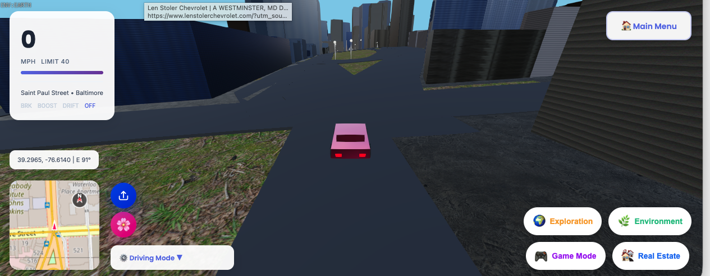
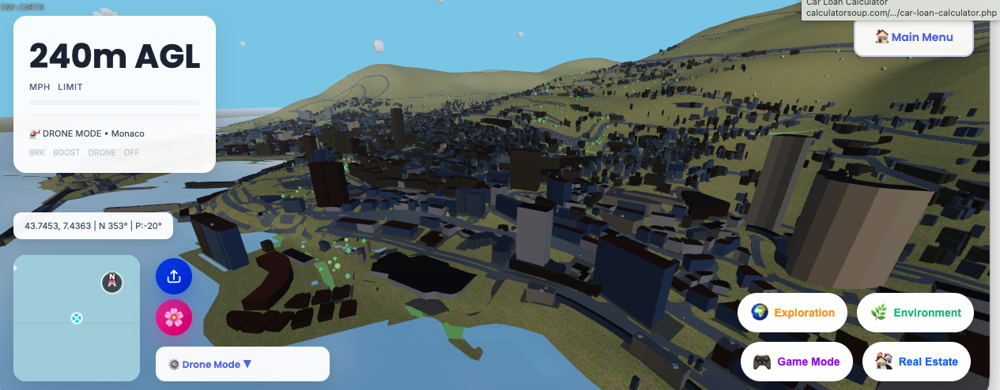
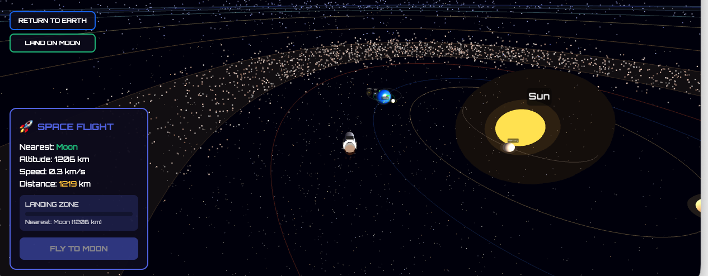

# World Explorer 3D

[](https://github.com/RRG314/WorldExplorer3D/actions/workflows/runtime-verify.yml)
[](https://github.com/RRG314/WorldExplorer3D/actions/workflows/secret-scan.yml)
[](https://rrg314.github.io/WorldExplorer3D/)
[](https://github.com/RRG314/WorldExplorer3D/releases/latest)
[](LICENSE)

World Explorer 3D is a browser-based geospatial exploration game built around real-world map context. Pick a preset city, use the interactive globe, or enter coordinates, then explore by walking, driving, flying, boating, or changing worlds entirely.

**[Launch World Explorer 3D](https://worldexplorer3d.io/app/)**

## Version 4.1.3

Version 4.1.3 restores a complete fixed-location Earth horizon without
restoring continuous streaming or the false blue city square. Detailed ground,
mapped water, roads, dense buildings, distant land/building context, and the
astronomical sky retain explicit, non-overlapping render ownership.

Highlights:

- Map-informed Earth scenes with roads, buildings, terrain, land use, vegetation, water, bridges, tunnels, and selected landmarks.
- Preset cities, geolocation, coordinate entry, and an interactive globe for choosing locations worldwide.
- Live Earth views for observed satellites, earthquakes, aircraft, current weather, community street imagery, modeled marine conditions, and NOAA water-level/tide coverage.
- Walk, drive, drone, plane, boat, underwater, rover, astronaut, and rocket traversal.
- Selected-location Earth sessions with atomic loading and explicit cancellation.
- Structure-aware bridges, elevated roads, ramps, underpasses, and tunnels.
- Material-aware building facades and improved rooftop geometry with restrained fallbacks when mapped detail is unavailable.
- Terrain, actor, vehicle, and camera interpolation designed to prevent clipping and visible pose drift.
- In-session Earth, Moon, Mars, ocean, and space transitions without a page reload.
- A navigable solar system with planets, moons, asteroid and Kuiper belts, spacecraft, and inner/full system maps.
- Deep-space destinations including catalog-backed star systems, nebulae, galaxies, and black-hole encounters.
- Enterable buildings using mapped indoor geometry where available and footprint-aware generated interiors elsewhere.
- Multiplayer rooms, social/account features, world and game editors, a 200-piece block builder, fishing, and leaderboards.
- Responsive touch controls for current iPhone and Android layouts.
- Provider health, freshness, cache, quality, datum, and fallback labels that distinguish observations, models, predictions, and reference-only data.

## Screenshots





## Data and Accuracy

Earth scenes use OpenStreetMap-derived geometry and other attributed public datasets. Source coverage, freshness, height data, and provider availability vary by location. The runtime uses bounded fallbacks when data is missing, but it does not claim survey-grade accuracy and is not a replacement for navigation or GIS software.

- [Data sources](DATA_SOURCES.md)
- [Attribution](ATTRIBUTION.md)
- [Known issues and limitations](KNOWN_ISSUES.md)
- [Acknowledgements](ACKNOWLEDGEMENTS.md)

Required attribution: `© OpenStreetMap contributors`

## Run Locally

Requirements: Node.js 22+, Java 21, and a browser with WebGL support.

```bash
git clone https://github.com/RRG314/WorldExplorer3D.git
cd WorldExplorer3D
npm install
npm run build:hosting -- --firebase-env staging
python3 -m http.server --directory dist 4173
```

Open `http://127.0.0.1:4173/app/`.

Core exploration can run locally without production credentials. Account, multiplayer, moderation, and other backend-dependent features require an authorized environment and are not configured by public repository secrets.

## Verify a Change

```bash
npm run build:hosting -- --firebase-env staging
npm run verify:hosting
npm run audit:reachability
npm run runtime:verify
npm run release:verify
```

`runtime:verify` is the fast pull-request gate. The full release gate additionally covers Firestore rules, mobile controls, editor and multiplayer surfaces, planetary round trips, provider fallbacks, ocean and biome behavior, and a representative global location matrix.

## Repository Layout

- `app/` - canonical browser runtime
- `dist/` - ignored, generated hosting artifact
- `functions/` - authorized backend functions
- `scripts/` - verification and release tooling
- `tests/` - security and runtime test fixtures
- `assets/` - landing and documentation media
- `github-pages/` - static project explainer for GitHub Pages

Edit canonical source only. `npm run build:hosting` creates a fresh, content-hashed hosting artifact; generated `dist/` files are never edited or committed.
`npm run audit:reachability` rejects hosted JavaScript or CSS that is no longer reachable from a declared page/runtime entrypoint.

## Project Documents

- [Changelog](CHANGELOG.md)
- [Roadmap](ROADMAP.md)
- [Controls](CONTROLS_REFERENCE.md)
- [Regression ledger](docs/REGRESSION_LEDGER.md)
- [Contributing](CONTRIBUTING.md)
- [Security policy](SECURITY.md)

## License

This repository is source-available under the custom terms in [LICENSE](LICENSE). It is not licensed as OSI open-source software. Third-party data and assets remain subject to their respective licenses.
