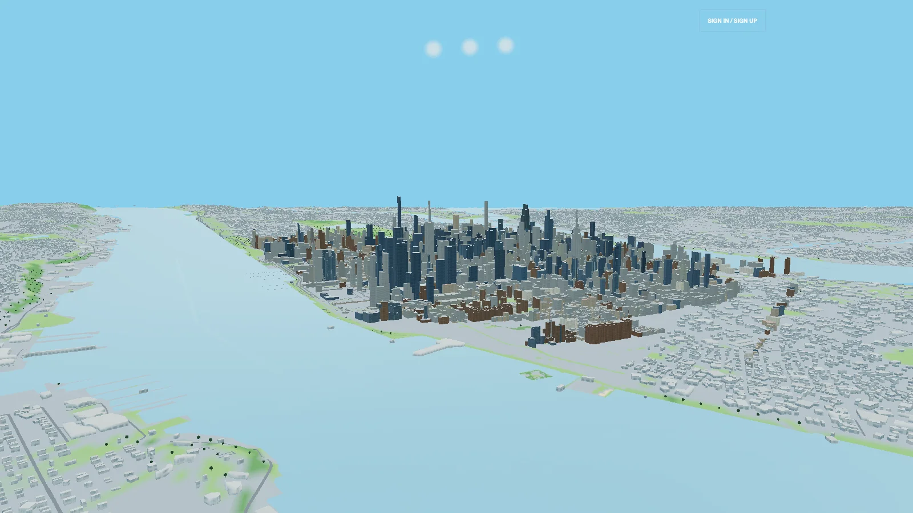
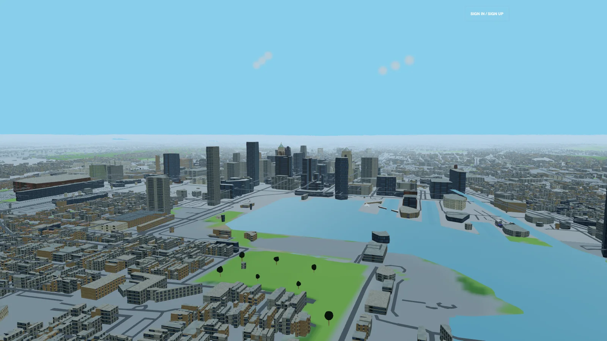
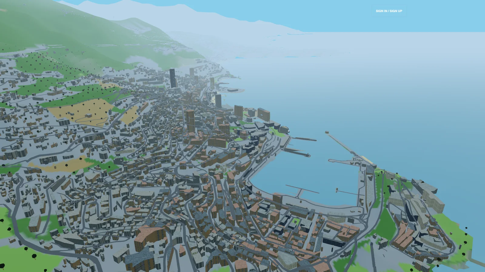
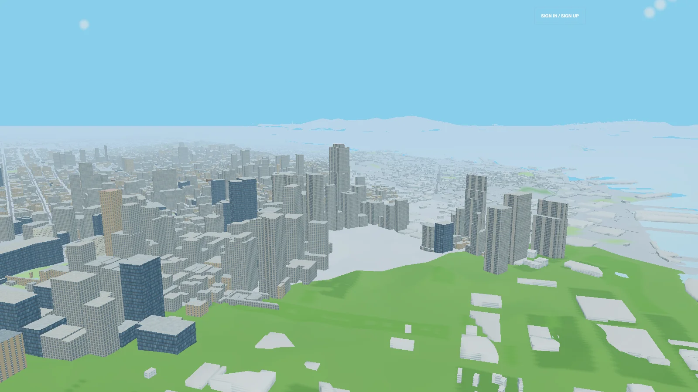
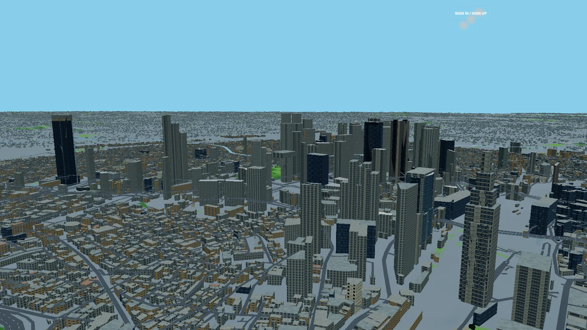
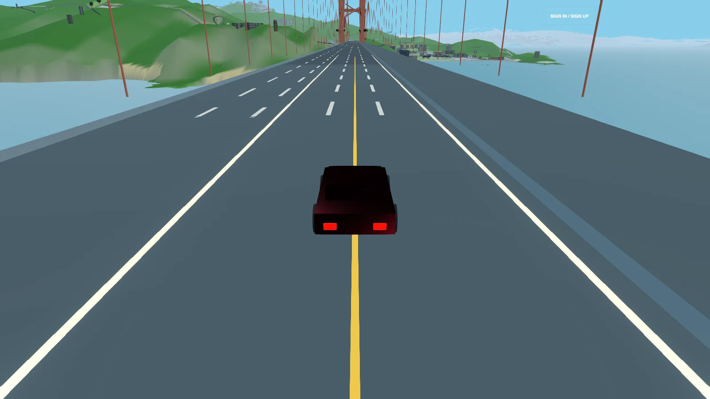
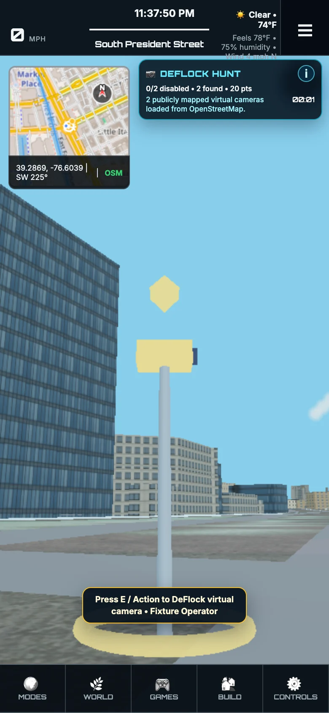
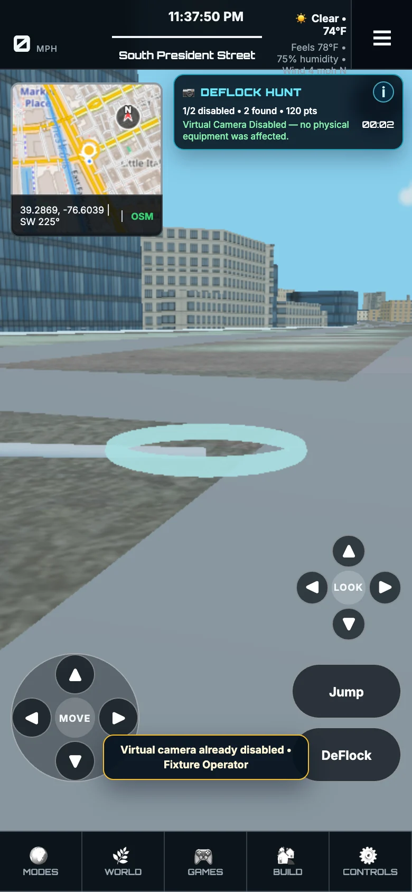

# World Explorer 3D

[](https://github.com/RRG314/WorldExplorer3D/actions/workflows/runtime-verify.yml)
[](https://github.com/RRG314/WorldExplorer3D/actions/workflows/secret-scan.yml)
[](https://rrg314.github.io/WorldExplorer3D/)
[](https://github.com/RRG314/WorldExplorer3D/releases/latest)
[](LICENSE)

World Explorer 3D is a browser-based geospatial exploration game built around real-world map context. Pick a preset city, use the interactive globe, or enter coordinates, then explore by walking, driving, flying, boating, or changing worlds entirely.

**[Launch World Explorer 3D](https://worldexplorer3d.io/app/)**



*A current in-game capture of the expanded New York fixed world. Every image below was captured directly from the browser runtime, not rendered as concept art.*

## Version 4.3.1

Version 4.3.1 is the corrected Explorer and Urban Sandbox release. It combines
contextual Discovery, wildlife and geology, field tools, progression,
companions, capability-aware AR, street-facing building entrances, richer
interiors and grounded world interaction inside the existing fixed-location
experience. It also improves deterministic building height, road composition,
vehicle contact on grades and world-memory release without creating another
world loader or reducing distant mapped detail.

Highlights:

- Map-informed Earth scenes with roads, buildings, terrain, land use, vegetation, water, bridges, tunnels, and selected landmarks.
- Preset cities, geolocation, coordinate entry, and an interactive globe for choosing locations worldwide.
- Live Earth views for observed satellites, earthquakes, aircraft, current weather, community street imagery, modeled marine conditions, and NOAA water-level/tide coverage.
- Walk, drive, drone, plane, boat, underwater, rover, astronaut, and rocket traversal.
- Selected-location Earth sessions with atomic loading and explicit cancellation.
- Structure-aware bridges, elevated roads, ramps, underpasses, and tunnels.
- Material-aware building facades and improved rooftop geometry with restrained fallbacks when mapped detail is unavailable.
- Terrain, actor, vehicle, and camera interpolation designed to prevent clipping and visible pose drift.
- In-session Earth, Moon, Mars, ocean, and space transitions without a page reload.
- A navigable solar system with planets, moons, asteroid and Kuiper belts, spacecraft, and inner/full system maps.
- Deep-space destinations including catalog-backed star systems, nebulae, galaxies, and black-hole encounters.
- Enterable buildings using mapped indoor geometry where available and footprint-aware generated interiors elsewhere.
- Multiplayer rooms, social/account features, world and game editors, a 200-piece block builder, fishing, and leaderboards.
- [DeFlock Hunt](docs/DEFLOCK_MODE.md), a virtual single-player and cooperative mode built from publicly mapped OpenStreetMap surveillance nodes.
- Live GPS Explore, an optional foreground-only mode that follows a player's physical location inside one bounded, fixed world without continuous-world streaming.
- Contextual AR for owned companions, recorded specimens, and habitat-aware virtual wildlife photo surveys, with WebXR, camera-overlay, and interactive-3D capability levels.
- Responsive touch controls for current iPhone and Android layouts.
- Provider health, freshness, cache, quality, datum, and fallback labels that distinguish observations, models, predictions, and reference-only data.

## Gameplay tour

World Explorer 3D is designed to make the scale and structure of a place visible
from the street, the water, and the air. These captures show the same runtime
players launch from the live application.

| Baltimore waterfront | Monaco coast |
| :--: | :--: |
|  |  |
| **Mapped harbor, roads, and regional city context** | **Dense terrain-aware development along the Mediterranean** |

| San Francisco Bay | Tokyo |
| :--: | :--: |
|  |  |
| **City scale shaped by land and water** | **Detailed local buildings inside a much larger urban region** |

### Traversal is part of the world



Bridges, elevated roads, ramps, tunnels, streets, and terrain are playable
surfaces rather than background scenery. Players can move through the same
location by car, on foot, by drone, by plane, or by boat where the environment
supports it.

### Mobile DeFlock Hunt

| Find a virtual camera | Disable it in the game |
| :--: | :--: |
|  |  |

[DeFlock Hunt](docs/DEFLOCK_MODE.md) is a fictional gameplay mode that places
virtual representations of publicly mapped OpenStreetMap surveillance nodes in
the loaded world. Disabling one affects only the game: no physical equipment is
accessed, controlled, damaged, or otherwise affected.

## Multiplayer model

Multiplayer uses bounded shared rooms rather than one continuous MMO server. A
room keeps one fixed world/location, live player presence, chat, shared blocks,
artifacts, and room activities together. Private rooms are unlisted and joined
with a six-character invite code; public rooms are discovered by city; featured
rooms are curated by administrators. Rooms support 2–32 players, with 8–14
recommended for the current browser renderer and Firestore presence model.

Run the real two-browser contract with `npm run test:multiplayer-integration`.
It uses local Auth and Firestore emulators and verifies private-code joining,
presence/movement, chat, and shared half-grid shape stacks without production
data.

## Data and Accuracy

Earth scenes use OpenStreetMap-derived geometry and other attributed public datasets. Source coverage, freshness, height data, and provider availability vary by location. The runtime uses bounded fallbacks when data is missing, but it does not claim survey-grade accuracy and is not a replacement for navigation or GIS software.

- [Data sources](DATA_SOURCES.md)
- [Attribution](ATTRIBUTION.md)
- [Known issues and limitations](KNOWN_ISSUES.md)
- [Acknowledgements](ACKNOWLEDGEMENTS.md)

Required attribution: `© OpenStreetMap contributors`

## Run Locally

Requirements: Node.js 22+, Java 21, and a browser with WebGL support.

```bash
git clone https://github.com/RRG314/WorldExplorer3D.git
cd WorldExplorer3D
npm install
npm run build:hosting -- --firebase-env staging
python3 -m http.server --directory dist 4173
```

Open `http://127.0.0.1:4173/app/`.

Core exploration can run locally without production credentials. Account, multiplayer, moderation, and other backend-dependent features require an authorized environment and are not configured by public repository secrets.

## Verify a Change

```bash
npm run verify:source
npm run verify:world
```

`npm run release:verify` builds an immutable production-shaped artifact and
runs the release checks against that exact output. Security-sensitive backend
changes are additionally exercised through the local Firebase emulator suites.

## Repository Layout

- `app/` - canonical browser runtime
- `dist/` - ignored, generated hosting artifact
- `functions/` - authorized backend functions
- `scripts/` - verification and release tooling
- `tests/` - security and runtime test fixtures
- `assets/` - landing and documentation media
- `github-pages/` - static project explainer for GitHub Pages

Edit canonical source only. `npm run build:hosting` creates a fresh, content-hashed hosting artifact; generated `dist/` files are never edited or committed.
`npm run audit:reachability` rejects hosted JavaScript or CSS that is no longer reachable from a declared page/runtime entrypoint.

## Project Documents

- [Changelog](CHANGELOG.md)
- [Roadmap](ROADMAP.md)
- [Controls](CONTROLS_REFERENCE.md)
- [DeFlock Hunt](docs/DEFLOCK_MODE.md)
- [Data sources and attribution](DATA_SOURCES.md)
- [Contributing](CONTRIBUTING.md)
- [Security policy](SECURITY.md)

## License

This repository is source-available under the custom terms in [LICENSE](LICENSE). It is not licensed as OSI open-source software. Third-party data and assets remain subject to their respective licenses.
