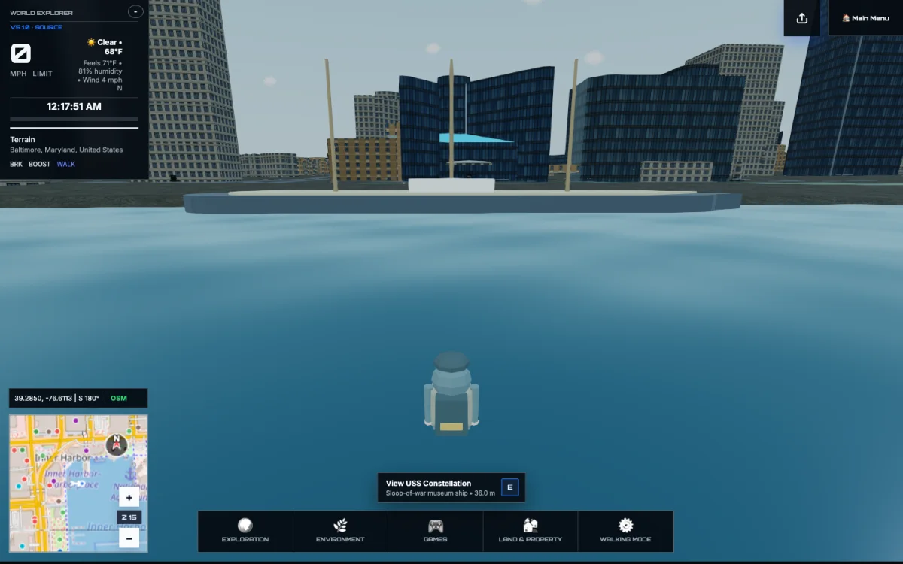
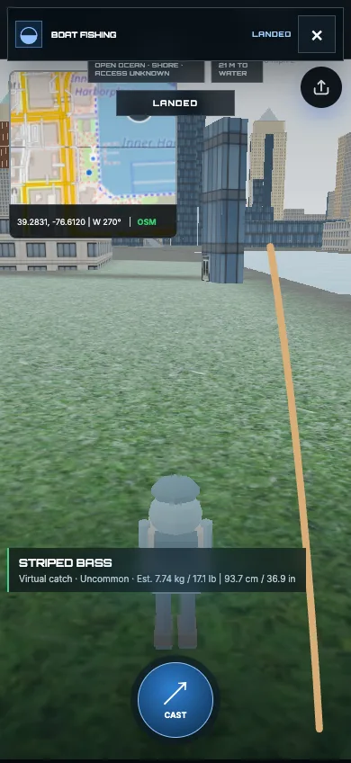
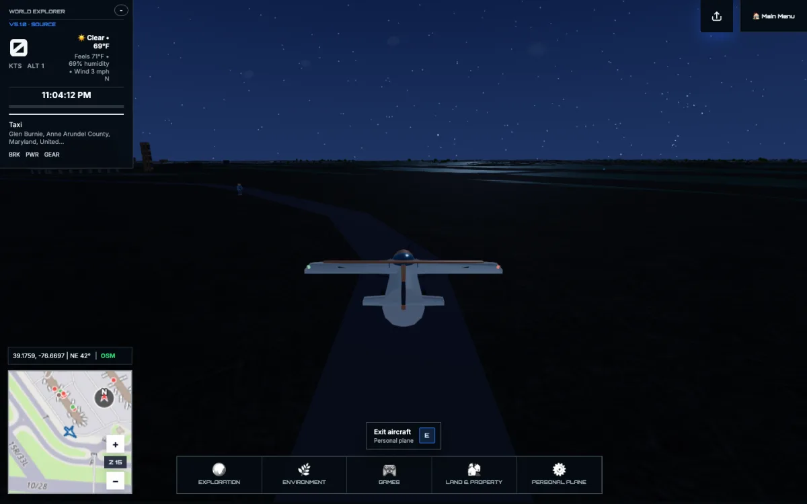
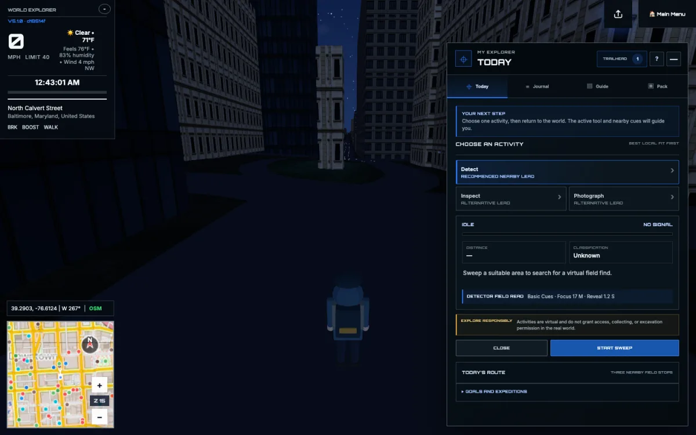
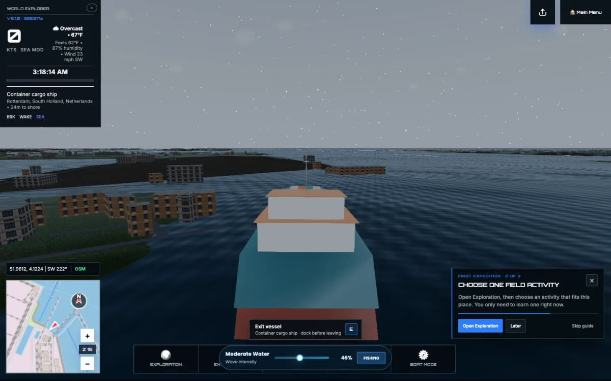

# World Explorer 3D

[](https://github.com/RRG314/WorldExplorer3D/actions/workflows/runtime-verify.yml)
[](https://github.com/RRG314/WorldExplorer3D/actions/workflows/secret-scan.yml)
[](https://rrg314.github.io/WorldExplorer3D/)
[](https://github.com/RRG314/WorldExplorer3D/releases/latest)
[](LICENSE)

World Explorer 3D is a browser-based world sandbox built around real places.
Choose a location, step into the world, and explore by land, water, air, or
space.

<p align="center">
  <a href="https://worldexplorer3d.io/app/"><strong>Play World Explorer 3D</strong></a>
  · <a href="CONTROLS_REFERENCE.md">Controls</a>
  · <a href="RELEASE_NOTES_5.1.0.md">What’s new</a>
  · <a href="ROADMAP.md">Roadmap</a>
</p>



*Baltimore’s Inner Harbor, with the mapped USS Constellation identified as a
sloop-of-war museum ship.*

## A world you can play in

Select a city, landmark, airport, harbor, or coordinates and enter a bounded 3D
world shaped by available terrain, roads, buildings, water, land cover, and
places. Walk the streets, cross bridges and rooftops, enter mapped or eligible
generated interiors, drive, fly, sail, fish, survey habitats, build, or meet
other players in a room tied to that location.

The same Explorer connects your Backpack, quick slots, Journal, Field Guide,
activities, Expeditions, specialties, companions, and seasonal surveys. The
World Editor holds both reviewed overlays and persistent Blocks, so creating a
place remains part of the world instead of a separate building game.

| Water and shore | Flight |
| :--: | :--: |
|  |  |
| **Fish from shore, pilot boats, dive, and explore ports** | **Use a personal aircraft or board aircraft at mapped airports** |

| Deep space | Explorer progression |
| :--: | :--: |
|  |  |
| **Fly manually or use optional Wayfinder assistance** | **Choose an activity and carry the result into one Explorer record** |



*A playable cargo ship underway near Rotterdam, with the shoreline kept in the
active world.*

## What you can do

- Explore on foot, by car, drone, plane, helicopter, boat, ship, rover,
  astronaut, or spacecraft, or use optional Live GPS play while walking.
- Visit supported mapped airports to board aircraft, choose pilot or passenger
  travel, search for destinations, or take a local sightseeing flight.
- Search for places by familiar names, including cities, landmarks, airports,
  and other expected location searches.
- Use configurable Backpack quick slots for field tools, fishing gear,
  equipment, and ranged actions.
- Photograph, inspect, survey, identify, fish, follow tracks and signs, and
  record finds in the Journal and Field Guide.
- Care for companions, build trust and levels, and travel with eligible
  domestic, bird, and livestock companions.
- Enter persistent multiplayer rooms with presence, chat, activities, shared
  Blocks, and room vehicles.
- Build with Blocks inside the World Editor and return to supported local or
  shared creations later.
- Leave Earth for the Moon, planets, the solar system, and selected deep-space
  destinations, with manual flight always available.

## Version 5.1

Version 5.1 brings the Explorer systems into one clearer experience and expands
the sandbox across Earth, oceans, airports, and space. It includes distinct
vehicle handling, visible damage, enterable responder vehicles, aviation and
skydiving, playable maritime fleets, regional field guides, companion growth,
configurable quick slots, improved place search, a redesigned First Journey,
rooftop traversal, and a more capable Wayfinder.

Eleven regional Field Guide packs provide 180 attainable entries across the
built-in Earth destinations. Field leads are game opportunities: they do not
claim that a real animal is physically present at the player’s location.

Read the full [5.1 release notes](RELEASE_NOTES_5.1.0.md) and the current
[known issues](KNOWN_ISSUES.md).

## Multiplayer and building

Multiplayer uses bounded rooms rather than one continuous MMO world. A room
shares one location, player presence, chat, activities, persistent vehicles,
and player-built Blocks. Private rooms use invite codes; public rooms can be
found by city.

Blocks are part of the World Editor. Existing supported local and room Blocks
remain on that shared persistence path, with one owner for placement,
permissions, saving, and recovery.

## World data and accuracy

Earth scenes use OpenStreetMap-derived geometry and other attributed public or
licensed sources. Coverage, freshness, height information, and provider
availability vary by location. Mapped, observed, modeled, reference, and
game-created content stay visibly distinct.

World Explorer 3D is a game. It is not a navigation, appraisal, surveying,
wildlife-presence, or safety service.

- [Data sources](DATA_SOURCES.md)
- [Attribution](ATTRIBUTION.md)
- [Known issues](KNOWN_ISSUES.md)
- [Acknowledgements](ACKNOWLEDGEMENTS.md)

Required map attribution: `© OpenStreetMap contributors`

## Run locally without Firebase

The standalone local edition runs the current game without a Firebase project,
account, credentials, emulators, or Java. Requirements: Node.js 20+ and a
browser with WebGL support.

```bash
git clone --branch steven/local-standalone-5.1.0 --single-branch https://github.com/RRG314/WorldExplorer3D.git WorldExplorer3D-Standalone
cd WorldExplorer3D-Standalone
npm run dev:standalone
```

Open `http://localhost:4192/app/` on that computer. See the
[standalone guide](docs/LOCAL_STANDALONE.md) for supported features.

Keyboard and touch controls support browser zoom, visible focus, higher
contrast, larger text, and reduced motion.

Earth, ocean, space, traversal, local progression, and browser saves remain
available. Accounts, cloud sync, multiplayer, shared rooms, live leaderboards,
moderation, and payments remain online-only. Secrets are not included in the
repository.

## Project guide

- [Release notes](RELEASE_NOTES_5.1.0.md)
- [Changelog](CHANGELOG.md)
- [Roadmap](ROADMAP.md)
- [System inventory](docs/SYSTEM_INVENTORY.md)
- [Architecture](docs/ARCHITECTURE_MAP.md)
- [Controls](CONTROLS_REFERENCE.md)
- [Contributing](CONTRIBUTING.md)
- [Security policy](SECURITY.md)

## License

Copyright © 2026 Steven Reid / World Explorer 3D. All Rights Reserved.

This repository is publicly viewable under the custom source-available terms
in [LICENSE](LICENSE). It is not licensed as OSI open-source software, and
attribution alone does not grant permission to copy, redistribute, publish,
host, or create derivative works. Third-party data, software, and assets remain
subject to their respective terms in [ATTRIBUTION.md](ATTRIBUTION.md) and
[ACKNOWLEDGEMENTS.md](ACKNOWLEDGEMENTS.md).
