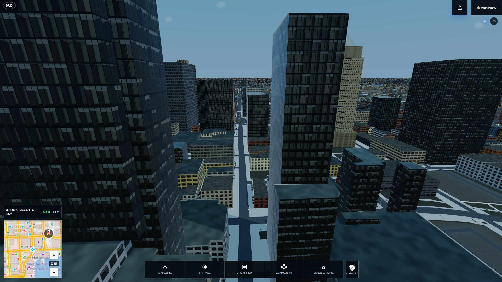
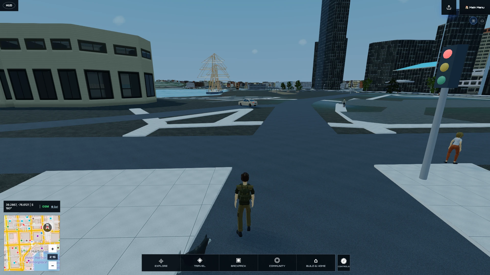
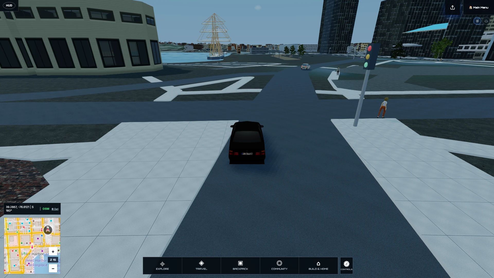
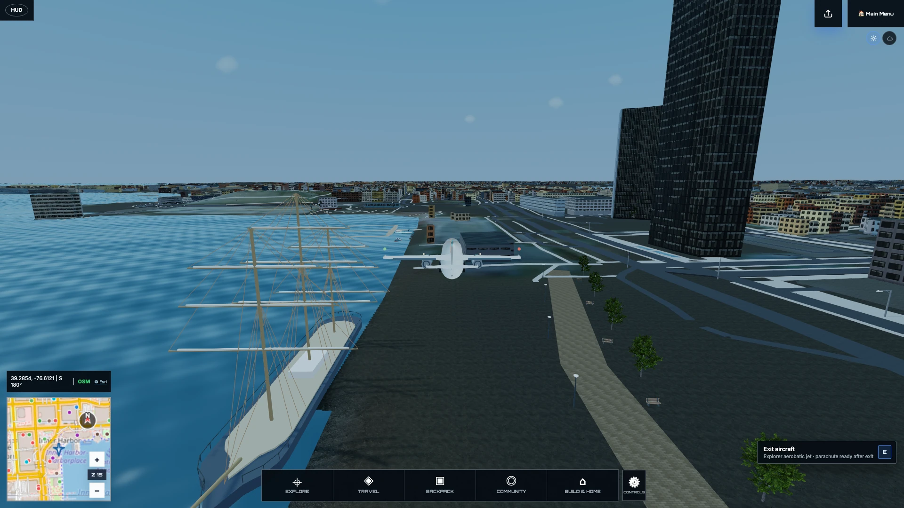
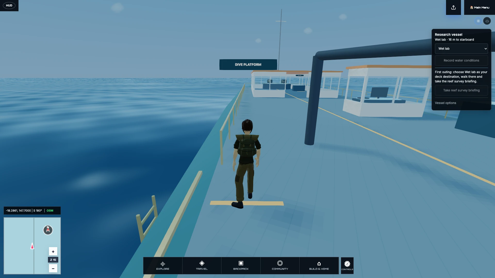
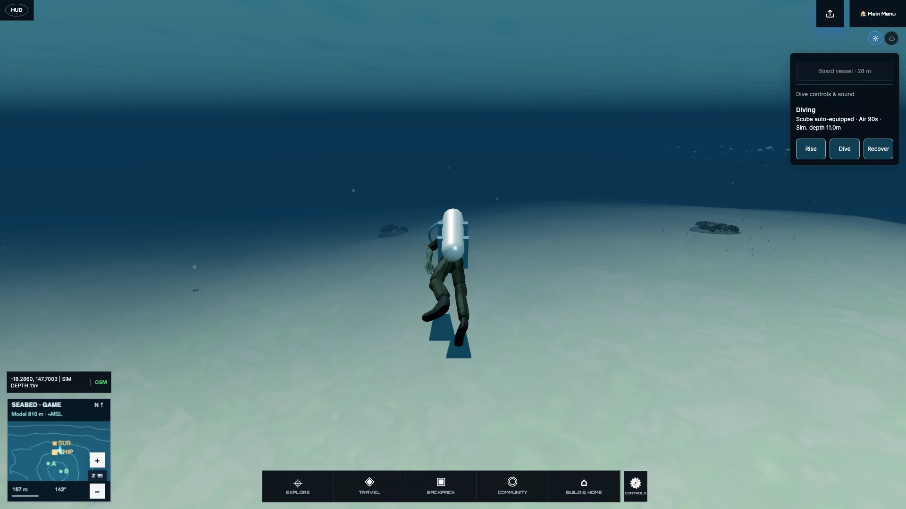
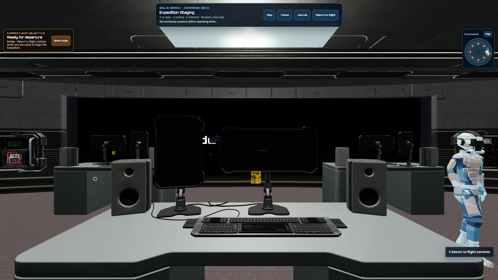
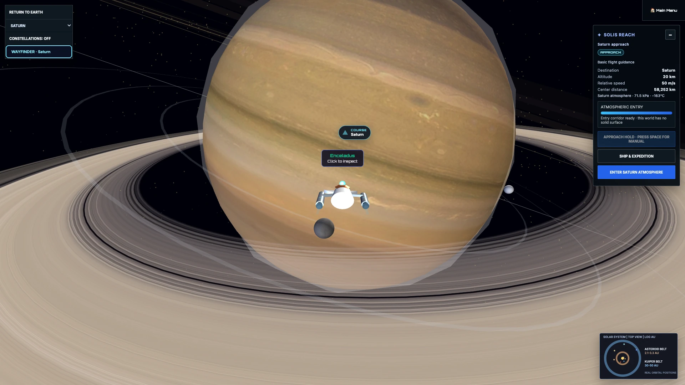
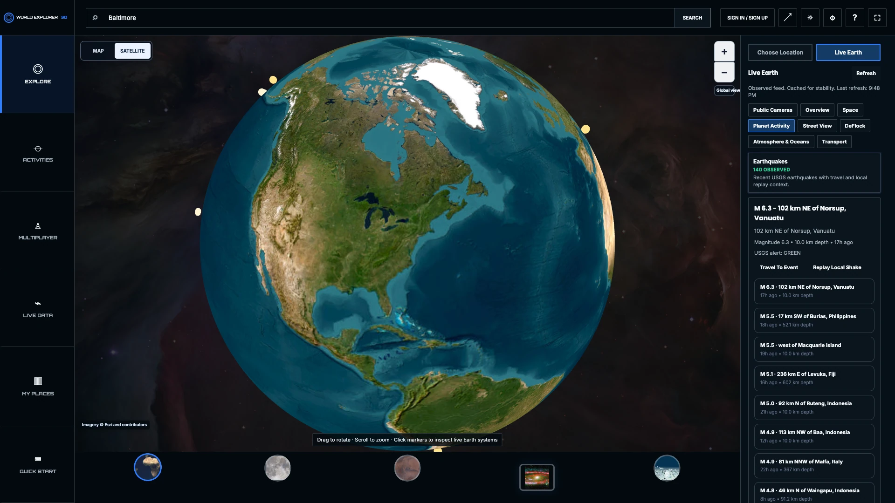

# World Explorer 3D

[5.5 release notes](RELEASE_NOTES_5.5.0.md) · [Known limitations](KNOWN_ISSUES.md) · [Roadmap](ROADMAP.md)

[](https://worldexplorer3d.io/app/)
[](https://github.com/RRG314/WorldExplorer3D/releases/latest)
[](https://worldexplorer3d.io/app/)
[](LICENSE)

World Explorer 3D is a browser-based world sandbox built around real places.
Choose a location, step into a bounded playable world, and explore by land,
water, air, or space. Discovery, vehicles, virtual property, persistent building,
photo-based home improvements and shared rooms connect the experience.

The 5.5 update brings fuller regional building and road coverage, terrain and
buildings that follow travel, more connected bridge and tunnel approaches, and
a research-vessel journey from deck to water and back. Public weather and marine data add context without a paid data
subscription. Existing locations and player progress remain part of the same
game. Dense-city pauses, uneven art quality and bounded world size remain
[known limitations](KNOWN_ISSUES.md).

<p align="center">
  <a href="https://worldexplorer3d.io/app/"><strong>Play World Explorer 3D</strong></a>
  · <a href="CONTROLS_REFERENCE.md">Controls</a>
  · <a href="RELEASE_NOTES_5.5.0.md">5.5 release notes</a>
  · <a href="ROADMAP.md">Roadmap</a>
</p>

## Explore by land, sea, air and space

Search for a city, landmark, airport, harbor or coordinates. Walk its streets,
drive, fly, sail, fish, survey habitats, build, or join a multiplayer room.
Your Backpack, Journal, Field Guide, companions and saved places travel with you.

Regional terrain and mapped buildings can load as you fly farther from your
starting point. Detailed streets, interiors and activities remain in the selected
district. Turn traveling scenery on or off in Graphics settings.

<!-- public-gallery:start -->


*Gameplay screenshots from the released 5.5.0 build.*

| Explore on foot | Drive the city |
| :--: | :--: |
|  |  |

| Take flight | Your research vessel |
| :--: | :--: |
|  |  |

| Below the surface | Aboard Solis Reach |
| :--: | :--: |
|  |  |

| Beyond Earth | Live Earth |
| :--: | :--: |
|  |  |
<!-- public-gallery:end -->

## What you can do

- Explore on foot, by car, drone, plane, helicopter, boat, ship, rover,
  astronaut on solid planetary surfaces, or spacecraft; or use optional Live
  GPS play while walking.
- Drive vehicle families with distinct vehicle handling, visible condition, and
  enterable responder vehicles.
- Visit supported mapped airports to board aircraft, choose pilot or passenger
  travel, search for destinations, or take a local sightseeing flight.
- Search for places by familiar names, including cities, landmarks, airports,
  and other expected location searches.
- Use configurable Backpack quick slots for field tools, fishing gear,
  equipment, and ranged actions.
- Photograph, inspect, survey, identify, fish, follow tracks and signs, and
  record finds in the Journal and Field Guide.
- Explore eleven regional Field Guide packs with 180 attainable entries across
  the built-in Earth destinations.
- Care for companions, build trust and levels, and travel with eligible
  domestic, bird, and livestock companions.
- Enter persistent multiplayer rooms with presence, chat, activities, shared
  Blocks, and room vehicles.
- Use Quick Build to place persistent Blocks in local play or a multiplayer
  room.
- Leave Earth for the Moon, planets, the solar system, and selected deep-space
  destinations, with manual flight always available.
- Try Interstellar Expeditions in Alpha: live aboard Solis Reach, work with its
  crew, respond to voyage events, and fly Pathfinder to supported planetary
  sites and back.
- Claim a first virtual property, list or purchase available properties with
  Explorer Credits, and connect planetary samples to the same Backpack, cargo,
  and mapped-business exchange loop.

## Explore the ocean

Start an ocean outing aboard the research vessel. Walk to deck stations, enter
the water, swim and scuba dive, deploy the submarine, and recover to the same
ship. A saved aboard voyage resumes on deck. Ocean environments and wildlife
remain limited; the larger licensed-asset and ecology upgrade is still planned.

## Beyond Earth

Fly manually or use optional Wayfinder assistance. Interstellar Expeditions
Alpha connects life aboard Solis Reach, planetary fieldwork, Pathfinder travel
and saved voyage progression. Ship art, crew motion, mission variety, sound and
planetary detail continue to develop.

## Multiplayer and building

Multiplayer uses bounded rooms rather than one continuous MMO world. A room
shares one location, player presence, chat, activities, persistent vehicles,
and player-built Blocks. Private rooms use invite codes; public rooms can be
found by city.

Quick Build places persistent Blocks in the current location. Local builds stay
on your device; room builds can be shared with other signed-in explorers.

## World data and accuracy

Earth scenes use OpenStreetMap-derived geometry and other attributed public or
licensed sources. Coverage, freshness, height information, and provider
availability vary by location. Mapped, observed, modeled, reference, and
game-created content stay visibly distinct.

World Explorer 3D is a game. It is not a navigation, appraisal, surveying,
wildlife-presence, or safety service.

- [Data sources](DATA_SOURCES.md)
- [Attribution](ATTRIBUTION.md)
- [Known issues](KNOWN_ISSUES.md)
- [Acknowledgements](ACKNOWLEDGEMENTS.md)

Required map attribution: `© OpenStreetMap contributors`

## Run locally

Requirements: Node.js 22+, Java 21, and a browser with WebGL support.

```bash
git clone https://github.com/RRG314/WorldExplorer3D.git
cd WorldExplorer3D
npm install
npm run build:hosting -- --firebase-env staging
python3 -m http.server --directory dist 4173
```

Open `http://127.0.0.1:4173/app/`.

Keyboard and touch controls support browser zoom, visible focus, higher
contrast, larger text, and reduced motion.

Core exploration can run without production credentials. Accounts,
multiplayer, moderation, and other online features require an authorized
environment. Secrets are not included in the repository.

## More about the project

- [What changed in 5.5](RELEASE_NOTES_5.5.0.md)
- [Changelog](CHANGELOG.md)
- [Roadmap](ROADMAP.md)
- [Controls](CONTROLS_REFERENCE.md)
- [Contributing](CONTRIBUTING.md)
- [Security policy](SECURITY.md)

## License

Copyright © 2026 Steven Reid / World Explorer 3D. All Rights Reserved.

This repository is publicly viewable under the custom source-available terms
in [LICENSE](LICENSE). It is not licensed as OSI open-source software, and
attribution alone does not grant permission to copy, redistribute, publish,
host, or create derivative works. Third-party data, software, and assets remain
subject to their respective terms in [ATTRIBUTION.md](ATTRIBUTION.md) and
[ACKNOWLEDGEMENTS.md](ACKNOWLEDGEMENTS.md).
