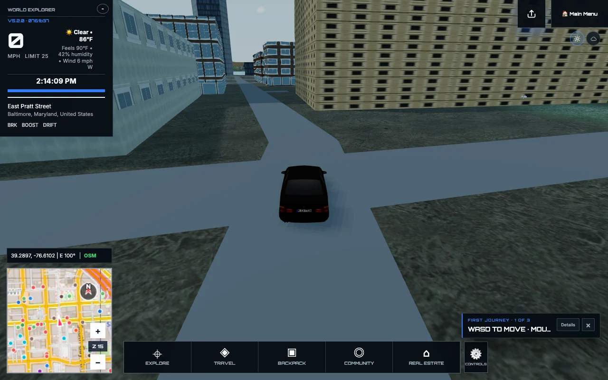
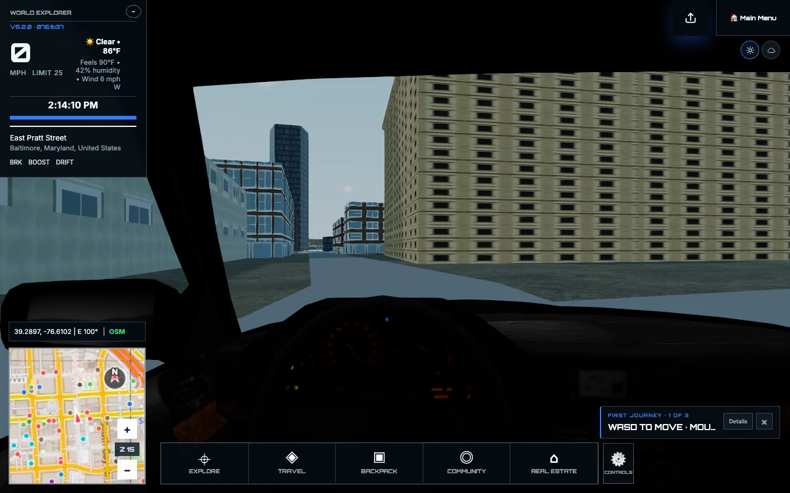

# A world worth making your own

World Explorer is growing beyond visiting places. The next step is helping make
them recognizable—starting with the buildings you know.

## Bring a real facade into the world

The manual **Improve this place** editor lets you choose a mapped building,
upload photos, select its sides, and crop and position each image. Save your
work and submit it for review. Approved contributions belong to that building,
not every building with a similar shape.

Start on your phone or continue from your computer with the account handoff.
You do not need to run paid 3D reconstruction to contribute an exterior.
Original photos stay protected; saving a draft does not publish it.

Production availability depends on the capture backend and account configuration,
not just the game download. See [release status](docs/RELEASE_AUDIT_2026_09_08.md)
for the current rollout boundary.

## More character in the landscape

Buildings have a broader range of facades and architectural details while
keeping their mapped footprints. Ground appearance draws on land-cover data,
with different treatment for forests, wetlands, dry ground, rock, snow and ice.
Curated trees replace the older simple tree shapes, with nearby obstacles and
distance-based detail.

Snow now has surface detail instead of a flat white fill. Location changes no
longer carry the previous area's road grading into a new landscape. Building
parts stay connected to their parent structures when data is incomplete.

## Back behind the wheel

Chase follows behind the BMW again. Switch to first person to sit behind the
steering wheel with the dashboard and windshield in view, then switch back
without getting stuck over the hood. **C** cycles camera views by default;
custom bindings remain available in Controls.

## Still ahead

Interior photo editing and automatic 3D reconstruction remain on the roadmap,
with their development work preserved. Interiors are private by default;
choosing to share an exterior never shares the inside of a home.

Complex bridge and tunnel entrances, cold-start loading, and worldwide terrain
detail still need work. This update does not turn incomplete map data into a
survey-quality model of every place.

Explore the [full project description](docs/PROJECT_DESCRIPTION.md),
[controls](CONTROLS_REFERENCE.md), and [roadmap](ROADMAP.md).
