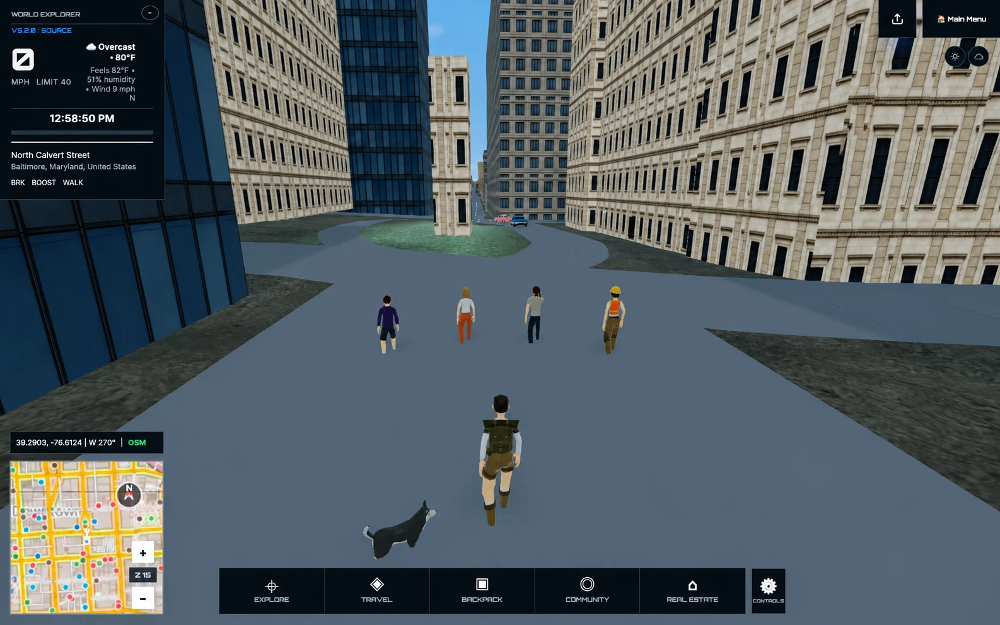

# World Explorer 3D 5.2.0

## The world feels alive

World Explorer 3D 5.2 brings the sandbox much closer to the world it is meant to
be: somewhere you can arrive, explore, drive, shop, improve your vehicle, care
for a companion, own a place, and keep traveling all the way into deep space.

The redesigned Explorer, permanent dog companion, BMW, pedestrians, traffic,
and current world presentation now appear together instead of mixing in the old
blocky character and vehicle stand-ins.

## More life on the ground

- A permanent dog companion joins the Explorer from the beginning, follows
  more closely, travels in supported vehicles, earns progress, and returns home
  safely when another companion is active.
- The Explorer’s man or woman presentation is selected from the account profile
  and carries into play without adding an intrusive in-game switch.
- Denser pedestrians and longer-lived traffic respond to the kind of place and
  time of day. Signals, stops, queues, and road following use one bounded living
  world rather than competing traffic systems.
- Current vehicle and character assets remain visible from spawn onward; the
  retired blocky fallbacks no longer flash into view or keep consuming runtime
  resources.
- Roads, terrain, bridges, junctions, curbs, sidewalks, buildings, and vehicle
  contact share the same published surface rules across the tested world set.

## A world that responds

- Nearby mapped convenience stores, mechanics, pet and veterinary services,
  field suppliers, medical locations, and marine services can connect to the
  systems they are actually useful for. Generated game inventory and services
  stay clearly separate from real mapped facts.
- One Explorer Wallet now pays for supplies, services, vehicle upgrades, and
  virtual property. Purchases recover cleanly if delivery cannot finish.
- Food, water, first aid, and medicine affect the Explorer’s health. The HUD
  health bar represents the active Explorer or vehicle without making the HUD
  larger.
- Mapped mechanics offer ordered, visible upgrades with real handling effects,
  saved to the signed-in player’s owned vehicle.
- Property values use a broader market-style scale, while the first eligible
  home claim remains an accessible introduction to ownership.
- Building and vehicle prompts appear at the relevant entrance or interaction
  point. Observation and exploration notices stay quieter, respect familiarity,
  and move out of the center of play.

## Start playing sooner

- The First Journey is now a short, optional three-step introduction: move,
  interact with something nearby, and open the Backpack. Everything else is
  discovered through play instead of an endless tutorial.
- Keyboard actions can be remapped and actually drive the runtime action map.
  Touch controls and camera behavior follow the same action rules on phones and
  tablets.
- Accessibility settings now share the game’s visual language and cover larger
  text and targets, contrast, reduced motion, focus visibility, notice timing,
  camera assistance, and control preferences.

## Interstellar Expeditions Alpha

- Live aboard Solis Reach, move through three decks and 25 mapped rooms, use
  the ship map, and work with crew members whose guidance follows the current
  objective.
- Plan persistent voyages with ship stores, systems, crew assignments,
  strategic time, discoveries, failures, recovery, and a Captain's Log.
- Respond to voyage problems at the affected station through visible shipboard
  actions instead of resolving the journey from a message alone.
- Fly Pathfinder manually from Solis Reach to supported planetary surfaces,
  complete fieldwork, carry the exact sample back to the ship, process it, and
  return it to the Earth Backpack and economy.
- Travel between the current Earth location and Solis Reach through the same
  Pathfinder, Space Flight, planetary, and saved-journey systems.
- Continue ordinary manual or Wayfinder-assisted Space Flight without starting
  an Expedition.
- Survive a surprise pirate interception during an eligible voyage: take manual
  control, distinguish friendly and hostile energy fire, protect Solis Reach,
  withstand boarding pressure and damage, then recover course through the same
  voyage state instead of entering a disconnected minigame.

Interstellar Expeditions are labeled Alpha in the game. The connected journey
is playable, while ship art, crew motion, planetary variety, mission variety,
audio, and mobile presentation remain active areas of improvement.

## Property, Credits, and materials

- Use one Explorer Credits balance across supported mapped-business exchange
  and virtual property activity.
- Claim one eligible first virtual property without spending Credits, then list
  it or purchase another player's available listing.
- Keep shared property ownership consistent between players in the same room;
  two players cannot claim the same available property.
- Show a public street address when mapped address data is available without
  displaying resident or private-owner information.
- Carry supported planetary materials through surface collection, Pathfinder,
  Solis Reach cargo and analysis, the Backpack, and eligible Earth stores
  without creating a second inventory or wallet.

## Navigation and interface

- Organize the gameplay bar around Explore, Travel, Backpack, Community, Real
  Estate, and current controls.
- Keep Quick Build inside Real Estate as the single player-facing Blocks tool
  for local and multiplayer-room construction.
- Separate the current-location and Live GPS entries, and keep world search,
  travel modes, Space Flight, Pathfinder, Solis Reach, and recovery together in
  Travel.
- Route Journal, Field Guide, Profile, skills, companions, items, and quick
  slots through the Backpack section.
- Remove the unfinished game editor and its player-facing entry points.

## Reliability and performance

- Keep one Pathfinder and one Solis Reach throughout launch, manual
  flight, landing, surface return, rendezvous, docking, and ship entry.
- Prevent solid planetary terrain from exposing or dropping the player beneath
  the playable surface.
- Preserve the selected journey when moving between a planet, local Space,
  Solis Reach, and Earth.
- Release inactive Space and Ocean drawing buffers and scene resources when
  returning to another environment while retaining reliable re-entry.
- Complete civic response routes on foot when mapped roads end away from the
  reported location, and clear a completed custody incident before play resumes.
- Restore the public explorer total, standard first-party analytics collection,
  and privacy-safe event boundaries.

Community Reality Capture remains a staged, fail-closed capability. Private
capture publication is not enabled in production until protected storage, App
Check, moderation, and reconstruction infrastructure pass their own deployment
gate.

## Existing 5.1 play retained

The 5.1 Earth, Ocean, airport, aircraft, maritime, vehicle, fieldwork, regional
Field Guide, Backpack, Journal, companion, quick-slot, multiplayer, accessibility,
and mobile-control features remain part of this release.

See [Known Issues](KNOWN_ISSUES.md) for current boundaries and continuing work.
