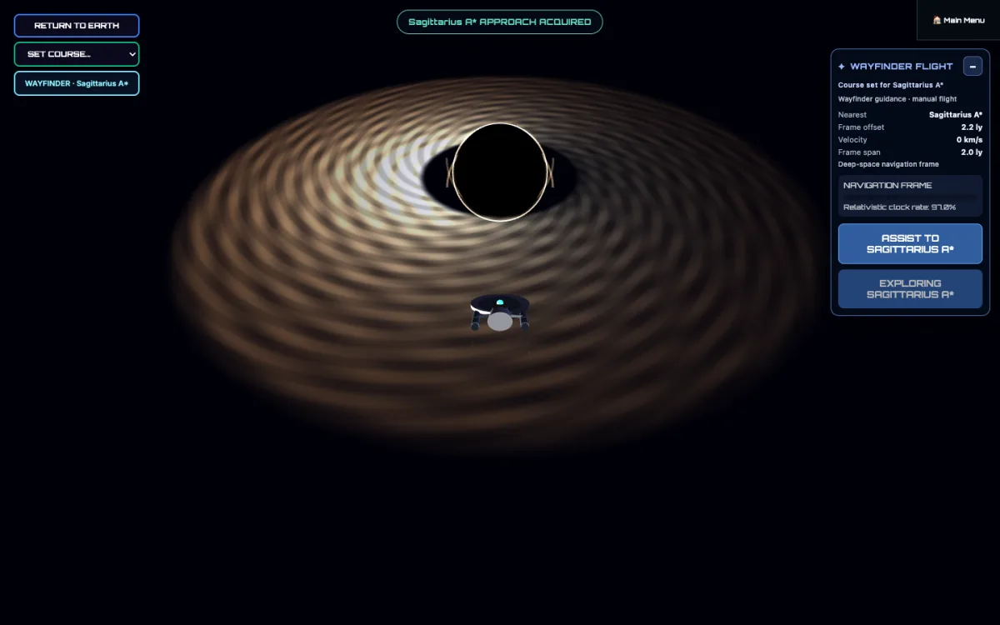

# World Explorer 3D 5.2.0

World Explorer 3D 5.2 adds a connected Interstellar Expeditions Alpha, virtual
property and Explorer Credits, a clearer gameplay menu, and more dependable
travel between Earth, space, and planetary surfaces.

## Interstellar Expeditions Alpha

- Live aboard Solis Reach, move through three decks and 25 mapped rooms, use
  the ship map, and work with crew members whose guidance follows the current
  objective.
- Plan persistent voyages with ship stores, systems, crew assignments,
  strategic time, discoveries, failures, recovery, and a Captain's Log.
- Respond to voyage problems at the affected station through visible shipboard
  actions instead of resolving the journey from a message alone.
- Fly Pathfinder manually from Solis Reach to supported planetary surfaces,
  complete fieldwork, carry the exact sample back to the ship, process it, and
  return it to the Earth Backpack and economy.
- Travel between the current Earth location and Solis Reach through the same
  Pathfinder, Space Flight, planetary, and saved-journey systems.
- Continue ordinary manual or Wayfinder-assisted Space Flight without starting
  an Expedition.

Interstellar Expeditions are labeled Alpha in the game. The connected journey
is playable, while ship art, crew motion, planetary variety, mission variety,
audio, and mobile presentation remain active areas of improvement.

## Property, Credits, and materials

- Use one Explorer Credits balance across supported mapped-business exchange
  and virtual property activity.
- Claim one eligible first virtual property without spending Credits, then list
  it or purchase another player's available listing.
- Keep shared property ownership consistent between players in the same room;
  two players cannot claim the same available property.
- Show a public street address when mapped address data is available without
  displaying resident or private-owner information.
- Carry supported planetary materials through surface collection, Pathfinder,
  Solis Reach cargo and analysis, the Backpack, and eligible Earth stores
  without creating a second inventory or wallet.

## Navigation and interface

- Organize the gameplay bar around Explore, Travel, Backpack, Community, Real
  Estate, and current controls.
- Keep Quick Build inside Real Estate as the single player-facing Blocks tool
  for local and multiplayer-room construction.
- Separate the current-location and Live GPS entries, and keep world search,
  travel modes, Space Flight, Pathfinder, Solis Reach, and recovery together in
  Travel.
- Route Journal, Field Guide, Profile, skills, companions, items, and quick
  slots through the Backpack section.
- Remove the unfinished game editor and its player-facing entry points.

## Reliability and performance

- Keep one Pathfinder and one Solis Reach throughout launch, manual
  flight, landing, surface return, rendezvous, docking, and ship entry.
- Prevent solid planetary terrain from exposing or dropping the player beneath
  the playable surface.
- Preserve the selected journey when moving between a planet, local Space,
  Solis Reach, and Earth.
- Release inactive Space and Ocean drawing buffers and scene resources when
  returning to another environment while retaining reliable re-entry.
- Complete civic response routes on foot when mapped roads end away from the
  reported location, and clear a completed custody incident before play resumes.
- Restore the public explorer total, standard first-party analytics collection,
  and privacy-safe event boundaries.

## Existing 5.1 play retained

The 5.1 Earth, Ocean, airport, aircraft, maritime, vehicle, fieldwork, regional
Field Guide, Backpack, Journal, companion, quick-slot, multiplayer, accessibility,
and mobile-control features remain part of this release.

See [Known Issues](KNOWN_ISSUES.md) for current boundaries and continuing work.
