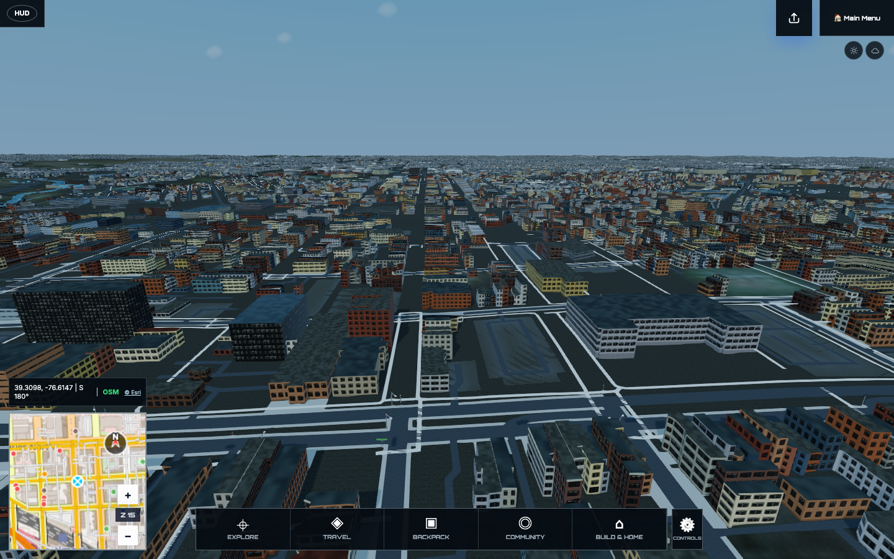
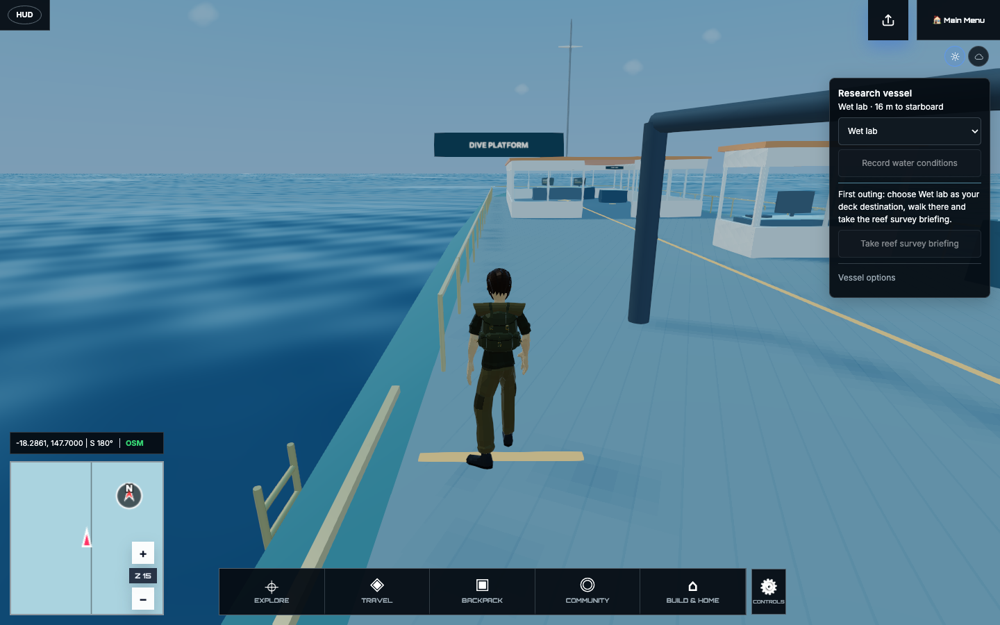

# Streets, sea, and real-world context

World Explorer 3D 5.5 brings fuller surroundings, a more connected ocean journey,
and more reliable transitions between places. Existing locations, vehicles,
Explorer records and saved voyages remain central to the game.

## More of the place around you

Buildings and regional roads remain visible across a wider surrounding area.
Terrain and mapped buildings now load around you as you travel beyond that area.
Regional buildings share the existing facade colors and use simple pitched roofs
where supported by the map. Changing graphics quality preserves the selected
location’s building coverage. Graphics settings can turn traveling scenery off
to retain the original fixed surroundings.
Parks, woodland, wetlands and protected areas use their physical land cover to
shape planting and terrain, rather than treating every green area alike.

Street facades, storefronts, pavement and roadside details have been refined.
These scenes still depend on the available map data; they are reconstructions,
not exact digital copies of every place.

## Better connections on land

Bridge and tunnel approaches share connected road heights. Tunnel openings,
terrain cuts, road surfaces and vehicle contact now agree more closely, including
where surface roads cross an underground route. Chase-camera transitions and
collisions with structures above the player have also been corrected.

Location changes handle cancellation and failed loads more reliably. A failed
request keeps a clear recovery path, and retired world resources are released
as you leave a place.

Loading now shows a progress bar, a clear note about longer waits, and short
tips about travel, fieldwork, ocean outings and space exploration. Browse the
tips yourself or let them rotate while your location takes shape. Initial game
startup also stays visible, with a reload option if required files cannot load.

## An ocean journey that stays together

Choosing an ocean starting point takes you directly aboard the research vessel.
Walk the deck, visit its stations, enter the water, swim and dive with automatic
scuba equipment, or deploy the submarine. Recovery returns you to the same
vessel, and an aboard save resumes there directly.

The swimmer and diver are easier to see. Vessel support follows the shared water
surface, and returning between ocean, Earth and spacecraft activities has been
repaired. Shipboard walking also avoids unnecessary work in the retained Earth
scene.

## Public data, clearly labeled

Weather and marine conditions use public providers without a paid data
subscription. Weather, wave and current models show their sources and available
times; aircraft observations use ADSB.lol. Missing information stays unavailable
rather than being presented as a live reading.

Live Earth also includes a regional road-camera wall for Finland and parts of
California, with up to four views, saved favorites and clear recovery when an
image is unavailable. Remote camera references remain separate from places you
have visited in the game.

## Less repeated work as you explore

Nearby actor queries, road-detail scheduling, shoreline checks and rendering
create less temporary work. Character capability checks use the information they
need without repeatedly copying progression history or the entire Backpack.
This also corrects stale capability results after character changes.
Image-processing and backend dependencies include current security fixes.

## What still needs work

Dense cities can still produce noticeable pauses during movement. Some complex
bridge and tunnel junctions remain visually rough, and graphics quality is not
uniform across locations. Physical-phone performance has not been fully validated.

Detailed roads, interiors and activities remain tied to the selected location.
Traveling regional scenery does not extend those systems into a fully playable
worldwide map. Slow or missing map data can delay new scenery; the last complete
region stays visible while a request is retried. The research vessel still uses the existing custom
model; the licensed replacement, broader ocean wildlife and activities, and
spearfishing are not part of this update. Interstellar Expeditions remain Alpha.

See [known limitations](KNOWN_ISSUES.md) and [the roadmap](ROADMAP.md).
Version 5.5 is a compatible update; it does not intentionally replace existing
player progress or introduce an incompatible save format.
