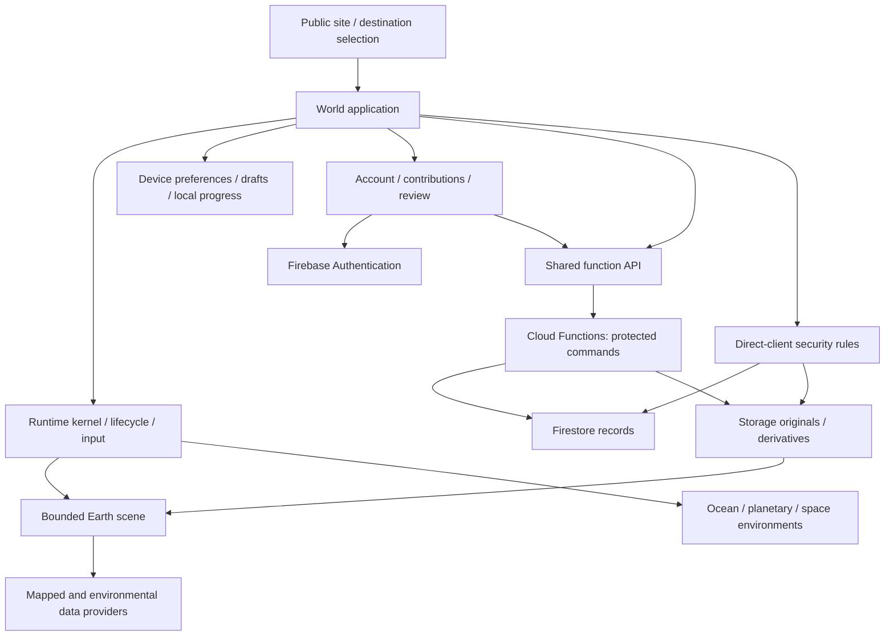

# World Explorer 3D Architecture Map

Updated September 10, 2026 · Source baseline `53452516` · Version 5.2.0.

September 15 performance audit supplement: [current ownership and scheduling](audits/2026-09-15-performance/architecture-and-ownership.md), [verified release/test findings and remaining measurements](audits/2026-09-15-performance/README.md). The dated findings below are historical unless reverified in that report.

This map describes current responsibilities and data flow. It replaces accumulated dated rollout notes; earlier detail remains in Git and specialist documents. An architecture boundary describes where responsibility belongs, not proof that every path enforces it correctly. See [system inventory](SYSTEM_INVENTORY.md), [source reference](SYSTEM_INVENTORY_REFERENCE.md) and [confirmed audit findings](audits/2026-09-10/README.md).

## Application overview

The product is a browser JavaScript application with a Three.js/WebGL world, supporting public/account pages and Firebase services. The browser owns presentation and active simulation. Protected shared changes go through backend commands or security-rule-controlled database operations. Hosting delivers an artifact; backend deployment is separate.

### Product entry points and shared services

`app/index.html` enters through `app/js/app-entry.js` and the module manifest/loader. Public pages, phone capture and account pages have distinct source entry points. Account Center and contribution/review components share functionality, but a complete account/admin usability pass remains open.

`runtime/kernel.js`, lifecycle scopes and workload policies coordinate active systems. `engine/` owns scene/WebGL setup and quality. `shared-context.js` is a mutable cross-module object; its wide use makes implicit dependencies a maintenance risk. Gradual explicit interfaces are preferable to a wholesale renderer/framework replacement.

### Persistence boundaries

localStorage and IndexedDB hold device-local preferences, progress or drafts according to each domain. Firebase Auth is identity. Firestore is structured shared state. Storage is media. The visible scene is an in-memory projection of these sources and provider data. A successful local save is not necessarily cross-device persistence or publication.

## Earth world flow

Destination choice → provider requests → normalized evidence → world compilation → published geometry/semantics → rendering, movement and interaction. Terrain, transport, buildings and POIs must agree on coordinates and stable identity. Changing cities must dispose the previous world and clear location-specific support data before publishing the next one.

Owners include `world/`, `terrain/`, `earth-core/`, `geospatial/`, `structure-semantics/` and `poi/`. Geospatial provider failures and generated fallbacks must retain honest provenance. Earth uses bounded locations rather than continuous planetary streaming.

### Building exterior presentation flow

Mapped footprint/height/context → compiled building → generated exterior catalog/materials → optional reviewed photo representation. Appearance must not create a competing building identity, collision model or property record. Existing roads, terrain alignment, doors and POIs remain connected to the building authority.

### Community Reality Capture flow

`reality-capture/capture-session.js` and the local draft store coordinate editing. `home-layout-editor.js`, `layout-drawing.js` and `plan-frame.js` cover the plan; `home-photo-surfaces.js` supports surface selection. `functions/interior-layout.mjs` supplies shared layout compilation. The backend capture modules validate ownership/revisions and derive media; account contribution components and review dialogs expose decisions.

Originals, metadata, revisions, access grants and published representations are separate records. Their states must agree. New interiors begin private; broader access/publication follows explicit visibility and review rules. Runtime entry must consume the saved doorway, geometry, collision and floor/wall/ceiling presentation together. Recent scoped staging work exercised this path; it is not a fresh whole-product or production acceptance result.

Manual editing is the ordinary intended workflow. Optional reconstruction processing remains a development path, not a guarantee that a photo set becomes a complete accurate house. AR session ownership is separate from reconstruction and publication.

## Property and Maryland parcel flow

`real-estate/` resolves virtual property and public addresses; `functions/property-authority.js` authorizes protected changes. Maryland parcel evidence augments this with available parcel context. Ownership/commerce consume existing wallet and property authorities. The product does not transfer real property or certify survey boundaries. Provider failure must preserve the documented fallback behavior.

## Player movement and cameras

`controls/` resolves actions; walking, boat, plane, transport and physics modules consume them. Cameras have mode-specific behavior. Panels, input focus and environment transitions must clear held actions and restore the correct mode. Entering a building connects proximity/permission decisions, saved entrances, spawn direction and walking support; a visible doorway alone is insufficient.

## Character, companions, and urban play

`player/` and `character/` provide condition and explorer models. Discovery/companion state connects to travel. `living-world/` and `urban-sandbox/` manage traffic, pedestrians, reactions, temporary actors, vehicles and supported services. Shared commands use corresponding backend authorities where implemented. Local simulation must not be advertised as authoritative multiplayer state simply because it is visible to one player.

## Economy and resource custody

`economy/connected-wallet-authority.js`, player inventory and backend economy/property/player-state modules separate presentation from protected settlement. Receipts and item identity are needed to prevent duplicate effects and preserve resource custody. Support billing is separate from Explorer Credits. The common request client's retry behavior is an open defect that must be resolved per write endpoint.

## Field exploration and progression

`discovery/`, activity catalogs, fishing, geology, resources and leaderboards connect observations and activities to Journal/Field Guide records. Backend discovery commands protect supported shared receipts/trades. Regional catalog entries are gameplay opportunities, not live occurrence claims. Keep device progress, account profile and shared receipts explicit when documenting persistence.

## Planetary and space environments

`ocean/`, `planetary/`, `space/`, `solar-system/`, `universe/` and `expedition/` have environment-specific lifecycle and movement. Travel must release renderer resources, restore input, and preserve the relevant explorer/cargo/voyage state. Generated expedition command code shares domain behavior with backend authority; generated output should not be edited as handwritten source. Solis Reach/Pathfinder and voyage content remain Expedition Alpha.

## Onboarding, input, and notification authority

Tutorial/current-journey guidance, `interaction/context-router.js`, HUD and accessibility settings coordinate actions and notices. A nearby immediate action should not compete with several unrelated overlays. Account/review status needs clear navigation and a return to the affected building. Implemented settings do not establish screen-reader or physical-phone acceptance.

## Quick Build and persistent Blocks

`block-builder/` and `editable-world/` use existing placement, removal, collision and storage paths. Local Blocks and authenticated room Blocks have different persistence and permission boundaries. They are game-created content, not edits to OpenStreetMap. Relevant parcel checks augment the existing placement rules where supported.

## Multiplayer and backend

`multiplayer/` handles rooms, presence, chat, activities, invitations and supported shared objects. Firestore rules authorize direct client reads/writes; Cloud Functions validate their own protected requests because administrative database access does not inherit client rules.

`functions/index.js` composes domain handlers for accounts, moderation, overlays, geospatial access, discovery, capture and other authorities. See the source reference for modules and rule declarations. Open findings include full-player prejoin disclosure to signed-in code holders, non-atomic client room-capacity checks and incomplete account cleanup. This map does not assert those boundaries are already repaired.

## Data classification

Preserve mapped, observed, forecast, modeled, reference and game-generated distinctions. Source, freshness, units and attribution travel with evidence where available. Gameplay prices, generated store interiors and modeled animals are not verified real-world facts. Privacy-sensitive media and precise shared presence require explicit access boundaries.

## Release shape

Canonical source → environment-selected hosting artifact → manifest/content identity → applicable test evidence → separately authorized deployment/promotion. A source document or configured gate is not a passing execution report. Normal pull-request checks currently omit important suites; the release matrix does not yet close the complete capture/publication and Storage-rule coverage gaps.

The backend targets Node 22; hosting uses esbuild and static assets. Node contract tests, browser tests and Firebase emulators serve different roles. Browser CDN dependencies need an inventory in addition to npm advisory checks. CI dependency setup and the production-default CLI shortcut require repair.

No build, browser, emulator or deployment was run for this documentation update. Root `AGENTS.md` limits this 8 GiB workstation to one task at a time and requires explicit authorization before heavy checks. Saved candidates are bounded by the local tooling safeguard added during cleanup.

Cloud alerting, backups, restore tests and physical-device performance remain operational verification items, not inferred guarantees. Use [the repair plan](audits/2026-09-10/repair-plan.md) for completion criteria and [the evidence ledger](audits/2026-09-10/tests-and-evidence.md) for actual results.

### RDT restoration (16 September 2026)

`app/js/rdt.js` again owns depth, deterministic identity and the bounded opt-in noise cache. `procedural-random.js` is a compatibility entry that aliases `worldSeed` to the same `rdtSeed`; it does not maintain a second generator. `reality-capture/rdt-building-index.js` applies occupancy-driven RDT partitioning to exact nearby-building selection, owned and cleared by the capture presentation runtime. It validates coordinate/identity changes before reusing bounds. Rendering, collision, feature eligibility and road elevation remain under their existing owners. The performance-mode label remains the baseline coverage policy; capture diagnostics separately identify `rdt-spatial`. See the restoration audit for measured scope and unresolved world-load acceptance.
