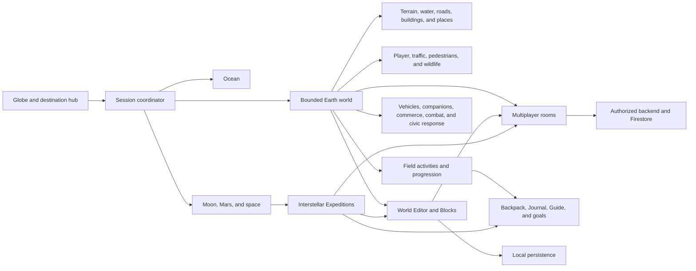
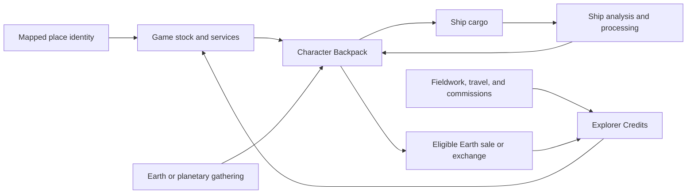
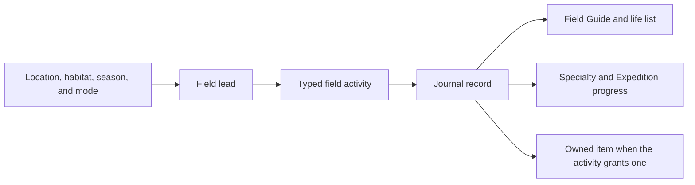

# World Explorer 3D Architecture

World Explorer 3D is a browser game organized around explicit ownership of the
active environment, assembled world, player state, and shared services.

## Application overview

The session coordinator owns transitions. Only the active environment may own
its scene roots, input handlers, timers, subscriptions, and network work.

## Earth world flow

Provider responses do not attach competing final worlds directly to the scene.
They are normalized and compiled into one bounded location. Cancellation and
request identity prevent an older location load from replacing a newer one.

Primary ownership areas:

- `app/js/world/` coordinates Earth loading and publication.
- `app/js/terrain/` owns ground sources, height, land cover, and seams.
- `app/js/world/compiler/` owns normalized transport and layer products.
- `app/js/buildings/` and `app/js/interiors/` own structures and indoor play.
- `app/js/world/water-*`, `app/js/boat-mode/`, and `app/js/ocean/` own water.

## Player movement and cameras

Keyboard, touch, and gamepad input are translated into mode-specific actions by
`app/js/controls/`. Each travel mode consumes the same semantic action shape
without reading unrelated UI state directly.

The active transport actor contract provides position, velocity, orientation,
bounds, and contact state for cameras, multiplayer presence, diagnostics, and
mode handoff. Walking and vehicle HUD values use shared physical unit
conversions so displayed speed matches world movement.

Touch walking uses screen-relative movement. Each thumb gesture retains the
camera direction visible when it began, while the chase camera follows behind
the character. This avoids inverted left/right input and prevents the camera
from feeding its own rotation back into a held direction.

Road vehicles share one physical controller and vehicle-state contract. Family
profiles change acceleration, steering response, braking, grip, mass, and
damage response without creating separate vehicle loops. Responder vehicles,
traffic, claimed vehicles, cameras, HUD units, crash state, and companions all
consume that same contract.

Aircraft and maritime fleets adapt the existing Plane and Boat controllers
rather than creating competing movement systems. Mapped airports, helipads,
marinas, harbors, and ports anchor generated playable fleets. Mapped vessels
keep their provider identity and remain separate from generated activity
vessels.

`app/js/plane-mode.js` remains the player flight owner. The shared fixed-wing
dynamics in `app/js/plane/flight-dynamics.js` resolves aircraft-class tuning,
airspeed, flight path, angle of attack, lift, stall, drag, bank-limited turning,
and ground roll. `app/js/transport/airport-layout.js` compiles mapped aviation
features and explicitly labeled gameplay fallbacks into one runway, stand,
tower, terminal, and mobile-budget layout. Provider airport classification and
mapped runway, terminal, apron, and stand evidence select a major, regional, or
local layout, so fleet size and aircraft mix fit the airport instead of applying
one commercial-airport pattern worldwide. `app/js/transport/aviation-runtime.js`
uses that same layout for presentation, collision, parked aircraft, taxi routes,
and bounded takeoff/landing circuits without running a second player controller.
`app/js/transport/airport-hub.js` is the single pilot/passenger destination
surface for terminal and aircraft entry; destination arrival hands control to
Plane Mode and records travel through the existing Explorer progression owner.
Airborne exit hands the same actor to Walking and the Backpack parachute rather
than creating a separate skydiving character or inventory.

`app/js/boat-mode/runtime-dynamics.js` remains the player vessel owner. The
handling profile in `app/js/boat-mode/vessel-handling.js` derives throttle,
acceleration, drag, braking, rudder response, and turning inertia from vessel
class and displacement. `app/js/transport/maritime-runtime.js` adds port fleet
and bounded harbor activity, then hands a boarded vessel to Boat Mode. Large
ships retain their mapped berth and use a bounded port-water transition when a
clipped provider polygon cannot contain the hull; mapped water must take over
at the transition edge. Boat camera framing uses the active water class:
harbors and channels keep large-ship follow distance bounded, while open water
retains a wider view. Terrestrial layers remain visible near shore and are
suppressed only in known, distant open ocean.

## Character, companions, and urban play

The Character Backpack is the item authority for equipment, ammunition,
recovered loot, purchases, and six player-assigned quick slots. Skills modify
the existing traversal, fieldwork, construction, companion, and spacecraft
owners; they do not replace those systems with parallel implementations.

The living-world population owns ambient pedestrians and traffic. The focused
urban runtime temporarily promotes nearby actors for interaction, vehicles,
civic response, defensive behavior, and collision, then returns them to the
population owner. Downed-actor items become bounded world pickups before the
Backpack can receive them. Mapped stores use exact eligible place records and a
stable per-store exchange model.

Temporary effects and entities follow one lifecycle policy. Projectiles and
impact effects dispose after impact or a short maximum flight. Unclaimed loot,
downed local actors, disabled road vehicles, responders, aircraft, and vessels
have bounded retirement or recovery rules that also dispose their rendering
resources. Room-owned entities are excluded from client-only retirement;
shared cleanup must be accepted by the room authority.

Companions retain individual identity, care, trust, experience, level, and
travel state. Domestic animals, birds, and eligible livestock use one companion
authority. Vehicle travel records an aboard state instead of leaving the
companion to trail through the scene.

## Economy and resource custody

`app/js/urban-sandbox/commerce-model.js` owns the current local Explorer Credits
record, transaction history, stable game stock, and mapped-business exchange.
The legacy storage key is retained so existing Credits survive the schema
change. `app/js/resources/material-catalog.js` defines material identity, unit
mass, and allowed cargo conversion. The Character Backpack remains the item
owner; the economy does not maintain a second list of carried objects.

Mapped place records provide identity, category, position, provider, licence,
and attribution. They do not provide World Explorer stock, price, rarity,
service availability, staffing, access, or a promise that a transaction can
occur at the real place. Those are deterministic game rules and are labeled as
game stock in the interface.

Earth-to-ship material transfer is performed at the existing Surveyor cargo
station. It consumes the exact Backpack quantities, adds the declared mass to
the existing Expedition resources, checks ship capacity, records the transfer,
and restores the Backpack if persistence fails. Personal equipment, ship cargo,
and outpost storage remain separate owners. Shared-room transfer is disabled
until a server transaction can authorize the Backpack removal and cargo addition
together.

The return path uses the same owners in reverse without collapsing their roles.
A planetary field interaction creates one Backpack sample; boarding the return
pod transfers that exact lot into Surveyor science cargo. Resource Processing
documents and seals it, Analysis & Data approves eligible non-recovery evidence,
and the Cargo Hold performs the only ship-to-Backpack export. The exported item
retains its sample, body, contact, mass, truth-class, and review identifiers.
Mapped businesses may buy it only when their game business class is authorized;
the resulting Explorer Credits value is a game rule, not a real commodity price.
Failed cargo persistence removes the tentative Backpack lot. Shared-room export
remains locked until both ownership changes can use one server transaction.

## Field exploration and progression

Normal walking and Live GPS use the same field-activity and player-state
authority. Live GPS may supply trusted physical-movement context, but generated
field leads remain game opportunities rather than live-occurrence claims.

Regional ecology packs are versioned separately from runtime logic and resolved
through one registry. The Baltimore–Chesapeake pack and the additional 5.1
regional packs share the same field-activity authority. Taxon records carry category,
habitat, seasonality, region, source, license, attribution, localization seed,
sensitive-species policy, migration, and rollback metadata.

The registry covers the regions around all built-in Earth destinations. It does
not infer species from OpenStreetMap, store occurrence points, estimate
abundance, or claim a real organism is present. Locations outside reviewed pack
bounds continue to use the global field catalog.

## Planetary and space environments

Planetary play resolves bodies through one catalog and world-address model.
Solid worlds publish an accepted traversable surface with collision and a
separate non-colliding horizon presentation. Atmospheric giants use an explicit
atmospheric journey rather than pretending they have a solid landing surface.
All surface star layers switch to terrain-occluded rendering on planetary entry
and restore their exact Earth material state on exit. Catalog and generated
mission worlds use the same entry and cleanup path.

`app/js/planetary/field-activities.js` owns the shared planetary photography,
geology, and environment-survey sites. Their panorama camera, sample scanner,
case, sensor mast, and sampling plate are presentation attached to the existing
activity record; they do not own a second mission or evidence ledger. The same
E/touch context interaction advances each three-step procedure. Only the final
step calls the existing Journal record and, for geology, the existing Expedition
sample transfer. Destination missions listen for that final field record rather
than maintaining separate field objects.

The surface return pod remains presentation inside
`app/js/planetary/solid-world-runtime.js`; `app/js/expedition/pod-journey-authority.js`
continues to own phase changes and `app/js/expedition/runtime.js` owns sample
custody. Added shell, docking, thermal, landing, ramp, and hatch meshes therefore
cannot bypass the established approach radius, return check, or rendezvous.
`app/js/planetary/runtime/obstacle-authority.js` publishes the active pod hull
to planetary walking only and clears it on departure. Earth building collision,
interior collision, and Blocks remain separate owners and receive no pod record.

Spacecraft state uses SI units for mass, velocity, thrust, propellant, gravity,
collision, and landing checks. The rendered solar system uses declared
presentation scales so it remains playable. Manual input cancels assisted travel,
and swept body collision prevents a fast frame from passing through a planet or
the Sun.

Interstellar Expeditions extend those authorities rather than replacing them.
`app/js/expedition/model.js` owns one versioned mission record for ship, route,
strategic time, crew, stores, systems, contacts, events, failures, samples, and
field stations. `simulation.js` advances analytical time; rendered frames never
stand in for years of travel. `runtime.js` presents the planner, ship work, and
local-stop handoff. The walkable ship remains nested inside the active Space
session and returns to that same session. A pending voyage event selects one
existing ship room and station; the ship interior owns its warning beacon,
route guidance, crew response, and physical interaction. The planner can report
the incident but cannot resolve it outside the ship.

At the affected station, a selected response starts one three-step physical
procedure. `ship-interior.js` publishes only the current procedure node through
the existing interior interaction collection; `interiors/runtime.js` routes the
normal E/touch action back to the ship. The interior owns the console geometry,
step lighting, prompt, and movement feedback. It does not alter mission state.
After the third step, `expedition/runtime.js` asks the existing Voyage Director
to apply crew, resource, system, delayed-consequence, and outcome changes to the
same Expedition record. Failed persistence leaves the final verification step
available instead of presenting an uncommitted repair as complete.

Stable route contacts are promoted through `contact-authority.js` into the
existing universe catalog and planetary surface authority. `archive.js` keeps
discovered contacts and their field stations after the active mission ends.
Space restores that catalog before Wayfinder is built, and the catalog map
replaces records by stable ID, so reload and free-roam revisit do not create a
second star system or planet. A modeled contact remains labeled as modeled game
content and never impersonates an observed catalog object.

Field stations use the existing Blocks renderer, shape catalog, collision, and
world address. Their structure is protected as system-owned while player Blocks
retain their own placement limit and ownership. Construction and service remove
the exact transferred ship resources. The strategic clock advances station
power, stores, condition, operating status, revision, and log. Single-player
state is local and versioned; a room Expedition is server-owned and clients may
only request validated mutations through the existing room backend.

## World Editor and persistent Blocks

The World Editor is the single entry point for two related workflows:

- Reviewed overlays use drafts, validation, revisions, moderation, and a
  published read-only projection.
- Blocks use direct local or room persistence, placement/removal authority,
  undo, reconnect handling, and collision integration.

These workflows share navigation and world ownership but not trust rules.
Blocks do not become map-provider edits, and overlay drafts do not bypass
moderation.

## Multiplayer and backend

Multiplayer rooms are bounded to one location. Firestore stores room metadata,
presence, chat, Blocks, activities, vehicles, and supported shared state.
Firebase Functions handle operations that require server authorization.

Client code may request an action, but authentication, membership, ownership,
moderation, and payload checks are enforced at the backend or in Firestore
rules. Production credentials are never part of the public source tree.

Room presence is the source for player and room discovery. Future map-based
discovery will aggregate privacy-safe activity areas and current counts from
that authority; it will not publish precise coordinates from an unrelated
client or infer online players from local scene objects.

## Data classification

Provider records preserve identity, source, freshness, units, and a truth
class. The application distinguishes:

- observed data;
- forecasts and predictions;
- modeled or derived data;
- reference layers;
- mapped features;
- game-generated content.

Fallbacks may maintain playability, but they must not be presented as measured
or surveyed facts. Attribution is maintained in the interface and public data
documentation.

## Release shape

Canonical source is built into an ignored static hosting directory. The build
contains the public site, game, account/legal pages, hashed runtime assets, and
the selected Firebase environment configuration. Backend deployment is a
separate operation from hosting deployment.

Production promotion is intentionally separate from staging preview creation.
The 5.1 release build is built once, preserved with its manifest and content
hash, and exercised on desktop and mobile. Backend authorization, multiplayer,
and creator checks run against local Firebase emulators. Production hosting and
backend services are not changed until that exact build is reviewed and
explicitly approved.
