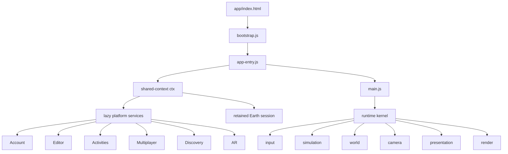
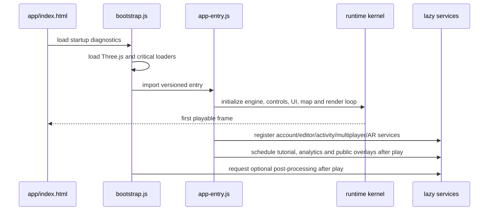
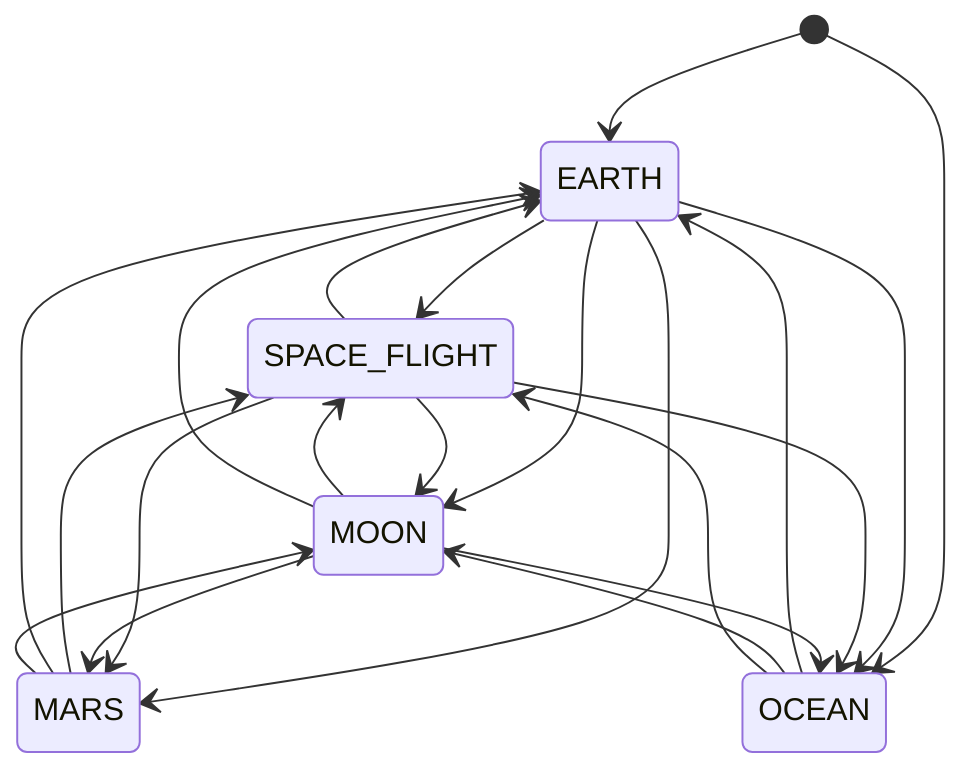
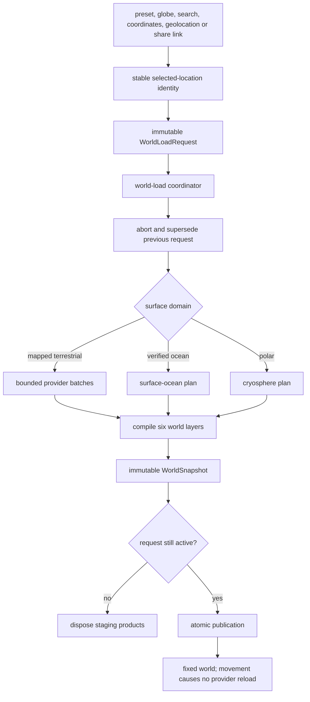
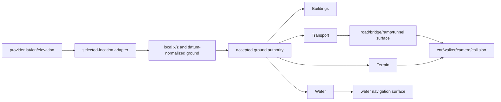
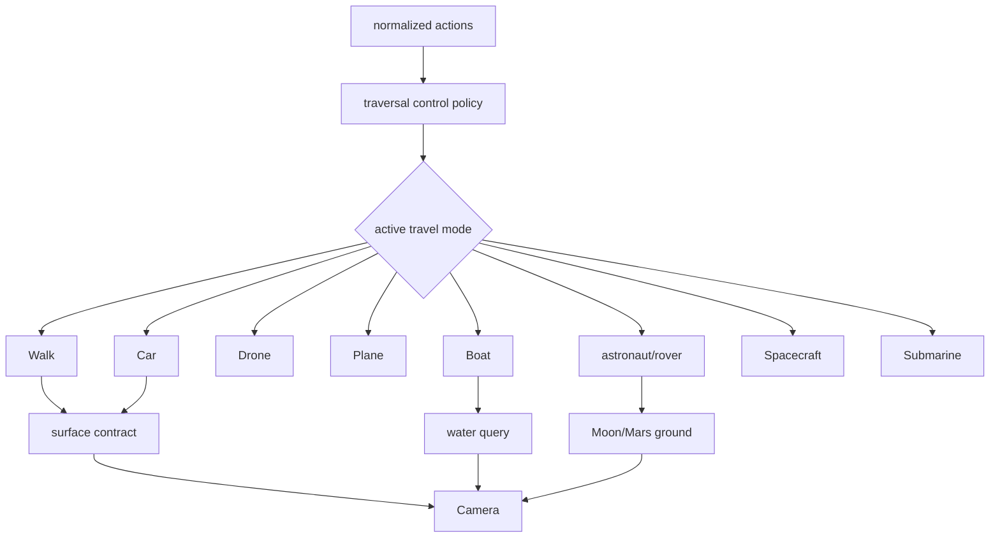
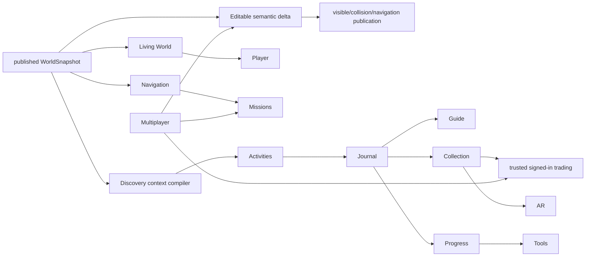

# World Explorer 3D — Architecture Map

Status: authoritative for version 4.3.0 release source inspected 2026-08-17. Baseline and status terminology are defined in `SYSTEM_INVENTORY.md`.

## 1. Runtime ownership map

`app/js/shared-context.js` is the compatibility bridge for mutable application ownership. It is not a second frame loop or an independent state store. `app/js/main.js` installs the primary frame runtime. `app/js/runtime/kernel.js` executes named, ordered systems and records timing/error state.

Kernel order and budgets:

| Phase | Principal work | Frequency |
| --- | --- | --- |
| input | normalize keyboard, pointer, touch and gamepad actions | each frame |
| simulation | active actor physics and gameplay | fixed 1/60 s, at most 5 catch-up steps |
| world | sky, weather, water, environment-dependent state | each frame or subsystem throttle |
| camera | actor following, structure/tunnel containment | each frame |
| presentation | HUD, minimap, discovery, availability | throttled by consumer |
| render | active environment renderer | each frame |

Frame delta is capped at 0.1 seconds. A critical system failure stops the kernel. A noncritical system is disabled and recorded rather than silently retried every frame.

## 2. Startup and lazy-load graph

Critical boot modules include config/state, renderer, physics, walking, travel mode, sky/weather, core gameplay, input, HUD, map, and UI. Interiors, fishing, editor, activity creator/discovery, multiplayer, AR, analytics, public overlays, Live Earth, Mars, Ocean, Space, block builder and Flower Challenge are loaded on demand or after first play.

## 3. Environment ownership and transitions

The exclusive environment enum is `EARTH`, `SPACE_FLIGHT`, `MOON`, `MARS`, and `OCEAN`.

`session-coordinator.js` owns requests and commits through `env.js`. Each transition has a sequence, abort signal and lifecycle scope. Environment adapters implement prepare/enter/exit/synchronous-exit/snapshot behavior.

| Environment | Scene/renderer ownership | Loop ownership | Return behavior |
| --- | --- | --- | --- |
| Earth | primary scene and renderer | runtime kernel | retained by location identity |
| Moon | primary renderer with lunar scene ownership | runtime kernel | restores retained Earth or enters Space |
| Mars | primary renderer with Mars world root | runtime kernel | restores retained Earth or enters Space/Moon |
| Space Flight | auxiliary canvas/scene/renderer | space session animation loop | destroys auxiliary scene and returns primary canvas |
| Ocean | auxiliary canvas/scene/renderer | ocean session animation loop | destroys auxiliary scene and returns primary canvas |
| AR | transparent auxiliary renderer over camera/3D view | temporary RAF or WebXR animation loop | stops tracks/session and returns to owning environment |

There is one primary Earth renderer. Space and Ocean are deliberate exclusive exceptions. AR is temporary presentation and cannot own the world.

## 4. Earth selection and atomic world load

The six snapshot layers are terrain, hydrology, transport, buildings, landuse and places. Every layer owns an authority, completeness, coverage, source and stable identities. An identical active request may share its promise; a changed signature supersedes it. Publication and provider responses check the current request identity.

Detailed building massing uses one build-pinned Overture release. Publication
requires every requested PMTiles cell to complete after a bounded retry; a
partial tile set is not a valid building world. Overture, Shortbread, and
Overpass are separate provider operations in the world-load ledger, and the
building layer product records the source that actually published. A fallback
may keep the world usable, but release verification requires the reviewed
Overture authority and cannot call a generalized fallback production-equivalent.

Detailed provider coverage is centered on the selection. A one-shot generalized regional context extends visibility to a fixed 14,000 m radius. It is not player-driven streaming. Far-terrain visibility changes are LOD over already-loaded state.

## 5. Coordinate and surface contracts

The selected latitude/longitude is local origin. Normal regions use local latitude/longitude meters with longitude cosine correction; polar regions use local east-north-up handling. Runtime scale is approximately 0.90 world unit per meter.

Visible surface ownership is explicit:

| Surface | Authority |
| --- | --- |
| base land | accepted-ground terrain artifact or declared fallback |
| road/path | compiled transport deck/profile |
| bridge/elevated road/ramp | structured transport surface model |
| tunnel | tunnel floor/corridor and portal aperture |
| mapped water | hydrology/water-surface registry |
| open ocean | surface-domain ocean water |
| building footprint/interior | building/interior compiler while active |
| Moon/Mars | destination terrain sampler |
| underwater seabed | Ocean bathymetry sampler |

Spawn, walking, driving, building placement, wildlife, discovery and camera systems must consume those authorities rather than invent a parallel height.

## 6. World compilation and publication

The Earth compiler is organized by data products rather than UI screens:

- ground readiness and terrain;
- water bodies, waterways, coastline and terrain masks;
- normalized transport source and graph;
- roads, paths, junctions, bridge/elevated/ramp/tunnel structures;
- landuse/hardscape/vegetation;
- building source identity, inference, geometry, roofs, facades and batching;
- landmark catalogs and fixed regional structures;
- POIs/place semantics, entrances, navigation graph and interior eligibility;
- Living World derivation;
- bounded Living World actor promotion, contextual urban interactions and
  session equipment/impact runtime;
- witnessed civic-response runtime with bounded location-aware responder
  vehicles, road-constrained search/contact outcomes and no standalone chase mode;
- room urban authority adapter backed by transaction-owned vehicle leases,
  action clocks and entity condition state;
- editable-world suppression and safe semantic objects;
- World Discovery environment cells, encounter slots and wildlife slots.

Compilation staging provider data is released after geometry publication. World collections are centrally registered so reset/location change can dispose them. Spatial indexes keep actor, camera and collision queries bounded.

## 7. Movement/controller architecture

Keyboard, touch and gamepad inputs normalize to shared actions. Mode dispatch selects one actor/controller. Live GPS may own walker horizontal movement after explicit consent, while terrain/structure collision retains vertical ownership. Companions are presentation followers, never authoritative actors.

The existing `building-entry` and `interiors` modules own indoor traversal. The
planned multi-floor extension must retain the exterior building identity and add
level-aware surfaces/connectors to that owner; it must not introduce another
Earth scene or interior gameplay mode.

## 8. Map inventory and ownership

| Map surface | Owner | Data/purpose | Interaction |
| --- | --- | --- | --- |
| Title globe selector | `ui/globe-selector/*` | preset/custom Earth selection | rotate/select/search/geolocate/launch |
| Minimap | `map/runtime.js`, `map/earth-*` | player, roads, POIs, objectives | zoom; follows actor |
| Large Earth map | `map.js`, `ui/map-interactions.js` | properties, navigation, interiors, overlays, activities, POIs, memories, games, civic response/search areas, transport | filters, select/info, navigation aid, permitted teleport |
| Earth tile layers | `map/tiles.js` | OSM base and optional satellite imagery | base-layer toggle |
| Moon map | `map/moon.js` | lunar destination context | destination/landing context |
| Live Earth globe | `live-earth/render-globe.js` | satellites, earthquakes, aircraft, weather, marine, imagery | layer selection and detail |
| Ocean HUD/sonar | `ocean/hud.js` | depth, seabed, marine scene context | submarine navigation aid |
| Solar maps | `solar-system/ui.js` | inner/full logarithmic solar system | object selection/info |
| Universe/deep-space UI | `universe/ui.js` | catalog navigation and scale | target selection/return to Sol |
| Activity/world markers | activity, discovery, memory, multiplayer modules | bounded overlays on Earth map/world | inspect/start/join as allowed |

These are separate presentations over shared world/location identity. They are not separate map databases. The large map currently retains some older inline shell styling and should not be treated as the design-system reference.

## 9. Gameplay, discovery and editable dependency map

One primary gameplay plugin owns the main mission. World Discovery is an exploration service and can coexist with free exploration; it pauses/inhibits incompatible actions through explicit policy. Editable World composes a bounded fictional layer without mutating base provider records.

## 10. Lifecycle and cleanup map

`runtime/lifecycle-scope.js` tracks timeout, interval, animation-frame, event-listener and arbitrary cleanup ownership. Major scope owners are environment transition/session, world load, Ocean, Space, AR, multiplayer listeners, Live GPS watch/listeners, discovery presentation, editor, activities, interiors and tutorial UI.

Cleanup invariants:

1. Superseded world loads cannot publish.
2. Hidden exclusive environments cannot retain render loops.
3. Media tracks stop when AR closes.
4. Live GPS stops when explicitly ended or page lifecycle requires it.
5. Firestore listeners unsubscribe on room/service teardown.
6. Scene objects dispose geometry/material/texture ownership on world or mode replacement.
7. UI timers and listeners belong to a scope or stable one-time application owner.
8. Earth scene identity remains retained only when a destination excursion is expected to return to it.

## 11. Backend boundary

The browser directly performs rendering, simulation, public-provider decoding, local persistence and permitted Firestore operations. Cloud Functions own Stripe, account deletion, admin/moderator authorization, public overlay publication, trusted discovery claims/trades, shared DeFlock claims and same-origin provider proxies. See `PERSISTENCE_AND_TRUST.md` for exact collections and operations.

## 12. Architecture limitations and ownership risks

- `shared-context.js` is an explicit but broad compatibility container; new work should not introduce a second owner for existing state.
- Space and Ocean intentionally own separate render loops; lifecycle tests are required whenever their entry/exit changes.
- AR has another temporary render/session lifecycle and must remain subordinate to the active environment.
- The large DOM shell combines newer modules with legacy inline UI; component location does not prove coherent product hierarchy.
- Long-tail discovery activities share common mechanics; catalog breadth exceeds unique minigame breadth.
- Mapped truth, derived context, generated visuals and player-authored edits coexist and must retain provenance separation.
- The working tree is not immutable. Architecture acceptance must be repeated against the final candidate hash.
