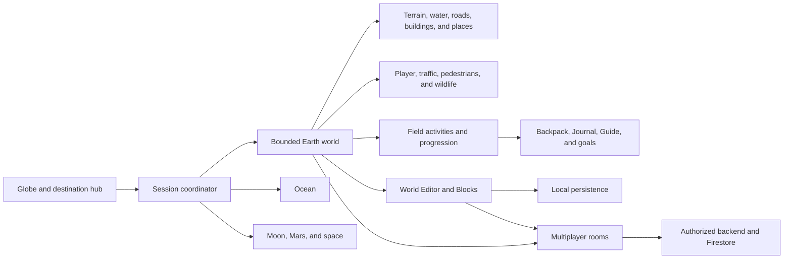
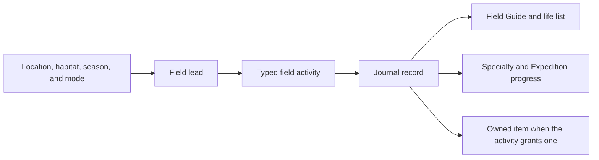

# World Explorer 3D Architecture

World Explorer 3D is a browser game organized around explicit ownership of the
active environment, assembled world, player state, and shared services.

## Application overview

The session coordinator owns transitions. Only the active environment may own
its scene roots, input handlers, timers, subscriptions, and network work.

## Earth world flow

Provider responses do not attach competing final worlds directly to the scene.
They are normalized and compiled into one bounded location. Cancellation and
request identity prevent an older location load from replacing a newer one.

Primary ownership areas:

- `app/js/world/` coordinates Earth loading and publication.
- `app/js/terrain/` owns ground sources, height, land cover, and seams.
- `app/js/world/compiler/` owns normalized transport and layer products.
- `app/js/buildings/` and `app/js/interiors/` own structures and indoor play.
- `app/js/world/water-*`, `app/js/boat-mode/`, and `app/js/ocean/` own water.

## Player movement and cameras

Keyboard, touch, and gamepad input are translated into mode-specific actions by
`app/js/controls/`. Each travel mode consumes the same semantic action shape
without reading unrelated UI state directly.

The active transport actor contract provides position, velocity, orientation,
bounds, and contact state for cameras, multiplayer presence, diagnostics, and
mode handoff. Walking and vehicle HUD values use shared physical unit
conversions so displayed speed matches world movement.

Touch walking uses screen-relative movement. Each thumb gesture retains the
camera direction visible when it began, while the chase camera follows behind
the character. This avoids inverted left/right input and prevents the camera
from feeding its own rotation back into a held direction.

## Field exploration and progression

Normal walking and Live GPS use the same field-activity and player-state
authority. Live GPS may supply trusted physical-movement context, but generated
field leads remain game opportunities rather than live-occurrence claims.

The Baltimore ecology pack is versioned separately from runtime logic. Taxon
records carry category, habitat, seasonality, region, source, license,
attribution, localization seed, and sensitive-species policy.

## World Editor and persistent Blocks

The World Editor is the single entry point for two related workflows:

- Reviewed overlays use drafts, validation, revisions, moderation, and a
  published read-only projection.
- Blocks use direct local or room persistence, placement/removal authority,
  undo, reconnect handling, and collision integration.

These workflows share navigation and world ownership but not trust rules.
Blocks do not become map-provider edits, and overlay drafts do not bypass
moderation.

## Multiplayer and backend

Multiplayer rooms are bounded to one location. Firestore stores room metadata,
presence, chat, Blocks, activities, vehicles, and supported shared state.
Firebase Functions handle operations that require server authorization.

Client code may request an action, but authentication, membership, ownership,
moderation, and payload checks are enforced at the backend or in Firestore
rules. Production credentials are never part of the public source tree.

## Data classification

Provider records preserve identity, source, freshness, units, and a truth
class. The application distinguishes:

- observed data;
- forecasts and predictions;
- modeled or derived data;
- reference layers;
- mapped features;
- game-generated content.

Fallbacks may maintain playability, but they must not be presented as measured
or surveyed facts. Attribution is maintained in the interface and public data
documentation.

## Release shape

Canonical source is built into an ignored static hosting directory. The build
contains the public site, game, account/legal pages, hashed runtime assets, and
the selected Firebase environment configuration. Backend deployment is a
separate operation from hosting deployment.

Production promotion is intentionally separate from staging preview creation.
The 5.0 build must be tested on desktop and mobile before production hosting is
changed.
