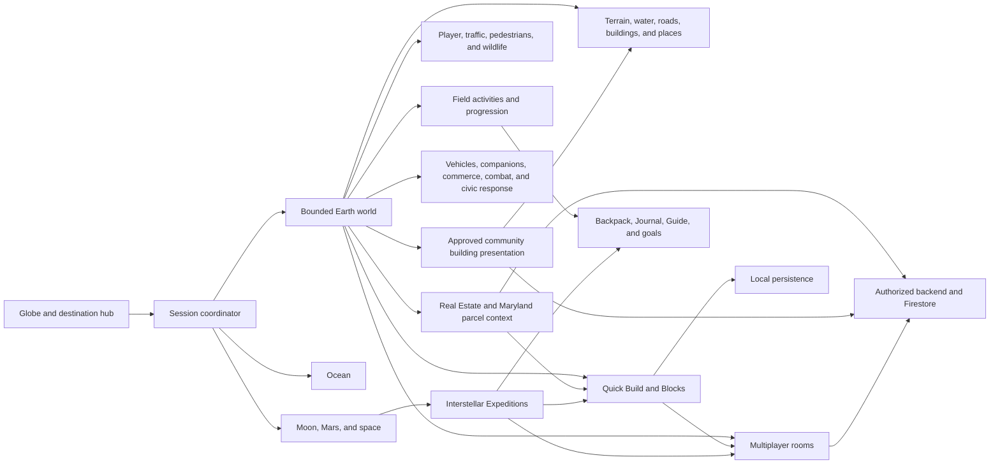
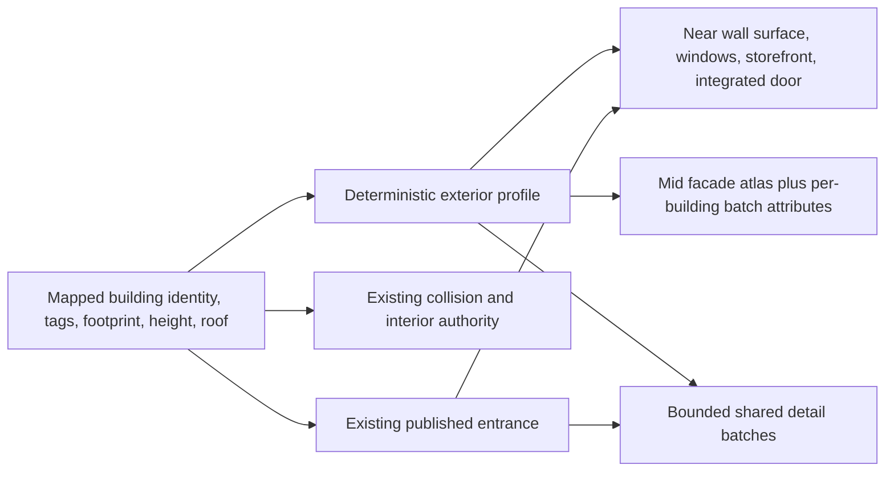
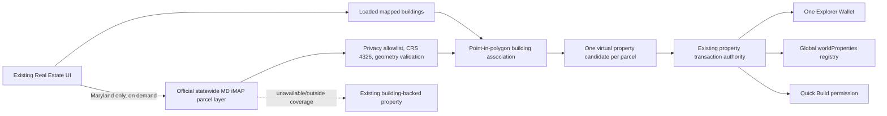
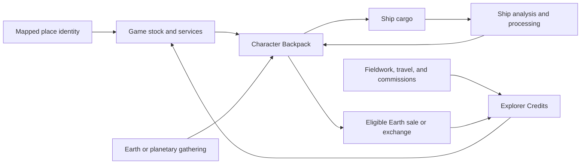
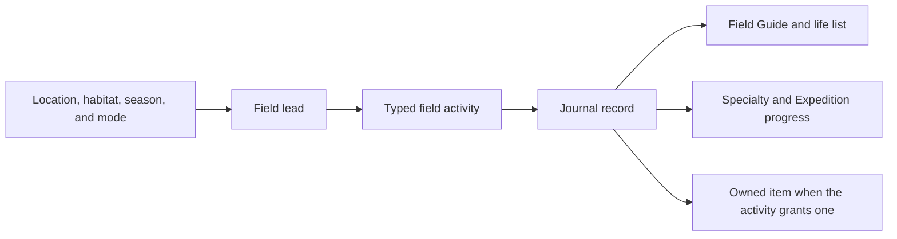

# World Explorer 3D Architecture

Local ground update,2026-09-08: `worldcover-categorical.js` validates bounded
numeric rasters; existing `worldcover-baseline.js` owns queue/cache/fallback;
`worldcover-biome-state.js` selects nearest local evidence. Surface material
blending changes presentation only. `vegetation.js` owns placement;
`vegetation-models.js` consumes the existing model catalog/runtime and publishes
cell LOD batches into the existing vegetation collection. The existing obstacle
solver consumes a nearby trunk index; no parallel physics or world authority.
Old generated sphere-canopy rendering/allocation has been removed. Global
appearance, terrain seams and physical-device acceptance remain open.

Updated 2026-09-07 against source `c801c19f`. This map identifies ownership and
integration, not universal release acceptance. [Current test guide](CURRENT_TEST_GUIDE.md)
records the deployed boundary; [project description](PROJECT_DESCRIPTION.md)
explains the app as a whole.

> POI work in progress (2026-09-05):
> [FUNCTIONAL_POI_SYSTEM.md](../FUNCTIONAL_POI_SYSTEM.md) defines the new
> normalization and capability boundary. Semantic publication, safe building
> association, and the shared wallet boundary are now live; interior and full
> family acceptance gates remain in progress.

> Community Reality Capture (2026-09-07): staging is provisioned and the
> phone → manual facade → approval → mapped-house loop has worked. Latest
> manual-first and privacy hardening is source-only; playable manual rooms,
> contributor-world previews and community rewards are not complete.

World Explorer 3D is a browser game organized around explicit ownership of the
active environment, assembled world, player state, and shared services.

## Application overview

### Product entry points and shared services

| Entry / subsystem | Ownership and connection |
| --- | --- |
| Public site / About | Static product pages lead into the app and existing account/support routes; they do not own gameplay state |
| Account | `account/account-center.js` connects Firebase identity, profile/creator settings, friends, security and receipts; phone and desktop use the same UID |
| Capture page | Lightweight authenticated client of the existing capture backend, not another world instance or building database |
| Admin | Role-authorized actions call backend moderation; successful publication is distinct from refreshing dashboard widgets |
| Live Earth | `app/js/live-earth/registry.js` and provider-specific modules own data layers and health; they do not become the road-traffic simulation or terrain authority |
| AR | `app/js/ar/session-service.js` owns AR lifecycle; capability detection chooses spatial AR, camera or 3D fallback. It does not own uploaded capture reconstruction or persistent anchors |
| Activities / rankings | Existing activity authorities and leaderboard catalog own results; capture awards and featured contribution rooms are not implemented by merely adding a new label |
| Support | Stripe payment/receipt flow remains separate from the single gameplay economy |

### Persistence boundaries

Firebase Auth identifies a user; it is not itself an authorization decision.
Backend authorities validate purchases, property, player state and capture
actions. Firestore stores their structured records; Storage holds media.
Browser settings and recovery drafts are convenience state, not trusted shared
ownership. Multiplayer rooms have their own membership/session lifecycle and
must not implicitly publish a private capture. Approved exterior presentation
is global by building identity; private interior delivery checks space access.

See the capture schema table below for actual collection names. Proposed names
such as `captureSessions`, `representationRevisions` and `reviews` must not be
documented as deployed collections when the current implementation stores those
states on existing records.

### Local bridge/tunnel transition work (2026-09-07; not release-approved)

Transport graph/profile compilation owns connected floor heights, including
wholly generalized junctions. Exact and generalized source families remain
separate. `tunnel-system-model` owns cover-derived external portal locations and
continuous internal lining. Its final compilation samples the published terrain
without feeding portal cuts back into cover detection.

`world/compiler/tunnel-solid-model.js` collects compatible graph-connected
mouths and constructs indexed closed clearance sweeps. `tunnel-solid-kernel.js`
unions them with pinned Manifold 3.5.3 in a short-lived worker. Publication runs
after final floor/cover compilation, before visual/collision assembly. One
boundary feeds rendering, wall collision and indexed camera/ceiling queries;
successful components do not also publish independent tube skins. Worker and
station budgets report failures through `ctx.tunnelSolidCompilation`. Simple
unjoined tunnels and failed components retain the existing shell path; failures
are not accepted geometry. `tunnel-junction-openings.js` remains that path's
bounded interval helper, not a second overlay on compiled solids.

Inferred Shortbread street labels remain display-only and cannot establish
route-gap connectivity. Explicit source layer and topology capabilities remain
distinguishable from absent/generalized attributes.

`hud/vehicle-camera-body.js` measures attached visual bounds once per asset
change, transforms the camera into that body's frame, and rejects collision-
shortened chase poses inside it. A clear roof pose is preferred; confined-space
first person is temporary and does not rewrite the player's selected mode.
The production packager emits a hashed worker entry and publishes its URL in
the existing runtime configuration; local JS/WASM/license files are vendored.

Bridge deck presentation consumes the assembly's sampled thickness, retaining
its approach taper. Tunnel concrete textures are shared across world rebuilds;
no per-light dynamic light population was added. Complex portal/branch visual
acceptance remains open. Ordinary road footprints and mapped buildings are not
removed to conceal structure conflicts.

The session coordinator owns transitions. Only the active environment may own
its scene roots, input handlers, timers, subscriptions, and network work.

## Earth world flow

Provider responses do not attach competing final worlds directly to the scene.
They are normalized and compiled into one bounded location. Cancellation and
request identity prevent an older location load from replacing a newer one.

Primary ownership areas:

- `app/js/world/` coordinates Earth loading and publication.
- `app/js/terrain/` owns ground sources, height, land cover, and seams.
- `app/js/world/compiler/` owns normalized transport and layer products.
- `app/js/buildings/` and `app/js/interiors/` own structures and indoor play.
- `app/js/world/water-*`, `app/js/boat-mode/`, and `app/js/ocean/` own water.

### Building exterior presentation flow

`world/building-exterior-catalog.js` is the sole generated-style selector.
`engine/building-facade-materials.js` owns shared wall textures and facade
shaders. `world/building-exterior-details.js` adds presentation-only geometry
to its own disposable collection with a maximum of six material batches. The
catalog can infer appearance, but it cannot move a footprint, alter terrain,
replace collision, create an entrance, change a POI or property identity, or
override an interior. Mid-LOD colors and roof appearance travel as merged
attributes so distant buildings do not allocate unique materials.

### Community Reality Capture flow

`app/capture.html` → existing Firebase Auth → owner-authorized capture API →
the same capture record and upload gallery. Account links and desktop QR open
this lightweight page without booting a second world. QR carries a capture ID,
not credentials. Local drafts are UID-scoped; server uploads survive device
changes. Staging Storage, Functions and worker infrastructure are provisioned.

```mermaid
flowchart LR
    Target[Stable mapped building] --> Draft[Authenticated guided draft]
    Draft --> Normalize[Client normalization and EXIF removal]
    Normalize --> Quarantine[Write-once private quarantine]
    Quarantine --> Validate[Server signature, count, size, and state validation]
    Validate --> Manual[Select mapped wall, crop and place photos]
    Manual --> Save[Owner revisioned save]
    Save --> Submit[Immutable cropped-photo GLB submission]
    Submit --> Review[Administrator photo, model, footprint, and alignment review]
    Validate -. restricted development path .-> Worker[Reconstruction and GLB optimization]
    Worker --> Review
    Review -->|approved exterior| Exterior[Presentation overlay]
    Review -->|approved interior| Interior[Authorized private-space resolver]
    Exterior --> Canonical[Existing mapped identity, terrain, collision, POI, and property]
    Interior --> Proxy[Existing interior proxy; layout alignment still requires acceptance]
    Review -->|rejected or failed| Fallback[Existing procedural presentation]
```

The capture system never creates a second building authority. Manual wall
patches cover selected regions of the actual mapped footprint; uncovered surfaces
remain procedural. They do not suppress the building or alter its collision.
Whole-model reconstruction is a separate representation kind that can suppress
generated visuals after load. Do not apply that whole-model behavior to patches.

`alignment.js` snapshots mapped geometry and wall height; `hybrid-editor.js`
owns crop/placement editing; server save checks owner and revision. Submission
builds an immutable cropped-image GLB. Approval publishes the exact submitted
revision with its region manifest. `runtime.js` resolves approved exterior
representations by canonical building ID, with bounded activation and procedural
fallback. The latest facade fix uses body height rather than roof-inclusive
height and fixes the local-X orientation of generated trim.

Interior model presentation currently retains an existing proxy shell for
collision and interactions. An arbitrary reconstructed layout is **not** thereby
a correctly playable interior. The manual room editor, dimensions, doors,
collision agreement and owner-world preview are remaining implementation work.

### Capture records, media and authority

| Record or media | Current owner and purpose |
| --- | --- |
| Existing canonical building identity | World/provider identity remains the target; geometry snapshots document alignment rather than becoming another building registry |
| `realityCaptures/{captureId}` | Owner UID, target, uploads/manifest, processing status/attempt identity, hybrid preview/submission and review; these are currently fields on the capture, not invented separate `captureSessions` or `reviews` collections |
| `buildingRepresentations` | Approved exterior publication records, immutable model reference and region/height metadata |
| `buildingPatchManifests` | Building-specific published patch regions and overlap conflict checks |
| `privateSpaces` | Interior owner, installed/pending capture, access mode, members and temporary grants |
| `privateSpaceAccessRequests` | Visitor requests, separate from a grant or public publication |
| `captureAdmission` | Admission/quota bookkeeping; processing also uses a lease and attempt ID, not client-controlled worker state |
| Storage `reality-captures/{uid}/{captureId}/originals/…` | Private original media; Firestore contains metadata, not photo blobs |
| Storage `…/processed/manual-v1/r{revision}-{hash}/capture.glb` | Immutable manual derivative; only the chosen cropped photos are embedded |
| Storage processing-attempt paths | Reconstruction outputs tied to the attempt, separate from manual derivatives |
| UID/capture-scoped local draft store | Recoverable editing convenience, never publication or permission authority |

The new source public-access guard requires a matching reviewed capture before
`PUBLIC` grants interior access. Owner/admin access and explicit private grants
are distinct. A public exterior cannot change an interior policy. This guard is
not yet part of the deployed facade-only update. Changing an already-private
approved capture into a public contribution still needs a complete reviewed UI
flow; policy enum values alone are not proof of that feature.

Raw uploads, processed private interiors, capture records, review decisions,
grants, and access requests are server-owned. Browser code can request an action
but cannot approve a capture, mint an asset URL, or infer permission from a
visible button. `PRIVATE`, `INVITE_ONLY`, `GUEST_LIST`, `SESSION_GUESTS`, and
`PUBLIC` are generic space modes; every new interior starts `PRIVATE` regardless
of contribution intent. Exterior visibility is stored and resolved separately.

### Streetscape boundary

The rejected September 6 offset-ribbon sidewalk presentation is not part of the
runtime. Earth retains the established mapped footway and pedestrian graph plus
the compiled road/terrain authority. A future streetscape implementation must
derive coherent road-edge and block polygons with joined intersections before
it can return. See [STREETSCAPE_SYSTEM.md](../STREETSCAPE_SYSTEM.md).

## Property and Maryland parcel flow

`gis/maryland-parcel-core.js` is the normalized parcel contract and 24-code
jurisdiction resolver. `gis/maryland-parcel-provider.js` owns bounded requests,
pagination, cancellation, timeout, simplification, and the small memory cache.
`real-estate/parcel-property-model.js` groups all currently loaded buildings
whose centers fall inside a parcel, retains land-only parcels, calculates the
documented game estimate, and answers parcel-aware build permission. The UI does
not start these requests during ordinary traversal.

Parcel-backed records use `parcel:md:{jurisdiction}:{hash(public POLYID)}` as
their canonical world property identity. The public source polygon ID remains in
the immutable catalog for verification but is not displayed as ownership data.
Existing building IDs remain the fallback everywhere and are retained as legacy
join aliases when a Maryland building becomes parcel-backed. Transactions still
settle through `functions/property-authority.js`; balances still settle through
the one economy wallet. Parcel geometry is never accepted as a client-authored
Firestore ownership boundary.

World Explorer keeps every mapped building available for exploration under the
existing entry rules. Buying a virtual parcel does not assert control over a real
building or lock the public exploration copy. Ownership controls the player's
private saved property state and Maryland Quick Build permission. If the parcel
provider is unavailable, pre-existing entry and build behavior remains usable.

## Player movement and cameras

Keyboard, touch, and gamepad input are translated into mode-specific actions by
`app/js/controls/`. Each travel mode consumes the same semantic action shape
without reading unrelated UI state directly.

The active transport actor contract provides position, velocity, orientation,
bounds, and contact state for cameras, multiplayer presence, diagnostics, and
mode handoff. Walking and vehicle HUD values use shared physical unit
conversions so displayed speed matches world movement.

Touch walking uses screen-relative movement. Each thumb gesture retains the
camera direction visible when it began, while the chase camera follows behind
the character. This avoids inverted left/right input and prevents the camera
from feeding its own rotation back into a held direction.

Road vehicles share one physical controller and vehicle-state contract. Family
profiles change acceleration, steering response, braking, grip, mass, and
damage response without creating separate vehicle loops. Responder vehicles,
traffic, claimed vehicles, cameras, HUD units, crash state, and companions all
consume that same contract.

`app/js/physics/road-vehicle-airborne.js` is the road-vehicle vertical-motion
authority. It detects actual ramp crests and support loss, integrates Earth
gravity while airborne, reconciles newly streamed terrain contact, and reports
landing impact to the existing transport-damage contract. The permanent BMW
uses the explicit `exploration_unlimited` durability policy: it stays at full
condition and remains drivable, while other vehicles can take damage. Persistent
BMW upgrades are owned by `app/js/transport/vehicle-upgrades.js` and alter the
same acceleration, braking, grip, recovery, and landing calculations.

Aircraft and maritime fleets adapt the existing Plane and Boat controllers
rather than creating competing movement systems. Mapped airports, helipads,
marinas, harbors, and ports anchor generated playable fleets. Mapped vessels
keep their provider identity and remain separate from generated activity
vessels.

`app/js/plane-mode.js` remains the player flight owner. The shared fixed-wing
dynamics in `app/js/plane/flight-dynamics.js` resolves aircraft-class tuning,
airspeed, flight path, angle of attack, lift, stall, drag, bank-limited turning,
and ground roll. `app/js/transport/airport-layout.js` compiles mapped aviation
features and explicitly labeled gameplay fallbacks into one runway, stand,
tower, terminal, and mobile-budget layout. Provider airport classification and
mapped runway, terminal, apron, and stand evidence select a major, regional, or
local layout, so fleet size and aircraft mix fit the airport instead of applying
one commercial-airport pattern worldwide. `app/js/transport/aviation-runtime.js`
uses that same layout for presentation, collision, parked aircraft, taxi routes,
and bounded takeoff/landing circuits without running a second player controller.
`app/js/transport/airport-hub.js` is the single pilot/passenger destination
surface for terminal and aircraft entry; destination arrival hands control to
Plane Mode and records travel through the existing Explorer progression owner.
Airborne exit hands the same actor to Walking and the Backpack parachute rather
than creating a separate skydiving character or inventory.

`app/js/boat-mode/runtime-dynamics.js` remains the player vessel owner. The
handling profile in `app/js/boat-mode/vessel-handling.js` derives throttle,
acceleration, drag, braking, rudder response, and turning inertia from vessel
class and displacement. `app/js/transport/maritime-runtime.js` adds port fleet
and bounded harbor activity, then hands a boarded vessel to Boat Mode. Large
ships retain their mapped berth and use a bounded port-water transition when a
clipped provider polygon cannot contain the hull; mapped water must take over
at the transition edge. Boat camera framing uses the active water class:
harbors and channels keep large-ship follow distance bounded, while open water
retains a wider view. Terrestrial layers remain visible near shore and are
suppressed only in known, distant open ocean.

## Character, companions, and urban play

The Character Backpack is the item authority for equipment, ammunition,
recovered loot, purchases, and six player-assigned quick slots. Skills modify
the existing traversal, fieldwork, construction, companion, and spacecraft
owners; they do not replace those systems with parallel implementations.

The living-world population owns ambient pedestrians and traffic. The focused
urban runtime temporarily promotes nearby actors for interaction, vehicles,
civic response, defensive behavior, and collision, then returns them to the
population owner. Downed-actor items become bounded world pickups before the
Backpack can receive them. Mapped stores use exact eligible place records and a
stable per-store exchange model.

`app/js/living-world/demand-model.js` bounds logical population by performance
tier and independently varies pedestrian and vehicle activity by time band.
One canonical POI lifecycle normalizes mapped identity and capabilities once,
associates safe building tenancy and a published entrance once, and publishes a
bounded nearby set. Commerce and building entry consume that record rather than
reclassifying provider tags independently. Mapped POIs and building entrances weight existing route edges, so activity
collects around plausible destinations without inventing geography.
`traffic-control-system.js` projects mapped or inferred controls onto those
lane edges, owns stop dwell and deterministic two-axis signal phases, and feeds
the existing population motor. `world/furniture.js` may render a physical pole
only after finding a point outside the published road envelope; the semantic
control remains usable if no safe fixture position exists.

`app/js/interaction/world-click-router.js` is the click-only semantic picking
owner for pedestrians, traffic, POIs, street furniture, and both individual
and batched building meshes. Existing gameplay owners decide the action after
selection. Weapons, Quick Build, and specialized activity panels keep input
precedence. Selection feedback is one short bottom-right card and does not add
another persistent HUD surface.

Temporary effects and entities follow one lifecycle policy. Projectiles and
impact effects dispose after impact or a short maximum flight. Unclaimed loot,
downed local actors, disabled road vehicles, responders, aircraft, and vessels
have bounded retirement or recovery rules that also dispose their rendering
resources. Room-owned entities are excluded from client-only retirement;
shared cleanup must be accepted by the room authority.

Companions retain individual identity, care, trust, experience, level, and
travel state. Domestic animals, birds, and eligible livestock use one companion
authority. Vehicle travel records an aboard state instead of leaving the
companion to trail through the scene.

## Economy and resource custody

`app/js/urban-sandbox/commerce-model.js` owns anonymous/offline Explorer Credits
state, transaction history, stable game stock, and mapped-business presentation.
Signed-in transactions use the connected wallet authority. A service charge
creates an effect-pending receipt; the client records durable recovery state,
applies the existing gameplay authority, and then settles the receipt. A failed
effect compensates the same wallet once, so payment and effect cannot drift.
The legacy storage key is retained so existing Credits survive the schema
change. `app/js/resources/material-catalog.js` defines material identity, unit
mass, and allowed cargo conversion. The Character Backpack remains the item
owner; the economy does not maintain a second list of carried objects.

`app/js/player/condition-model.js` owns explorer health. Anonymous play persists
locally; signed-in play hydrates and saves the same condition through the player
state authority. Mechanic upgrade settlement writes owned-vehicle levels on the
server and the client hydrates those levels without echo writes.
The unchanged blue HUD slot displays that condition while walking, the active
vehicle's condition while traveling, and the protected full condition of the
permanent BMW and personal plane. Backpack food, water, first aid, and medicine
call this one owner when consumed. Mapped mechanics expose sequential, fixed
vehicle upgrade services through the same Explorer Wallet and transaction log.

Mapped place records provide identity, category, position, provider, licence,
and attribution. They do not provide World Explorer stock, price, rarity,
service availability, staffing, access, or a promise that a transaction can
occur at the real place. Those are deterministic game rules and are labeled as
game stock in the interface.

Earth-to-ship material transfer is performed at the existing Solis Reach cargo
station. It consumes the exact Backpack quantities, adds the declared mass to
the existing Expedition resources, checks ship capacity, records the transfer,
and restores the Backpack if persistence fails. Personal equipment, ship cargo,
and outpost storage remain separate owners. Shared-room transfer is disabled
until a server transaction can authorize the Backpack removal and cargo addition
together.

The return path uses the same owners in reverse without collapsing their roles.
A planetary field interaction creates one Backpack sample; boarding the return
pod transfers that exact lot into Solis Reach science cargo. Resource Processing
documents and seals it, Analysis & Data approves eligible non-recovery evidence,
and the Cargo Hold performs the only ship-to-Backpack export. The exported item
retains its sample, body, contact, mass, truth-class, and review identifiers.
Mapped businesses may buy it only when their game business class is authorized;
the resulting Explorer Credits value is a game rule, not a real commodity price.
Failed cargo persistence removes the tentative Backpack lot. Shared-room export
remains locked until both ownership changes can use one server transaction.

## Field exploration and progression

Normal walking and Live GPS use the same field-activity and player-state
authority. Live GPS may supply trusted physical-movement context, but generated
field leads remain game opportunities rather than live-occurrence claims.

Regional ecology packs are versioned separately from runtime logic and resolved
through one registry. The Baltimore–Chesapeake pack and the additional 5.1
regional packs share the same field-activity authority. Taxon records carry category,
habitat, seasonality, region, source, license, attribution, localization seed,
sensitive-species policy, migration, and rollback metadata.

The registry covers the regions around all built-in Earth destinations. It does
not infer species from OpenStreetMap, store occurrence points, estimate
abundance, or claim a real organism is present. Locations outside reviewed pack
bounds continue to use the global field catalog.

## Planetary and space environments

Planetary play resolves bodies through one catalog and world-address model.
Solid worlds publish an accepted traversable surface with collision and a
separate non-colliding horizon presentation. Atmospheric giants use an explicit
atmospheric journey rather than pretending they have a solid landing surface.
All surface star layers switch to terrain-occluded rendering on planetary entry
and restore their exact Earth material state on exit. Catalog and generated
mission worlds use the same entry and cleanup path.

`app/js/planetary/field-activities.js` owns the shared planetary photography,
geology, and environment-survey sites. Their panorama camera, sample scanner,
case, sensor mast, and sampling plate are presentation attached to the existing
activity record; they do not own a second mission or evidence ledger. The same
E/touch context interaction advances each three-step procedure. Only the final
step calls the existing Journal record and, for geology, the existing Expedition
sample transfer. Destination missions listen for that final field record rather
than maintaining separate field objects.

The surface return pod remains presentation inside
`app/js/planetary/solid-world-runtime.js`; `app/js/expedition/pod-journey-authority.js`
continues to own phase changes and `app/js/expedition/runtime.js` owns sample
custody. Added shell, docking, thermal, landing, ramp, and hatch meshes therefore
cannot bypass the established approach radius, return check, or rendezvous.
`app/js/planetary/surface-pod-launch.js` provides the single visible liftoff
handoff for Earth and modeled planetary surfaces. It moves the existing landed
pod when one is present, creates only a temporary Earth presentation otherwise,
and commits to the existing Space Flight authority after the surface ascent.
`app/js/planetary/runtime/obstacle-authority.js` publishes the active pod hull
to planetary walking only and clears it on departure. Earth building collision,
interior collision, and Blocks remain separate owners and receive no pod record.

Spacecraft state uses SI units for mass, velocity, thrust, propellant, gravity,
collision, and landing checks. The rendered solar system uses declared
presentation scales so it remains playable. Manual input cancels assisted travel,
and swept body collision prevents a fast frame from passing through a planet or
the Sun.

Interstellar Expeditions extend those authorities rather than replacing them.
`app/js/expedition/model.js` owns one versioned mission record for ship, route,
strategic time, crew, stores, systems, contacts, events, failures, samples, and
field stations. `simulation.js` advances analytical time; rendered frames never
stand in for years of travel. `runtime.js` presents the planner, ship work, and
local-stop handoff. The walkable ship remains nested inside the active Space
session and returns to that same session. A pending voyage event selects one
existing ship room and station; the ship interior owns its warning beacon,
route guidance, crew response, and physical interaction. The planner can report
the incident but cannot resolve it outside the ship.

The bridge and Observation Gallery sample the active local Space renderer into
bounded viewport surfaces; they do not run a second universe simulation. Ship
walls and closed pressure doors publish through the existing interior collision
collection. Crew interactions also use that collection and the normal E/touch
action. `expedition/runtime.js` derives phase-aware advice from the same voyage,
destination mission, and contact records, while `ship-interior.js` sends the
chosen station to the existing cross-deck map and lift route.

Earth–Solis Reach travel reuses that same ownership chain. The current Earth
session supplies the geographic anchor, `space.js` and the Space runtime own
manual Pathfinder motion, camera, gravity, collision, approach, and landing,
and `expedition/pod-journey-authority.js` owns the ordered shuttle phases. The
Solis Reach's docking target is the physical exterior collar in Earth orbit rather
than a second Earth-world vehicle. Docking enters the existing ship interior;
Earth descent returns through the existing Earth session loader at the saved
location. Backpack, Journal, account, and multiplayer records are not copied at
either boundary.

The pirate boarding interception is a bounded middle-voyage branch inside that
same ownership chain. `expedition/hostile-interception.js` owns its deterministic
trigger, one-time flag, phase machine, checkpoint, consequences, failure check,
history, and return to the Voyage Director. `space/pirate-interception-runtime.js`
owns the temporary formation, target assist, enemy flight states, projectile and
impact pools, combat HUD, and audio presentation. It flies the established
Pathfinder through the established Space controller and never invents another
craft or mission record. The render result is submitted back to the Expedition
authority, which applies damage to the existing Solis Reach systems, stores, and
crew before persistence. Shared-room clients request the same encounter commands
through the generated Expedition command engine.

Solar-system selection, celestial collision, landing zones, universe navigation,
and their prompts are suspended while the local combat frame owns presentation;
they are restored when the encounter exits. Reloading an unresolved fight retains
the saved pre-combat checkpoint and can resume defensive control. See
`../EXPEDITION_PIRATE_INTERCEPTION.md` for rules, asset budgets, verification, and
the explicit interior-boarding boundary.

At the affected station, a selected response starts one three-step physical
procedure. `ship-interior.js` publishes only the current procedure node through
the existing interior interaction collection; `interiors/runtime.js` routes the
normal E/touch action back to the ship. The interior owns the console geometry,
step lighting, prompt, and movement feedback. It does not alter mission state.
After the third step, `expedition/runtime.js` asks the existing Voyage Director
to apply crew, resource, system, delayed-consequence, and outcome changes to the
same Expedition record. Failed persistence leaves the final verification step
available instead of presenting an uncommitted repair as complete.

Stable route contacts are promoted through `contact-authority.js` into the
existing universe catalog and planetary surface authority. `archive.js` keeps
discovered contacts and their field stations after the active mission ends.
Space restores that catalog before Wayfinder is built, and the catalog map
replaces records by stable ID, so reload and free-roam revisit do not create a
second star system or planet. A modeled contact remains labeled as modeled game
content and never impersonates an observed catalog object.

Field stations use the existing Blocks renderer, shape catalog, collision, and
world address. Their structure is protected as system-owned while player Blocks
retain their own placement limit and ownership. Construction and service remove
the exact transferred ship resources. The strategic clock advances station
power, stores, condition, operating status, revision, and log. Single-player
state is local and versioned; a room Expedition is server-owned and clients may
only request validated mutations through the existing room backend.

## Onboarding, input, and notification authority

`controls/keyboard-bindings.js` is the saved desktop action authority.
`controls/action-input.js` resolves those actions together with touch and gamepad
state for walking, driving, boats, aircraft, drones, underwater travel, and Space.
Mode-specific camera modules consume look axes independently, so a remapped
movement key cannot become a camera command. Custom held keys are cleared with the
rest of input whenever a panel, pause, or travel transition takes control.

`tutorial/tutorial.js` owns the optional three-step First Journey.
`interaction/context-router.js` chooses the single immediate usable world action
and records familiarity by action family. `tutorial/current-journey.js` is a lower
priority active-task or nearby-suggestion layer. CSS and runtime gates ensure an
immediate action, open panel, or activity suppresses less urgent guidance instead
of stacking over the player.

`ui/accessibility.js` owns device-local interface preferences and publishes the
resolved notice duration used by tutorial, journey, and field-lead consumers.
Accessibility preferences alter presentation only; they do not grant items,
advance progression, change authoritative physics, or write multiplayer state.
See `docs/ONBOARDING_CONTROLS_ACCESSIBILITY.md` for the implemented policy.

## Quick Build and persistent Blocks

Quick Build is the single player-facing entry for Blocks. It uses the existing
shape catalog, placement and removal authority, undo history, collision, and
local or room persistence. Opening it does not create another world, editor
scene, movement controller, or copy of the block store.

Local builds remain device-local. Room builds use authenticated room ownership
and Firestore rules. Blocks are game-created content and never become edits to
OpenStreetMap or another map provider.

When verified Maryland parcel evidence is loaded, a new block placement also
checks whether the current Explorer owns the containing virtual parcel. Removal
still follows block ownership. Outside Maryland and during source failure, Quick
Build uses its existing rules so an external GIS outage cannot disable the game.

## Multiplayer and backend

Multiplayer rooms are bounded to one location. Firestore stores room metadata,
presence, chat, Blocks, activities, vehicles, and supported shared state.
Firebase Functions handle operations that require server authorization.

Client code may request an action, but authentication, membership, ownership,
moderation, and payload checks are enforced at the backend or in Firestore
rules. Production credentials are never part of the public source tree.

Reality Capture adds App Check to its HTTP boundary, Firebase Authentication to
owner/reviewer/private-space actions, deny-by-default direct Firestore access,
write-once normalized upload rules, and short-lived brokered Storage URLs.
One-time grants are atomically consumed; session grants are bound to the current
room. Whether an owner is available for an access request is derived from fresh
backend room presence for both people, never from a browser-supplied flag. A
near-door entry attempt submits the request only when that server decision says
it is available. Owner deletion of unapproved work recursively removes its uploads and
related access records. Production still requires an isolated reconstruction
job with malware/content controls and provisioned Storage/App Check services.
Earth and interior runtimes now allow capture presentation without a staging-only
unlock; normal server authorization/review and service-error procedural fallback
remain. An explicit operator disable is supported, not required. Room access uses the canonical multiplayer-room resolver,
and capture eligibility requires a current stable mapped building.

The existing capture worker selects Meshroom, TRELLIS.2 image generation or
TRELLIS.2 mesh texturing and feeds one Blender/GLB inspection/review path.
Attempt-specific output and transactional completion prevent stale workers from
recreating deleted captures. AR session ownership/cancellation remains separate
from photo submission and reconstruction. Actual remote GPU reconstruction and
physical-device AR acceptance remain unverified; see
[the integration audit](REALITY_CAPTURE_AR_INTEGRATION_PLAN.md).

Room presence is the source for player and room discovery. Future map-based
discovery will aggregate privacy-safe activity areas and current counts from
that authority; it will not publish precise coordinates from an unrelated
client or infer online players from local scene objects.

Firebase Analytics is a presentation and reporting consumer, not a gameplay
authority. `js/analytics-service.js` owns its singleton independently of game
startup. `js/site-analytics.js` owns canonical page views and arrival-to-first-play
events; `js/analytics.js` retains world sessions, auth association, and bounded
gameplay events using the same instance through `firebase-init.js`. This local
repair is not deployed yet. Initialization does not import the game or require
sign-in, Firestore, Storage, or App Check. Manual page views replace the default
automatic page view, preventing duplicate counts. Query strings and fragments
are excluded; referrers retain only the origin. Session and bounded product events exclude exact GPS coordinates,
room codes, names, messages, artifact text, and other free-form input. Standard
first-party analytics storage is used when no preference has been recorded so
visits and returning sessions can be counted reliably. An explicit limited
analytics preference denies storage, removes the analytics cookies, and leaves
only cookieless measurements. A signed-in account identifier is attached only
after an explicit standard-analytics preference. Advertising storage, user
data, and personalization remain denied in every state.

## Data classification

Provider records preserve identity, source, freshness, units, and a truth
class. The application distinguishes:

- observed data;
- forecasts and predictions;
- modeled or derived data;
- reference layers;
- mapped features;
- game-generated content.

Fallbacks may maintain playability, but they must not be presented as measured
or surveyed facts. Attribution is maintained in the interface and public data
documentation.

## Release shape

Canonical source is built into an ignored static hosting directory. The build
contains the public site, game, account/legal pages, hashed runtime assets, and
the selected Firebase environment configuration. Backend deployment is a
separate operation from hosting deployment.

Production promotion is intentionally separate from staging preview creation.
The 5.2 release build is built once, preserved with its manifest and content
hash, and exercised on desktop and mobile. Backend authorization, multiplayer,
property, account, civic, and shared Expedition checks run against local Firebase emulators. Production hosting and
backend services are not changed until that exact build is reviewed and
explicitly approved.

Checkpoint completion is derived from candidate and backend execution manifests,
not hand-edited status fields. Each manifest records the HEAD commit and a hash of
the current tracked and untracked source state. The release boundary rejects
missing, failed, partial, or stale evidence. Individual passing gates may be
reused only when their command and that complete fingerprint still match; a
source or gate-command change invalidates the reuse automatically.
