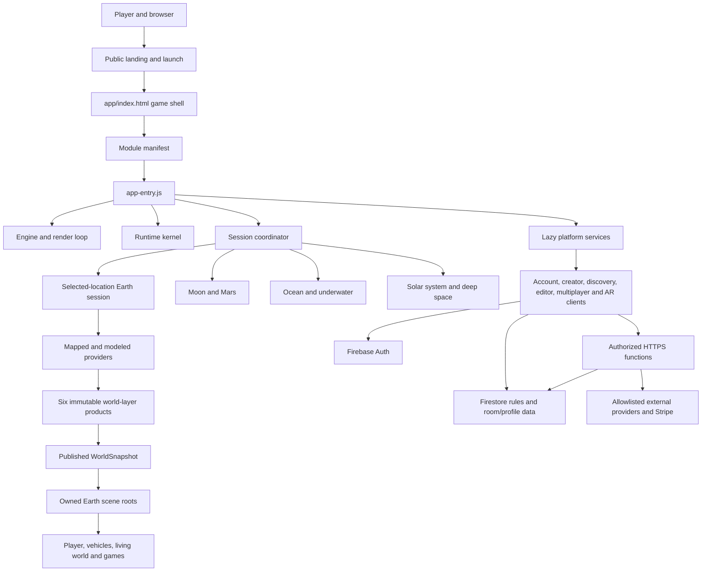
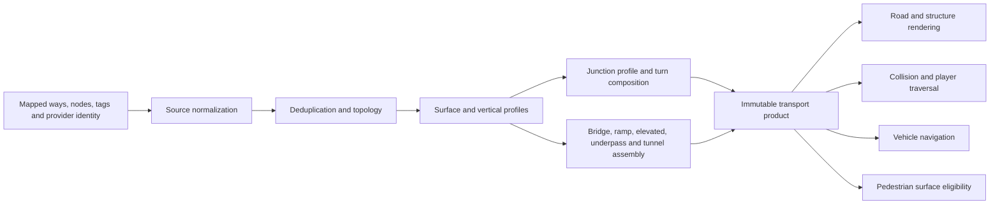
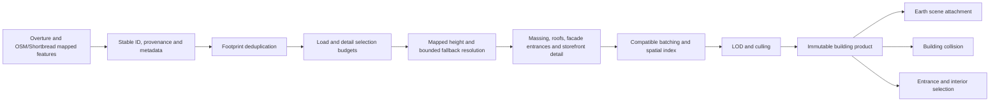
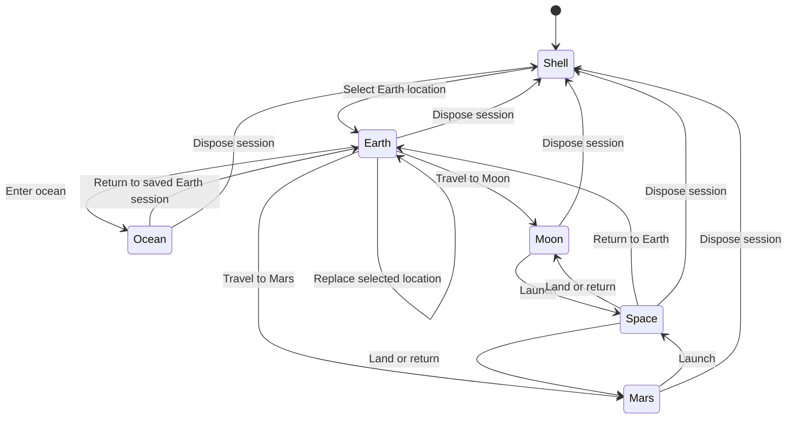
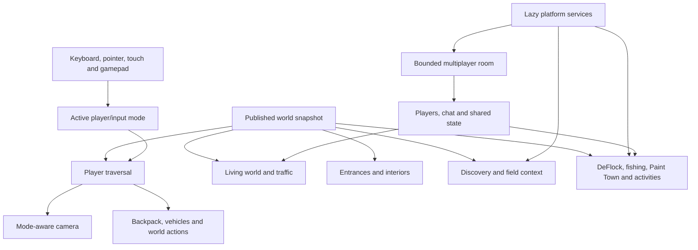
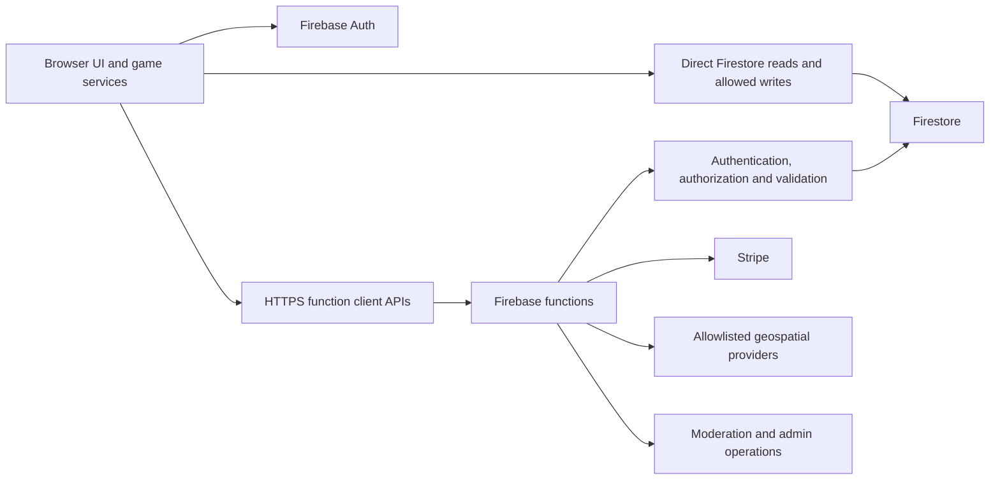
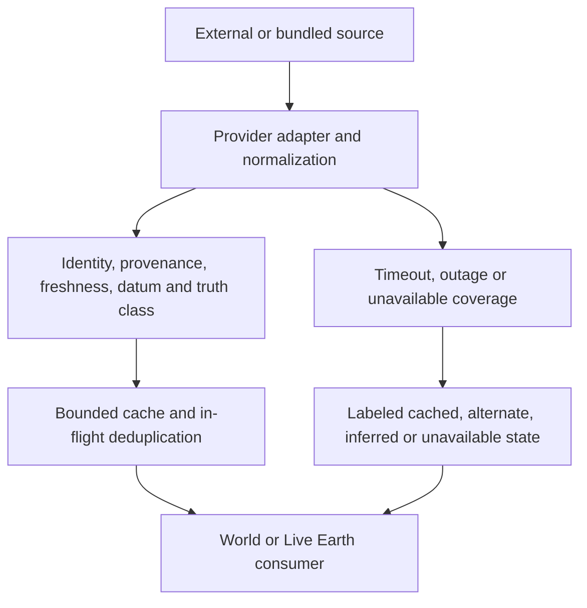

# World Explorer 3D Architecture Map

Last audited: 2026-08-22 against World Explorer 3D 4.3.1 at release commit
`af540b39fc80ba01998d48a2739d982fd8b913c1`.

This map explains how the current code executes and where authority changes
hands. It complements the component-by-component
[system inventory](SYSTEM_INVENTORY.md). World Explorer 3D is a bounded,
selected-location application, not a continuous-world streaming engine.

## System context



The renderer does not own provider selection, and providers do not own final
scene attachment. The session coordinator owns transitions; the Earth loading
pipeline owns world publication; individual gameplay systems consume published
surfaces and state.

## Browser boot sequence

```mermaid
sequenceDiagram
    participant Browser
    participant HTML as app/index.html
    participant Manifest as modules/manifest.js
    participant Entry as app-entry.js
    participant Kernel as runtime/kernel.js
    participant Registry as platform/service-registry.js
    participant Loop as main.js

    Browser->>HTML: Load game document and HUD shell
    HTML->>Manifest: Start module bootstrap
    Manifest->>Manifest: Load critical Three.js dependencies
    Manifest->>Manifest: Load optional rendering helpers
    Manifest->>Entry: Import application entry
    Entry->>Entry: Create engine, input, UI and shared capabilities
    Entry->>Kernel: Register phased runtime systems
    Entry->>Registry: Register lazy platform services
    Entry->>Entry: Register on-demand environments and games
    Entry->>Loop: Start the frame loop
    Loop->>Kernel: Run fixed and frame phases
```

`app/js/shared-context.js` is the explicit compatibility surface between many
older and newer modules. It is application-scoped, not a second world model.
New code should prefer a narrow service or lifecycle-owned capability instead
of adding unrelated mutable state to the shared context.

## Selected-location Earth load

```mermaid
sequenceDiagram
    participant UI as Location UI
    participant Coordinator as World load coordinator
    participant Request as WorldLoadRequest
    participant Session as WorldLoadSession
    participant Providers
    participant Compiler
    participant Products as Layer products
    participant Snapshot as WorldSnapshot store
    participant Scene as Earth publication

    UI->>Request: Create immutable location identity and bounds
    Request->>Coordinator: Request selected world
    Coordinator->>Coordinator: Cancel or supersede older request
    Coordinator->>Session: Create load state and provider metrics
    Session->>Providers: Fetch accepted ground and mapped layers
    Providers-->>Session: Payloads with identity and provenance
    Session->>Compiler: Normalize, deduplicate, resolve and compile
    Compiler->>Products: Terrain, hydrology, transport, buildings, landuse, places
    Products->>Snapshot: Assemble one immutable snapshot
    Snapshot->>Scene: Atomically publish accepted lists and scene roots
    Scene-->>UI: World ready; enable normal gameplay
```

If a newer request arrives, the older session becomes superseded and its
provider work, compilation products, scene resources, and callbacks must not
publish. Publication is the boundary between construction and gameplay.

## Physical world authority map

| Physical concern | Selection authority | Geometry/state authority | Publication authority | Consumers that must not replace it |
| --- | --- | --- | --- | --- |
| Ground height and collision | Accepted-ground/provider registry | Terrain tiles, seams, height sampling and WorldCover | Terrain layer product and Earth publication | Roads, buildings, actors, vehicles, water |
| Water surface | Hydrology source and water-body contract | Hydrology compiler and water surface registry | Hydrology layer product | Boat mode, underwater mode, shoreline effects |
| Roads and engineered structures | Transport source normalizer and network model | Surface/profile/junction/structure/tunnel compilers | Transport layer product | Traffic, player vehicles, pedestrians, structure visuals |
| Buildings | Building source selection, stable ID and footprint deduplication | Metadata/height/semantics, batching, roofs, facades and collision | Building layer product | Entrances, interiors, discovery, living world |
| Landuse and vegetation | Mapped landuse and WorldCover classification | Landuse compiler and deterministic placement | Landuse layer product | Visual environment and discovery |
| Places and street objects | POI, entrance and furniture evidence | Place/furniture compilers | Places layer product | UI labels, pedestrian destinations, discovery |
| Environment visibility | Session coordinator and scene ownership | Environment-specific lifecycle scope | Active owned scene roots | Render loop and input modes |

A physical surface may have many consumers, but only one published owner.
Visual decoration, collision, traversal, and simulation should derive from the
same accepted product rather than reconstructing competing geometry.

## Transport data flow



When a bridge or ramp ends incorrectly, review in that order and identify the
first stage where its valid identity, topology, profile, or geometry disappears.
Do not begin by adding a second visual structure. Source incompleteness remains
a possible result and must be labeled rather than disguised.

## Building data flow



Building counts alone do not prove a correct skyline. Reviews must confirm that
mapped height and identity survive every stage and remain visible in the final
assembled frame at the same location and camera path.

## Environment and lifecycle ownership



The session coordinator serializes these transitions. Lifecycle scopes own
listeners, timers, callbacks, scene objects, physics resources, provider work,
and deferred tasks. Teardown must release the old environment before another
owner publishes conflicting input, camera, collision, or render state.

## Gameplay dependency map



Non-player people use eligible published pedestrian paths and destinations.
They must not be placed on vehicle-only road, bridge, ramp, or tunnel surfaces.
Traffic consumes the published transport network. A feature system may attach
game state to a mapped identity but must not silently become a second world
surface authority.

## Client, backend, and persistence boundary



Direct-client writes are limited by `firestore.rules`. Operations requiring
transactions, moderation, entitlements, payments, provider credentials,
immutable cooperative claims, or privileged aggregation belong in
`functions/`. Firebase configuration values in the client identify the public
project; they are not authorization secrets.

Multiplayer is room-based. A room owns one bounded location plus player
presence, chat, artifacts, blocks, modifications, activities, and cooperative
game state. There is no single global MMO simulation server.

## External data boundary



Mapped features, observations, forecasts/models, predictions, reference-only
routes, and visual fallbacks are distinct truth classes. See
[DATA_SOURCES.md](../DATA_SOURCES.md). A fallback can keep the experience
usable, but cannot be represented as current observed or surveyed data.

## Build and release flow


`npm run release:verify` is the orchestration entry. The built artifact, not a
source-only development server, is the release candidate. Automated assertions
do not replace final-frame review, especially for skyline scale, transport
continuity, terrain/water relationships, actor placement, HUD layout, and
camera/player control.

## Common trace paths

| Change or defect | Trace this path before editing |
| --- | --- |
| World loads the wrong place | UI selection → `WorldLoadRequest` identity/bounds → coordinator → provider request → published snapshot |
| Terrain or water mismatch | Accepted-ground/provider evidence → datum/height sampling → seams/masks → terrain/hydrology products → final collision/rendering |
| Bridge, ramp, overpass, tunnel, or road gap | Source identity/tags → normalization → dedup/topology → vertical profile → junction/structure assembly → transport product → rendering/collision/traversal |
| Missing or incorrect skyline | Source/provenance → footprint dedup → selection budget → height resolution → batching → LOD/culling → building product → final scene visibility |
| Car or actor clips a slope | Published terrain/transport height → collision query → contact solver/interpolation → rendered pose/camera |
| Pedestrian appears on a road or bridge | Published surface eligibility → living-world navigation graph → spawn/destination selection → runtime population |
| Old world remains in memory | Superseded load/session → lifecycle scope → provider abort → scene publication teardown → renderer/physics disposal |
| Backend feature works only in UI | Client API → auth token → function method/validation → transaction/rules/index → second-client readback |
| Environment controls conflict | Session coordinator → active environment owner → input mode → camera → scene roots → teardown |
| Visual feature disappears at distance | Source identity → published object → batching → LOD/culling thresholds → render budget; do not change mapped data detail as a performance shortcut |

## Deliberate boundaries and current gaps

- Earth sessions are location-based and bounded; continuous streaming is an
  intentional non-goal.
- Mapped source quality varies. The system may use a documented fallback, but
  cannot invent exact measurements or source connections.
- Accepted-ground authority covers 41 reviewed fixed-location artifacts; other
  areas can use a labeled fallback with weaker datum guarantees.
- Generated multi-floor interiors exist; mapped indoor ingestion currently
  selects one mapped level.
- Activity creation and local testing exist; production activity publishing
  does not.
- Crafting, a unified mission/economy authority, and universal physical player
  embodiment do not exist in the current codebase.
- The runtime has lazy loading, cancellation, batching, and cleanup mechanisms,
  but named desktop/mobile performance budgets are not yet a release gate.
- Important shipped features still need complete immutable-candidate journeys;
  see [ROADMAP.md](../ROADMAP.md).

## Review rule

Identify the first authoritative stage where correct identity, data, geometry,
state, or lifecycle ownership disappears. Fix that stage and remove the cause;
do not add a city-specific correction, duplicate renderer, test-only camera, or
visual-only physical surface. Verify one bounded change in the complete game,
then checkpoint it before beginning another.
