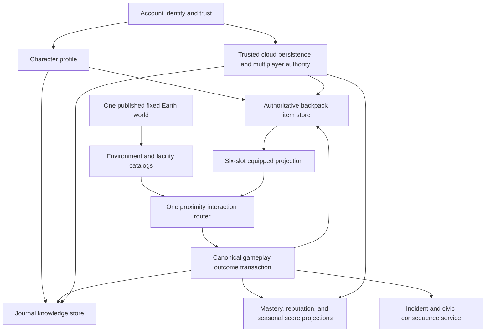

# World Explorer 3D — Character, Backpack, Journal, and Sandbox Unification Plan

Date: 2026-08-18
Status: R&D and architecture plan; implementation has not started
Branch: `steven/urban-sandbox-foundation`
Production: unchanged on the verified 4.2.1 rollback

## Decision

World Explorer should be one character-centered game, not a collection of menu
systems.

- **Account** is the player's identity, permissions, cloud ownership, social
  relationships, settings, and trusted progression envelope.
- **Character** is the embodied person in the world: position, condition,
  appearance, active objective, and currently equipped item.
- **Backpack** is the only inventory. Tools, consumables, specimens, crafted
  objects, trade goods, and mission items all live here.
- **Hotbar** is only a six-slot projection of backpack items. It is not another
  inventory.
- **Journal / Field Guide** is the character's knowledge and planning tool. It
  records what happened, explains the world, shows where and how things may be
  found, tracks contacts and places, and provides recipes and activity guidance.
  It does not own detectors, traps, ammunition, or collected objects.
- **Context Action** is the only way to act on a nearby person, animal, vehicle,
  door, or object.
- **Account and Journal must remain separate.** The account may summarize
  Explorer accomplishments, but it must not become the in-world Journal UI or
  duplicate its records.

The Journal can appear as an item inside the character's bag, but that is a
presentation relationship, not shared data ownership.

## Why the current experience feels bolted on

The user's report matches the source audit.

| Problem | Current evidence | Required disposition |
| --- | --- | --- |
| Two equipment systems | `discovery/profile-store.js` persists `equippedToolId`; `urban-sandbox/equipment-model.js` owns a separate six-slot inventory | Migrate Discovery tools into one backpack and delete the separate equipped-tool authority |
| `X` disrupts field activity | `input.js` routes every walking `X` to `handleWorldDiscoveryQuickAction`; a closed panel resets to Metal Detect and an open panel advances/cancels its state machine | Retire `X` as a Journal/activity owner; use `J`, contextual `E`, and explicit Cancel/Escape |
| Two collection concepts | Discovery stores `items`, `fieldGuide`, and `events`, while sandbox “items” are only a counter | Acquired objects become backpack item instances; observations remain Journal/Guide records; retire Collection as a separate storage destination |
| Journal contains Gear | The five-pane Discovery workspace renders Today, Field Guide, Collection, Gear, and Progress | Journal becomes Log, Guide, Places, Activities, and Recipes; Backpack owns gear and objects |
| Inventory objects lack verbs | Sandbox inventory is a fixed definition list; taken objects increment `sandboxItems` | Every released item type must declare equip/use/combine/place/consume/trade/quest verbs or remain unreleased |
| Interactive actors can still look like proxies | Distant Living World actors are instanced and only nearby actors are promoted under a small budget | An actor must promote before it can receive an interaction prompt or physical impact |
| Vehicle impacts are not physical crashes | `physics.js` has strong arcade steering/drift; building collision mostly pushes and slows/stops the car | Add one near-field rigid-body adapter with contact impulses, angular response, damage, skid, and rollover |
| People are not physical actors | Walking uses world/building collision, while NPC impacts mostly change a condition number and rotate the model into a downed pose | Add character capsules and a bounded impact/ragdoll state without making every crowd instance dynamic |
| Civic response is incomplete | `civic-response-model.js` has levels 0–3; responders resolve warning/citation/recovery | Replace it with a rule-driven incident, evidence, response, pursuit, surrender, arrest, custody, injury, and recovery pipeline |
| “Explorer leaderboard” measures the wrong behavior | `multiplayer/loop.js` scores rooms joined, artifacts shared, and friends added | Replace with server-verified seasonal/specialty/region scorecards tied to actual play |
| Door assertions do not guarantee visible doors | Doors are shader-integrated and tests prove attributes/prompts, but the user still cannot see them reliably | Add close-range visible entrance promotion and player-view acceptance, not just attribute counts |
| Bridge counts do not guarantee a smooth approach | The transport compiler has graph joins and grade constraints, but source segmentation and missing approach coverage can still create visible/traversal seams | Add endpoint continuity audits and driven seam gates for every published bridge approach |

## Target player experience

### Normal world view

The screen stays world-first:

- a small six-slot hotbar;
- one bottom-center contextual action prompt;
- one compact active-objective/status pill when needed;
- health/condition and civic response only while relevant;
- no permanent Journal, inventory, Collection, mission, or wanted panel.

### Controls

| Input | One meaning |
| --- | --- |
| `E` / Action | Use the highest-priority valid nearby interaction |
| `I` / Bag | Open the backpack |
| `J` / Journal | Open the Journal / Field Guide |
| `1`–`6` | Equip the assigned backpack hotbar item |
| `V` / Use | Use the equipped item when walking; existing vehicle-specific behavior remains mode-scoped |
| `Esc` / Cancel | Close the current panel or request cancellation of the active activity |
| `X` | Removed from Field Journal ownership; left unassigned until control-remapping work |

Number keys must continue to equip items while an activity is active. They are
ignored only while a real text input has focus. Opening the Journal must never
capture or disable the hotbar.

### Backpack

The Backpack has four views over one item store:

1. **All items** — every owned item instance or stack.
2. **Tools & equipment** — equip, assign to hotbar, inspect condition/ammo/use.
3. **Materials & specimens** — combine, trade, place, donate, or use in a recipe.
4. **Mission items** — clearly locked to the relevant objective and removed or
   converted by a trusted outcome transaction.

There is no separate Collection inventory. “Specimens” can be a Backpack filter,
and a future home/museum can be a different physical storage container backed by
the same item-instance model.

### Journal / Field Guide

The Journal has five purposes:

1. **Log** — chronological record of discoveries, missions, trades, arrests,
   hospital recoveries, places visited, and meaningful encounters.
2. **Field Guide** — identification pages, habitat/context, evidence quality,
   likely regions, required tools, ethical/safety notes, and known observations.
3. **Places & contacts** — discovered facilities, NPC contacts, shops, garages,
   hospitals, civic facilities, activities, and saved destinations.
4. **Activities** — explanations, prerequisites, leads, current objective, and
   “mark on map”; it does not remotely complete an interaction.
5. **Recipes & plans** — learned combinations, missing components, and where
   relevant materials or traders may be found.

A Guide page may say “Use the detector in developed shoreline areas” and mark a
plausible lead. The detector itself remains in the Backpack. An animal page may
explain habitat and observation methods; it cannot spawn, trap, or adopt an
animal from the menu.

## Unified game-screen composition

The game screen needs one layout authority before additional status or activity
features are added. Individual features may publish content, but they may not
choose arbitrary fixed coordinates and z-indexes independently.

### Reserved zones

| Zone | Normal owner | Rules |
| --- | --- | --- |
| Top status | location, travel speed, weather/time | Compact, collapsible and never repeated by an activity |
| Top-right transient | health/condition and civic response | Appears only while relevant; maximum two stacked status cards |
| Center | the 3D world and aiming focus | No persistent panels; only short-lived reticles or world-anchored markers |
| Center-lower context | contextual Action and current objective | Exactly one primary prompt plus an optional concise objective pill |
| Bottom quick access | six-slot hotbar | One shared bar; travel-mode controls replace or reconfigure it rather than stacking another bar |
| Focus layer | Journal, Backpack, fishing, crafting, trade, custody/result | One focus surface at a time; it reserves or hides conflicting HUD zones |
| Mobile touch edges | movement/look/action controls | Safe-area aware and hidden when a focus activity supplies its own controls |

The layout service owns the active focus layer and publishes a screen-layout
snapshot for tests. Opening a focus activity closes menu flyouts and prevents
Journal, Backpack, fishing, crafting, trade, pause or result surfaces from
stacking on one another. Small contextual prompts may not appear behind a focus
surface.

### Responsive behavior

- Desktop Journal and Backpack share header, typography, close behavior and
  spacing tokens, while Backpack uses the larger icon-led grid its object
  recognition task requires. Item verbs stay in accessible labels/tooltips and
  tutorials instead of repeating as permanent card copy.
- On narrow screens, a focus surface becomes a safe-area-aware sheet with one
  sticky header and one scroll owner. The bottom navigation, vehicle dock and
  touch controls hide or move to reserved space instead of being covered.
- Boat wave controls and Fishing are mutually exclusive. Opening Fishing hides
  the wave dock, boat prompt, global bottom navigation, contextual prompts and
  generic touch controls; closing Fishing restores the current boat layout.
- Fishing is an in-world deck activity, not a modal click form. The existing
  boat camera moves to a deck-level outboard view that shows only the nearby
  gunwale, while the existing Fishing state owns cast, bite, tension, fatigue,
  line integrity, reel distance and the one world fish. Tap/drag, hold and rod
  movement are the primary feedback; compact instruments replace prose.
- Fishing truth is explicit: a generated fish is a simulated gameplay event,
  and its length/weight are labeled estimates rather than observations or
  measurements. Species selection currently uses the documented water-kind and
  latitude model. When the selected location carries qualified GEBCO
  bathymetry evidence, the catch retains that evidence and source identity;
  when it does not, depth remains `null`/`unknown`. GEBCO grid depth is modeled
  context, not a navigational sounding or proof that a species is present.
- Activities that need repeated input expose their controls inside the focus
  surface. They do not add a second bottom bar.
- The screen must pass automated bounding-box collision checks and human visual
  inspection at desktop, 390×844 portrait, tablet landscape and reduced-height
  viewports.

### Visual system

All new gameplay UI uses one token set for panel color, border, type scale,
spacing, focus state, disabled state and semantic status colors. Icon plus text
is required for important actions; color alone cannot communicate inventory,
civic, health or activity state. Legacy floating menus are progressively routed
through the same shell rather than restyled as separate systems.

## One ownership model



### Canonical item instance

Every item released to players needs one catalog definition and one instance or
stack record:

```text
itemId                stable instance or stack identity
catalogId             detector, camera, quartz, food, repair part, etc.
ownerId               anonymous local character or authenticated account
containerId           backpack, hotbar reference, home storage, trade escrow
quantity              bounded stack count
condition/durability  modeled gameplay state where relevant
charges/ammunition    bounded use state where relevant
provenance            earned, found, crafted, traded, mission, admin
sourceEventId         outcome that created the item
tradePolicy           local-only, account-owned, locked, tradeable
verbs                 equip/use/combine/place/consume/trade/quest
revision              optimistic/server transaction version
```

The hotbar stores only six item references. It never copies item data.

### Canonical outcome transaction

Every successful activity, proximity interaction, craft, trade, incident, arrest,
or recovery emits one versioned outcome. One transaction can then:

- add/remove/change backpack items;
- append a Journal log entry;
- update a Field Guide identity or contact;
- advance an objective;
- award mastery/reputation/season score if eligible;
- create civic evidence or consequences;
- emit privacy-bounded analytics.

This replaces direct UI-specific writes and prevents one action from becoming
three contradictory records.

## Interaction rules

The existing `interaction/context-router.js` remains the single selection owner.
It will be extended, not replaced.

Priority is based on safety, explicit objective state, distance, and player aim:

1. immediate safety/recovery action;
2. current objective target;
3. door/vehicle seat the player is facing;
4. nearby person/animal interaction;
5. item pickup or world object;
6. optional inspect action.

Only one primary action appears. Secondary actions open a compact verb wheel
when an entity supports more than one meaningful verb. A system may not show an
action until the target has a detailed visual, valid collider, stable identity,
and executable outcome.

### Animals

- Encounters are habitat/context plausible, explicitly modeled, and not claimed
  as live wildlife observations.
- The exact published animal actor owns Observe, Photograph, Offer Care, Feed,
  or Trade-related interaction when eligible.
- Wild animals are not inventory. Observations go to the Journal/Guide.
- Domestic/companion acquisition uses visible proximity actions and an ownership
  outcome; the companion then becomes a character-owned entity.
- Animal drops, found objects, or trader goods become ordinary backpack items
  only through an explicit outcome.

### NPCs

- Distant crowds remain pooled/instanced.
- An NPC entering interaction or impact range promotes to one stable detailed
  actor; the source instance hides before the detailed actor appears.
- If the detailed-actor budget is unavailable, the prompt waits rather than
  allowing interaction with a box/proxy.
- Detailed actors use skeletal animation and role/outfit variation; fallback
  geometry must still have a readable head, torso, limbs, hands, and facing.
- Talk, trade, mission, flee, report, surrender, arrest, injured, downed, and
  recovery are explicit states with visible animation transitions.

## Vehicle and character physics R&D decision

### Current limit

The existing custom controller is suitable for driving feel, road/surface
selection, bridge/tunnel continuity, and low-cost world traversal. It is not a
general rigid-body solver. A collision currently tends to push and damp a car;
it cannot correctly exchange impulses, rotate from an off-center hit, roll from
support loss, or drive a ragdoll.

### Recommended architecture: bounded near-field physics island

Use a pinned, locally bundled Rapier 3D compatibility build behind one
`PhysicalEmbodimentService`. Rapier supports dynamic bodies, colliders,
continuous collision detection, contact-force events, a kinematic character
controller, and a ray-cast vehicle controller. The dependency is WebAssembly and
must load asynchronously; it must be packaged in the immutable build rather than
fetched from a runtime CDN.

This service does **not** become a second Earth world:

- the fixed WorldSnapshot remains the source of terrain, road, building,
  bridge, tunnel, and water geometry;
- nearby collision proxies are derived from already-published surfaces;
- no provider request is made because an actor moved;
- only promoted/occupied/recently impacted actors receive physics bodies;
- distant traffic and crowds retain their current low-cost simulation;
- one frame-kernel system steps physics at a fixed timestep and interpolates
  presentation;
- the old vehicle controller and the rigid-body controller are mutually
  exclusive for a given vehicle.

### Vehicle behavior

For a promoted physical vehicle:

- a dynamic chassis owns translation, quaternion rotation, linear velocity,
  angular velocity, mass, center of mass, and inertia;
- wheel ray casts own suspension, steering, engine force, braking, contact,
  lateral friction, and wheel rotation;
- collision impulses depend on relative velocity, mass, contact normal, and
  contact point;
- off-center impacts create yaw/pitch/roll instead of a scripted random roll;
- rollover occurs only when contact forces and support geometry physically
  create it;
- skid audio/marks derive from measured wheel slip and surface material;
- damage zones derive from contact location and impulse energy;
- damaged steering, tire grip, lights, panels, smoke, and engine condition are
  modeled gameplay consequences, not arbitrary hit-point color changes;
- an overturned vehicle can be exited, recovered, repaired, or towed.

Mass, dimensions, center-of-mass height, tire friction, suspension, and damage
thresholds must be source-labeled as measured class data or explicitly
game-modeled. They are not real specifications for the fictional vehicle models.
No final numerical values are approved by this document; they must come from the
physics spike and recorded test evidence.

### People and animals

- locomotion uses kinematic capsules and the existing accepted walk surface;
- vehicle/person and person/world contacts emit collision outcomes;
- strong impacts temporarily promote the actor to a bounded articulated
  ragdoll, then transition to downed/recovery logic;
- only a small measured number of nearby ragdolls may be active; distant actors
  never become an unbounded physics fleet;
- hit reaction, stumble, knockdown, injury, incapacitation, and recovery use
  distinct thresholds derived from the same contact event;
- non-gory presentation is the initial release policy.

### Mandatory spike before integration

The dependency is not approved for the main runtime until an isolated spike
proves:

1. one current car model can accelerate, brake, skid, collide off-center, roll,
   settle, and recover on existing road/terrain proxies;
2. one promoted NPC capsule blocks and reacts without tunneling;
3. bridge, ramp, tunnel, interior, and building colliders use existing surface
   identity and do not duplicate world ownership;
4. fixed-step determinism is sufficient for replaying validated outcomes;
5. desktop, integrated-GPU, and target-phone frame/memory budgets are measured;
6. the WASM/runtime asset is included and reachable in the immutable build;
7. disabling the experiment returns to the unchanged existing controller.

If the spike fails those gates, retain the current controller and implement a
smaller impulse/angular-response model; do not ship two competing physics paths.

## Civic response, wanted levels, arrest, injury, and recovery

### Product rule

The game can use a consistent fictional civic ruleset everywhere. It must not
claim to reproduce every real jurisdiction's criminal law, use-of-force policy,
booking process, or medical routing.

The current three-level attention model becomes a five-level **Response Level**
projection over typed incidents and evidence:

| Level | Meaning | Typical response |
| --- | --- | --- |
| 0 | Clear | No active response |
| 1 | Inquiry | Witness report, local search, verbal contact |
| 2 | Stop requested | Traffic stop, citation, item/vehicle recovery |
| 3 | Arrest sought | Pursuit, containment, surrender/arrest available |
| 4 | Armed danger | Armed responders only after a verified active threat |
| 5 | Critical incident | Bounded multi-unit response, area containment, highest arrest priority |

Stars may visualize the level, but the rule engine owns it. Escalation cannot be
based on a generic score alone.

### Incident and evidence rules

Typed incidents include collision, reckless driving, trespass, theft, vehicle
taking, assault, weapon discharge, explosive use, responder assault, and escape
from a lawful game stop. Each record contains:

- actor and target identities;
- location/time/world identity;
- severity and action category;
- witness or responder/sensor evidence;
- line of sight/hearing/proximity basis;
- whether the player was identified;
- response jurisdiction/facility context;
- decay, merge, and escalation policy.

Unwitnessed actions do not magically create attention. A witness must complete a
report, or a responder must directly observe the event. Repeated events merge
under bounded rules instead of incrementing a star every frame.

### Responders

- Location context chooses ranger, campus safety, civic police, or another
  supported fictionalized agency profile.
- Vehicles use the same promoted physical vehicle system.
- Responder NPCs exit vehicles, take cover, issue commands, pursue on foot,
  arrest, provide aid, and return to service through visible states.
- Shooting is permitted only for a verified high-level active threat under the
  game rules, with line-of-sight, range, friendly-fire, cooldown, and surrender
  checks. Lower-level events use observation, pursuit, warnings, citations, and
  arrest—not automatic gunfire.
- The first release remains non-gory and exposes accessibility/tone controls.

### Surrender, arrest, custody, death, and injury

Arrest flow:

1. responders establish valid contact;
2. player stops or selects Surrender;
3. equipment is holstered and movement transfers to a custody state;
4. a server/local outcome transaction resolves seized/recovered mission items,
   citation, reputation, vehicle recovery, and Journal record;
5. the character is transported to a verified facility when available;
6. release begins at a valid public exit/entrance with the world and inventory
   state reconciled.

Injury/death flow:

1. character condition tracks health, injury and incapacitation;
2. nonfatal incapacitation can lead to aid, arrest, or local recovery;
3. death/recovery performs one explicit transition;
4. the character resumes at a verified hospital/emergency facility when
   available, with a clear source label and gameplay consequence;
5. if the destination lies outside the current fixed world, a normal atomic
   location transition loads the new hospital-centered world—never a hidden
   second world.

## Real facility data and truth policy

The current POI catalog already recognizes hospitals, clinics, police, and fire
stations, but the primary fixed-world query is not yet a complete civic-facility
catalog and does not establish legal booking destinations.

Build one `FacilityCatalog` during the fixed world load from:

- OpenStreetMap nodes, ways, and relations for `amenity=police`,
  `amenity=prison`, `amenity=hospital`, `healthcare=hospital`, emergency entrance,
  detention, operator, name, access, and address tags;
- Overture Places candidates only when category, operating status, confidence,
  source, and identity reconciliation pass explicit thresholds;
- jurisdiction-specific official facility datasets where licensing and update
  policy permit exact routing.

Every facility record carries source identity, truth class, fetched/source date,
operating status where supplied, exact/inferred entrance status, and confidence.

### Honest routing rules

- **Hospital:** prefer a verified hospital with emergency capability and a
  usable entrance; never relabel a clinic as a hospital.
- **Police contact:** a public-facing police station is not automatically a jail.
  `detention=yes` can support a detention-capable candidate.
- **Jail/prison:** `amenity=prison` identifies a detention/correctional facility,
  but does not prove that a specific incident would be booked there.
- **Exact county/local booking:** only claim this in a supported jurisdiction
  with an official, reviewed routing adapter.
- **Fallback:** say “nearest mapped civic facility” or “simulated processing;
  exact booking destination unavailable.” Never invent a county lockup, hospital,
  entrance, or interior.
- Generated interiors remain explicitly generated. A real exterior location
  does not make its procedural cells an accurate floor plan.

OpenStreetMap documents hospitals separately from clinics, defines public-facing
police stations through `amenity=police`, and permits detention capability to be
tagged separately. Overture Places supplies categories, operating status,
confidence, and per-property sources. Those are useful candidates, not proof of
actual legal or medical routing.

## Crafting, combining, trading, and economy

### Item verbs first

No item appears in the Backpack unless at least one released verb works. The
catalog validator rejects inert player-facing items.

Examples:

- flashlight: equip, use, recharge/repair;
- detector: equip, use in eligible context, repair;
- camera: equip, photograph, review evidence;
- food: consume, offer to an eligible companion, trade;
- mineral/specimen: inspect, combine in a recipe, trade, donate, place at home;
- repair components: combine into a repair kit, consume on a damaged vehicle;
- found documents: inspect, use in an objective, archive in Journal;
- crafted camp kit: combine, place through Editable World, recover.

### Recipe graph

Recipes are data, not hard-coded menu branches:

```text
recipeId
required item catalog IDs/tags and quantities
required tool/capability
place/environment requirement
output item(s)
consumed versus retained inputs
learned/hidden policy
authority policy
```

Crafting is a single atomic inventory transaction. It cannot create an output if
inputs changed, are trade-locked, or belong to another account. Anonymous local
crafts remain local-only until an explicit trusted migration exists.

### Trading

- NPC traders are proximity-based detailed actors attached to stable place or
  role identities.
- Offers reference actual item instances/stacks and server prices/barter rules.
- Player-to-player trade uses the existing transactional escrow direction, but
  only account-owned trusted items are eligible.
- Journal Guide pages may list known traders or likely regions; they do not own
  the goods.
- Economy, crafting, mission rewards, repair, and trading must share one server
  ledger before multiplayer release.

## Progression and engagement

Do not merge every activity into one endlessly farmable points total.

### Personal progression

- Explorer rank from first identifications, meaningful new-region evidence, and
  completed expedition arcs;
- specialty mastery for Nature, Earth, Places, Navigation, Craft, and Civic/Service;
- tool proficiency unlocked by visible use, not inventory possession;
- location reputation from missions, aid, trade, and civic consequences;
- collections/museum completion based on owned item identity, not observations;
- companion bond from world actions and useful companion behaviors.

### Return loop

- current expedition with 1–3 clear goals;
- weekly regional expedition assembled from released mechanics only;
- Journal leads based on missing Guide knowledge, materials, recipes, contacts,
  and nearby places;
- cooperative community goals that do not require friend-count farming;
- seasonal recognition and cosmetics/title rewards without deleting permanent
  Journal or item history.

### Leaderboards

Retire the current “Explorer” board based on rooms, artifacts, and friends. Keep
mode-specific boards only where the metric is meaningful, and add:

- seasonal Explorer score;
- specialty boards;
- region/city expedition boards;
- cooperative contribution board;
- friends/room comparison as a filter, not a separate scoring system.

Only server-verified outcomes enter shared boards. Each score record stores the
season, category, bounded evidence counters, rules version, and anti-cheat
decision. Exact discovery coordinates stay private. Repeat farming, self-trade,
friend churn, repeated room joins, and duplicate claims award no score.

## Doors, buildings, bridges, and ground transitions

### Visible doors

The shader entrance atlas remains the distance/facade owner, but close play needs
a promoted entrance presentation:

- mapped entrance first;
- inferred entrance only when approach/ground/facade validation passes;
- close-range recess, frame, threshold, handle, lighting, and open/close state
  attached to the same entrance ID;
- no prompt unless the actual door is visible from the player approach;
- generated/inferred status exposed in inspection/provenance;
- authored landmark doors only through the same entrance catalog.

This is LOD promotion inside one building owner, not a second door system.

### Bridge and ramp continuity

Add a `TransportContinuityAudit` to every published bridge/ramp/elevated-road
component:

- graph endpoint connection exists on both ends;
- visual deck, collision surface, and navigation surface share the same profile;
- endpoint height step and grade remain within the existing vehicle/walk policy;
- no terrain lip, water gap, hidden wall, missing abutment, or disconnected lane;
- connected approach ways remain in the protected transport budget;
- a real-input drive traverses both joins;
- failure is recorded by source identity and cannot be hidden by a floating patch.

Where source data is incomplete, use the existing explicitly generalized
structure fallback or mark the route incomplete. Do not invent a surveyed bridge
alignment.

## Migration and retirement ledger

| Current owner/surface | Action |
| --- | --- |
| Discovery `equippedToolId` | Migrate once to backpack/hotbar; retain read adapter for old saves, then remove writes |
| Discovery Gear pane | Remove after backpack migration |
| Discovery Collection pane/store | Migrate owned records to backpack items; keep Guide/events; remove as inventory owner |
| Sandbox `sandboxItems` counter | Replace with real item instances |
| Fixed sandbox equipment definitions | Convert to item catalog starter grants; no automatic regrant after migration |
| `X` quick action | Retire; migrate teaching/help to `J`, `E`, and objective pill |
| Legacy Police Chase runtime | Keep retired; do not reuse placeholder police meshes |
| Civic levels 0–3 | Read/migrate active session only; replace with versioned incident/response rules |
| Explorer leaderboard social score | Freeze historical board read-only; launch versioned seasonal board |
| Fishing catches and activity completions | Project through canonical outcomes without deleting existing histories |
| Account Center | Keep as identity/settings/social surface; add read-only Explorer summary links |

Migration must be idempotent, versioned, backed up locally, and tested with old
anonymous and signed-in fixtures. No item may be duplicated by re-running it.

## Implementation sequence

### Phase 0 — Freeze, evidence, and control containment

- Save the current accepted water/sky/wave and blocker-repair checkpoints.
- Add reproducible browser tests for the reported `X`/inventory conflict, proxy
  NPC, invisible door, and bridge-approach failures.
- Record current anonymous and signed-in save fixtures.
- Publish no new mechanics.

Exit: every reported problem has a failing automated or visual reproduction and
the current build can be restored exactly.

### Phase 1 — Player-domain contracts

- Add pure schemas for character, item catalog, item instance, container,
  hotbar, Journal knowledge, canonical outcome, and migration versions.
- Add catalog validation requiring real verbs.
- Add local in-memory/IndexedDB migration tests and server transaction designs.

Exit: old saves migrate once with no loss/duplication and all projections derive
from one outcome fixture.

### Phase 2 — Backpack/Journal/control vertical slice

- Replace the sandbox Equipment panel with Backpack.
- Move detector, camera, lens, trowel, fishing rod, parachute, and sandbox gear
  into the same item catalog/store.
- Make `I`, `J`, `1`–`6`, `V`, `E`, and `Esc` follow the target control map.
- Route one detector find and one wildlife observation through the canonical
  outcome transaction.
- Remove the Journal Gear pane and separate Collection storage UI.

Exit: active field work never blocks hotbar use; an acquired detector find is a
Backpack item plus Journal/Guide evidence, while a wildlife observation creates
no item.

### Phase 3 — Item utility, crafting, and NPC trade slice

- Replace `sandboxItems` with stable item instances.
- Release a small complete recipe chain using existing world objects.
- Add one proximity NPC trader with buy/sell/barter outcomes.
- Add one placeable/recoverable crafted object through Editable World.
- Implement server-authoritative account inventory transactions before shared
  trade/rewards are enabled.

Exit: every visible item has a working verb and transactions cannot dupe items.

### Phase 4 — Physical embodiment spike and decision gate

- Build the isolated Rapier adapter and one promoted car/NPC test scene.
- Measure bundle/init cost, memory, fixed-step CPU, collision stability, bridge/
  tunnel compatibility, mobile behavior, and cleanup.
- Choose Rapier integration or the bounded custom fallback from evidence.

Exit: written GO/NO-GO with recorded measurements. No dual-controller shipping.

### Phase 5 — Vehicle and actor physical vertical slice

- Integrate the selected physics path for the occupied car and nearby promoted
  vehicles.
- Add impulse crash, skid, spin, rollover, damage zones, exit/recovery, and
  repair outcome.
- Add NPC/animal capsules, collision avoidance, hit/stumble/downed/recovery, and
  bounded ragdoll.
- Upgrade close NPC/vehicle animation and visual assets under measured budgets.

Exit: repeatable crashes differ by speed/contact placement, actors collide
without proxy boxes, and the system passes sustained desktop/phone runs.

### Phase 6 — Civic response and custody

- Replace level 0–3 with versioned incident/evidence/response rules.
- Add responder NPC exit, commands, pursuit, surrender, arrest, threat-limited
  combat, aid, and cleanup.
- Add character health/injury/incapacitation.
- Keep shared-room outcomes server-owned.

Exit: unwitnessed events remain clear; every escalation has evidence; arrest and
recovery are complete visible journeys rather than status text.

### Phase 7 — Verified facilities and destination consequences

- Compile the FacilityCatalog in the initial fixed-world load.
- Implement hospital recovery and detention routing with truth labels.
- Add jurisdiction-specific adapters only where an official dataset is reviewed.
- Integrate exact exterior entrances and explicitly generated interiors.

Exit: Baltimore and additional worldwide fixtures prove verified routing,
provider outage behavior, no invented facility, and correct atomic world
transition when a destination is outside the current publication.

### Phase 8 — Missions, economy, and character continuity

- Connect mission objectives, crafting, trading, repair, garages/homes, item
  rewards, civic outcomes, and Journal history to one character profile.
- Add one authored Baltimore expedition that uses travel, person, animal,
  discovery, trade/craft, building, and consequence systems.

Exit: the complete chain survives reload, account sign-in, and two-client room
reconciliation without parallel reward stores.

### Phase 9 — Engagement and leaderboard replacement

- Launch versioned seasons, specialties, regional scorecards, weekly expeditions,
  and cooperative goals.
- Freeze the old social-score Explorer board read-only.
- Add server outcome verification, anti-farming rules, privacy review, and
  retention analytics.

Exit: the board rewards actual released gameplay, cannot be inflated by repeated
room joins/friend churn, and drives a clear return loop.

### Phase 10 — Door/transport worldwide visual acceptance and release

- Promote visible close doors and run player-view entrance journeys.
- Run bridge/ramp endpoint continuity over representative structures worldwide.
- Re-run world, memory, multiplayer, security, mobile, and immutable-candidate
  gates.
- Obtain hands-on device acceptance before preview/promotion.

Exit: no interaction prompt points at an invisible door; representative bridges
are visibly and physically traversable at both ends; all new systems have one
owner and complete cleanup.

## Test and release matrix

Every phase must include:

- pure contract and migration tests;
- anonymous, signed-in, old-save, retry, and rollback fixtures;
- desktop keyboard, controller, and 390×844 touch journeys;
- installed-Chrome rendered evidence inspected by a person;
- target phone/tablet/integrated-GPU acceptance for physics phases;
- fixed-step replay and high/low frame-rate behavior;
- zero movement-triggered provider requests;
- zero duplicate world, inventory, Journal, vehicle, actor, or physics owner;
- title/location/environment disposal and forced-GC plateau;
- Firestore Rules and two-client Functions emulator tests for shared outcomes;
- provenance/fallback assertions for facilities and real-world claims;
- accessibility, reduced motion, tone, and control-remapping checks;
- immutable artifact reachability, identity, preview, and rollback proof.

## Release decision

This program is feasible, but it is not one safe last-minute patch. The current
water/sky and production-blocker work can remain a separate candidate after its
own release gates. None of the inventory migration, physics, arrest, custody,
facility routing, economy, or leaderboard replacement should be added to a
same-day production candidate.

Phases 0–2 form the first internal test milestone: one Backpack, one Journal,
one control map, canonical outcomes and the first shared screen-layout rules.
They are not a production release.

Per the product owner's release requirement, production remains blocked until
all phases in this plan are implemented and the test/release matrix passes,
including the already completed production-blocker and water/sky work. Partial
milestones may be tested locally or in explicitly non-production candidates,
but they may not be promoted to production.

## R&D references

- [Rapier JavaScript getting started](https://rapier.rs/docs/user_guides/javascript/getting_started_js/)
- [Rapier rigid bodies and CCD](https://rapier.rs/docs/user_guides/javascript/rigid_bodies/)
- [Rapier collision/contact-force events](https://rapier.rs/docs/user_guides/javascript/advanced_collision_detection/)
- [Rapier dynamic ray-cast vehicle controller](https://rapier.rs/javascript3d/classes/DynamicRayCastVehicleController.html)
- [Rapier character controller](https://rapier.rs/docs/user_guides/javascript/character_controller/)
- [OpenStreetMap hospital tagging](https://wiki.openstreetmap.org/wiki/Tag%3Aamenity%3Dhospital)
- [OpenStreetMap police-station tagging](https://wiki.openstreetmap.org/wiki/Tag%3Aamenity%3Dpolice)
- [OpenStreetMap prison data item/tag](https://wiki.openstreetmap.org/wiki/Item%3AQ4731)
- [Overture Places overview](https://docs.overturemaps.org/guides/places/)
- [Overture Places categories](https://docs.overturemaps.org/schema/reference/places/types/categories/)
