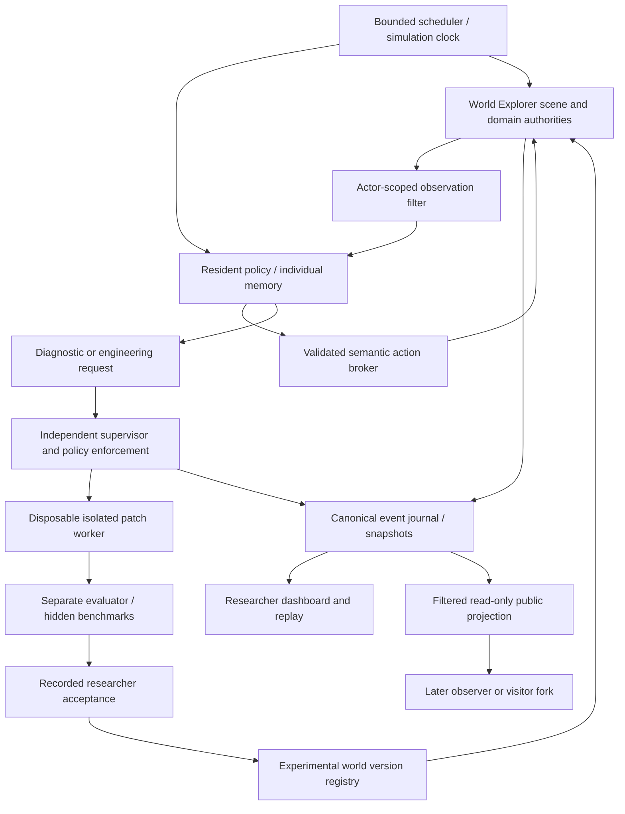

# World Explorer 3D — embodied agent research platform

September 11, 2026. Canonical research specification, consolidated from all four supplied proposals. This document is the active specification; the archived proposal texts are historical inputs. The current request authorizes continued research implementation and adds material construction, tool-making and survival as core capabilities. Population scale, paid model allowance, autonomous host access and public publication remain separately gated.

**Branch:** `steven/research-embodied-society`. **Parent checkpoint:** `f88af9db`, preserving the existing audit and first repair batch on `steven/building-exteriors-local`. That checkpoint has local test evidence, not a fresh whole-app acceptance certificate. No extra project/worktree copy was created for planning. **Environment:** research configuration only; no new Firebase project or cloud environment has been provisioned. Material/needs services, private resident walking bodies, world-action authorization and construction projection are implemented as components. A small browser fixture exercised the actual walking mesh and block collision. No model-controlled resident, autonomous repair or society experiment has run.

[Project inventory](SYSTEM_INVENTORY.md) · [Existing release work](RELEASE_REPAIR_PROGRAM.md) · [All 179 numbered requirements and source hashes](../research/embodied-society/requirements.json) · [Disabled pilot configuration](../research/embodied-society/pilot.config.json) · [Implementation evidence/status](../research/embodied-society/implementation-status.json)

## 1. Project description

This is a research platform within World Explorer where independent artificial residents perceive a bounded world, act through real gameplay mechanisms, maintain needs, form individual memories and communicate through permitted channels. The researcher watches their actual bodies and recorded activity. A later, separately gated engineering capability lets residents investigate a suspected software defect, propose an isolated patch and retry the interrupted task after external validation.

There are two connected studies:

- **Situated maintenance:** does encountering a problem through ordinary embodied activity help an agent discover, classify and repair software faults? How does this compare with an agent given a direct bug report?
- **Open-ended populations:** what recurring patterns occur when independent residents share space, resources and communication? Do information exchange or persistent records change viability, adaptation and problem diagnosis?

World Explorer supplies the geography, world interactions and existing gameplay authorities. The research subsystem supplies orchestration, actor-scoped adapters, bounded memory, model access, evaluation and evidence. It must not become an unrelated grid simulation wearing World Explorer's name.

The public-facing possibility is an observable research world that users could eventually visit. It is an optional product surface consuming an isolated research projection or visitor fork, not a route through which resident agents gain production authority.

## 2. Decisions that reconcile the four proposals

| Conflict or missing distinction | Decision |
|---|---|
| One-agent maintainer versus immediate eight-agent society | One platform, sequential gates: 1 → 2 → 4 → 8. Eight agents is a later acceptance milestone, not the first implementation batch. |
| “Do not stop until all infrastructure works” versus current request to review/clarify plans | Specification review is complete; owner authorized continued implementation. Build and verify vertical slices in order; never claim planned or mocked slices are running residents. |
| Assigned home/tasks versus no prescribed society | A home and water task are declared controls in the maintainer benchmark. Open-ended society conditions do not assign occupations, relationships or institutions. |
| Repair demonstration must succeed versus valid scientific failure | Engineering infrastructure must contain and record attempts correctly. Agent repair success is a measured outcome; an honestly recorded failure is valid research data. A successful repair remains a separate proof-of-capability milestone. |
| Existing Credits and stock versus no imposed economy | Document inherited gameplay rules as designed affordances. Agent-to-agent exchange is not forced into Credits. Do not call unlimited shop stock emergent economics. |
| Reuse player systems versus independent residents | Reuse domain logic through actor-scoped adapters. Existing singleton controls/storage cannot simply be shared among residents. Prove separation before adding residents. |
| Rapid simulated days versus real travel/physics | Begin at 1×. Keep fixed-step interaction time separate from strategic time and record both. No teleported journeys or skipped collision checks. |
| Source access versus hidden fault/evaluator answers | Export a sanitized source workspace; withhold evaluator files, answer keys, unrelated history and privileged logs. Tool permissions expand by mode under a supervisor. |
| Git worktree per patch versus the Mac's disk limits | A branch/worktree is version isolation, not a security sandbox. Create at most one disposable patch workspace when engineering is approved, with bounded shared artifacts and recorded cleanup. Do not create one project copy per resident. |
| Live public observation versus uncontaminated research | Pure spectators see an exported view. A walking visitor uses a non-interactive projection or a forked session. Interaction is an explicitly tagged treatment. |
| Generation fitness versus emergent social outcomes | Select on viability, competence, diagnosis, repair reliability and cost. Keep cooperation, inequality, institutions and specialization observational unless a separate experiment explicitly makes them objectives. |

## 3. What was missing from the prompts

The proposals are broad and scientifically careful, but omit implementation contracts that determine whether results are trustworthy:

1. **Actor identity and mutation isolation.** Current player storage includes fixed keys; much of the runtime reads one shared context. A resident ID in a prompt does not create an independent body or inventory.
2. **Actual containment.** A worktree, allowlisted command name or JavaScript flag cannot contain generated code. Running `npm test` can execute arbitrary patch code. Isolation needs an OS-enforced worker boundary and a separate evaluator process/service.
3. **Exactly-once resource effects.** Network retries, duplicate model responses and replay must not purchase, consume or transfer twice. Every command needs durable operation identity and versioned results.
4. **No oracle leakage.** Fault IDs, expected diagnoses, scorer decisions and researcher-only views must stay out of resident observations, source search and test output.
5. **Paused/in-flight semantics.** Pause, step, cancellation, snapshot and resume need a rule for outstanding model calls and partially completed actions.
6. **Replay tiers.** Replaying recorded events, deterministically rerunning domain logic, and rerunning a nondeterministic model are different claims.
7. **Data snapshots and licensing.** Live map/weather providers can change. Record the exact world inputs where permitted; label runs non-reproducible where inputs cannot be retained.
8. **Budget ownership.** Calls must reserve cost before dispatch. No configured allowance means no model call, rather than an implicit unlimited budget.
9. **Research denominators and leakage.** Encountered faults differ from reachable faults. Social messages within one settlement are not independent statistical replications. Development faults and held-out faults must be separated.
10. **Public visitor effects.** Humans must not silently become unrecorded participants in an autonomous run.
11. **Software/state compatibility.** Accepting or rolling back code can invalidate saved state. Versions must include data-schema compatibility and checkpoint recovery.
12. **Evidence status.** Distinguish proposal, implemented adapter, harness-tested behavior, real embodied observation and independently evaluated result.

These requirements are incorporated below rather than left as optional follow-up ideas.

## 4. Architecture and ownership



### Existing systems to reuse and constraints to verify

| Existing owner | Research integration | Gate or limitation |
|---|---|---|
| `app/js/controls/action-input.js`, `walking/`, `physics/`, `engine/` | Bounded motion/look/interact commands; body/collision and animation | Current controls refer to active-player state. Do not mutate global keyboard state to impersonate several residents. |
| `app/js/player/condition-model.js`, `backpack-model.js`, `backpack-store.js` | Health, item definitions, consumption and inventory normalization | Condition and Backpack have fixed device storage keys. Supply per-actor storage namespaces and audit downstream singleton access. Health is not proof of a complete food/water/rest model. |
| `poi/`, `places/`, `urban-sandbox/`, `economy/`; backend economy/player authorities | Discover services, acquire/use supported items | Identify an actual actor-scoped command for each capability; absent commands are `UNSUPPORTED`, not a mocked success. |
| `world/`, `terrain/`, `transport/`, `geospatial/` | Real scene compilation, roads, terrain, bridges and provider evidence | Freeze bounded world inputs; environmental gaps remain distinct from defects. |
| `interiors/`, `real-estate/`, `reality-capture/`, `functions/interior-layout.mjs` | Building entry, home use, surface/layout geometry and private-space access | Use synthetic research-owned content; no real player's home/photo records. |
| `multiplayer/`, Firestore rules and protected backend commands | Reuse concepts and supported domain operations for shared residents | Current admission/privacy findings must not be inherited uncritically. A browser session is not a secure identity for every agent. |
| `discovery/`, `fishing/`, `resources/`, `block-builder/` | Optional later field/resource/construction affordances | Enable only after proving resource effects, costs, permissions and actor identity. |
| `runtime/kernel.js`, `lifecycle-scope.js`, `workload-policy.js` | Fixed-step updates and cleanup hooks | One renderer and a central scheduler initially; no per-agent render loop. |
| `runtime-diagnostics.js`, shared API error handling | Player-visible failures first; scoped diagnostics after escalation | Existing diagnostics are not a full research event journal; researcher truth is a separate stream. |
| Hosting artifact tooling, verification scripts, Git | Pinned baseline, focused tests, immutable patch/runtime evidence | Existing release remains under repair. No experiment automatically graduates code into production. |

Proposed implementation boundaries: `app/js/experiments/embodied-society/` for browser adapters/view; `scripts/embodied-society/` for orchestration/operator tooling; `tests/embodied-society/` for contracts; `research/embodied-society/` for versioned definitions. Runtime integration is opt-in and excluded from ordinary production entry graphs. Tests must prove absence of experiment routes, worker clients and credentials in a normal artifact.

### Authority separation

The **world authority** validates actions and owns state. A resident may request actions, not edit authoritative inventory/health directly. The **supervisor** owns identity, run lifecycle, budgets, grants, version transitions and intervention records. The **evaluator** owns hidden faults and acceptance tests. The **researcher** controls initial acceptance of experimental patches. A second model reviewing a patch does not replace independent executable evaluation.

Reuse health/inventory mechanics; add only genuinely missing experimental need variables through a versioned experiment rule package. Such additions are declared designed constraints, never silently claimed as existing gameplay. There must be one committed resource ledger; the research journal records effects from it rather than creating a second wallet.

## 5. Agent/world contracts

Every request carries `runId`, `agentId`, `worldVersion`, `operationId`, expected state revision and deadline. Server identity determines actor permissions; a resident-supplied ID is not sufficient authorization.

**Observation:** observation ID; timestamps; permitted pose/body/needs/inventory; visible or legitimately known interaction candidates; player-visible notices; scoped RGB reference where enabled; provenance and observation level. Levels: vision-only, vision+basic state, vision+GPS, vision+map, vision+structured evidence. Common delivery metadata is separate from content. Do not call a condition “vision-only” if it provides hidden coordinate/POI state.

**Action:** allowlisted semantic verb, bounded parameters, target evidence ID and causal goal ID. Start with walk/turn/look/interact/use/wait; add buy/equip/entry only where verified owners expose them. “Open door” is advertised only where a real door interaction exists. Outcomes: accepted, running, succeeded, failed, cancelled, expired, unsupported, outcome-unknown. Long movement is interruptible and reports actual progress. No teleport, arbitrary JavaScript, raw database write, fabricated item spawn or bypass of collision/private spaces.

**Idempotency:** the broker journals admission and the authoritative result before acknowledging. Repeating an operation returns that result; conflicting payloads for the same ID fail. Pending/unknown outcomes are reconciled before a new resource mutation. Transfers atomically debit/credit compatible units, respect capacity/ownership, and conserve quantities except for declared production/consumption/loss.

**Needs:** food, water, rest/shelter and health have units, bounds, change rates, effects, satisfaction actions and incapacity rules in the run definition. No instant death from one failed plan. Resource regeneration and shop stock rules are explicit. A missing storage/rest affordance is recorded, not silently implemented to force a successful demonstration.

**Goals:** provenance is system need, assigned experimental task or agent-initiated goal. Records include parent, creation evidence, completion condition, deadline, abandonment reason and result. Do not ask the model to produce hidden chain-of-thought; store only bounded decision summaries, chosen action, reason category and confidence.

## 6. Identity, memory, communication and beliefs

Each resident owns a separate body, state namespace, working context, memory index and action stream. Cross-agent reads are rejected even if the caller guesses an ID. There is no shared hidden conversation buffer.

World truth, observations, beliefs, communicated claims and shared artifacts are distinct records. Beliefs reference their supporting events and retain confidence, age, contradictions and supersession. A researcher may compare a belief with evaluator truth, but that comparison does not automatically update the agent.

Memory types: working, episodic, spatial/semantic, social and technical/repair. Set explicit entry/byte/token limits, retrieval bounds and compaction policy. Keep original observable messages in the researcher archive subject to retention; summaries are not ground truth. Future forgetting treatments affect agent-accessible memory, not silently erase evaluation history.

Local speech uses measured proximity and declared occlusion/audience rules. Addressed messages require an existing legitimate channel. Delivery creates sender/audience/time/location/provenance events; beliefs are updated by the recipient's policy, not automatic truth synchronization. Introduce delay/range consistently across conditions. Rate-limit conversation loops. Human messages are separately tagged interventions.

No assigned occupations, friends, enemies, leaders, currencies, governments or institutions in the neutral society preset. Existing world affordances and any supplied language examples are disclosed as potential sources of bias. Social patterns are inferred from actual repeated behavior under declared criteria, not from an agent calling itself a farmer or mayor.

## 7. Scheduler, clocks and budgets

One scheduler orders events by `(simulationTick, priority, sequence)` with stable actor ordering or recorded seeded tie-breaking. It owns wake-ups, commands, need updates, messages, timeouts, snapshots and engineering admission. No uncontrolled async loop per resident; no LLM call per rendered frame. Residents continue bounded low-level plans between decision events.

**Clock policy:** begin at 1× interactive and strategic time. Pausing admits no new model/tool/world mutations. In-flight calls are cancelled where possible, otherwise their results are quarantined by run epoch; late responses cannot mutate resumed state. Step advances one defined tick/event boundary. Snapshots occur at a quiescent boundary or record pending command states explicitly.

Long-duration studies may later accelerate analytic need/time progression where its equivalence is tested. Never increase movement delta to skip collisions or change market-resource timing without recording the treatment. Record simulation time, wall time and model latency independently. Budget exhaustion is a stopping outcome, not agent incompetence.

**Initial local envelope (proposed limits, not measured performance guarantees):** one resident, one renderer, one in-flight decision, engineering off, zero paid model allowance, 15 wall minutes per smoke session, no automatic browser launch, at most 256 MiB new artifacts and at least 10 GiB free disk. Later measured trials can set a supervised process-memory ceiling; do not start an extra container VM on this 8 GiB Mac automatically. A real body/model pilot needs explicit configured allowance and readiness gates first.

Before dispatch, reserve maximum request token/cost allowance; reconcile actual usage afterward. Unknown pricing or usage stops paid dispatch unless a separately recorded operator allowance covers it. Budgets cover messages, decisions, retrieval, writes, retries, patch count, files/lines changed, worker CPU/memory/wall time and artifact bytes. “Evolution” never increases its own permissions or budget.

## 8. Engineering containment and evaluation

Modes: embodied → diagnostic request → scoped diagnostics → source-read grant → patch proposal → isolated patch worker → external validation → researcher decision → world-version transition → task retry. The resident cannot grant its own next mode or decide that tests passed.

Failure taxonomy: normal obstacle, bad plan, resource shortage, missing data, unsupported feature, possible software defect, confirmed defect and capability gap. Store uncertainty and evidence. An exception is a diagnostic clue, not automatically proof of a patchable defect. Permit reasonable world alternatives before escalation; do not require a fixed sequence that reveals the injected fault.

### Required isolation before any autonomous patch execution

- Disposable OS-enforced worker with a sanitized source snapshot and a constrained writable area. Git worktree metadata may point outside a directory; do not expose host common Git directories or credentials through it.
- No production/staging-user credentials, home directory, SSH agent, cloud login cache, browser profile, host sockets or unrestricted package-install access mounted into the worker.
- Separate research service identities and default-denied network egress. Model calls go through a scoped broker; source/data cannot be sent to arbitrary destinations.
- Commands represented as fixed executable/argument templates, not arbitrary shell strings. Tests run untrusted code and require the same containment regardless of their friendly command name.
- Immutable evaluator, hidden fault manifests, expected patches and benchmark definitions outside the worker's readable/writable mounts. Published ownership docs are sanitized before source grants.
- Resource limits, cancellation, output-size limits and descendant-process cleanup enforced outside agent code. Symlink/path traversal and outbound requests have negative tests.
- No direct PR creation, baseline merge or deployment initially. Research acceptance and production approval are separate authorities.

A configuration validator only checks declared intent. It cannot certify these runtime properties. An isolation attestation must come from real negative containment tests before engineering can be enabled. The host's current unrestricted tool environment is not an engineering sandbox.

### Patch lifecycle and versioning

Every attempt records immutable base commit, run/fault encounter, attempt ID, allowed ownership area, diff hash, test commands/results, artifact hash, original task retry and supervisor decision. Limit one patch worker initially. Protect evaluator/config/security paths. A patch changing tests must still pass independent untouched evaluator tests; deleting an assertion is not a repair.

Baseline does not change during benchmark evaluation. On approval, quiesce the experimental world, check schema compatibility, snapshot, apply the new experimental version and retry the original task. Record source version, rule/config version, state schema, data snapshot and accepted patch sequence separately. Stale-base or conflicting patches are re-evaluated serially. Rollback restores a compatible code/state pair and records the intervention; do not erase the failed branch from history.

Capability proposals need recurring unsatisfied-goal evidence, alternatives tried, ownership analysis, minimal scope, security/resource review and human approval. They cannot add unrestricted tools or grant themselves privileged world powers.

## 9. Fault and control protocol

Build the clean embodied water-acquisition loop first. Initial pilot uses one experimental store/home pair with pinned data and a verified legitimate acquisition/consumption action. The maintainer control may assign the home/task; the neutral society preset must label that difference.

Start with one injected causal fault, then expand to at least 10 validated cases across purchase settlement, inventory credit, item consumption, door interaction, entrance orientation, layout placement, persistence, POI capability resolution, field completion and terrain/vehicle support. Each case needs a verified clean baseline, reproducible fault effect, reachability criteria, difficulty rationale, expected diagnostic class and hidden acceptance checks. The case list is a proposed coverage plan; no fault suite has been implemented or run yet.

Use artifact-scoped mutation or versioned dependency substitution owned by the evaluator; do not merely have a fake agent API return an error followed by success. Agent search cannot read the fault switch or answer key. Include missing-data and unsupported-capability controls where the right result is *not* a code change. Include benign obstacles to measure unnecessary escalation.

Comparison arms: direct bug-report coding; embodied without repair memory; embodied with declared memory; later no communication versus local communication, with engineering held constant. The direct-report arm receives more problem information by design; report that difference rather than calling it an otherwise identical treatment. Match initial conditions and budgets, use held-out seeds/fault families for confirmation, and keep memory inheritance explicit.

Primary maintenance metrics: encountered reachable faults / reachable faults; correct classifications / adjudicated classified events; valid repairs / attempts; valid repairs / encountered repairable faults; unrelated regressions / evaluated patches; completed interrupted tasks / interrupted tasks; unnecessary escalations on non-defects; tokens/time/cost per run and successful recovery. Report all denominators, zero-denominator cases and censored runs.

## 10. Research events, replay and analysis

Canonical events contain schema version, run/branch ID, monotonically ordered sequence, event ID, causal/operation ID, real and simulation timestamps, actor/audience, world version, event kind, payload, provenance and visibility. Separate public, resident-visible, researcher-only and evaluator-only fields. Server validates and appends events; agents cannot edit or delete history. Redact secrets before storage and export.

Event families cover action/results, needs, resource effects, communication, beliefs, goals, commitments, home/artifacts, faults/classification, engineering/patch decisions, version changes, interventions and stop reasons. Record model/provider/version, policy hash, sampling configuration, latency, token use and decision output. Do not record hidden chain-of-thought.

**Storage plan:** begin with a single operator-owned local run service using append-only JSONL plus atomic versioned checkpoints, explicit byte quotas and indexes for replay. No high-volume Firestore document per rendered frame. It must refuse or pause before exhausting its quota. Multi-host or public access later needs a measured dedicated research datastore/object store and retention policy; Firebase provisioning is a separate gate, not an assumed existing environment.

**Replay tiers:** (1) render recorded events/checkpoints without new model calls; (2) replay deterministic domain commands with pinned inputs, RNG state and recorded model outputs; (3) rerun a model as a new replicate, not a bit-identical replay promise. Store clock/RNG state, outstanding operations, pending deliveries, budgets, state schema and model-response identities. Hash checkpoints and event prefixes; detect truncation or mismatch. A fork references its immutable parent prefix and appends new events.

Export JSONL and CSV; add GraphML when interaction graphs exist. Aggregate from canonical events, with metric code/version and supporting event IDs. Conversation text alone does not prove a transfer, cooperation or institution. Candidate specialization requires sustained activity concentration; candidate reciprocity requires repeated bidirectional observable help/exchange; candidate shared rules require repeated recognition and behavior. Thresholds and windows are specified before confirmatory analysis.

Use the settlement/run as the replication unit for population outcomes. Report sample size, uncertainty, censored/budget-limited runs and exclusion reasons. Separate DEV, PILOT, EXPLORATORY and CONFIRMATORY runs. A pilot of several seeds tests infrastructure and variance; it does not establish a universal effect. Determine confirmatory sample size from a declared effect/precision target and pilot variance. No novelty, consciousness or human-society equivalence claims are made here.

**Retention defaults for a pilot:** event/checkpoint budget enforced per run; no continuous video by default; keep a bounded ring of diagnostic frames. Raw model/conversation retention and any public consent/license policy must be set before a model run. Preserve manifest, hashes, summary and accepted/rejected patch evidence when pruning approved bulky artifacts. Never silently overwrite history to stay within quota; pause/export/prune through a recorded operator action.

## 11. Researcher and eventual public experience

The private dashboard embeds the actual experimental World Explorer view. It provides free camera/follow, resident selection, needs and inventory, current goal with provenance, recent decision summary, conversation audience, evidence-linked beliefs, patch state and a time/version timeline. Researcher-only truth is visibly separated. Controls: start, pause, resume, step, snapshot, fork, documented event/fault injection, end and export. All interventions enter the journal.

One eventual operator command should start the broker, scheduler and dashboard with bounded shutdown and no unrelated terminals. It must not silently create cloud projects, install huge dependencies, open multiple browsers or start paid model calls. `experiment:society` now starts the research server for the actual World Explorer page. The rehearsal launcher was removed following the owner’s correction. The real-world/browser acceptance check remains pending; specification checks remain separate.

### Production-adjacent observation design

| Mode | User experience | Authority and research consequence |
|---|---|---|
| Researcher view | Full authorized live inspector and controls | Isolated research identity; privileged actions logged. |
| Public spectator | Sanitized live/delayed bodies, selected conversations, aggregate metrics and timeline | Read-only projection; no commands to resident world, private memories or source tools. Public publishing remains disabled. |
| Walk-around observer | Human camera/avatar navigates a replicated scene and sees residents | No collision/resource/message effects on the source run. Projection labels freshness/version; this is observation, not co-residency. |
| Interactive visitor fork | Human enters a fork and may interact using normal permissions | New run ID and explicit HUMAN_INTERVENTION treatment; original autonomous run remains untouched. |
| Human participant study | Humans influence a designated experimental run | Separate protocol and recorded interventions; never silently mixed with autonomous controls. |

A production website could eventually link to a separate research origin/view. The one-way export broker strips private fields, credentials, precise sensitive real-player data and executable tooling; export schemas and rate limits are independently enforced. No production user/account data is copied into the experiment. An identity bridge or public chat would need its own review. Agent-authored patches do not automatically flow from a research branch into production; only ordinary reviewed product changes may be considered later.

## 12. Implementation gates and acceptance

| Gate | Deliverable | Evidence required to advance |
|---|---|---|
| G0 — specification and isolation design | This consolidated plan, provenance, disabled config and branch | All source sections accounted for, contradictions resolved, no runtime/cloud/model launch. **Completed for planning only.** |
| G1 — body and authoritative action adapter | One actual resident observes, walks, interacts and uses a supported item | Visible World Explorer body; collision/private-space respect; per-actor storage; no fake action success; cleanup and pause tests. |
| G2 — one resident pilot | Bounded needs/goals, model broker, memory, real view and event journal | Clean water/home task through actual systems; model failure containment; budgets; snapshot/replay. Scripted control is labeled separately from model behavior. |
| G3 — diagnosis benchmark | Clean baseline plus injected and non-defect controls | Evidence of encountering faults; no hidden-key leakage; classification/reachability metrics; at least 10 cases after the first case works. |
| G4 — isolated repair | One contained patch attempt with external evaluator | Real containment negative tests, independent test results, version transition and original embodied task retry. Repair failure remains recorded data; successful proof cannot be scripted. |
| G5 — two residents | Separate bodies/state/memories and local communication | A fact learned by A is unavailable to B until a legitimate delivery; resource conservation and audience tests; observable communication. |
| G6 — four residents | Concurrent goals, transfers, commitments and meaningful locations | Scheduler fairness, no shared-context leakage, bounded model load, repeated actual interactions and pause/resume. |
| G7 — eight-resident pilot | Sustained settlement with live view, replay, metrics and controls | Measured capacity first, several independent replicates, communication-disabled comparison; no required society/occupation outcome. |
| G8 — later research | Memory/generation comparisons, second geography, capability gap and counterfactual forks | Stable prior gates; held-out evaluation; explicit inheritance; no uncontrolled self-reproduction; resource expansion separately justified. |
| G9 — observer/visitor release | Filtered projection and optionally a visitor fork | Privacy/export tests, load measurements, no reverse authority, intervention labeling, explicit approval to publish. |

The 48-simulated-hour maintainer benchmark follows short body/needs smoke runs. Thirty-to-one-hundred-day society runs follow measured eight-agent pilots; twenty-to-fifty residents and multiple settlements are future research capacity, not requirements to launch immediately.

## 13. Acceptance test matrix

Required executable categories: actor/memory isolation; action validation/cancellation/idempotency; inventory conservation; needs/time progression; private-space permissions; communication audience/range; scheduler ordering/fairness; budget reservation; invalid/timeout model responses; stuck/oscillating policies; snapshot prefix/integrity; deterministic replay; fork separation; fault enablement and leakage; worker filesystem/network/process containment; evaluator immutability; patch/state rollback; export privacy; metrics against hand-verifiable event fixtures; production build exclusion.

Small domain/contract checks run sequentially locally. Real browser checks use one renderer and short bounded sessions when authorized. Worker/emulator/population tests belong on measured isolated capacity. An integration test must observe a real world state transition, not merely a DOM label or mocked response. No test badge is a claim of emergence or scientific confirmation.

## 14. Consolidated implementation brief

Use this section as the controlling brief for subsequent implementation:

> Build the embodied-society research platform only on the isolated research branch. Follow this specification and complete the next unmet gate as a real vertical slice. Reuse existing World Explorer authorities through explicit actor-scoped interfaces; do not fabricate a parallel game or share singleton player state between residents. Begin with G1, then G2. Preserve existing repair work and production behavior. Keep model calls and engineering disabled until their respective configuration, budget and containment gates pass. Record actual evidence and failures. Never expose hidden evaluator answers or chain-of-thought. Do not hardcode successful repairs, conversations, occupations or social outcomes. A worktree is not a security sandbox. Keep public projection and visitor interaction disabled until G9. Stop at an actual missing prerequisite or operator-controlled resource boundary and identify it accurately; do not label scaffolding as a completed run. Maintain this single primary document and the machine-readable requirements/status files rather than accumulating contradictory plans.

## 15. Current operator instructions and blockers

To inspect the planned experiment without starting it:

```bash
cd .
npm run experiment:society:check
npm run experiment:society:preflight
```

`check` validates proposal coverage, source hashes and the safe disabled configuration. `preflight` deliberately reports **NOT LAUNCHABLE** and exits nonzero while G1/G2 and environment/model prerequisites are missing. Neither command opens a browser, uses an API key, provisions Firebase, launches residents or grants tool access.

Current blockers to a real run: integration of the tested body/action components with a mapped research scene and private-space authority; verified clean world and pinned data; model/provider choice with explicit budget; run broker/event service; dashboard; permission-isolated research persistence; real containment before engineering. No external credentials were inspected. No sandbox has been certified. No fault/repair, non-repair, one/two/four/eight-agent, replication or emergence result exists yet. Model/API cost incurred for experiment execution: **$0; no calls made** (this excludes the ordinary coding-assistant session).

The next integration deliverable is **G1: one real body with validated actions and isolated state**, consuming the workshop prototype below, followed by the clean G2 needs loop. This makes the eventual snow-globe view credible before adding society or autonomous software changes.


## 16. Core extension: residents can make what they need

**Owner steering, September 11:** World Explorer is the base environment for residents to live, survive, make tools, build useful things and potentially develop increasingly advanced means of production. Minecraft-like material interaction is an inspiration for affordances, not a requirement to replace mapped Earth with a voxel planet or force a predefined technology ladder.

This is now a core workstream, not a late optional construction feature. Distinguish three operations:

1. **Use the world:** acquire, move, combine, shape, consume and repair materials using implemented physical/gameplay processes.
2. **Design within existing mechanics:** propose an arrangement/process using supported primitives, try it, observe effects, revise it and share the design through legitimate channels.
3. **Extend the simulation:** propose a missing material/process/tool capability when existing mechanics cannot represent it. This requires the isolated engineering review; an agent cannot make an impossible object real simply by describing it.

There is no assigned final technology level or occupation. Equally, “arbitrarily advanced” cannot mean unlimited instantaneous invention: outcomes are limited by represented materials, energy, labor, tooling and supported simulation. Expansion adds explicit validated mechanics, not a model-generated success statement. Neither artificial residents nor their behavior are claimed to be human lives or human-equivalent cognition.

### Material and process rules

Each material has quantity, units, mass, provenance and supported properties. Processes consume bounded inputs, time, applicable energy/fuel, usable tools and a reachable authorized workstation. Outputs, residue, loss and waste must account for inputs. Tool condition survives storage and transfer. Construction consumes actual kits/materials and uses existing Blocks geometry, placement permissions and collision; a roof object does not automatically prove a habitable shelter.

The initial finite rules are designed affordances, not discoveries: fiber → cord; branch/stone/cord → stone axe; tool-gated timber acquisition; timber → planks; planks → workbench/storage/wall/shelter kits. Residents decide whether and when to use them. Subsequent material families could include containers, food/water processing, agriculture, clay/ceramics, metals, mechanical components and powered tools, but no such process is declared implemented until its resource/energy and functional-effect tests pass. Existing space fabrication already accounts for feedstock, power, useful outputs and residue; reuse its principles without pretending it is an Earth crafting system.

Recipes form a graph of available transformations, not a scripted agent schedule. Learned recipes/designs belong to individual memory or explicitly shared artifacts. Access to a recipe catalog is an observation treatment; an agent must not silently receive every recipe or future technology. Novel supported arrangements must be used successfully to count as an innovation. An unmet need may be solved by trade, movement or cooperation instead of crafting.

### Implemented workshop domain prototype

`app/js/experiments/embodied-society/material-rules.mjs` and `workshop.mjs` reuse `createBackpackModel` per resident and existing Block shape/grid definitions. The service has finite gather nodes, per-actor inventory, tool wear, timed craft jobs with reserved inputs, capacity checks, consented transfers, construction records, owner-controlled storage, idempotent commands and one persisted atomic state transition per operation. `scripts/embodied-society/snapshot-store.mjs` supplies bounded local atomic-file snapshots; one process owns each store.

`world-authority.mjs` derives proximity from resident bodies and station capabilities from committed structures; it requires explicit host queries for visibility, permission, placement, consent and verified shelter. Domain tests use controlled query doubles. A real walking-integrator test proves that an initially distant resident must approach before gathering. Private mapped-world geometry and permission integration remain unverified.

`construction-projection.mjs` projects committed structures into a separate Three.js group and collision maps using the existing Block geometry factory and collision-query implementation. Replaying the same structure snapshot does not allocate duplicate meshes; invalid snapshots preserve the prior projection. The browser component test consumed a declared test wall kit, saved one wall, rendered it and stopped the resident at its collision boundary. This is not yet a rendered mapped settlement or secure multi-user backend.

`needs.mjs` reuses the actual player condition model with isolated storage and existing drink/snack definitions. Declared experimental rates track food, water and rest; the supervisor-only `advanceTo` progresses idle actors. Water/food consumption debits actual inventory. Rest needs continuous host-verified shelter, is capped to the reserved duration, and cannot earn extra recovery from a delayed completion. Cancelled crafting returns reserved inputs, never finished outputs. A roof object grants no shelter benefit. A continuous scheduler, mapped food/water sources, weather protection, body incapacity integration and live survival journey remain incomplete.

Prototype acceptance exercises gather → cord → axe → timber → planks → workbench → storage, followed by deposit, restart and authorized retrieval. Failure tests cover shortages, no tool/station, access denial, stale concurrent commands, persistence errors, duplicate replay and snapshot quotas. No model API call is used to force this sequence: it is a declared developer test, not an emergence claim.

### Added implementation gates

- **G1-C:** connect finite material nodes, tool use and placement to the real body/world adapter; prove no remote gathering, collision bypass, private-space bypass or duplicate resources.
- **G2-C:** make constructed storage and workstations physically reachable/useful, then implement and verify actual food/water/rest effects. Initial controlled-survival runs must disclose any starter reserve.
- **G5-C:** two residents can make, exchange, store and teach supported processes with isolated inventory and provenance; no assigned crafter/merchant role.
- **G7-C:** compare construction-enabled and construction-disabled populations while holding resource access and budgets explicit. Measure effects rather than requiring technological progress.
- **G8-C:** allow evidence-backed design and capability proposals; measure whether later populations benefit from accepted world changes without inheriting hidden memories automatically.

Added metrics: input/output/residue mass, energy/work consumed, tool wear, failed experiments, usable objects created, observed use/benefit, shared/adopted designs, repair/reuse versus new construction, production-chain depth and resource dependencies. “Technology” or “advancement” remains a descriptive analysis with disclosed criteria.


### Evidence ledger and next work

| Evidence | Observed result | Limit |
|---|---|---|
| Sequential research component suite: **49 passed** | Material conservation, real Backpack, cancellation, needs, persistence/retry, real walking, authority and construction collision exercised | World permission/surface callbacks are controlled fixtures; not cloud security evidence |
| Short Three.js r128 browser fixture | One kit consumed; one committed wall rendered; resident A stops at z≈1.587 before wall z=2; B stays at z=0; no browser errors | Synthetic scene and explicit starter reserve; no AI decisions or mapped-world journey |
| Existing PR verification | Final source/import graph verification and **333 current contracts passed** | No whole-world browser, emulator or release certification |
| Disabled specification/preflight | All 179 supplied sections indexed; configuration denies launch | Validation is not an OS sandbox or permission grant |

Run `npm run experiment:society:test` for the small sequential component suite. The explicitly labelled developer fixture is `tests/fixtures/embodied-society/body.html`; `node scripts/embodied-society/verify-body-visual.mjs` runs one short browser check and closes its server/browser. It uses the existing game-development skill client and CDN Three.js; it is not an offline or production launcher. Local screenshot/state evidence is in `output/verification/embodied-society-body/`.

Next implementation order: (1) research-only pinned mapped-world host and placement/private-space queries; (2) single bounded scheduler with persisted body/world clock, action broker and actor-only observations; (3) useful resource nodes, workstations/storage and clean survival journey; (4) private operator view and explicitly budgeted model policy; (5) isolated memory/communication and later population gates. Material mechanics may expand through reviewed process definitions; autonomous source modification stays behind G4. Nothing in this checkpoint grants a resident raw code execution or production authority.


### Supervisor checkpoint history (rehearsal withdrawn)

`run-controller.mjs` owns the actor action envelope, fixed physics steps, bounded simulated duration, decision-call reservation, timeout, pause cancellation and full body/workshop checkpoints. Only one decision may be outstanding; late responses cannot apply after pause. Observations include only the current resident plus the host-supplied perception result. That perception adapter still needs mapped-world visibility/privacy validation. The injected decision callback is not yet a provider adapter or dollar-budget authority. Thinking blocks the local simulation queue; model latency is not silently converted into elapsed simulation time.

The prior rehearsal screen and its launcher have been removed. Its browser evidence below is historical component evidence only; it is not the current launch path.

Verification: **39 research tests passed**, **333 existing contracts plus source verification passed**. Short browser checks exercised start, wall collision, pause, frozen paused time, one-second step and checkpoint export without console/page errors. The first launcher test exposed blocked shared-module requests; the explicit allowlist was corrected before the passing rerun. Full UI screenshot inspected at `output/verification/embodied-society-rehearsal-fixed/controls.png`. All test browsers/servers closed.

Live launch remains incomplete: pinned mapped-world host, real perception/private-space queries, durable resume, functional resource/shelter journey, configured model provider and money budget. The operator was asked for provider/model and per-run spending allowance; none has been inferred or spent. This limitation applies even though the control rehearsal can now start.


## 17. Current implementation: actual world and live model path

Owner correction: continue the intended embodied AI platform, not a scripted rehearsal. The live launch is now `npm run experiment:society -- /absolute/path/to/private-run.json`. Without a configuration, `npm run experiment:society` starts a configuration-disabled research server; it makes no model calls. The address is `http://127.0.0.1:4498/app/`, serving the actual World Explorer page and source runtime. No alternate floor/grid world is created.

The server injects only the research controls into the served HTML. Source app-entry and production HTML are unchanged. On this origin only, Firebase initialization/configuration and site analytics are disabled. Static operator files, credentials and general backend code are not served. Mutating research HTTP requests require the same Origin and a per-server session token. These application boundaries are not an OS sandbox for generated code; engineering remains unavailable.

`mapped-world-host.mjs` binds to an immutable, currently published world and its existing `SurfaceQuery`, collision authority, building meshes and scene. It rejects world replacement, private/interior space, water, unknown terrain and fallback ground. It uses the existing renderer and resident/Block modules. Position observations disclose the world-unit scale; interaction distances are evaluated in metres. Foot-height sampling was corrected to match the retained walking adapter, and live surface object references are excluded from serializable checkpoints.

The first live controls create **one** resident and finite operator-placed research supplies on checked, clear mapped ground. These supplies are declared experimental starting conditions, not real-world stock or natural resource observations. Construction is limited to checked research cells. Known process definitions are a disclosed initial-knowledge treatment. Local perception contains nearby authorized supplies, owned construction records and forward obstacle-clearance samples; it does not export the entire world or other actors’ private state. The policy chooses its actions. There is no fixed action or construction sequence.

`model-provider.mjs` implements the server-side OpenAI Responses request with strict structured action output, no model tools, no response storage, bounded input/output, one concurrent request and explicit call/money limits. The API key is read only from `WE3D_RESEARCH_API_KEY` on the server. Model ID, maximum spend, token rates and call/output limits are explicit per-run settings; no paid default or existing credential was assumed. Schema implementation follows the [official Structured Outputs guide](https://developers.openai.com/api/docs/guides/structured-outputs). Provider access and actual model behavior have not been verified with a real call.

Before each dispatch, the full conservative token-cost ceiling is reserved durably. A failed or ambiguous request is not retried or refunded automatically. A failed provider requires recovery. The server rejects reuse of an existing run ID instead of resetting supplies, counters or checkpoints. Checkpoints and model ledgers are bounded files under `output/embodied-society-live/<runId>/`; they contain no API key. Restart recovery is deliberately not advertised or enabled yet.

The controller retains the last 20 resident action outcomes with position/tick provenance. Ordinary world failures (for example insufficient material or absent station) become next-observation feedback; infrastructure and invalid-response errors stop the run. Model latency blocks this pilot’s simulation queue and is not counted as simulated time. The pilot remains bounded to 15 simulated minutes, 40 metres around the chosen spawn, one body and one renderer. The normal human body is paused and the existing camera follows the resident.

### Configuration and readiness

[Configuration example](../research/embodied-society/live.config.example.json) intentionally has no selected model or money allowance, so it cannot dispatch. Supply a new run ID, selected model, approved per-run spend and verified model token rates in a private config file. Supply the key through the server environment, not that file or the browser. Then start the server, enter a mapped world in the existing app, and use **Start AI resident** once the world and configuration are ready.

**Current evidence:** 49 sequential research tests passed; the source/import graph and 333 retained application contracts passed. HTTP integration used a declared provider transport double, not paid AI. It covered durable reservation, an actual local HTTP decision round trip, exclusive start, checkpoint persistence, restart budget retention and refusal to reuse a run ID. Negative host tests reject unaccepted surfaces and invalid publications. No new whole-world browser or live-model result is claimed.

**Still required before calling this ready:** the single mapped-world browser acceptance check (requested from the owner under AGENTS.md’s Mac resource rule), configured provider/budget/key, a real model-driven resource/consumption journey, and fixes from those results. Full world input archival/replay, restart recovery, actual shelter/rest and interior entry, long-term memory, communication, populations, independent fault evaluation and public observation remain later incomplete plan work. A publication identity lock is not proof that every external map input is archived or reproducible.


### September 11 approved mapped-world follow-up

The owner approved a bounded, low-quality actual-world check without model calls. One browser at a time consumed about 76 seconds total and all owned browser/server processes closed. The first attempt exposed the research panel intercepting the real Explore button. The panel now stays hidden during world selection and loading. A corrected check reached Baltimore loading; accepted terrain did not become ready within the bound. This is **incomplete acceptance**, not a successful mapped-world run. No additional heavy check was started after the timeout.

The initial readiness probe also returned too early; its loading-screen screenshot contradicted its milestone. That result was rejected and the probe tightened to synchronous runtime state plus accepted terrain. Local evidence is `output/verification/embodied-mapped-world/report.json` (timeout) and `blocked-report.json`/`blocked.png` (original interception). Do not present a loading-screen capture as world or resident evidence.

Run-end and failed-start cleanup now restore the original human pause state, camera updater, car and walking-character visibility and dispose research meshes/resources. Syntax validation and all 49 sequential research tests pass; these do not substitute for browser lifecycle acceptance. Remaining immediate work: diagnose the actual mapped-world loading bottleneck using bounded diagnostics, then verify mapped resident placement/movement and the real configured provider journey. No model was configured or called; production is untouched.


### Longer world check and free hosted pilot — September 11

The owner extended the browser allowance. The actual Baltimore world completed: accepted ground and an immutable published WorldSnapshot, worldLoading false, no reported runtime errors, and the real streets/buildings visible in the inspected screenshot. Readiness was observed at 83.03 seconds; the owned browser/server closed at 84.62 seconds. Map providers completed around 13 seconds, regional ground around 21 seconds, building compilation around 43 seconds, transport mesh publication around 57 seconds, then gameplay startup. This supersedes the earlier loading timeout for **world loading only**. Resident placement, survival and model decisions remain unverified in the actual world.

Local evidence: `output/verification/embodied-mapped-world/long-report.json` and `long-final.png`. Diagnostics retain phase/provider counts instead of duplicating complete map graphs. No paid services or model calls were used.

The server now supports Groq Chat Completions with strict action JSON using GPT-OSS, in addition to the existing OpenAI Responses adapter. The free launcher selects `openai/gpt-oss-20b`, 20 calls maximum, 2048 output tokens maximum and at least 60 seconds between decisions. Server-side call reservations and timestamps survive restart. Quota errors stop the run; there is no paid fallback or automatic retry. Zero dollar accounting is a declared Free-plan treatment, **not an API-enforced billing lock**: the app cannot inspect the account's plan. The operator must keep the Groq account on the Free plan.

52 sequential research tests pass, including free-adapter request/response handling, durable call reservation, interval enforcement after restart, invalid settings rejection and quota-stop behavior. These use a provider transport double; no Groq key is available and no live Groq result is claimed. Operator instructions are in `docs/EMBODIED_AI_FREE_START.md`.


### Gemini selected and actual provider attempt — September 11

Owner selected Gemini and authorized using existing Google access. The default free launcher now selects `gemini-3.8-flash`. The server implements Google's native generateContent endpoint with header-only credentials, JSON action schema, bounded output, completed-candidate requirement, exclusion of thought text and separate token-usage accounting. All existing call reservations, quota stop, minute spacing and no-paid-fallback behavior remain. The local password-style setup page allows configuration without shell access or a credential file; origin/session guards, frame rejection and one-time provider configuration are tested.

AI Studio showed the existing project as Free tier. A new separate project creation attempt failed; an existing key was used with the owner's authorization. No billing changes were made. The key was submitted to the local setup form and held only in server memory. The mapped Baltimore world loaded; Start AI resident created the mapped host, body, workshop and run checkpoint. The first real Gemini request returned **HTTP 503**. No model action was applied. End run completed and the normal human character was visibly restored. The owned browser and server were closed, discarding the in-memory key. Saved run `free-1789156903764-2a7df2` records one reserved provider request and an ended checkpoint with the error. This is an actual provider failure, not a scripted response or a passing autonomous survival test.

55 sequential research tests pass (Gemini tests use transport doubles). The live attempt additionally exposed stale enabled Start/Pause controls and zero-decision display after a failed first call; the UI now disables repeat start during/after a run and refreshes terminal/error state before displaying the failure. This last UI correction is source/syntax checked; no second heavy world run was launched. Next live step: a new run after Gemini availability recovers, then verify model-selected movement, gathering and consumption. Independent construction and sustained survival remain unproven.


### First verified live Gemini actions — September 11

The owner authorized further diagnosis and retries. A lightweight connection probe now checks the real provider without loading the 3D world. Probes reserve calls from the same ledger and cannot run once the world run is active. At most three probe attempts are permitted. Only a settled 502/503/504 failure can be manually recovered; reservations, free-tier spacing and the total call limit remain intact. Error messages are bounded/redacted and HTTP failure details are persisted.

The retry of Gemini 3.8 Flash answered a connection probe but returned 503 with a specific high-demand message on the resident request. After checking Google's free-tier model listing, the test explicitly switched to `gemini-3.1-flash-lite`. Initial replies exposed an action-contract problem: the old schema offered slots for all verbs, allowing mixed fields rejected by the controller. The final Gemini schema uses an `action` object with exactly one verb-specific shape. Neutral unused slots can be removed by the shared adapter; conflicting/unknown fields are rejected. Received structured actions and the resulting commands are now durably recorded separately. No hidden reasoning is stored.

**Passing live evidence:** run `free-1789158460096-09fbef` in the actual Baltimore world. Three real completed Gemini responses: one connection-only wait (not applied), then two resident-selected gathers. The workshop records one `trail-water` at tick 0 and one `route-snack` at tick 36; the resident held two inventory entries. Pause froze time at 23 simulated seconds, Resume continued, and End completed at 64 simulated seconds with no final error. The normal human character was visibly restored. All owned tabs and server processes were closed; no credential file or billing change was made.

The compact evidence record is `research/embodied-society/evidence/gemini-live-2026-09-11.json`; full local ledger/checkpoint/workshop snapshots are in `output/embodied-society-live/free-1789158460096-09fbef/`. Earlier failed runs are preserved as failed evidence. Screenshots were inspected in the browser tool output. This verifies actual model-driven gathering and lifecycle controls only. Autonomous movement, consumption, crafting, construction, shelter and sustained survival still require live acceptance. Research supply piles and recipes remain explicit starting conditions, not emergent discoveries.
