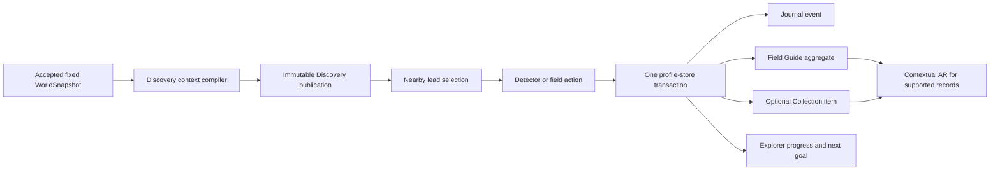

# World Explorer 3D — Explorer Platform Implementation Report

Date: 2026-08-17
Product version: 4.3.0 release
Source baseline: `steven/living-editable-world` at `8410cdbf6e00038eefd0d9bb7e652d2abd8dabce`, plus the current uncommitted implementation
Status: local acceptance build; production verification in progress; not pushed or deployed

## Purpose and scope

This is the authoritative report for the Explorer experience that was just
built. It covers the player-facing Field Journal, the discovery action/result
pipeline, progression and Gear, wildlife and specimen presentation, contextual
AR integration, first-use teaching, responsive behavior, persistence, privacy,
and the matching landing-page handoff.

It is intentionally not a complete inventory of every historical World Explorer
system. The fixed Earth world, Living World, transport structures, account,
multiplayer, Live GPS, Ocean, fishing, editing, and Firebase platform are included
only where the new Explorer experience depends on or integrates with them.

Runtime code and executable tests are authoritative. Earlier architecture and
audit documents remain useful design history, but their descriptions of the
pre-rebuild UI and progression are no longer current.

## Executive outcome

The recent work changes World Discovery from a collection of technically present
features into one coherent Explorer loop:

> notice a nearby lead → equip the appropriate tool → act in the world → save one
> result → update the Journal and Field Guide → add to Collection only when an
> object was actually acquired → show progress and the next reason to explore.

The implementation is meaningfully integrated with the existing app:

- the world remains the primary play surface;
- the Field Journal is closed by default and collapses during an activity;
- there is one Explorer persistence transaction, not separate UI-owned saves;
- observations and photographs are no longer represented as owned objects;
- tool access, goals, specialties, and regional progress derive from one durable
  Explorer progress record;
- contextual AR opens from companions, supported records, or eligible habitat,
  rather than appearing as a permanent competing mode;
- the public landing page now demonstrates the current Journal → Guide →
  Collection → Progress structure using current-build captures.

This is a production-shaped vertical slice, not a claim that every possible
animal, plant, rock, fossil, Ocean activity, or real-device AR path is complete.

## What was built

### 1. One Explorer event and result pipeline

Every completed released field action now creates one schema-versioned
`ExplorerEvent`. The profile store records the claim, Journal event, Field Guide
aggregate, optional Collection item, and Explorer progress in one IndexedDB
transaction.

The result projects to:

| Destination | Meaning | Written for |
| --- | --- | --- |
| Journal | Chronological record of what the player did, where, and when | Every completed Explorer action |
| Field Guide | Identification index with observations and regions | Every identified record |
| Collection | Virtual objects the player actually acquired | Finds/specimens and other explicit acquisitions only |
| Progress | Rank, specialty, regional, and goal credit | New identification or new-region evidence |

Duplicate claims are rejected by stable claim identity. Repeating the same
identification in the same region can remain documented without farming rank.
A first identification awards 3 points; evidence of an already known identity in
a new region awards 2 points; an already credited same-region repeat awards 0.

Primary owners:

- `app/js/discovery/explorer-events.js`
- `app/js/discovery/profile-store.js`
- `app/js/discovery/runtime.js`

### 2. Field Journal information architecture

The previous parallel dashboard was replaced with five player concepts:

| Surface | Player question it answers |
| --- | --- |
| Today | What can I meaningfully do here now? |
| Field Guide | What exists, and what have I identified? |
| Collection | Which virtual objects did I actually acquire? |
| Gear | What am I carrying, what can it do, and what unlocks next? |
| Progress | How is this expedition, region, specialty, and rank developing? |

Today shows one recommended nearby lead and at most two alternatives. Starting a
field action minimizes the Journal and leaves a compact resume/status control with
distance and bearing. The large panel is not intended to remain over gameplay.

The Journal can be filtered by specialty and region. Events saved against a known
preset retain its location key and expose a safe Return to location action.

The Field Guide includes search, category filters, unknown silhouettes, evidence
explanations, observation counts, region history, and licensed reference images
where the local catalog supports them.

Primary owners:

- `app/index.html`
- `app/styles/discovery.css`
- `app/js/discovery/runtime.js`

### 3. Progression, goals, and capability unlocks

Explorer rank now uses durable points rather than raw Collection count. Released
ranks are:

| Rank | Points | Capability effect |
| --- | ---: | --- |
| Trailhead | 0 | Lens, Camera, Detector, Trowel, Fishing Rod |
| Pathfinder | 8 | Adds Binoculars, Rock Hammer, Sediment Pan |
| Field Explorer | 20 | Adds Fossil Brush, Specimen Brush, Field Shovel |
| Expeditioner | 45 | Rank recognition; no additional released tool is promised yet |

The current goal sequence teaches the loop before broadening it: first discovery,
first acquired item, three identifications in the current region, Pathfinder,
deeper regional coverage, Field Explorer, then balanced Nature/Earth/Places work.

Regional progress separately tracks wildlife/nature, geology/fossils,
places/finds, and distinct field activities. This makes it impossible to complete
an expedition by repeating only one activity.

Gear cards are actionable. An unlocked tool can be equipped and persisted; a
compatible nearby lead can auto-equip it; locked cards name the required rank and
remaining points; and each released tool explains its field purpose.

Primary owners:

- `app/js/discovery/explorer-goals.js`
- `app/js/discovery/explorer-events.js`
- `app/js/discovery/tools.js`
- `app/js/discovery/runtime.js`

### 4. Released activities and progressive opportunity pacing

The underlying catalog retains broader R&D definitions, but the player-facing
nearby-lead surface now exposes only activities with a credible current action
presentation:

- metal detecting;
- close inspection;
- photography;
- geology inspection;
- virtual sediment panning;
- fossil documentation;
- virtual foraging;
- wildlife tracking/observation;
- beachcombing;
- the existing full fishing activity.

Unfinished labels such as drone survey, generic delivery, sonar, and virtual dive
are withheld from the core nearby-lead surface until they have a distinct visible
mechanic. This prevents catalog breadth from being misrepresented as finished
gameplay.

Opportunities are deterministic within the compiled fixed-world context. The
first local layer is available at Trailhead; additional finite layers become
available at 3 and 10 saved records. Unseen catalog identities receive priority.
Normal walking, NPC movement, companion movement, and GPS movement do not start
new provider queries.

Primary owners:

- `app/js/discovery/catalog.js`
- `app/js/discovery/model.js`
- `app/js/discovery/pacing.js`
- `app/js/discovery/field-activities.js`
- `app/js/discovery/runtime.js`

### 5. Detector and held-tool presentation

Metal detecting is a dedicated state machine rather than a renamed generic
interaction:

> sweep → approach signal → refine → classify depth → excavate with a compatible
> tool → reveal → collect or leave.

The character visibly carries the detector. Excavation changes to the appropriate
trowel or shovel, creates ground disturbance, and uses phase-specific movement,
audio cues, and mobile haptics. Six detector finds use distinct ground-level
reveal silhouettes instead of one floating placeholder.

Released field tools have character/first-person attachment and specific use
animation for photography, binocular observation, rock inspection, brushing,
panning, detecting, and excavation. The entire released equipment set is bounded
at 47 meshes and 3,173 triangles in the visual-budget test.

Primary owners:

- `app/js/discovery/detector-session.js`
- `app/js/discovery/field-equipment.js`
- `app/js/discovery/natural-history-models.js`

### 6. Wildlife, companions, specimens, and reference media

Wildlife observations use species-specific bounded models where supported rather
than the generic evidence marker. The current model set includes distinct hound,
cat, fox, deer, small-mammal, mallard, and pigeon rigs. Ambient wildlife is
deterministic, habitat filtered, capped at eight actors, and uses enter/retention
hysteresis to reduce visible popping.

Individual animal budgets are capped at 30 meshes, 1,800 triangles, and 8
materials. These are deliberately performance-bounded game models, not scanned
photoreal assets.

The local reference library contains optimized, attribution-complete photographs
for the curated first-pass animals, plant, geology, mineral, and fossil records.
Reference images are identification aids and never evidence that a real specimen
exists at the exact selected map coordinate.

Companions keep stable instance identity, one-active enforcement, following,
travel safety, care/training values, personality/variation, and contextual AR.

Primary owners:

- `app/js/discovery/animal-models.js`
- `app/js/discovery/wildlife-runtime.js`
- `app/js/discovery/companions.js`
- `app/js/discovery/companion-runtime.js`
- `app/js/discovery/visual-content.js`
- `app/assets/discovery/`

### 7. Contextual augmented reality

AR is implemented as a presentation capability, not another world loader or
environment. The runtime capability order is:

1. spatial WebXR where supported;
2. an honestly labeled camera overlay;
3. interactive 3D fallback.

Contextual entry points exist for an owned companion, supported Guide/Collection
records, and a compatible water-habitat photo survey. There is no permanent AR
HUD or global duplicate menu.

AR is Earth-only, user initiated, blocked in unsafe vehicle/speed states, ends
when the page hides or world identity changes, never requests a microphone or
GPS, and does not store or upload camera frames. Its auxiliary renderer, camera
stream, XR session, listeners, and content are disposed on exit.

Primary owners:

- `app/js/ar/capabilities.js`
- `app/js/ar/eligibility.js`
- `app/js/ar/field-challenge.js`
- `app/js/ar/presentation.js`
- `app/js/ar/session-service.js`
- `app/styles/ar.css`

### 8. First-use teaching and analytics

The core First Expedition remains a short three-step journey: move, choose a
field activity, and record one result. Its completion copy now explains where
the result went and why Journal, Guide, Collection, Current Goal, and regional
progress differ.

Each Explorer section also has a persisted first-open coach. Tool guidance and
section teaching use separate acknowledgement identities so learning one does
not silently suppress the other.

Discovery analytics uses an allowlisted event bridge. Product events exclude
coordinates, stable claim/source IDs, and free-form text. Analytics is for funnel
and comprehension measurement, not a second gameplay or persistence authority.

Primary owners:

- `app/js/tutorial/tutorial.js`
- `app/js/tutorial/ui.js`
- `app/js/discovery/tutorials.js`
- `app/js/discovery/telemetry.js`
- `js/analytics.js`

### 9. Landing-page handoff

The existing landing page was improved in place rather than replaced by a
separate marketing site. Its Explorer story now matches the actual current UI:
Journal → Field Guide → Collection → Progress. The old exploration/mobile frames
were replaced with current 1440 × 900 and 390 × 844 captures.

The primary hero remains a recognizable Baltimore harbor/city frame so the page
sells the world before it explains a subsystem. Published-content hooks, account
routes, multiplayer references, legal routes, and the launch path remain intact.

Primary owners:

- `index.html`
- `styles/landing.css`
- `assets/landing/current/`

## Runtime and data flow

The Discovery publication is derived only after the accepted fixed-world
snapshot exists. It is tied to the snapshot request ID and sequence, rejects
stale publication, and disposes during world replacement. It does not mutate the
base WorldSnapshot.

## Persistence and trust boundaries

| Data | Authority | Durability/trust |
| --- | --- | --- |
| Anonymous profile, Journal, Guide, Collection, claims, companions | `world-explorer-discovery` IndexedDB v2 | Local to the browser profile |
| Explorer events | IndexedDB `events` store | Added through a non-destructive v1 → v2 upgrade |
| Equipped tool and section teaching | Discovery profile | Local and durable |
| Signed-in discovery receipt | Firestore/Cloud Function boundary | Server-written owner-readable receipt |
| Trade eligibility | Trusted server receipt only | Anonymous/client-reported records are non-tradeable |
| Product analytics | Allowlisted sanitized analytics bridge | No exact position, claim/source ID, or free text |
| Camera/XR frames | AR session only | Not copied, saved, or uploaded |

Existing profiles are normalized rather than renamed or destructively migrated.
The legacy discipline counters remain for compatibility while
`explorerProgress` is the current progression authority.

## Integration boundaries

- **Fixed Earth world:** supplies the immutable world identity and compiled
  environment. Explorer movement does not create a second world loader.
- **Living World:** supplies bounded ambient actors and supports current animal
  presentation; Explorer does not own NPC traffic simulation.
- **Editable World:** selected released field activities may create virtual
  semantic outputs without altering mapped source records.
- **Fishing:** is launched as the existing full activity. Its historical catch
  store is still separate from the canonical Explorer event pipeline.
- **Live GPS:** may move the walking actor inside the fixed world; it does not
  currently create Explorer visit/distance Journal events.
- **Ocean and route games:** remain meaningful existing systems but do not yet
  project their completion into the Explorer Journal.
- **Account/backend:** signed-in receipts use the existing auth and trusted
  backend boundary; anonymous local play remains available.
- **Landing:** describes the released Explorer loop but must not imply that the
  limited first-pass catalog is a production-scale natural-history database.

## Current maturity and honest limits

| Area | Current status | Remaining acceptance or expansion |
| --- | --- | --- |
| Journal/Guide/Collection transaction | Implemented | Production verification and user acceptance |
| Rank, specialties, goals, regional progress | Implemented | Tune pacing from real play data |
| Gear equip/unlock flow | Implemented for 11 released tools | Add capabilities only with distinct mechanics |
| Detector vertical slice | Implemented and browser-tested | Hands-on feel and pacing feedback |
| Released generic field actions | Playable with distinct held presentation | Some remain lighter mechanics than detector/fishing |
| Wildlife/specimen 3D | Bounded curated first-pass quality | Larger species/geology catalog and further art polish |
| Reference photography | Licensed curated local set | Broader taxonomic coverage with the same provenance bar |
| Companion following/care | Implemented | Care/training still needs richer in-world consequence |
| AR fallback/desktop journey | Implemented | Physical Android WebXR and handheld Safari acceptance |
| AR field challenge | Interactive session implemented | Durable Explorer event/progression integration |
| Fishing/Ocean/routes/Live GPS | Existing systems launch or coexist | Canonical Explorer history integration remains |
| Trading | Trusted backend contracts exist | No complete player-facing marketplace is released |
| Landing desktop/mobile | Current captures and structure implemented | User visual acceptance before deployment |

## Production-readiness decision rule

The code should be considered ready for the user's production-candidate test only
after all of the following are true:

1. focused Explorer platform, visual-budget, AR, persistence/backend, CSS,
   module-identity, maintainability, and production-readiness gates pass;
2. the installed-Chrome Baltimore acceptance journey passes with zero fatal
   application errors and fresh screenshots are visually inspected;
3. the landing page is checked at desktop and 390 px mobile width with current
   images, visible primary action, and no horizontal overflow;
4. the local working source is converted into a clean, immutable, content-hashed
   candidate before any deployment decision;
5. physical-device AR remains labeled pending until it is actually tested on the
   intended Android and Safari hardware.

Passing source tests does not make the current dirty worktree an immutable
deployable artifact. The user's hands-on test is an explicit acceptance gate
before commit, push, candidate creation, or deployment.

## Fresh verification result — 2026-08-17

Current decision: **ready for local user testing; not yet ready for production promotion.**

The focused source and contract layer is green:

| Gate | Result |
| --- | --- |
| Explorer fixtures, persistence, progression, goals, and privacy | Passed — 11 contexts, 17 catalog tools, 25 catalog activities, 6 detector finds |
| Discovery visual budgets and reference media | Passed — 10 images, 7 animal rigs, 5 specimen types, 9 held tools |
| AR capability, eligibility, and challenge contracts | Passed |
| Discovery backend normalization | Passed |
| Cloud Functions runtime/export contract | Passed — Node 22 and 20 verified exports |
| Account/admin/onboarding integration contract | Passed |
| CSS integrity | Passed |
| ES-module URL identity | Passed — 472 targets |
| Maintainability ownership | Passed — 506 modules; 9 non-blocking size advisories |
| Production-readiness evidence contract | Passed |
| Whitespace/diff validation | Passed |

The two Explorer blockers found by the earlier broader gate are closed:

1. **Wildlife and companion presentation:** all Discovery placement paths now
   use the shared accepted walk/terrain surface adapter and reject building
   collisions. The full installed-Chrome journey passes detector, held trowel,
   excavation, Collection, field observation, Guide, Progress, dog, airborne
   bird, AR fallback and mobile assertions. Human review confirms the field
   subject and companions are fully framed with the gameplay panel collapsed.
2. **Hosting asset reachability:** the 15 obsolete landing/gameplay images were
   removed recoverably. Strict reachability now passes 532/532 modules with no
   orphan, and the asset audit passes 79 reachable assets plus 27 dynamic PBR
   assets without exclusions.

Whole-product production gates still remain outside the Explorer feature: the
accepted working tree must be committed to create an immutable candidate, the
privileged operational-endpoint check requires a Firebase preview URL, and a
2.02 GB heap high-water observation in the heavy Living/Editable World journey
requires target-hardware acceptance. See `docs/TEST_AND_RELEASE_MAP.md` and
`KNOWN_ISSUES.md` for the authoritative current release decision.

No commit, push, immutable candidate, preview deployment, or production
deployment was created.

## Focused user acceptance path

1. Open `http://127.0.0.1:4192/` and inspect the current landing page at normal
   desktop width and a narrow phone-like width.
2. Launch Baltimore, switch to walking, open **Exploration → Field Journal &
   Activities** (or press **X**).
3. Confirm Today offers one recommended lead and no more than two alternatives.
4. Complete a detector action through signal, classification, tool swap,
   excavation, reveal, and collect.
5. Confirm the result card names Journal, Field Guide, Collection, and Progress.
6. Complete photography or wildlife observation and confirm it appears in the
   Journal and Guide but not as an owned Collection object.
7. Filter the Journal, open the Field Guide explanation, inspect an image-backed
   identity, and use Return to location on a preset-backed record.
8. Equip a tool in Gear, inspect locked Pathfinder equipment, and confirm points
   remaining are understandable.
9. Review Current Goal and the regional Nature/Earth/Places/activity scorecard.
10. Minimize during play and confirm only the compact resume control remains.
11. Test a companion and the interactive 3D AR fallback locally. Reserve camera
    overlay/WebXR acceptance for an HTTPS phone candidate.
12. Repeat the core path at approximately 390 × 844 and check that all five tabs,
    the action controls, reference images, and result routing remain usable.

## Deployment boundary

No deployment is authorized by this report. The correct sequence is:

> focused production verification → user local acceptance → fix/tune findings →
> clean commit → immutable candidate build → candidate smoke test → explicit user
> deployment approval → push/promote the exact approved artifact.
