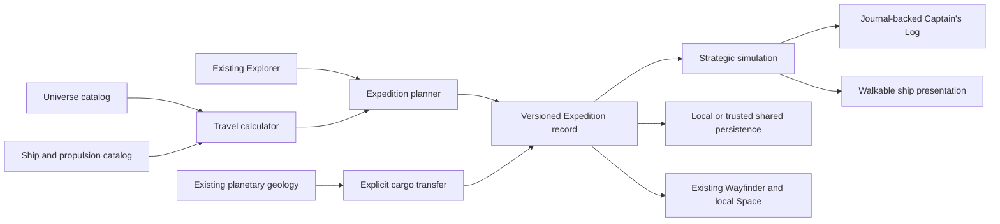

# Interstellar Expedition System

Decision record: 2026-08-30  
Status: implementation authority; connected alpha candidate implemented

## Product boundary

Interstellar Expeditions make the journey between distant destinations a
playable simulation. They do not replace ordinary Space Flight.

World Explorer keeps three travel depths through the same destination catalog:

1. **Free flight** keeps the established personal spacecraft, manual controls,
   optional local assistance, orbit, landing, surface play, and return.
2. **Assisted travel** keeps Wayfinder as an interruptible convenience over the
   existing spacecraft and course authorities.
3. **Interstellar Expedition** is an explicit choice to plan and manage a
   persistent long-range ship before returning to ordinary local exploration
   on arrival.

An Expedition never creates another copy of a star, planet, Explorer, Journal,
Backpack, planetary surface, geology activity, Quick Build, Blocks world, or
multiplayer platform.

## Selected architecture

| Concern | Authority | Rule |
| --- | --- | --- |
| Destinations and physical distance | `app/js/universe/catalog.js` plus astronomical body/world addresses | Known catalog identity and distance are never replaced by an Expedition-only destination |
| Ship and propulsion definitions | `app/js/expedition/catalog.js` | Profiles carry physical or fictional classification, performance, capacity, and functional-room requirements |
| Travel duration and relativity | `app/js/expedition/travel-calculator.js` | Planner, readiness, simulation, and UI consume the same calculation |
| Mission state | `app/js/expedition/model.js` | One versioned immutable record owns route, clock, crew, resources, systems, events, discoveries, and state |
| Strategic time and consequences | `app/js/expedition/simulation.js` | Analytical bounded steps; rendered frames never stand in for years of travel |
| Personal equipment | existing Backpack | Transfers to ship cargo are explicit and conservation checked |
| Ship supplies and cargo | Expedition record | No menu event can create supplies without a declared allocation, production, recovery, or transfer |
| Logs and progression | existing Journal and Explorer event authorities | The Captain's Log is a presentation of shared records, not another Journal database |
| Shared missions | existing room/backend authority | A trusted host/server owns valuable shared state; browsers do not independently consume or award it |
| Arrival and local play | current Wayfinder, Space Flight, planetary journey, surface, geology, and Blocks authorities | Long-travel compression stops before the player resumes local play |

## Physical and gameplay model

### Distance and time

Every route keeps three different values:

- physical distance from the catalog, expressed in meters and readable light-years;
- simulated external elapsed time;
- crew-experienced proper time when relativistic effects matter;
- expected player time after strategic compression.

The calculator uses constant proper-acceleration and deceleration legs, with an
optional capped cruise speed. For relativistic profiles it uses the Lorentz
factor and hyperbolic constant-proper-acceleration relationships. It does not
use `distance / speed` after acceleration and deceleration have become
significant. Results expose whether the speed cap was reached and keep the
underlying seconds even when the UI displays days or years.

Free-flight render scaling is not used for Expedition distance or duration.
Expedition chronology also does not advance contemporary Earth data. A mission
may represent centuries while an Earth visit still loads the current Earth
context.

### Propulsion classifications

The initial catalog uses four honest classes:

- **Demonstrated:** chemical and electric propulsion. Chemical propulsion is
  useful for high-thrust local maneuvers; electric propulsion provides high
  efficiency and low thrust. Neither is presented as a practical crewed
  interstellar drive.
- **Engineering development:** nuclear thermal/electric profiles are useful
  within the Solar System and remain unsuitable for ordinary crewed
  interstellar travel at the assigned performance.
- **Physically grounded but highly speculative:** beamed sails and fusion
  concepts may reach meaningful fractions of light speed in studies, but the
  required infrastructure, mass, shielding, power, and deceleration remain
  unresolved.
- **Fictional:** the game long-range drive converts externally supplied power
  into a directed high-energy plasma exhaust and field-shaped radiation shield.
  Momentum comes from the expelled reaction mass and radiation. The fictional
  assumption is a compact conversion and field system with performance far
  beyond demonstrated engineering. It is never described as established
  technology or a warp drive.

Faster-than-light travel, if enabled later, remains explicitly fictional and
uses a separate calculation profile. It never changes the catalog distance.

### Life support and resources

The strategic resource set is intentionally small:

- food;
- recoverable water/life support reserve;
- power reserve;
- propulsion resource;
- medical supplies;
- maintenance material;
- fabrication feedstock;
- mission/science cargo.

Water recovery is modeled as a percentage with continuing loss, not infinite
recycling. The default advanced ship begins below perfect recovery and carries
a safety reserve. Food production, fabrication, and repairs consume power,
crew capacity, and materials when the selected ship supports them.

The preparation screen forecasts demand and margin. `Ready`, `Marginal`, and
`Insufficient` come from route capability, role coverage, ship capacity,
supplies, and system condition. They are not player-level gates.

### Crew and generation boundaries

The existing Explorer is one crew member. NPC crew provide overlapping role
coverage for command, flight/navigation, engineering, medical/life support,
and science/surface work. Routine schedules are automatic. Fatigue and health
affect effective coverage without requiring hourly micromanagement.

Cryogenic suspension is classified as speculative. Reserve specialists have a
controlled wake cost, recovery state, replacement role coverage, and finite
medical and power demand rather than treating sleep as a label.

Generation voyages use aggregate population continuity, aging, training, role
succession, and knowledge preservation. The model will not store genetic data
or claim one disputed minimum population as settled science. Ship profiles
must carry large safety margins and the game must display the uncertainty.

### Systems, maintenance, and failure

The ship tracks propulsion, power, life support, navigation, thermal control,
medical, fabrication, food production, sensors, and hull only when the class
requires them. Condition changes gradually through time, load, environment,
maintenance, and events.

Events are either caused by current state or selected from a bounded contextual
deck. Every event changes real crew, resource, route, cargo, or system state.
A prepared ship receives warnings, backups, repair, fabrication, diversion, and
rescue opportunities. A mission can be lost only through a reconstructable
causal chain under the selected survival rules.

### Persistent ship and interior

One stable ship ID owns class, installed modules, propulsion, condition, crew,
cargo, history, and a deterministic interior seed. Class requirements generate
a bounded room graph; validation rejects missing rooms, disconnected routes,
overlaps, or an interior that exceeds the declared hull.

The first complete ship is a long-range research vessel with a bridge,
engineering, life-support core, crew quarters, medical bay, cargo/fabrication
space, science lab, and local-craft bay. Every named room exposes the function
it represents. Visibility is deck/room bounded and routine crew animation is
presentation, not strategic authority.

## Persistence and rollback

The local single-player record uses a versioned store with a previous-record
backup before migration. It persists the Expedition, ship, route and leg,
strategic clock, crew, resources, systems, cargo, discoveries, log, and current
state; it never saves renderer objects, transient animation, or DOM state.

Shared Expeditions require the existing authenticated backend and room
authority before resource transfer, ownership, rescue, or outpost production
can be released. A local UI record is not proof of shared ownership.

Schema rollback restores the previous compatible record and keeps the newer
record as diagnostic recovery data. Incomplete or unsupported versions fail
closed without modifying the existing Explorer profile.

## Connected alpha slice

The first implementation target is a Proxima Centauri research expedition:

1. explicitly choose Expedition without changing the normal Space entry;
2. select Proxima Centauri, realism and survival presets, a research ship,
   propulsion, crew, supplies, and route;
3. receive one readiness assessment from the shared calculator;
4. board and walk the validated research-ship interior;
5. depart and advance strategic time;
6. consume supplies and accumulate wear;
7. resolve one maintenance event that changes the affected system and material;
8. record one sensor discovery in the Captain's Log;
9. arrive and stop long-travel compression;
10. hand the selected Proxima destination to the existing Wayfinder/local Space
    runtime while keeping the same Explorer and Expedition record.

The same record also supports physically entered resource stops, causal failure
and recovery, cryogenic replacement, generation continuity, shared room crews,
one-time rescue, and persistent field stations. Ordinary Space remains
available without creating or loading an Expedition.

## Current implementation status

The Solis Reach now has three validated decks, 25 reachable rooms, working
pressure doors and lift, compact and expanded maps, visible assigned crew,
mobile walking controls, and room stations connected to the same crew,
resources, systems, mission log, and existing Explorer Journal. Entering the
ship pauses the current Space session; returning to flight resumes that same
session and course instead of creating a second Space environment.

The seven visible crew now follow deterministic work, support, rest, and
emergency-response assignments derived from the same persistent Expedition
record. Crew health, fatigue, experience, and primary assignment survive save
and restore; strategic time changes age, experience, fatigue, and health, while
repair and science outcomes affect the crew members whose roles performed the
work. Their movement is a bounded presentation of that state, not another crew
simulation.

The connected alpha includes ship-system operations, explicit planetary sample
custody and processing, repair and resupply stops, cryogenic and generation
missions, relativistic time, shared human crew, reconnect, rescue, persistent
field stations, full-record save and reload, durable discoveries, and causal
failure reports. Ordinary manual Space flight and optional Wayfinder assistance
remain the established travel paths outside Expeditions. Further destinations,
ship classes, rooms, art, animation, audio, event families, and planetary
activities expand this system without changing its authorities.

## Verification gates

Each gate is written from the behavior implemented at that checkpoint. Existing
tests are evidence only after their setup and assertions are reviewed against
the current authority.

- deterministic calculator checks at non-relativistic and relativistic speeds;
- preparation failures for invalid destinations, missing roles, insufficient
  capacity, and insufficient supplies;
- resource conservation across provisioning, consumption, repair, fabrication,
  recovery, and allowed Backpack transfers;
- quiet intervals, state-driven events, recoverable failure, and causal mission
  loss in the headless strategic simulator;
- save/close/reload with the same complete Expedition record;
- representative interior reachability, collision, scale, and functional-room
  interaction;
- the complete planning-to-arrival journey at desktop and 390×844;
- the unchanged normal Space journey with no crew, provisioning, food, large
  ship, or Expedition UI requirement;
- lifecycle teardown without a second render loop, stale input listener, or
  retained destination scene.

## Research basis

- NASA, *Candidate Interstellar Propulsion Technology Concepts*: chemical
  propulsion is energy-density limited for interstellar missions; fusion,
  antimatter, and directed-energy sails remain low-readiness concepts.  
  https://ntrs.nasa.gov/api/citations/20200000759/downloads/20200000759.pdf
- NASA, *In-Space Propulsion*: electric propulsion provides high total impulse
  at low thrust and may require hundreds or thousands of operating hours.  
  https://www.nasa.gov/smallsat-institute/sst-soa/in-space_propulsion/
- NASA, *Space Nuclear Propulsion*: nuclear thermal propulsion couples higher
  thrust with roughly twice chemical propellant efficiency; nuclear electric
  propulsion trades thrust for efficient long operation.  
  https://www.nasa.gov/space-technology-mission-directorate/tdm/space-nuclear-propulsion/
- NASA, *Environmental Control and Life Support Systems*: water recovery, air
  revitalization, and oxygen generation are connected vehicle systems.  
  https://www.nasa.gov/reference/environmental-control-and-life-support-systems-eclss/
- NASA, *Water Recovery Milestone*: the ISS demonstrated approximately 98%
  water recovery, which still leaves consequential losses on long missions.  
  https://www.nasa.gov/missions/station/iss-research/nasa-achieves-water-recovery-milestone-on-international-space-station/
- NASA Human Research Program, *Five Hazards of Human Spaceflight*: radiation,
  isolation, distance, altered gravity, and closed environments interact on
  long missions.  
  https://www.nasa.gov/hrp/hazards/
- ESA, *Hypometabolic stasis* and *Hibernation and Torpor*: induced human torpor
  remains a research concept rather than established long-duration capability.  
  https://www.esa.int/gsp/ACT/projects/hypometabolic/  
  https://explorationscience.esa.int/topical-teams/hibernation-and-torpor/
- Smith, *Acta Astronautica* 97 (2014), review of genetically viable
  multigenerational voyaging populations: estimates are uncertain and proposed
  safe populations vary widely; the game therefore uses bounded aggregate
  simulation and discloses uncertainty.  
  https://doi.org/10.1016/j.actaastro.2013.12.013
