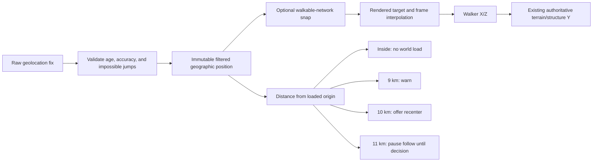

# Live GPS Explore Mode: R&D and Architecture Decision

Date: 2026-08-15  
Repository baseline: `steven/earth-core-recovery` at `17d8a9c`  
Status: architecture research only; no production GPS implementation was added

## Executive decision

**Conditional GO for a foreground-only, single-player Phase 1 prototype. NO-GO for production release until physical iPhone and Android field tests pass.**

The correct first design is a bounded extension of the existing fixed-location Earth session:

1. The user chooses **Live GPS Explore** and grants location permission from a user gesture.
2. World Explorer loads one ordinary fixed Earth world centered on the first accepted GPS fix.
3. Subsequent accepted fixes move the walking avatar inside that already-loaded world.
4. Normal GPS motion does not reload terrain, roads, buildings, bridges, ramps, tunnels, vegetation, or water.
5. Only inexpensive actor, camera, map, and thresholded nearby-game systems update.
6. At 9 km from the session origin the UI warns; at 10 km it offers a controlled recenter; at 11 km it pauses GPS-follow until the player recenters or exits.

This preserves the current architecture. It does **not** require continuous-world streaming, a floating origin, or two simultaneous worlds. A controlled recenter should use the existing single-world teardown/reload path. Because current dense-world memory is already material, building a hidden second world for seamless overlap is specifically rejected.

The current code is suitable as a base, but it is not ready to ship Live GPS without three prerequisite corrections: one canonical geographic projection for every consumer, a GPS ownership/state machine, and actual mobile performance/permission testing.

## 1. Scope, method, and evidence limits

This investigation traced the current location selection, world-load transaction, geographic projection, walking/vehicle state, map updates, weather, activities, DeFlock, multiplayer, cache ownership, movement tests, and current memory/frame reports. It also ran a deterministic synthetic GPS model covering stationary noise, 500 m/2 km/5 km walks, a city-block loop, an impossible jump, an outage, a 10 km bicycle trip, and a 12 km boundary crossing.

No production gameplay code was changed. The simulation is architecture evidence, not a claim that synthetic noise represents a real phone.

Current automated mobile coverage is viewport/user-agent emulation. It does not reproduce Mobile Safari, a phone GPU, thermal throttling, OS permission prompts, screen locking, radio power, or real GPS error. Those are release-blocking unknowns.

## 2. Current Earth architecture audit

### 2.1 Coordinate system

The ordinary Earth projection in [`app/js/config.js`](../app/js/config.js) is a local equirectangular frame centered on `LOC`:

- `x` increases east.
- `z` increases south.
- `SCALE = 100000`.
- One world unit is approximately 1.11 m; one metre is approximately 0.9009 world units.
- Near the poles, the code switches to a WGS84 east/north/up conversion.

The conversion is invertible for the bounded region, but it is not yet a single enforced service. In particular, the map code duplicates a non-polar conversion rather than always calling the canonical `worldToGeo`. Live GPS must not introduce a third conversion. Before implementation, all GPS, map, contribution, game, and multiplayer consumers should use one local-frame contract with round-trip and polar tests.

### 2.2 What loads once

An Earth location change is a coordinated, cancellable full-world build. It publishes:

- A detailed core of z15 terrain and local high-detail roads/buildings.
- A one-shot regional transport/structure context.
- Generalized far buildings, water, terrain, land cover, vegetation, street furniture, and other location-scoped features.
- One local walking/driving/flying coordinate frame.

Changing locations tears down the prior world and builds another. There is no active dual-world or floating-origin path.

### 2.3 What updates as the actor moves

Normal walking, driving, and flying update local actor state, physics, camera, surface queries, and presentation. They do not rebuild the Earth world. The current sustained travel report crossed the detailed terrain boundary and recorded `movementWorldDataRequests: []`; the fixed publication counts stayed unchanged. The requests seen during travel were primarily map raster tiles plus unrelated analytics/Firebase traffic.

Existing movement-dependent work includes:

| System | Current behavior | Live GPS implication |
|---|---|---|
| Walker/physics/camera | Per frame | GPS supplies an external target; physics still owns vertical surface placement |
| HUD | About 15 Hz | Keep, but do not rebuild HUD on every raw fix |
| Mini/large map | About 5 Hz; actor-centered raster tiles | Keep; canonicalize projection and retain the 96-tile LRU |
| Route/navigation | Rebuild after about 10 world units walking / 18 driving | Coalesce to at least 25 m and no more than 1 Hz in GPS mode |
| Activity discovery | At least 2.2 s or 90 world-unit movement | Existing threshold is appropriate |
| Weather | Checked every 5 s; refreshed after 10 minutes or 12 km | Existing policy is appropriate; never query per GPS fix |
| Boat availability | Periodic local surface query | Keep local; GPS mode should remain walking-only initially |
| DeFlock proximity | Per frame over the loaded camera list | Add a spatial index and distance/time gate |
| Multiplayer presence | At most every 2 s; 0.5 m movement threshold | Too precise/chatty for GPS; defer and redesign |

### 2.4 Continuous-world status

The earlier continuous-world system is intentionally removed. The current ownership test forbids the old Earth streaming modules, and [`docs/PRODUCTION_ARCHITECTURE_AUDIT.md`](PRODUCTION_ARCHITECTURE_AUDIT.md) explicitly says not to restore them. Current references to “chunks” are static batching or cooperative work slices, not an actor-centered data stream.

**Answer to the central architecture question: continuous-world streaming is not necessary for the intended walking experience.** A bounded session covers ordinary walking well, and a deliberate single-world recenter covers longer trips without recreating the failure mode the project removed.

## 3. Measured world dimensions and current cost

### 3.1 Geographic/visual envelopes

The Earth scene has nested envelopes, not one exact radius:

| Envelope | Current extent | Meaning |
|---|---:|---|
| Detailed terrain/core | 49 z15 terrain meshes in current reports; roughly a few kilometres around origin | Highest local fidelity |
| Exact local road/building request | Commonly about 0.02–0.03° for roads and up to 0.022° for detailed buildings | Approximately 2–3 km radial, latitude/provider dependent |
| Fixed mapped regional context | ±14 km latitude/longitude box | Roughly 28 km across each axis; generalized streets/structures/far context |
| Far terrain envelope | 22 km configured outer distance | Visual terrain continuity, not equal semantic detail |
| Camera far plane | 12,000 world units | About 13.3 km geometric distance before fog/occlusion |

The mapped regional box is the important safety constraint. A 10 km circular GPS operating radius remains at least 4 km inside each axis-aligned 14 km edge. The corners extend farther, but the design must use the conservative circular radius, not rely on corners.

There is a unit-contract defect worth fixing before GPS: `fixedRegionalContextRadiusWorld` and `worldTraversalRadiusWorld` are assigned metre values even though the names and surface contract imply world units. They are also not a demonstrated actor clamp. GPS boundaries must initially be calculated geodesically in metres from the loaded `LOC`, not inferred from that property.

### 3.2 Representative load and scene size

Current browser reports show how large the fixed scene already is:

| Evidence | Measurement |
|---|---:|
| Baltimore matrix load | 45.6 s |
| New York matrix load | 72.4 s |
| Baltimore roads / buildings | 13,688 / 28,570 |
| New York road vertices / triangles | 1,022,220 / 845,262 |
| New York detailed building records / meshes | 27,169 / 5,713 |
| New York generalized far buildings | 170,694 total: 8,994 exact + 161,700 instanced |
| Fixed regional structures in dense city | Approximately 1,340 bridges + 340 tunnels |
| Pregerson hardware run | 107 renderer geometries, 85 textures |
| Pregerson frame cadence | p95 17.9 ms, p99 18.6 ms, 0 frames over 50 ms |

Load time is network/provider dependent, but the cost is large enough that recentering cannot be treated as a silent or frequent operation.

### 3.3 The 1.5 GB question

A measured dense New York load previously reached **1,856,833,497 bytes of live JavaScript heap**. That was not considered normal or acceptable. The cause was retained provider staging data: 292 decoded Shortbread tiles, raw Overpass responses, and an overly detailed regional ring. The recent memory correction releases those caches after compilation and reduced installed-Chrome New York post-GC heap to **644–712 MB**, under an 850 MB regression budget. A current real-input interchange run measured **516.7 MB** used heap.

Therefore:

- 1.5 GB was a real regression, not a target.
- 0.52–0.71 GB is materially better on the test Mac, but still large for mobile browsers.
- GPS filtering/state itself should be kilobytes to low megabytes, not hundreds of megabytes.
- Holding a second decoded/rendered world during recenter could bring the process back toward or beyond 1.3–1.5 GB and must not be built.
- Production mobile approval requires real-device peak/plateau memory and termination testing.

## 4. Walking and cycling distance model

These are explicit planning assumptions, not guarantees about a specific user:

| Activity assumption | 15 min | 30 min | 60 min |
|---|---:|---:|---:|
| Walking at 4.8 km/h | 1.2 km | 2.4 km | 4.8 km |
| Jogging at 9 km/h | 2.25 km | 4.5 km | 9 km |
| Cycling at 15 km/h | 3.75 km | 7.5 km | 15 km |
| Cycling at 20 km/h | 5 km | 10 km | 20 km |

A 10 km safe radius easily covers an hour of ordinary walking and most jogging. It covers roughly 30–40 minutes of ordinary cycling before recentering. That is a good match for the product request without pretending the loaded world is global.

## 5. Proposed bounded-world architecture



The state must keep five positions distinct:

1. **Raw**: unmodified browser reading, retained briefly in memory for diagnostics.
2. **Filtered**: validated/smoothed truth used for movement and contributions.
3. **Snapped**: optional horizontal presentation on a plausible walkable surface.
4. **Rendered**: interpolated visual pose.
5. **Loaded origin**: the immutable geographic origin for the current Earth build.

Never overwrite raw or filtered GPS with a snapped coordinate. Altitude must not control avatar `y`; phone altitude is optional/noisy and may use a different datum. Existing accepted terrain and compiled bridge/tunnel/road surfaces remain authoritative vertically.

## 6. Boundary and recentering policy

### 6.1 Recommended Phase 1 policy

| Distance from loaded origin | State | Behavior |
|---:|---|---|
| 0–9 km | Inside | Normal GPS-follow; no Earth reload |
| 9–10 km | Warning | Small persistent edge message; optionally prefetch bytes only |
| 10–11 km | Recenter-ready | Offer `Recenter world here` or `Keep current world` |
| 11+ km | Hard pause | Freeze rendered GPS-follow, retain latest fix, require recenter/exit |

The hard pause avoids walking the avatar into an area where generalized coverage, collision, gameplay data, and visual terrain no longer agree. It should not silently teleport or automatically spend another 45–75 seconds loading.

### 6.2 Recenter strategies compared

| Strategy | Memory | Complexity | UX | Decision |
|---|---:|---:|---|---|
| Full teardown/reload at explicit user choice | One world | Low; existing path | Visible transition | **Phase 1 choice** |
| Prefetch raw/cache bytes, then teardown/reload | Small bounded cache growth | Medium | Shorter later load | Phase 1.5 after measurement |
| Build a second full scene, then swap | Approximately two worlds | High | Smooth if it survives | **Reject** |
| Continuous actor-centered chunks/floating origin | Unbounded lifecycle risk | Very high | Previously caused stalls/regressions | **Reject** |

Prefetching, if added, may fetch/cache undecoded provider bytes after the warning threshold. It must not create geometry, physics, a second renderer, or a second scene. A recenter transaction preserves the GPS state, disposes the old world through existing ownership, sets the accepted fix as new `LOC`, loads once, reprojects, and resumes only after the new surface is ready.

## 7. Browser and mobile capability matrix

The W3C Geolocation API is restricted to secure contexts and exposes `getCurrentPosition` and `watchPosition`. Accuracy, altitude, heading, and speed may be absent; high accuracy is a hint that may increase time and power, not a guaranteed mode. User agents choose what constitutes a meaningful update and may rate-limit delivery. The specification also restricts updates to fully active visible documents, dropping hidden-document updates until visibility returns. See the [W3C Geolocation Recommendation](https://www.w3.org/TR/geolocation/).

Chrome’s official documentation says geolocation access is paused when a page is backgrounded, and background tabs throttle timers and stop `requestAnimationFrame`. See [Chrome one-time permissions](https://developer.chrome.com/blog/one-time-permissions) and [Chrome background tab policies](https://developer.chrome.com/blog/background_tabs).

| Capability | iPhone/iOS browser or installed web app | Android browser or installed web app | Architecture consequence |
|---|---|---|---|
| Foreground `watchPosition` | Available with secure context and permission | Available with secure context and permission | Phase 1 viable |
| Exact callback rate | Browser/OS controlled | Browser/OS controlled | App processes at a budgeted cadence; cannot command GPS hardware frequency |
| Screen locked/background tracking | Not reliable web behavior | Not reliable web behavior | Mode is explicitly foreground-only |
| Installed PWA background entitlement | No standard native-style background-location entitlement | No standard native-style background-location entitlement | Do not market route tracking |
| Device heading | Permission/gesture and sensor dependent | Sensor/permission dependent | Optional enhancement, never required |
| GPS altitude | Optional and datum-sensitive | Optional and datum-sensitive | Do not drive terrain height |
| Screen Wake Lock | Visible-document only; may be revoked by OS/power state | Same standards limitation | Optional convenience, not correctness |

The Device Orientation specification requires secure context and permission-aware use; absolute orientation depends on accelerometer, gyroscope, and magnetometer availability. WebKit requires motion/orientation permission requests from a user interaction on iOS. See [W3C Device Orientation](https://www.w3.org/TR/orientation-event/) and [WebKit’s Safari 13 sensor permission notes](https://webkit.org/blog/9674/new-webkit-features-in-safari-13/).

Screen Wake Lock can help during an active walk, but only while visible and the user agent may release it for low battery or power-saving reasons. See the [W3C Screen Wake Lock specification](https://www.w3.org/TR/screen-wake-lock/).

Permission lifetimes vary by browser and user choice. The cross-engine implementation table and permission model are documented by the [W3C Permissions API](https://www.w3.org/TR/permissions/).

### Product promise

Live GPS Explore must say: **“Works while World Explorer is open and visible. Locking the screen or switching apps may pause movement.”** It must not promise background route recording.

## 8. GPS validation, smoothing, and recovery

A small explicit filter is preferable to a Kalman filter for Phase 1 because its behavior is inspectable, testable, and easier to tune across phones.

### 8.1 Proposed acceptance pipeline

1. Reject non-finite/out-of-range coordinates.
2. Reject stale samples older than 15 seconds during active follow.
3. If horizontal accuracy is worse than 100 m, hold position and show `Poor GPS accuracy`; do not teleport.
4. Detect an impossible innovation using both elapsed time and the old/new accuracy radii. Initial candidate: reject movement larger than `max(75 m, 2.5 × (oldAccuracy + newAccuracy) + 35 m/s × dt)` and quarantine it until a second nearby fix confirms relocation.
5. Apply a dead zone of `max(3 m, min(12 m, 0.35 × accuracy))` to suppress stationary drift.
6. Smooth accepted positions with an accuracy- and speed-class-weighted exponential filter.
7. Interpolate the rendered avatar toward the filtered/snapped target every frame. Filtering must not be tied to render FPS.

Movement classification should use a robust rolling window, not one noisy sample:

- Stationary: below about 0.6 m/s.
- Walking: 0.6–2.2 m/s.
- Running: 2.2–4.2 m/s.
- Fast movement: above 4.2 m/s.

“Fast movement” is informational. The game must never automatically switch the player into a car based on GPS speed. At unsafe/high speed, suppress interaction prompts and avoid mechanics that encourage looking at the screen.

### 8.2 Outage behavior

- Keep the last accepted target during a short gap.
- After 10 seconds without an acceptable fix, display `GPS signal lost` and stop advancing the avatar.
- Keep the world and camera usable.
- On recovery, validate the new fix. Smooth a nearby reacquisition; for a large confirmed relocation, ask for recenter rather than animating across the city.
- On `visibilitychange` to hidden, stop/pause the watch and record mode state. On return, request a fresh fix before resuming.

## 9. Road/path snapping

Snapping should improve presentation without falsifying the player’s actual location.

- Use the existing compiled traversal graph/spatial index.
- Candidate priority: sidewalk/footway/path/trail, then walkable road edge, then unsnapped terrain.
- Default snap range: 8 m; absolute cap: 12 m.
- Disable snapping when accuracy is worse than 30 m.
- Reject a candidate across a building footprint, water barrier, tunnel/bridge deck mismatch, or implausible vertical layer.
- Retain and expose `snapDistanceMeters` in diagnostics.
- Use filtered unsnapped GPS for boundary decisions, privacy, and explicit geographic contributions.

This avoids the common failure where a noisy fix on one stacked road deck snaps to another. The current compiled surface authority should decide the avatar’s final vertical support.

## 10. Control model

Live GPS Explore should be a walking-only controller with four states:

| State | Translation | Look/camera/UI | GPS collection |
|---|---|---|---|
| Off | Existing controls | Existing controls | Off |
| Following | GPS owns horizontal walker target; WASD translation disabled | Enabled | On |
| Paused | Existing/manual local exploration, clearly marked | Enabled | Optionally retained in memory |
| Signal lost / boundary hold | Position held | Enabled | Attempting/reacquiring |

The player can pause GPS-follow at any time, explore manually, then choose Resume. If the accepted GPS fix is far from the manual avatar, Resume should provide a brief camera transition or explicit confirmation. It must never blend manual movement into the GPS truth.

Jump should be disabled or cosmetic during follow. Driving, planes, boats, fishing, interiors, and other controllers should require leaving/pausing GPS-follow in Phase 1.

### Heading

Use movement bearing only after an accepted displacement of roughly 8–12 m. Smooth it with circular-angle math. Keep camera look independent so the user can look around while walking. Device orientation is an optional user-gesture-enabled enhancement and must fall back cleanly when unavailable, denied, or magnetically unreliable.

## 11. Thresholded subsystem update policy

No provider or game system should treat a raw `watchPosition` callback as a command to query or rebuild.

| Consumer | Proposed GPS trigger |
|---|---|
| Raw validation/filter | Every callback; constant memory ring buffer (last 60–120 samples maximum) |
| Rendered actor/camera | Every frame toward current target; O(1) work |
| HUD location/accuracy | 4–5 Hz maximum |
| Minimap center | Existing 5 Hz maximum; tile loads only when tile identity changes |
| Navigation route | At least 25 m movement and at most 1 Hz |
| Local activities | Keep current ≥90 world units / ≥2.2 s gate |
| Weather | Keep current 12 km / 10-minute policy |
| Memories and static POIs | Load/recenter/manual refresh only |
| DeFlock proximity | 5 m movement or 250 ms, using a spatial index |
| DeFlock provider coverage | Initial load; optional merge refresh no sooner than 1 km and 60 s, or recenter only |
| Multiplayer | Defer; eventual 5 m and 1 Hz maximum with explicit room consent |
| Photo/OSM contribution | Explicit user action only, using filtered actual location |

## 12. DeFlock integration

Current DeFlock loads up to 750 surveillance nodes in a roughly 0.022° radius around `LOC`, then performs discovery/interaction/detection against that fixed list. Its current interaction radii are 55 world units discovery, 10 interaction, and 70 detection. It does not currently expand its camera source as the player travels.

For Phase 1:

1. Keep DeFlock selectable from the in-world Games menu.
2. Never reload the Earth scene when DeFlock coverage changes.
3. Replace all-camera per-frame scans with a small spatial grid/index.
4. Display the actual camera-data coverage boundary independently from the 10 km world boundary.
5. Either keep the current approximately 2.4 km camera coverage and say so, or add a bounded nearby-data merge that runs no more often than 1 km/60 s and deduplicates stable OSM IDs.
6. Do not make a single huge 10 km Overpass query from every phone. A later production solution should use a cached server-side geographic tile/coverage endpoint.
7. Keep interactions virtual. At fast movement speed, disable action prompts and show a passive map only.

DeFlock progress can remain location/session scoped. A recenter must preserve already discovered/disabled IDs but reload marker geometry into the new local frame.

## 13. Performance and quality strategy

GPS state and interpolation are not the expected bottleneck. The current scene is dominated by world geometry, render cost, map images, and provider startup. The feature should add no recurring Earth queries and no decoded-world growth.

### Normal mode budgets

- Process accepted GPS targets at no more than the delivered rate; coalesce downstream work.
- Retain a fixed-size diagnostic ring buffer.
- Keep one world, one renderer, and one Earth frame loop.
- Assert stable geometry/textures/heap during a 60-minute simulated route.
- Assert zero terrain/road/building/structure provider requests during in-bounds normal travel.

### Low Power Mode

Offer an explicit switch and optionally recommend it after sustained frame or thermal pressure:

- 30 FPS render cap.
- Lower device pixel ratio/render scale.
- Disable or reduce dynamic shadows and optional post/effects.
- Reduce decorative animation and far-building detail.
- Prefer map readability and the walker marker over distant visual detail.
- Use `enableHighAccuracy: false`, a modest `maximumAge` (15–30 s), and app-side coalescing when the player accepts reduced precision.

The browser controls actual sensor/radio behavior, so dropping callbacks in JavaScript does not prove GPS hardware power savings. Battery claims require instrumented real-device runs.

### Performance gates before release

- iPhone Safari and installed home-screen web app: cold load, 30-minute foreground walk, screen off/on, app switch/return.
- Android Chrome and installed PWA: same.
- Dense city and ordinary suburban location.
- Peak and post-GC heap, renderer geometry/texture plateau, frame p95/p99, >50/100 ms stalls, thermal dimming/termination, network requests by subsystem, and battery percentage over time.
- No process termination or unrecoverable WebGL context loss.
- No repeated world loads while inside 10 km.

## 14. Privacy and data retention

Live location is sensitive. The minimum design is:

- Ask only after the user presses `Start Live GPS Explore`.
- Explain why the location is needed before the browser prompt.
- Keep raw/filtered fixes in memory only, in a bounded ring buffer.
- Do not persist a route trail to localStorage, IndexedDB, analytics, logs, service workers, or a server.
- Do not include exact coordinates in routine telemetry or error reports.
- Redact/round coordinates in diagnostics by default; exact export requires a deliberate user action.
- Stop the watch immediately on exit, permission loss, page hide policy, or Earth teardown.
- Never retransmit location except for an explicitly consented feature.

These practices follow the Geolocation specification’s privacy guidance to request only what is needed, dispose of data when no longer required, protect it, and disclose purpose/retention/sharing ([W3C Geolocation privacy considerations](https://www.w3.org/TR/geolocation/)).

## 15. Multiplayer implications

Current multiplayer is not compatible with recentering across independently loaded origins. Presence stores a local `x/y/z` pose plus a room origin and only treats nearly identical origins as compatible. It writes at most every two seconds, reads up to 32 presence records, and supports small rooms, but GPS introduces more serious privacy and frame-identity issues.

Recommendation: **do not include multiplayer in Phase 1**.

A later GPS multiplayer protocol must:

- Use an authoritative geographic position plus a world-frame generation ID, not only local `x/z`.
- Reproject remote players into each client’s current loaded origin.
- Quantize/coarsen location for discovery; share finer position only inside an explicit private room.
- Limit GPS presence to at most 1 Hz and 5 m movement.
- Never store trails; keep short TTLs.
- Handle recenter as a frame change without ghost teleports.
- Include block/report/invisibility and a clear “who can see me” control.

Public exact real-time GPS must not be built.

## 16. Permission, failure, and safety UX

### Entry flow

1. Game card explains: `Move your in-world walker as you move in real life. Works only while this screen stays open.`
2. User presses `Start`.
3. App requests a fresh first fix (`maximumAge` near zero, finite timeout).
4. Only after the first acceptable fix does the normal Earth load begin.
5. After world readiness, `watchPosition` starts and the state becomes Following.

### Required user-visible states

- Permission denied: `Location access is off. Enable it in browser settings, or use a selected location.`
- Unavailable: `This device cannot provide a location right now.`
- Timeout: `A location fix took too long. Try outdoors or use the selected location.`
- Poor accuracy: show the accuracy radius and hold the avatar.
- Signal lost: hold position, keep controls/camera, offer retry/exit.
- Page hidden/backgrounded: `GPS movement paused while World Explorer was not visible.`
- Boundary warning/recenter-ready/hard pause: show distance and choices.

### Safety copy

Display concise copy before start and in Help:

> Stay aware of traffic, terrain, private property, and local rules. Do not use the game while driving. Camera and map locations may be inaccurate; all DeFlock interactions are virtual and never affect physical equipment.

At fast movement speed, switch to passive presentation, suppress gameplay actions, and never encourage the user to chase an object.

## 17. Diagnostics required before implementation approval

Add a developer-only panel/export with:

- Permission and visibility state.
- Watch active/stopped and last callback age.
- Raw accuracy, speed, heading availability, altitude availability.
- Raw/filtered/snapped/rendered positions, rounded by default.
- Dead-zone, rejected-jump, poor-accuracy, and outage counters.
- Snap target/type/distance and surface owner.
- Loaded origin, geodesic distance to origin, boundary state, recenter generation.
- Downstream update counters and last-run time for map, route, weather, activities, DeFlock, and multiplayer.
- World provider request count since follow started; expected zero for core Earth providers.
- Heap, renderer geometries/textures, frame p95/p99, >50/100 ms stalls.
- Active renderer/RAF/watch counts so teardown leaks are visible.

Exact coordinates must not enter ordinary console logs.

## 18. Deterministic simulation result

Run:

```bash
node scripts/research-live-gps-model.mjs
```

The script writes `output/research/live-gps-simulation.json`. Current deterministic results:

| Trace | Key result |
|---|---|
| Stationary, 5 minutes | Raw RMS 6.63 m; filtered RMS 4.86 m; 40 dead-zone holds |
| Straight 500 m walk | No reload; filtered RMS 4.49 m |
| City-block loop | No reload; filtered RMS 4.99 m |
| 2 km / 5 km walks | No reload; boundary remains inside |
| Injected approximately 970 m bad fix | Exactly one impossible jump rejected; filtered RMS 4.68 m versus 55.89 m raw |
| 20-second outage | One outage detected and recovery continued without reload |
| 10 km bicycle trace | Warning at 9 km; recenter-ready at 10 km; no normal-travel reload |
| 12 km boundary trace | States reached in order: inside, warning, recenter-ready, hard-pause |

The simulation proves the policy is deterministic and testable; it does not prove real sensor quality. It also exposed a tuning requirement: speed classification must use a rolling estimate so one noisy fix does not switch smoothing constants, and recovery interpolation must cap visible catch-up speed.

## 19. Proposed implementation plan

Implementation should begin only after this architecture is accepted.

### Phase 0 — contracts and tests

- Add one canonical geographic/local-frame service and migrate map conversion to it.
- Correct or rename the metre/world-unit traversal-radius fields.
- Add a pure GPS state machine and deterministic fixtures; no UI/provider calls in the filter.
- Add lifecycle assertions for one geolocation watch and zero leaks after repeated start/stop/world reload.

### Phase 1 — foreground single-player MVP

- Add Live GPS to the Games menu and title flow.
- First-fix world load, then foreground `watchPosition`.
- Implement validation, smoothing, rendering interpolation, pause/resume, visibility handling, and the 9/10/11 km policy.
- Walking-only control; no multiplayer, background tracking, or automatic recenter.
- Add diagnostics and zero-world-request travel assertions.

### Phase 1.1 — snapping and DeFlock

- Walkable-path snap with strict distance/layer rules.
- DeFlock spatial index, camera coverage UI, and bounded server-cached nearby refresh if product testing requires more than current coverage.
- Preserve progress by stable camera IDs across recenter.

### Phase 1.2 — mobile quality and low power

- Add Low Power Mode.
- Complete physical iPhone/Android field matrix.
- Tune thresholds per device evidence without changing the fixed-world ownership model.

### Phase 2 — optional recenter prefetch and private multiplayer

- Prefetch bytes only if measurements show material benefit.
- Redesign multiplayer around geographic positions, frame generations, consent, quantization, and privacy.
- This phase is independently gated; it is not required for single-player GPS.

## 20. Files/subsystems expected to change in implementation

This is a planning list, not an implementation diff:

- New: `app/js/live-gps/` state machine, filter, lifecycle, controller, boundary, diagnostics.
- Projection: `app/js/config.js`, `app/js/terrain/source-contract.js`, and map conversion consumers.
- Location/session: `app/js/location-session.js`, `app/js/earth-location.js`, title geolocation flow, globe/location transitions.
- Movement: walking runtime/controller and core frame scheduling, without changing surface ownership.
- UI: Games menu/card, compact GPS status, permission/errors, boundary/recenter dialog, Help/safety copy.
- Maps/navigation: actor projection and threshold/coalescing.
- DeFlock: source coverage contract, spatial query, recenter re-projection, progress retention.
- Lifecycle/world load: watch cancellation and explicit recenter transaction using the current reset path.
- Multiplayer only in Phase 2: geographic presence/frame protocol and privacy controls.
- Tests: pure model, fake-geolocation browser harness, lifecycle, no-world-request travel, real-device manual protocol.

## 21. Risks and mitigations

| Risk | Severity | Mitigation / gate |
|---|---|---|
| Dense scene exceeds mobile memory | Critical | One world only; low-power profile; physical device memory/termination gate |
| Browser pauses GPS in background | Expected limitation | Foreground-only product promise and visible recovery state |
| Repeated provider work reintroduces lag | Critical | Zero core world requests in bounds; threshold counters; fail automated trace |
| Bad fixes teleport avatar | High | Accuracy gate, innovation quarantine, second-fix confirmation, render cap |
| Map/simulation disagree due duplicate projection | High | Canonical frame service before feature work |
| Wrong stacked-road/path snap | High | Small snap range, structure layer/surface checks, unsnapped fallback |
| DeFlock coverage ends before world boundary | High | Explicit coverage ring; cached bounded refresh or documented limited radius |
| Privacy leak through logs/analytics/multiplayer | Critical | Memory-only raw fixes, redacted diagnostics, no trail, multiplayer deferred |
| Battery/thermal drain | High | Foreground-only, pause hidden, low-power mode, real-device 30/60-minute tests |
| Dual-world recenter returns heap to 1.5 GB | Critical | Architecture prohibition and one-world lifecycle assertion |

## 22. What should not be built

- No continuous Earth/vector/terrain streaming tied to player position.
- No floating-origin rewrite for this feature.
- No second full scene for seamless recentering.
- No hidden/background GPS promise, service-worker route tracker, or persisted trail.
- No raw GPS directly controlling the rendered avatar.
- No altitude-driven terrain placement.
- No world/provider query on every location callback.
- No automatic switch to car/plane/boat based on speed.
- No public exact live-location multiplayer.
- No single giant phone-originated DeFlock Overpass query covering the whole 10 km world.
- No silent automatic recenter with a minute-long load.

## Final go/no-go recommendation

**GO** to a separately reviewed Phase 0/Phase 1 implementation on the current fixed-world architecture.

**NO-GO** to deployment until all of these are true:

1. One canonical coordinate transform is used by world, maps, GPS, and contribution paths.
2. In-bounds simulated and real movement creates zero core Earth provider requests and zero world rebuilds.
3. Start/stop, permission denial, background/foreground, outage, bad fix, and recenter lifecycle tests pass.
4. DeFlock accurately communicates or extends its smaller data-coverage area.
5. Physical iPhone Safari/home-screen and Android Chrome/PWA tests meet agreed frame, memory, thermal, battery, and recovery budgets.
6. Exact coordinates never enter analytics/logging, and multiplayer remains off until its geographic/privacy redesign is separately approved.

This yields the requested real-world movement experience while keeping the stable design principle: **load a bounded place once, move within it cheaply, and cross its edge only through a controlled transaction.**
