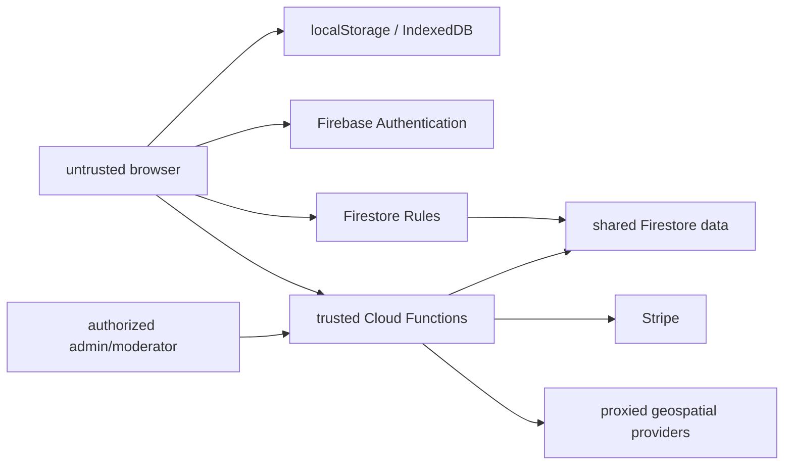

# World Explorer 3D — Persistence and Trust Inventory

Status: authoritative release-source persistence/security map for version 4.3.0, inspected 2026-08-17.

## 1. Authority model



Browser state is authoritative only for private local gameplay. A signed-in user ID does not grant admin, moderator, room-owner or plan authority by itself. Firestore Rules guard allowed direct client operations. Cloud Functions re-verify authentication, authorization, input limits and transaction state for privileged operations.

## 2. Browser-local persistence

| Store/key family | Data | Scope/recovery |
| --- | --- | --- |
| `worldExplorer3D.firebaseConfig` | public Firebase config override/emulator selection | device/browser; non-secret |
| `worldExplorer3D.lastLocation.v1` | last selected location | device/browser |
| globe saved favorites/recent places | player-selected locations | bounded device/browser lists |
| render quality and SSAO keys | GPU presentation preference | device/browser |
| `worldExplorer3D.tutorialState.v2` | tutorial milestones/deferred prompts | migrates v1 state |
| activity creator guide state | creator walkthrough completion | device/browser |
| real-estate enabled/key values | optional user-supplied provider keys | device/browser; user is responsible for local exposure/terms |
| `worldExplorer3D.memories.v1` + backup | local memory pins/flowers and related records | primary/backup recovery |
| build blocks + backup/migration | local block-builder content | bounded list, primary/backup |
| overlay local drafts + backup | unpublished editor drafts | primary/backup |
| activity library + backup | local activity definitions | bounded primary/backup |
| activity completions | local activity progress | device/browser |
| editable-world local store + backup | location-keyed semantic deltas/history | stable fixed-world identity, bounded and recoverable |
| DeFlock local state | discovered/disabled virtual nodes | keyed by location and source version |
| `worldExplorer3D.fishing.catches.v1` | bounded catch history | device/browser |
| Flower/player name and leaderboard cache | display name/local results | device/browser |
| Paint Town color | per-user/device paint preference | device/browser |

Clearing site data removes these records. They are not account backups unless an explicit server projection exists. Local backups protect against malformed primary JSON, not device loss.

## 3. IndexedDB stores

| Database | Ownership | Contents |
| --- | --- | --- |
| `worldexplorer3d-map-cache` | Earth provider cache | bounded OSM/provider responses keyed by request/version |
| `worldexplorer3d-worldcover-cache` | terrain semantic cache | WorldCover baseline products |
| `world-explorer-discovery` | World Discovery local profile | profile, items, claims/events, Field Guide records and companions for anonymous/local play |

Discovery local authority is marked anonymous/local and items are not server-tradeable. Signed-in trusted claims use Cloud Functions and server ownership. Cache databases never override active world-load identity or server authorization.

## 4. Firestore data model

```text
users/{uid}
  friends/{friendUid}
  recentPlayers/{otherUid}
  incomingInvites/{inviteId}
  myRooms/{roomCode}

creatorProfiles/{uid}
explorerProfiles/{uid}
  items/{itemId}
  claims/{claimId}
discoveryTrades/{tradeId}

rooms/{roomId}
  players/{uid}
  state/{stateId}
  chat/{messageId}
  chatState/{uid}
  artifacts/{artifactId}
  blocks/{blockId}
  activities/{activityId}
  activityState/{stateId}
  worldModifications/{modificationId}
  paintClaims/{claimId}
  deflockStates/{cameraId}

overlayFeatures/{featureId}
  revisions/{revisionId}
  moderation/{eventId}
overlayPublished/{featureId}
editorSubmissions/{submissionId}

siteContent/{entryId}
siteContentPublished/{entryId}
adminActivity/{entryId}

flowerLeaderboard/{entryId}
paintTownLeaderboard/{entryId}
deflockLeaderboard/{entryId}
fishingLeaderboard/{entryId}
explorerLeaderboard/{uid}
activityFeed/{entryId}
```

Room meshes/world provider data are not stored in Firestore. Every participant builds the same bounded location locally and synchronizes presence and small shared records.

## 5. Direct client trust rules

`firestore.rules` enforces:

- authenticated self-ownership for user/private profile paths;
- admin/moderator claims for protected reads/writes;
- room membership, owner and moderator distinctions;
- room visibility, player limits and create quotas;
- allowlisted field names and immutable identity fields;
- bounded text, list and numeric sizes;
- ownership of player-created blocks/artifacts/modifications;
- constrained chat and room state;
- append-only or constrained leaderboard/activity behavior;
- ordinary clients cannot publish public overlays, site content or admin activity;
- discovery server-owned claims/items/trades cannot be forged through a normal client write.

Rules are a server-enforced boundary. UI hiding is presentation only and is never authorization.

## 6. Cloud Functions inventory

### Account, plan and payment

- `createCheckoutSession`
- `createPortalSession`
- `startTrial`
- `enableAdminTester`
- `getAccountOverview`
- `listBillingReceipts`
- `updateAccountProfile`
- `deleteAccount`
- `stripeWebhook`

Stripe secrets, price IDs and webhook verification remain server-side. Browser plan labels are not trusted. The webhook resolves the user and writes plan/subscription state after signature verification.

### Contributions, overlays and moderation

- `submitContribution`
- `getContributionModerationOverview`
- `listContributionSubmissions`
- `moderateContributionSubmission`
- `saveOverlayFeatureDraft`
- `submitOverlayFeature`
- `deleteOverlayFeatureDraft`
- `moderateOverlayFeature`

Published overlays are separate from drafts/revisions. Moderation records actor and decision state. Ordinary clients cannot directly promote a draft to public truth.

### Admin operations

- `getAdminDashboardOverview`
- `listAdminOverlayFeatures`
- `getAdminOverlayFeatureDetail`
- `listAdminUsers`
- `getAdminUserDetail`
- `listAdminRooms`
- `updateAdminRoomFlags`
- `getAdminSiteContent`
- `saveAdminSiteContentDraft`
- `publishAdminSiteContent`
- `listAdminActivity`
- `getAdminOperationsSnapshot`

The consolidated admin UI is `account/admin.html`. It organizes overview, moderation, users, multiplayer rooms, landing/site content, analytics, system operations and audit activity. `account/moderation.html` remains a focused moderation surface/compatibility entry, not a second source of admin authority.

### Trusted gameplay/discovery

- shared DeFlock virtual-disable claim;
- discovery collectible claim;
- discovery trade create/list/accept/cancel operations;
- transaction-based ownership and item locks.

Virtual claims do not change physical assets or mapping providers. Discovery trading is signed-in/server-owned only; anonymous local items remain nontradeable.

### Same-origin geospatial proxies

- `/api/geospatial/deflock-cameras`
- `/api/geospatial/street-imagery`
- `/api/geospatial/aircraft`

The proxies centralize CORS, input normalization, timeouts, sanitization, provider fallback and caching. They do not turn provider data into first-party truth.

## 7. Authentication and authorization

Firebase Authentication supports email/password and Google sign-in. Account service observes auth and lazily passes identity into multiplayer/creator/editor services.

Roles and entitlements:

| Authority | Source | Permits |
| --- | --- | --- |
| anonymous local | browser-only | core exploration, local progress/content within limits |
| authenticated user | Firebase Auth + user doc/rules | profile, social, permitted rooms, server discovery, creator submissions |
| room owner/moderator | room fields/rules/functions | room flags, moderation and shared-world controls as allowed |
| site moderator/admin | verified claims and configured allowlists | protected admin/moderation functions and data |
| supporter/pro | server plan/subscription state | plan presentation and configured room/account entitlements |

Admin tester enablement is a protected server path; it cannot be safely simulated by setting a browser value.

## 8. Account deletion and data lifecycle

`deleteAccount` requires authenticated/recently verified authority and removes or anonymizes account-owned data through the server. Current deletion logic covers the user record, creator/explorer profiles, owned rooms and room subcollections, user social/my-room subcollections, explorer items/claims, leaderboard/activity entries and related authored records handled by overlay cleanup.

Deletion constraints:

- localStorage/IndexedDB on other devices cannot be remotely cleared;
- third-party payment/legal retention follows Stripe/provider/legal policy;
- shared records may require deletion, anonymization or retained moderation/audit metadata depending on their role;
- the function must remain synchronized with any new Firestore collection containing user identifiers.

Every new user-owned collection requires a rules update, deletion-path update and emulator test in the same change.

## 9. Camera, location and device privacy

| Capability | Consent/lifecycle | Persistence |
| --- | --- | --- |
| Live GPS | explicit foreground permission; `watchPosition`; stops/pauses per page and user controls | current diagnostics samples only in runtime; no background route claim |
| AR camera overlay | explanatory preview, then explicit camera request | tracks stay device-local; runtime stores no frames |
| WebXR AR | explicit immersive session request | no World Explorer frame upload/storage path |
| microphone | disallowed by hosting Permissions-Policy | none |
| analytics | loaded after first play when configured | Firebase Analytics events; governed by deployed privacy/consent configuration |

Hosting grants camera, geolocation and XR only to self under `/app/**`; microphone is disabled.

## 10. Secrets and configuration

Browser Firebase project configuration is public configuration, not a secret. Trusted values remain in Firebase parameters/environment:

- Stripe secret and webhook secret;
- supporter/pro price identifiers;
- admin allowed email/UID sets;
- extra allowed origins;
- optional Resend API key, sender and moderation notification destinations.

Secret scanning runs on every push, pull request and manual dispatch. User-supplied real-estate API keys are stored locally by the settings UI and should be treated as exposed to that browser profile; they are not promoted to server secrets.

## 11. Failure and recovery model

- Firestore listener failure may retain explicitly labeled last-good bounded room state.
- Local memory/builder/editor/activity/editable stores use backup recovery where implemented.
- Provider/cache failure cannot cross world-load identities.
- Transactions protect shared discovery trades and world modifications against stale ownership.
- Account/admin UI must distinguish unauthenticated, unauthorized, backend unavailable and empty-data states.
- Debug/analytics state cannot authorize operations.

## 12. Trust acceptance checklist

- Firestore emulator rules tests pass.
- Functions export/runtime tests run on Node.js 22.
- Unauthorized user, cross-user, nonmember, visitor, member, owner, moderator and admin cases are tested.
- Stripe webhook signature verification and origin/CORS policies remain server-side.
- Discovery item ownership and trade locks are transactional.
- Account deletion covers every current user-owned path.
- AR closes every camera/XR track and does not store frames.
- Live GPS cannot silently recenter/load another world.
- Production configuration contains no committed private key/secret.
- The final immutable candidate, not only source mode, passes rules/functions/hosting verification.

Current focused functions and account/admin contract tests pass, but the complete working tree is not release-approved while the open blockers in `TEST_AND_RELEASE_MAP.md` remain.
