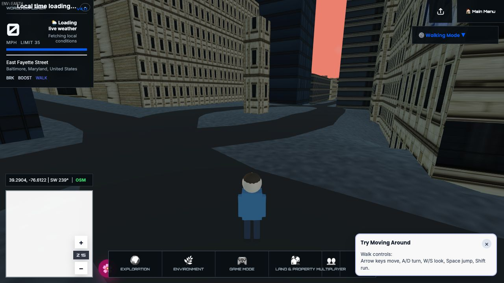

# WorldExplorer3D Production Architecture Audit

**Audit date:** 2026-07-28  
**Decision:** **Not production-ready. Do not deploy the audited state.**  
**Audit baseline:** local snapshot `3823aea9333717ab1ea5032fb4ca929900ab8a81` on `steven/4.1.2-minimap-runtime-hotfix`  
**Audit branch:** `steven/4.1.2-production-architecture-audit`  
**Audit worktree:** `/Users/stevenreid/Developer/WorldExplorer3D-production-architecture-audit`

## Executive assessment

The project repeatedly passes tests while failing visually because its strongest checks prove internal counters and synthetic contracts, not the presentation and gameplay outcomes named by those checks. The clearest examples are in `scripts/test-runtime-invariants.mjs`: “road center driveable” can pass with one sample and no road-center hit; “linear feature navigation ready” requires zero linear-feature meshes; and “accepted ground runtime ready” requires the provider to be blocked because no ground artifacts are configured. Screenshots are generated but not compared or inspected by the suite. A successful run therefore does not mean that a player sees a complete, coherent, traversable world.

The current work contains valuable architectural direction: a runtime kernel, lifecycle scopes, a compiled transport-surface model, explicit source contracts, sub-meter fragment matching, side-only bridge barriers, and a reachable-module audit. These should be retained. They are not yet joined into one authoritative production pipeline. Actual runtime terrain still falls back to asynchronously loaded Terrarium tiles and converts missing samples to zero; Shortbread discards transport semantics required for grade separation; building geometry and metadata cross source boundaries without a reliable shared identity; rendering and physics have overlapping publication paths; and acceptance tests bypass normal player input and lifecycle behavior.

The release-blocking result is not “rewrite everything” and not “restore v3.1.” The minimum honest release candidate is a bounded repair: activate one accepted-ground owner, preserve full transport semantics at ingestion, make one compiler own road/bridge/tunnel height and connectivity, remove pass-on-absence assertions, and prove the result with real input, real locations, inspected screenshots, hardware-eligible performance, and complete tunnel/bridge/mode-transition journeys.

### Finding count

| Severity | Count | Meaning |
|---|---:|---|
| Blocker | 7 | A release can be visually or functionally broken while required checks pass, or the production artifact cannot be trusted |
| High | 14 | Material worldwide correctness, lifecycle, data, control, or performance risk |
| Medium | 10 | Significant maintainability, fidelity, or coverage debt |
| Low | 5 | Cleanup and workflow quality issue |
| **Total** | **36** | |

### Five principal root causes

1. **Acceptance semantics are inverted or too weak.** Tests label missing providers, absent presentation, tiny samples, and synthetic models as readiness.
2. **Source adapters destroy or ambiguously merge authoritative semantics.** Shortbread is intentionally lean; the adapter further reduces bridge, tunnel, layer, lane, placement, access, building, and roof meaning.
3. **Authority is declared but not active.** Accepted ground, compiled transport, navigation, visual meshes, collision, and raw elevation callers do not yet form one enforced ownership chain.
4. **Synthetic and direct-state tests bypass the player path.** Tests overwrite actor state, inject control actions, call updates directly, or simulate thousands of frames without real time.
5. **Release evidence is not artifact-grade.** The trusted v3.1 suffix cannot be resolved locally, performance uses SwiftShader and is marked ineligible, and screenshots are artifacts rather than assertions.

## Verified baseline and repository state

The source repository was inspected at branch `steven/4.1.2-minimap-runtime-hotfix`, checkpoint `1e81910` (`fix travel boundaries and transport continuity`), with nine modified files and one untracked test representing the current post-checkpoint work. No work was reset or discarded. The exact state was captured in the permitted local-only snapshot commit:

`3823aea9333717ab1ea5032fb4ca929900ab8a81` — `chore: snapshot pre-production architecture audit`

The audit worktree and branch were created from that snapshot. Nothing was pushed, deployed, or submitted as a pull request.

The snapshot included work in:

- `app/js/space/runtime.js`
- `app/js/structure-semantics.js`
- `app/js/structure-semantics/stacking.js`
- `app/js/terrain/structure-visuals.js`
- `app/js/world/bridge-guardrails.js`
- `app/js/world/load-roads.js`
- `package.json`
- `scripts/test-transport-surface-contract.mjs`
- `scripts/world-matrix-assertions.mjs`
- `scripts/test-space-flight-controls.mjs` (new)

Inventory results:

- 629 repository files at the audited snapshot.
- Approximately 119,510 lines under `app/js`, `scripts`, and `tests`.
- Reachability audit: 407 reportable JavaScript modules, 12 entrypoints, zero unreachable files.
- Module-version audit: 344 targets passed.
- Maintainability guard: failed because `app/js/physics.js` is 721 lines against a 700-line limit.
- Package version remains `4.1.1`; the audited branch is post-release hotfix work, not an identified reproducible 4.1.2 artifact.

### Historical comparison

| Baseline | Git identity used | Files | Relevant conclusion |
|---|---|---:|---|
| v3.0 | tag `v3.0.0` / `b64ae3e…` | 987 | Useful space-control behavior and simpler presentation baseline; not suitable for wholesale restoration |
| trusted v3.1 | tag commit `0354194baf2feabadcfe5313fd6b722a7c4cdf4f` | 616 | The supplied artifact identity `3.1.0+0354194baf2f.774a91ee84b96fd6.production` names this commit, but `774a91ee84b96fd6` is not a local Git object or repository metadata value |
| released 4.0 | tag `v4.0.0` / `7c7e95e…` | 735 | Added orbital and Earth-loading work, but retained overlapping streaming/publication complexity |
| released 4.1.0 | tag `v4.1.0` / `9b992b3…` | 774 | Current UI direction and explicit runtime ownership should be preserved |
| released 4.1.1 | tag `v4.1.1` / `3abce67…` | 642 | Removed Continuous Earth runtime and introduced production contracts, without completing presentation-grade acceptance |
| current snapshot | `3823aea…` | 644 | Adds important transport/space hotfix work; still fails the production gate described here |

Between v3.1 and the audited state, the selected terrain/world/space/travel area gained 4,475 lines and removed 3,597 lines across 73 files. This is an architectural replacement, not a small regression with one location-specific fix. The smallest reusable historical unit is v3.0/v3.1 space input/camera behavior as a behavioral oracle; old Earth streaming and road code should not be copied wholesale.

## Professional architecture reference

The expected pipeline is:

```text
authoritative source records
  -> lossless normalized features with provenance
  -> local metric frame (documented axes, datum, origin)
  -> accepted-ground provider
  -> transport graph + independent vertical alignment
  -> render/collision/navigation products
  -> one session owner
  -> real-input gameplay and visual acceptance
```

Key primary sources used:

- [OpenStreetMap Simple 3D Buildings](https://wiki.openstreetmap.org/wiki/Simple_3D_buildings) — outlines, parts, height/min-height, roof shape and material semantics.
- [OSM bridge key](https://wiki.openstreetmap.org/wiki/Key:bridge), [layer](https://wiki.openstreetmap.org/wiki/Key:layer), [level](https://wiki.openstreetmap.org/wiki/Level), [incline](https://wiki.openstreetmap.org/wiki/Key:incline), and [building passage](https://wiki.openstreetmap.org/wiki/Tag:tunnel%3Dbuilding_passage) — grade separation, approaches, clearance, and special tunnel distinctions.
- [Overpass API manual](https://dev.overpass-api.de/overpass-doc/en/) and [Overpass QL](https://wiki.openstreetmap.org/wiki/Overpass_API/Overpass_QL) — authoritative OSM element/geometry enrichment behavior and limitations.
- [Shortbread 1.0 schema](https://shortbread-tiles.org/schema/1.0/) — explicitly lean, maximum zoom 14, and not a full representation of OSM; the buildings layer has only a dummy property.
- [Overture Maps documentation](https://docs.overturemaps.org/) and [release calendar](https://docs.overturemaps.org/release-calendar/) — versioned global datasets; the configured `2026-06-17.0` release was current at audit time.
- [MapLibre source specification](https://maplibre.org/maplibre-style-spec/sources/) — raster DEM encoding, bounds, tiling, and source contracts.
- [Cesium local horizontal coordinate system](https://cesium.com/learn/cesium-native/ref-doc/classCesiumGeospatial_1_1LocalHorizontalCoordinateSystem.html) and [origin shifting](https://cesium.com/learn/unity/unity-placing-objects/) — explicit local axes, scale, georeference, and precision management.
- [Three.js WebGLRenderer](https://threejs.org/docs/pages/WebGLRenderer.html) — renderer ownership, `renderer.info`, and disposal.
- [MDN WebGL best practices](https://developer.mozilla.org/en-US/docs/Web/API/WebGL_API/WebGL_best_practices) and [W3C Long Animation Frames](https://www.w3.org/TR/long-animation-frames/) — eager resource deletion, VRAM budgeting, batching, and user-visible long-frame measurement.
- [FHWA roadway geometric design discussion](https://www.fhwa.dot.gov/publications/research/safety/17098/004.cfm), [horizontal curves](https://www.fhwa.dot.gov/publications/research/safety/13078/), and [vertical alignment chapter](https://highways.fhwa.dot.gov/sites/fhwa.dot.gov/files/Chapter_09.pdf) — horizontal alignment, vertical curves, cross-section, grade, and superelevation. A road corridor is not a line draped over every DEM sample.

## Architecture and ownership map

### Current data flow

| Concern | Current inputs | Current owner(s) | Required owner |
|---|---|---|---|
| geospatial frame | WGS84 lat/lon, local equirectangular formula | `config.js`, terrain inverse conversion, source-contract ENU helpers | one metric local-frame service with declared `+X east, +Y up, -Z north`, datum and origin |
| ground | Terrarium tiles plus inactive accepted-ground contracts | `terrain/tiles.js`, `terrain.js`, `accepted-ground-runtime.js`, multiple direct callers | one accepted-ground provider; no numeric result for unavailable data |
| roads | Shortbread streets and synthetic structure semantics | `shortbread-source.js`, `load-roads.js`, transport compiler, terrain rebuild | one lossless transport adapter, one graph, one compiled surface |
| structures | inferred bridge/tunnel flags and layers | `structure-semantics*`, tunnel model, structure visuals, guardrails | structure compiler consuming preserved source semantics |
| buildings | Overture geometry/parts, Shortbread fallback, optional Overpass metadata | three source/adaptation paths plus building passes | one provenance-aware building assembly service |
| water | OSM/Shortbread water, ocean/bathymetry, boat queries | water contract, ocean, boat mode, world passes | one surface ownership registry with coastal priority |
| world publication | load transaction/session plus rebuild/support passes | `load-runtime-session.js`, `load-roads.js`, `terrain/rebuild.js`, `load-support.js` | one atomic world publication transaction |
| controllers | shared action input plus mode-local updates | physics, walking, plane, boat, drone, space | independent controllers behind one transition state machine |
| animation/rendering | kernel RAF plus destination-specific RAF loops | kernel, ocean, space, live globe, UI animations | one lifecycle lease per visible renderer/loop |
| shared state | mutable context service locator | `shared-context.js` and side-effect import order in `app-entry.js` | explicit subsystem interfaces and immutable publication snapshots |

### Duplicate or ambiguous owners

The following overlaps must be resolved before the production gate:

1. Terrain height: raw Terrarium sampling, `ground.js`, surface rules, accepted-ground runtime, transport compiler inputs, and local fallback meshes.
2. Road height: terrain surface profiles, compiled transport samples, structure-aware offsets, bridge landmark/safety code, and actor surface attachment.
3. Road connectivity: source fragments, endpoint tolerance logic, navigation graph, compiled model, and structure stacking.
4. Structure classification: Shortbread-derived flags, `structure-semantics.js`, stacking, tunnel-system model, and visual-specific inference.
5. Water surface: world water-body contract, ocean surface, bathymetry, and boat-mode proximity queries.
6. Building ground/parent assembly: Overture parent suppression, Shortbread fallback extrusion, Overpass metadata merge, and terrain-conforming building passes.
7. World publication: load session, load support, terrain rebuild, road pass, and post-load actor reconciliation.
8. Animation frames: runtime kernel, space, ocean, live globe, sky/UI callbacks.
9. Renderer lifecycle: Earth scene renderer, space renderer, ocean renderer, and globe renderer.
10. Travel boundary: actor controllers, spawn resolution, location configuration, and minimap/world presentation.

### Incompatible or ambiguously merged data

| Merge | Compatibility result |
|---|---|
| Shortbread streets -> OSM-like tags | **Lossy.** Boolean bridge/tunnel and inferred `layer=1/-1` replace actual layer and discard covered, tunnel type, lanes, placement, incline, access, maxheight, destination, junction, cutting/embankment and other needed values. |
| Shortbread buildings -> OSM building model | **Insufficient.** Shortbread supplies geometry with a dummy building property; it cannot supply professional height, parts, facade, material, roof, level, or parent semantics. |
| Shortbread geometry + Overpass metadata | **Ambiguous.** The feeds do not share a guaranteed stable identity; proximity/tag matching can attach metadata to the wrong geometry or duplicate it. |
| Overture buildings + OSM metadata | **Conditionally compatible only with provenance and explicit identity mapping.** The current pipeline treats them as interchangeable more often than the schemas justify. |
| Overture parents + tile-local parts | **Boundary-sensitive.** Parent suppression depends on referenced parts visible in loaded tiles, so partial coverage can suppress or duplicate shells. |
| Terrarium elevation + accepted-ground contract | **Incompatible readiness semantics.** The contract forbids treating missing data as zero, while `terrain/tiles.js` returns zero for unloaded tiles. |
| local equirectangular world + ENU source-contract utilities | **Locally approximable, not one contract.** Axes and scale are documented in different places and all consumers are not forced through the same conversion. |

## Findings

The “history” column records the earliest audited baseline in which the issue or its direct ancestor was observed. A finding marked “current” may be introduced by post-4.1.1 work.

### Blockers

| ID | Finding and user-visible consequence | Root cause / evidence | Files and history | Resolution and missed tests |
|---|---|---|---|---|
| B-01 | The suite can pass when the rendered world is visibly broken. | Runtime launch inspection showed a large floating facade/geometry overhead, repeated/unsupported building forms, overlapping UI, unfinished streetscape, and a blank white minimap without console errors. Screenshot tests only write files. | `scripts/test-runtime-invariants.mjs:916-923`; current and 4.1 lineage. | **Replace** pass/fail semantics with inspected visual baselines and gameplay assertions. Existing screenshot-producing tests miss pixels, occlusion, composition, and UI overlap. |
| B-02 | “Road center driveable” can pass without proving a road hit. | Runtime report had one drive sample, zero center hits and zero lane hits; the check is only `blockedDriveRatePct <= 10`. A missing hit is not blocked. | `scripts/test-runtime-invariants.mjs:926`; 4.1/current. | **Repair** with minimum sample/hit counts, route-complete journeys, collision/mesh/graph agreement, and failures on unknown samples. |
| B-03 | Ground readiness is explicitly a pass-on-absence condition. Terrain can flatten to sea level while tests pass. | `acceptedGroundRuntimeReady` requires status `blocked`, reason `no-ground-artifacts-configured`, and an unavailable sample. Actual tile samplers return numeric zero for unloaded data. | `scripts/test-runtime-invariants.mjs:954-963`; `app/js/terrain/tiles.js:360,397-401`; current architecture. | **Repair** and activate one accepted provider. Unknown must remain unavailable; production must require coverage, datum, provenance and render/collision parity. |
| B-04 | Transport classification cannot reliably represent real bridges, ramps, tunnels or covered roads worldwide. | Shortbread is intentionally lean; `roadTags()` collapses real layer to `1/-1` and drops the semantics needed to distinguish structure types and restrictions. | `app/js/world/shortbread-source.js:84-104`; source pattern in v3.1+, still current. | **Replace** the adapter/input for authoritative transport compilation, or enrich by stable OSM identity before compilation. Synthetic structure tests miss real split ways and tile boundaries. |
| B-05 | Holland Tunnel and comparable structures are not release-proven end to end. | Synthetic tunnel tests pass, but the required spawn, full exit, inside/after mode switches, collision, portal masking and non-trapping journey are not a required gate. Lossy source tags make a false synthetic pass likely. | `scripts/test-tunnel-system-model.mjs`, `scripts/test-world-matrix.mjs`, `structure-semantics*`; 4.1/current. | **Repair** one general tunnel pipeline and require a complete real-input Holland journey plus other tunnel types. No location patch. |
| B-06 | Performance evidence is not eligible to approve a deployment. | Automated browser runs force SwiftShader and mark the result `budgetEligible:false`. The observed sustained diagnostic rendered roughly 111 frames over 70 seconds under contention while sampled speed stayed zero; its reported displacement came from the scripted path. | phase-5 performance/sustained scripts; 4.1/current. | **Replace** release evidence with hardware WebGL runs on macOS and Windows-compatible Chromium, LoAF/frame percentiles, renderer/resource growth, and a real 60+ second input session. |
| B-07 | A live deployment cannot be proven to match its audited source. | The supplied trusted v3.1 identity includes `774a91ee84b96fd6`, which is neither a local Git object nor located in repository deployment metadata. Current code remains package `4.1.1` on hotfix work. | tags, package metadata, release process; v3.1 through current. | **Replace** release process with a reproducible immutable artifact manifest containing commit, dependency lock, content hash and deployment ID; verify before promotion. |

### High

| ID | Finding and consequence | Root cause / evidence | Files and history | Resolution and missed tests |
|---|---|---|---|---|
| H-01 | Roads can float, bridge small terrain features, or develop implausible profiles. | At-grade smoothing uses a maximum ground envelope and grade passes that predominantly raise points; it does not model engineered cut/fill or vertical curves. | `app/js/world/compiler/transport-surface-model.js`; current, replacing earlier drape behavior. | **Repair** compiler with horizontal/vertical alignment, signed cut/fill bounds, parabolic transitions, cross-section and provenance. |
| H-02 | Render, collision and navigation can disagree at bridges/tunnels. | Connection, stacking, compiled samples, structure visuals, raw terrain and actor attachment still have separate decision paths. | compiler, `structure-semantics*`, `load-roads.js`, `physics.js`, tunnel visuals; 4.1/current. | **Repair** one immutable compiled product consumed by all three outputs. |
| H-03 | Building shells/parts can float, duplicate, disappear or receive the wrong facade. | Overture parent suppression is tile-local; Shortbread fallback has no semantic building data; optional Overpass enrichment lacks guaranteed cross-source identity. | `overture-building-source.js:49-81,122-176`, Shortbread/building passes; v3.1/current. | **Replace** merge with provenance-preserving assembly and stable-ID policy; deterministic generic fallback only when metadata is absent. |
| H-04 | Terrain/render/collision datum may diverge worldwide. | Terrarium fallback datum is not promoted through one accepted contract; water, buildings, roads and actor samplers can call different paths. | terrain, ground, surface rules, water and spawn files; v3.0-current. | **Repair** accepted-ground activation and explicitly normalize vertical datum and units. |
| H-05 | Missing elevation silently becomes `0`, creating cliffs, submerged starts and bad transitions. | Both tile-level and lat/lon samplers return zero while data is unloaded. | `app/js/terrain/tiles.js:360,400`; v3/current. | **Repair** with typed availability and deferred publication; never confuse unknown with sea level. |
| H-06 | Complex ramps and stacked interchanges remain source- and tile-boundary fragile. | Fragment tolerance improves sub-meter drift, but semantic layer, placement, endpoint-to-interior connections and incomplete source route policy are insufficient. | `load-roads.js`, stacking, navigation, transport compiler; current hotfix lineage. | **Repair** graph stitching with stable provenance, connection confidence, taper/grade/clearance rules and non-drivable incomplete-route state. |
| H-07 | Tunnel type, portal, masking and clearance behavior is under-specified. | `tunnel=yes`, covered, building passage, layer, underground, culvert and indoor meanings collapse into small synthetic categories. | Shortbread adapter, semantics, tunnel compiler/visuals; 4.1/current. | **Replace** normalized tunnel taxonomy and validate portal/cut/mask/ceiling/collision/camera behavior by type. |
| H-08 | Water can be duplicated or selected incorrectly during mode changes. | Ocean, water-body contract, bathymetry and boat proximity queries have overlapping ownership and elevation inputs. | `ocean.js`, `ocean/bathymetry.js`, `world/water-body-contract.js`, `boat-mode/water-query.js`; v3-current. | **Repair** a single water-surface registry with polygon containment, priority and datum; boat selection must require a valid navigable surface, not proximity alone. |
| H-09 | A world load can publish stale or repeated work after a location/mode change. | Runtime kernel and load transactions help, but terrain rebuild, road/building passes, support work and actor reconciliation still mutate shared context asynchronously. | `load-runtime-session.js`, `load-support.js`, `terrain/rebuild.js`, `load-roads.js`, `shared-context.js`; v4/current. | **Repair** atomic immutable publication with session tokens and disposal ownership. |
| H-10 | Renderer/RAF resources can survive mode transitions. | Earth has lifecycle utilities, while space, ocean, globe and UI maintain additional RAF/renderer paths; space renderer retention is not proven bounded across repeated transitions. | `runtime/kernel.js`, `engine/webgl-lifecycle.js`, `space/runtime.js:470`, `ocean.js:490-579`, live globe; v3-current. | **Repair** renderer leases; assert one active environment renderer/loop and stable counts after repeated transitions. |
| H-11 | Space-control changes are not presently testable in isolation. | `scripts/test-space-flight-controls.mjs` fails importing `space/runtime.js` because top-level vectors require global `THREE`. | `space/runtime.js`, new test; current only. | **Repair** dependency injection and use v3 behavior as an oracle for local axes/quaternion order/camera, including axis crossings. |
| H-12 | Driving tests do not prove forward/reverse steering or real road following. | The travel test replaces `readControlActions`, directly calls `ctx.update`, and mutates actor/controller state. Sustained tests force route state and angle. | `test-travel-control-runtime.mjs`, `test-phase5-sustained-earth.mjs`; 4.1/current. | **Replace** release layer with keyboard/gamepad events and observable pose/camera/route outcomes. Retain direct tests only as lower-layer unit tests. |
| H-13 | Mobile behavior is Chromium emulation only. | Viewports and user agents do not reproduce Mobile Safari/WebKit touch, GPU, memory, browser chrome or gesture handling. | mobile control scripts; 4.1/current. | **Repair** with WebKit automation plus physical iOS/Android smoke testing before release. |
| H-14 | The rendered scene does unnecessary work and has weak depth/LOD evidence. | Camera spans 0.5–12,000 units, fog is fixed, and several large terrain/structure/effect meshes disable frustum culling. Runtime reports around 1.56–1.92M triangles and 153–184 calls in one diagnostic. | `engine/scene-bootstrap.js:444-445`, terrain/structure/road render paths; v3-current. | **Repair** bounds/culling, LOD, material/texture budgets, shadow frustum and reversed/log-depth evaluation if justified; do not reduce horizon. |

### Medium

| ID | Finding | Evidence / scope | Resolution |
|---|---|---|---|
| M-01 | The local world conversion is an informal equirectangular approximation rather than an enforced local metric CRS. | `config.js:24-45`; separate ENU math exists in `terrain/source-contract.js`. | **Replace** duplicate transforms with one local-frame service and regression fixtures for axes/scale/inverse round trips. |
| M-02 | No floating origin exists. | Fixed local center and camera far plane; precision is acceptable for the current district but unsafe for future long-range flight/world expansion. | **Defer to 5.0** unless measured current travel exceeds the precision budget; keep actor limits separate from presentation. |
| M-03 | Terrain mesh quality is fixed rather than error-driven. | z15 tiles and configured fixed segment mesh; no demonstrated screen-space error LOD or seam/morph acceptance. | **Repair** after authority activation with error-based LOD, normals and seam tests across alpine/coastal/polar cases. |
| M-04 | Raw ground callers are widespread and not mechanically restricted. | At least ground, physics, plane, walking, structure, building, spawn, vegetation, furniture, water, terrain and compiler modules sample height. | **Repair** with an allowed consumer API and an audit that fails unauthorized imports/calls. |
| M-05 | Shared mutable context preserves import-order coupling. | `shared-context.js` exports `Object.create(null)`; `app-entry.js` relies on ordered side-effect imports. | **Repair incrementally** behind subsystem interfaces; 5.0 can remove the service locator. |
| M-06 | Visual building rules can override recognizable architecture without source confidence. | Generic roof/facade/material synthesis spans semantic and batching passes. | **Repair** with provenance/confidence and landmark opt-out; never invent mapped attributes. |
| M-07 | Linear-feature “readiness” encodes absence of presentation. | Runtime invariant requires `linearFeatureMeshCount === 0`. | **Delete/replace** this assertion with a product decision and user-visible path/rail/waterway acceptance. |
| M-08 | Real-world matrix coverage is broad in names but shallow in player journeys. | Location loads and internal metrics do not necessarily traverse an interchange, tunnel or bridge end to end. | **Repair** scenarios as typed journeys with input, checkpoints and inspected images/video. |
| M-09 | Software-rendered frame simulation is conflated with sustained gameplay. | Thousands of direct updates are not wall-clock duration; timers, streaming, input and browser scheduling differ. | **Keep** simulation as deterministic soak, add real-time soak as separate release evidence. |
| M-10 | The main physics module already violates its maintainability gate. | `physics.js` is 721 lines, limit 700. | **Repair** only along controller ownership seams; avoid cosmetic splitting. |

### Low

| ID | Finding | Resolution |
|---|---|---|
| L-01 | Cache-bust/module version strings create review noise and can mask stale deployment behavior. | **Replace** manual version chains with build-generated content hashes and immutable assets. |
| L-02 | Package/release naming is stale for the post-4.1.1 state. | Version only at the final release commit; generate artifact manifest from it. |
| L-03 | Some request failures are broadly ignored in runtime tests. | Classify required, optional, privacy/analytics and abort-expected requests explicitly. |
| L-04 | Generated screenshots/reports lack a retention and review policy. | Keep only release evidence with scenario metadata; make inspection/sign-off explicit. |
| L-05 | File-count concerns can distract from ownership defects. | Keep the reachability audit; measure cohesion, coupling, duplicate ownership and public interfaces rather than targeting an arbitrary file count. |

## Raw elevation consumer audit

Direct or semantically equivalent ground sampling occurs in these production areas and must be routed through the accepted provider or a compiled product:

- Core ground/physics: `ground.js`, `physics.js`, `walking/physics.js`, `walking/runtime.js`, `plane-mode.js`, `world.js`.
- Terrain implementation: `terrain.js`, `terrain/tiles.js`, `terrain/height-sampling.js`, `terrain/reprojection.js`, `terrain/structure-*`, `terrain/accepted-ground-runtime.js`.
- Transport and structures: district-ground, tunnel and transport compilers; bridge guardrails/landmark/safety; structure semantics/stacking; `world/structure-aware.js`; surface contracts.
- World dressing: building, landuse, spawn, vegetation, furniture and waterway passes.
- Water: `boat-mode/water-query.js`, `ocean/bathymetry.js`, `world/water-body-contract.js`.
- Tools/features: runtime diagnostics/debug presentation, activity editor, paint projectiles and shared links.

Legitimate consumers are ground publication, compiled transport input, water datum reconciliation, building foundation placement, spawn resolution and actor collision. Illegitimate consumers are any render or controller path that independently decides a height already owned by a compiled surface. The codebase needs an import-level allowlist so this distinction is enforced rather than documented.

## Continuous Earth artifact audit

Continuous Earth must remain deleted. No active runtime module or UI named Continuous Earth is reachable in the audited snapshot. `app/js/world/load-continuous-world.js` and the v3.1 streaming-vector subsystem were deleted in 4.1 phase 3. The only observed current references are negative ownership/denylist assertions in phase-3 tests. Those guards are useful until the next release, after which their naming can be generalized to a prohibited-legacy-owner manifest. Do not restore the v3.1 continuous loader, streaming vector chunks, aerial context, or initial-retirement lifecycle.

## Runtime and visual evidence

### Direct browser inspection

The app was launched through the actual in-app Chromium browser against the audit worktree. The location selector rendered, then launch produced a long main-thread stall before interaction became available. The first Baltimore scene showed:

- a large peach-colored facade or building plane floating above the player;
- repeated and weakly supported building/facade forms;
- overlapping top-left status/UI elements;
- an unfinished-looking streetscape;
- a blank white minimap tile;
- no corresponding console error.



This single image is sufficient to disprove the claim that current green invariant checks imply acceptable presentation. It is not sufficient by itself to diagnose every building/minimap defect, so those remain scoped to their owning phases in the release plan.

### Executed automated evidence

| Test / scenario | Result | Audit interpretation |
|---|---|---|
| reachability audit | pass: 407 reportable, 12 entrypoints, 0 unreachable | Useful repository evidence; not runtime cohesion proof |
| module-version audit | pass: 344 targets | Cache-string consistency only |
| maintainability guard | fail: `physics.js` 721 > 700 | Valid boundary warning |
| terrain source/provider/artifact/builder tests | passed before aggregate stopped | Contract-level evidence only |
| aggregate `npm test` | stopped at ground datum because `pyproj` was absent from the default environment | Environment is not self-contained; rerun with locked toolchain required |
| space-flight controls | fail: `THREE is not defined` on module import | The new control test is not runnable as authored |
| tunnel-system model | pass | Synthetic geometry only; not Holland gameplay |
| transport-surface contract | pass | Synthetic geography/structure matrices; useful lower layer |
| phase-5 production contract | pass | Internal contract, not production acceptance |
| runtime invariants | pass | False-confidence evidence: 1 drive sample, 0 center/lane hits, 0 linear meshes, blocked accepted ground |
| minimap sustained diagnostic | completed | Roughly 1.5M–1.9M triangles, 153–184 calls in sampled states; software WebGL and scripted displacement make it non-eligible for a release budget |
| phase-5 sustained Earth | **failed** | `walking surface gap 0.763 m`; it also uses forced frame updates, so the failure is meaningful but a pass would still not replace gameplay |
| phase-5 software performance | stopped after more than 8 minutes without completing its 1,800-frame SwiftShader sample | This is itself evidence of an impractical/ineligible local gate; no result was treated as a pass |
| travel control runtime | **failed** | Timed out taking its final screenshot; its earlier direct input/state injection also cannot prove player behavior |
| focused world matrix | reported **pass** for alpine, coastal, major bridge, stacked interchange and Holland categories | Visual review contradicts the pass: examples below; scripted structure motion is not a complete player traversal |
| mobile controls | pass: iPhone portrait, Android portrait, iPhone landscape emulations | Chromium emulation does not prove WebKit or a physical device |

The runtime invariant reported 3,526 roads, 26,260 buildings, 3 road meshes, 1,017 building meshes, 274,361 compiled samples, 469,522 road vertices and 420,230 road triangles in its Baltimore case. These counts show substantial data and geometry, not correctness. Its screenshot capture is inside a `try/catch` and has no pixel assertion.

The focused matrix's machine result was `pass:true` with no location failures or fatal console errors. Visual inspection of every primary/drone/landmark screenshot found:

- **Swiss Alps:** the drive camera was engulfed by terrain, no road or building data loaded, and the drone view exposed coarse pale terrain and small dark artifacts. The test still passed.
- **Miami Beach:** the road surface had severe gaps/overlaps and a circular/loop-like mesh artifact; the drone view showed large flat sheets, fragmented roads, and implausible/floating building placement.
- **Golden Gate:** the driving view rendered the deck, but cables/supports crossed awkwardly; the landmark view was bisected by giant opaque blue sheets through the bridge and landscape.
- **Holland Tunnel:** the spawn rendered a crude triangular/low ceiling and the drone view showed most foreground/world area as a flat blue sheet with city fragments beyond it. The scripted test moved for only 8 simulated seconds and did not prove a complete exit or mode switches.
- **Pregerson Interchange:** the drone view exposed a dense planar web of overlapping road ribbons, implausible crossings, sparse/flat surroundings and a floating vertical building fragment. The scripted result nevertheless reported 100% on the expected layer.

Location load times were 2.6 s Swiss Alps, 7.7 s Miami Beach, 7.5 s Golden Gate, 12.9 s Holland Tunnel and 17.3 s Pregerson. The alpine case had 75 loaded terrain tiles but zero roads/buildings. The Holland and Pregerson scripted journeys reported slightly negative minimum structure separation (`-0.171` and `-0.319`), yet the overall matrix still passed. These contradictions directly substantiate B-01, B-05, H-02, H-06, H-08, H-14, M-08 and M-09.

### Scenarios not independently proven

The following release-required outcomes were not independently proven and therefore remain blockers or phase exit conditions:

- a complete player-controlled Holland Tunnel spawn, traversal and exit;
- mode switching inside and after the tunnel;
- end-to-end stacked-interchange and elevated-ramp merges;
- player-controlled bridge approach and exit;
- physical keyboard/gamepad forward and reverse steering correctness;
- a hardware-eligible continuous 60+ second drive with stable frame times;
- meaningful player-controlled walking distance;
- drone and plane travel across a district without camera shake or presentation shrinkage;
- space pitch/yaw across multiple local axes and pole crossings;
- building placement on mountain slopes;
- single-owner coastal water and boat selection;
- Mobile Safari and physical mobile controls;
- Windows GPU/browser behavior;
- deployment artifact equivalence to the supplied v3.1 production suffix.

Absence of proof is recorded as a failed release gate, not converted into a pass.

## Prioritization and production gate

### A. Must fix before the next deployment

- B-01 through B-07 and H-01 through H-14.
- Activate one accepted-ground provider and eliminate numeric-zero missing data.
- Preserve transport semantics and compile one graph/surface used by rendering, collision and navigation.
- Complete real Holland, bridge, ramp/interchange, driving, walking, flight, water and mode-switch journeys.
- Make space controls importable/testable and compare behavior with v3.
- Prove renderer/listener/RAF/resource cleanup through repeated transitions.
- Run hardware-eligible macOS and Windows-compatible performance, WebKit plus device smoke tests.
- Produce and verify an immutable release artifact manifest.

### B. Can follow immediately after deployment

- M-03, M-06, M-10 and visual-fidelity improvements that do not alter ownership.
- Broader material/roof/landmark enrichment after provenance rules are safe.
- Additional worldwide scenario fixtures and calibrated LOD/shadow budgets.

### C. Longer-term 5.0 architecture

- M-02 floating origin if long-range metrics require it.
- Remove `shared-context.js` service-locator coupling in favor of explicit typed subsystem APIs.
- Consolidate environment renderers into a common lifecycle host.
- Move from fixed district projection assumptions to a formal georeferenced local-frame service across Earth, minimap and flight.

### D. Delete

- Any restored Continuous Earth loader/streaming ownership.
- Readiness checks that require an absent mesh or blocked provider.
- Cross-source building metadata guesses without stable identity/provenance.
- Controller acceptance tests that masquerade direct state mutation as player gameplay.
- Terminal barriers across valid transport paths.
- Manual cache-bust release chains once content-hashed builds exist.

### Minimum honest release candidate

A candidate may be called production-ready only when:

1. All seven Blockers are closed with committed evidence.
2. One accepted-ground provider owns every production height and reports no unknown-as-zero sample.
3. One normalized transport record retains real structure/lane/placement/access semantics; one graph and compiled surface feed mesh, collision and navigation.
4. Required real-world journeys complete through normal input and inspected presentation.
5. Repeated mode/location transitions leave one active owner per renderer/RAF/listener/cache and stable resource counts.
6. Hardware-eligible performance meets the budgets in `NEXT_PRODUCTION_RELEASE_PLAN.md`.
7. Mobile WebKit/device and Windows-compatible smoke checks pass.
8. The release artifact is reproducible and cryptographically tied to the promoted Git commit.

Until all eight conditions are met, the correct release status is **not production-ready**.
