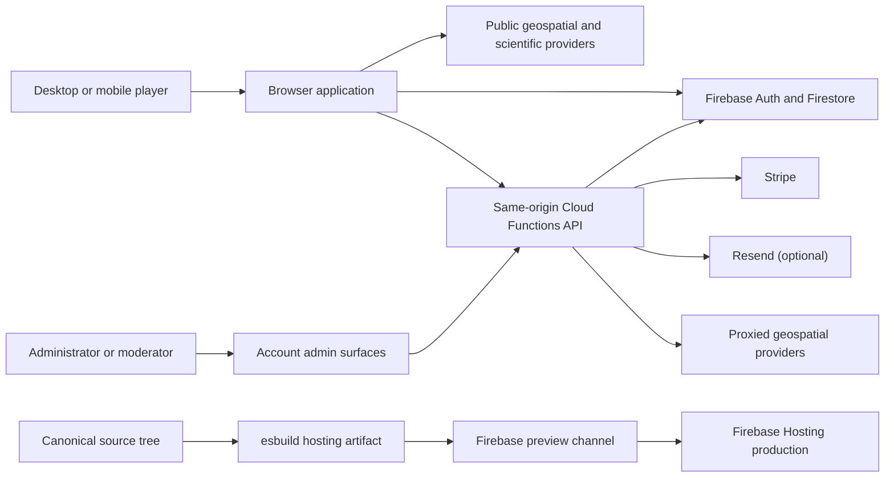
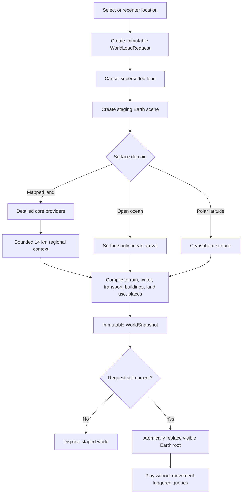

# World Explorer 3D — Complete System Inventory and Reconstruction Guide

Status: **authoritative release-source inventory** for version 4.3.0 as inspected on 2026-08-17.

Source baseline: branch `steven/living-editable-world`, commit `8410cdbf6e00038eefd0d9bb7e652d2abd8dabce`, plus the explicitly inventoried working-tree implementation. The working tree is not a release artifact: it currently contains 56 modified tracked files and 29 untracked paths. Any later commit or deployment must record a new baseline here.

Audience: developers, technical partners, maintainers, and non-developers who need a precise explanation of what the application does and how its parts fit together.

This is the system blueprint for World Explorer 3D. It inventories the user-facing product, browser runtime, world-generation pipeline, movement and gameplay systems, online services, persistence, security model, build and release process, and important design constraints. A developer should use it together with the source code, data licenses, and tests. It is intentionally more detailed than the README.

The document is sufficient to understand the systems that must exist in a compatible reconstruction. Exact geometry algorithms, visual assets, tuning values, provider schemas, and security validation still need to be implemented from source or independently engineered; a prose document cannot substitute for those implementation details.

## 0. Audit baseline and document authority

This inventory was derived from the live source, HTML shells, Firebase configuration and rules, package scripts, workflows, assets, and automated tests. It does not treat older planning documents as proof that a feature exists.

| Baseline fact | Current value |
| --- | --- |
| Product version | 4.3.0 |
| Git baseline | `8410cdbf6e00038eefd0d9bb7e652d2abd8dabce` |
| Tracked files | 955 |
| Browser modules under `app/js` | 506 |
| Automated test files | 138 |
| Script files | 180 |
| Application/account/functions source size | about 145,556 lines |
| Test/tooling source size | about 41,022 lines |
| Primary game shell | `app/index.html` |
| Production hosting root | generated `dist/`, not the source tree |

Status labels used in the capability tables are intentionally strict:

- **Implemented and user-accessible** — a current UI or direct player action reaches working runtime code.
- **Implemented but hidden/internal** — working infrastructure or diagnostics without a normal player entry point.
- **Partial** — meaningful implementation exists, but coverage, integration, evidence, or product completeness is limited.
- **Placeholder/scaffold** — an entry point or contract exists but does not yet provide the full stated experience.
- **Experimental** — intentionally limited, device-dependent, speculative, or R&D-grade behavior.
- **Deprecated/legacy** — retained for compatibility, migration, or history; not the current design authority.
- **Planned only** — described in planning material but not implemented in the inspected runtime.
- **Unknown** — source evidence was insufficient to classify safely.

The canonical document set is:

1. `docs/SYSTEM_INVENTORY.md` — whole-product system and subsystem catalog.
2. `docs/ARCHITECTURE_MAP.md` — runtime ownership, environment, world-load, map, and dependency diagrams.
3. `docs/DATA_AND_PROVENANCE.md` — provider, truth-class, generated-content, asset, and attribution map.
4. `docs/PERSISTENCE_AND_TRUST.md` — browser storage, Firestore, authentication, rules, Cloud Functions, and deletion boundaries.
5. `docs/PRODUCT_CAPABILITIES.md` — player-facing capability and maturity matrix.
6. `docs/TEST_AND_RELEASE_MAP.md` — test ownership, production gates, artifact identity, blockers, and release procedure.

Focused implementation reports such as `docs/EXPLORER_PLATFORM_IMPLEMENTATION_REPORT.md` remain component evidence. They do not replace this whole-system inventory.

## 1. Product definition

World Explorer 3D is a browser-based geospatial exploration game. A player selects a real-world location and the browser constructs one bounded 3D world around that location from public geographic data. The player can then walk, drive, fly, use a drone, boat, enter selected buildings, play location-aware games, build objects, join a multiplayer room, or transition to the Moon, Mars, an underwater environment, the solar system, and deeper space.

The product is not a continuous global MMO, navigation tool, surveying tool, flight simulator, or scientific ocean/astronomy simulator. It is an explorable game whose world is informed by real data.

### 1.1 Public surfaces

| Surface | Purpose | Primary source |
| --- | --- | --- |
| Marketing site | Public product overview and launch path | `index.html`, `assets/landing/` |
| Game | Main WebGL application | `app/index.html`, `app/js/` |
| About | Product and project information | `about/` |
| Account | Authentication, plan, profile, billing, receipts, deletion | `account/` |
| Administration | User, room, content, and operational administration | `account/admin.html` |
| Moderation | Contribution and overlay review | `account/moderation.html` |
| Legal | Privacy and terms | `legal/` |
| GitHub Pages explainer | Repository-oriented public showcase | `github-pages/` |
| Cloud API | Authorized account, room, moderation, payment, and proxy operations | `functions/` |

### 1.2 Capability status terms

- **Local** means the feature can work in the browser without signing in.
- **Provider-dependent** means it relies on a public or third-party data service and may have incomplete coverage, rate limits, or outages.
- **Backend-dependent** means it requires the configured Firebase project and usually authentication.
- **Fallback-backed** means the runtime has a lower-detail, cached, bundled, or generated alternative when its preferred source is unavailable.
- **Reference or modeled** means the visualization is useful game context but is not a direct live observation.

## 2. Non-negotiable architectural invariants

These constraints protect correctness and performance. A compatible implementation should treat them as requirements.

1. **One active environment.** Earth, Space Flight, Moon, Mars, and Ocean are mutually exclusive runtime environments. Hidden environments must not retain an active render loop.
2. **One fixed Earth world per selected location.** Selecting a location starts one bounded load. Ordinary player movement never starts a new world-data query.
3. **No continuous-world streaming.** The detailed core and approximately 14 km regional context are loaded for the selected location. Crossing an intentional GPS boundary offers a deliberate recenter; it does not silently stream the planet.
4. **Cancellable location changes.** A new location cancels the old load. A superseded provider response must never publish into the new world.
5. **Atomic world publication.** A world load produces an immutable `WorldSnapshot`; terrain, hydrology, transport, buildings, land use, and places belong to the same request identity before publication.
6. **Single ownership of a visible surface.** Terrain, mapped hardscape, water, road decks, bridges, ramps, tunnel floors, and tunnel openings have explicit authority. Competing surfaces must not overlap or fight.
7. **Retain Earth across destination excursions.** Returning from Space, Moon, Mars, or Ocean reuses the existing Earth scene when the location identity still matches.
8. **One active gameplay plugin.** Starting a game stops and cleans up the previous gameplay plugin; auxiliary Live GPS may coexist where explicitly supported.
9. **Single primary Earth renderer.** Earth, Moon, and Mars use the main Three.js renderer. Separate Ocean and Space renderers exist only while those environments are active.
10. **Frame work is budgeted.** Input, simulation, world, camera, presentation, and render work run in named phases. Slow UI/provider work must not be placed in movement updates.
11. **Secrets stay on the server.** Payment credentials, privileged moderation, protected account operations, and trusted DeFlock room claims run in Cloud Functions, never in browser code.
12. **Production is an immutable artifact.** The deployed build is content-hashed and identified by a manifest. Preview and production promotion must use the same verified artifact.

## 3. System context



The browser performs most rendering, simulation, local gameplay, and public-data decoding. Firebase supplies identity and shared persistent state. Cloud Functions are the trust boundary for operations that cannot safely be decided by a browser.

## 4. Technology stack and repository inventory

### 4.1 Runtime stack

| Layer | Technology |
| --- | --- |
| Application | HTML, CSS, modern JavaScript ES modules |
| 3D renderer | Three.js 0.128.0 / WebGL |
| Asset loaders | GLTFLoader, DRACOLoader, RGBELoader |
| Optional effects | EffectComposer, SSAO, SMAA, bloom, shader passes |
| Mapping formats | OSM/Overpass JSON, vector tiles/PBF, PMTiles, GeoTIFF-derived artifacts |
| Dynamic libraries | `satellite.js`, `pbf`, `@mapbox/vector-tile`, `pmtiles` |
| Backend client | Firebase Auth, Firestore, Analytics 10.12.5 browser modules |
| Backend | Firebase Hosting, Firestore, Authentication, Node.js 22 Cloud Functions |
| Payments | Stripe |
| Optional email | Resend |
| Production bundling | esbuild with ESM code splitting and content hashes |
| Tests | Node.js contract tests, Playwright browser tests, Firestore emulator rules tests |

Critical Three.js loaders are fetched before application boot. Optional post-processing scripts load after the first playable frame so visual effects do not block entry.

### 4.2 Canonical repository layout

| Path | Responsibility |
| --- | --- |
| `app/` | Canonical game shell, styles, runtime JavaScript, game assets, ground artifacts |
| `app/js/` | Approximately 120,000 lines across more than 460 browser modules |
| `functions/` | Trusted Firebase Cloud Functions and the bundled Baltimore DeFlock fallback |
| `js/` | Shared public/account Firebase initialization and site utilities |
| `scripts/` | Build, diagnostic, test, screenshot, preview, and release tooling |
| `tests/` | Rules and runtime fixtures |
| `assets/` | Public landing and documentation media |
| `config/` | Non-secret Firebase project configurations |
| `.github/workflows/` | CI, secret scanning, full release verification, GitHub Pages deployment |
| `dist/` | Ignored generated hosting output; never edit or commit it |

Largest runtime areas include `world`, `terrain`, `editor`, `multiplayer`, `ui`, `live-earth`, `runtime`, `game`, `boat-mode`, `activity-editor`, `universe`, `planetary`, `sky`, `engine`, `earth-core`, `physics`, `solar-system`, `interiors`, `deflock`, and `live-gps`.

### 4.3 Important entry points

| Entry | Role |
| --- | --- |
| `app/index.html` | Authoritative game DOM and UI shell |
| `app/js/bootstrap.js` | Startup diagnostics, vendor loading, application import |
| `app/js/app-entry.js` | Initializes state, engine, UI, frame loop, and lazy services |
| `app/js/main.js` | Connects runtime systems and render execution |
| `app/js/shared-context.js` | Explicit shared mutable runtime context, `ctx` |
| `app/js/state.js` | Initial actor, world, environment, map, gameplay, sky, and UI state |
| `app/js/env.js` | Environment enum and transition rules |
| `app/js/earth-session.js` | Earth scene retention, reload, resume, and location identity |
| `functions/index.js` | Main trusted API exports |
| `scripts/hosting-artifact.mjs` | Production artifact builder and verifier |

## 5. Browser startup and runtime lifecycle

```mermaid
sequenceDiagram
    participant HTML as app/index.html
    participant Boot as bootstrap.js
    participant Entry as app-entry.js
    participant Engine as Engine/UI
    participant Kernel as Runtime kernel
    participant Lazy as Lazy services
    HTML->>Boot: Load shell modules and bootstrap
    Boot->>Boot: Install error diagnostics
    Boot->>Boot: Load Three.js and critical loaders
    Boot->>Entry: Import versioned application entry
    Entry->>Engine: Initialize state, renderer, inputs, UI
    Entry->>Kernel: Register frame systems and start loop
    Kernel-->>HTML: First playable frame
    Entry->>Lazy: Register services; load only when opened
    Boot->>Boot: Load optional rendering effects after play
```

### 5.1 Shared context

Modules import one explicit `ctx` object and attach APIs or state to it. This is a compatibility bridge between older globally connected systems and newer modules. It makes dependencies visible at import sites while avoiding multiple independent copies of core state.

For a reconstruction, use a typed application context or dependency injection container. Do not create competing global stores for the same actor, scene, location, or world load.

### 5.2 Frame kernel

The runtime kernel executes ordered phases:

1. `input` — normalize keyboard, touch, and gamepad actions.
2. `simulation` — fixed-step actor and gameplay updates.
3. `world` — sky, waves, weather, planetary tracks, availability rules.
4. `camera` — actor-aware presentation camera and collision containment.
5. `presentation` — HUD, map, visibility, activity, and status updates.
6. `render` — the active environment's draw operation.

The default fixed simulation step is 1/60 second. A frame delta is capped at 0.1 seconds and fixed updates are capped at five catch-up steps. Systems have a stable ID, owner, phase, priority, enabled state, criticality, lifecycle cleanup, timing, and error records.

Presentation is deliberately throttled: weather is approximately 1 Hz, HUD about 15 Hz, and minimap/visibility about 5 Hz. This prevents DOM and map work from causing recurring travel hitches.

### 5.3 Resource and transition cleanup

`runtime/lifecycle-scope.js` tracks timers, intervals, animation frames, event listeners, and cleanup callbacks. `session-coordinator.js` gives every environment transition an `AbortController`, lifecycle scope, adapter, and snapshot. Leaving a system must dispose its listeners, animation work, network work, meshes, and UI ownership.

## 6. Location selection and Earth-session lifecycle

Players can begin from:

- preset cities: Baltimore, Hollywood, New York, Miami, Tokyo, Monaco, Nürburgring, Las Vegas, London, Paris, Dubai, San Francisco, Los Angeles, Chicago, and Seattle;
- interactive globe selection;
- text place search;
- custom latitude/longitude;
- browser geolocation;
- a normalized shared link;
- next-city cycling from inside the world.

Place search uses Nominatim. Reverse geocoding uses Nominatim with BigDataCloud as a fallback. Surface verification uses geographic/ocean evidence so open-ocean and polar selections follow the correct arrival policy.

### 6.1 World coordinate system

The selected latitude/longitude is the local world origin. Normal latitudes use a local latitude/longitude scale with longitude corrected by the cosine of latitude. Polar areas use a local east-north-up frame to avoid Web Mercator failure. Current scale is roughly 0.90 world unit per meter.

### 6.2 Earth load state machine



The authoritative snapshot layers are terrain, hydrology, transport, buildings, land use, and places. Each layer declares one authority, completeness (`complete`, `partial`, or `empty`), coverage, source, and stable record identities.

### 6.3 Surface domains

- **Mapped terrestrial:** accepted ground plus transport, land use, vegetation, water, buildings when settlement evidence exists, POIs, and structures.
- **Verified open ocean:** water/surface arrival with boat support; it avoids inappropriate road and building queries.
- **Polar cryosphere:** north sea ice or south ice sheet for absolute latitude 86° and above; walkable and independent of Web Mercator providers.

### 6.4 Bounded world coverage

The exact core uses detailed data. A one-time generalized regional transport and structure ring extends the visible fixed world to about 14 km. The regional request uses lower-detail vector tiles, excludes duplicate core detail, and does not include regional buildings. Far terrain is prepared once and sampled for regional road elevation.

Adaptive budgets change feature counts and LOD thresholds by performance tier and device class. Mobile has stricter budget and LOD caps. Feature selection keeps important nearby content while spreading retained features across the visible area rather than cutting one hard circular edge.

## 7. Earth data and world compilation

### 7.1 Provider fabric

| Domain | Preferred source | Use | Important fallback or constraint |
| --- | --- | --- | --- |
| Roads, buildings, water, land use, POIs | OpenStreetMap via Overpass | Exact playable core | Bounded timeout, cancellation, cached last-good behavior |
| Broad transport/building context | OSM Shortbread vector tiles | Regional continuity and fallback | Lower zoom and strict tile cap |
| Buildings | Overture PMTiles | Bounded building fallback | Used only when primary coverage is inadequate |
| Ground elevation | Accepted USGS 3DEP or Copernicus GLO-30 artifacts | Authoritative physical ground | Mapzen Terrarium is visual fallback, not silently promoted to accepted truth |
| Land cover | ESA WorldCover | Forest, grass, urban, sand, soil, rock, snow semantics | IndexedDB baseline cache and explicit outage handling |
| Bathymetry | GEBCO-derived/open topography and bundled data | Ocean selection and underwater terrain | Resolution varies by region |
| Base map | OpenStreetMap raster | Default 2D map | Provider-dependent |
| Satellite map | ArcGIS imagery | Optional visual map layer | Imagery terms and availability apply |

Provider requests are tied to the active world-load session, have timeouts, record health/freshness/quality, and cannot publish after cancellation. Decoded provider payloads are staging data: after geometry publication, large raw caches are dropped to reduce heap retention.

### 7.2 Terrain

Terrain responsibilities include:

- choose an accepted elevation artifact for the location;
- decode and sample height data;
- build detailed local terrain and fixed far-field context;
- align actor, vehicle, road, building, and water consumers to one ground authority;
- construct polar ice when ordinary tile providers are invalid;
- join tile seams and reproject actors after ground publication;
- render semantic materials for urban ground, grass, forest, sand, soil, rock, and snow;
- allow mapped parks/natural areas, hardscape, road decks, water, and tunnel portals to override base terrain visibly;
- cut or mask terrain around water and tunnel openings.

### 7.3 Roads and general transport

The transport compiler converts mapped ways into a network model with normalized tags, junctions, surface profiles, drive surfaces, markings, and collision authority. It supports streets, service roads, paths, junction envelopes, underpasses, and transitions between at-grade and structured transport.

Road geometry uses adaptive subdivision so elevation changes remain smooth. Publication guards reject or contain unreasonable geometry far from the selected origin.

### 7.4 Bridges, elevated roads, and ramps

Structured transport is not decorative. A compiled bridge/elevated corridor may include:

- the exact playable drive surface;
- deck/body geometry;
- girders;
- columns or piers;
- abutments;
- ramp transition profiles;
- structure-aware collision and camera containment;
- an indexed bridge-road conflict query.

Static regional support geometry is partitioned into bounded, frustum-culled batches. It does not participate in recurring whole-world chase-camera raycasts or dynamic shadow redraws when far away.

### 7.5 Tunnels

Tunnels are compiled corridors with a spline-based floor, walls, crown/shell, lighting, portal zones, camera containment, collision, and terrain portal apertures. Tunnel ownership must suppress outside terrain or sky through the shell and must not regress bridge/road surface continuity.

### 7.6 Buildings and landmarks

Buildings use mapped footprints and tags, height/level interpretation, restrained roof inference, facade materials, batching, spatial indexes, collision volumes, and source identity. Overture may fill bounded coverage gaps. Generated detail must not be represented as surveyed truth.

Selected landmark systems add recognizable authored or catalog-based forms, including the Eiffel Tower, Elizabeth Tower, Giza pyramids, the Golden Gate Bridge, and model-catalog landmarks. Landmark placement still belongs to the selected fixed world.

### 7.7 Hydrology and vegetation

Hydrology distinguishes exact mapped water, waterways, coast/open-ocean surfaces, and regional water. Water owns its visible surface and its navigation candidates. Terrain masking prevents duplicate land through mapped water.

Vegetation combines mapped natural/land-use areas and semantic land-cover evidence with bounded procedural placement. It is representative rather than a tree-by-tree survey.

### 7.8 Places and world semantics

The world includes mapped POIs, historic sites, street furniture, public overlays, activity markers, memory markers, navigation markers, and gameplay markers. POI categories include education, healthcare, emergency services, food, shopping, culture, historic places, parks, parking, fuel, banks, postal services, hotels, recreation, and tourism.

### 7.9 Living World derivation

After one fixed Earth world publishes, a disposable Living World runtime derives a bounded entrance catalog, pedestrian graph, directed traffic graph, façade-depth batches, and procedural ambient populations from that publication. Mapped facts take precedence; inferred entrances, sidewalks, and crossings carry explicit inferred provenance. The traffic graph reuses the accepted transport surface for bridge, ramp, elevated-road, tunnel, and underpass heights.

Pedestrians and vehicles are pooled instanced presentations updated at 10 Hz with distance-based work reduction and quality-tier caps. Ten pedestrian roles and nine traffic families provide bounded variety. Nearby relevant actors can promote into detailed, stable local entities for Talk, Take, vehicle entry and condition reactions while their source instance is hidden. They are simulated game ambience, not observed people or live traffic. The runtime never requests provider data because an actor or the player moved, and it is disposed on world replacement.

The local urban-interaction baseline also derives street lamps, waste baskets,
street names and traffic controls from mapped data or conservative published-road
semantics. Its on-demand five-slot equipment loadout and object impacts are
session-local and explicitly blocked from trusted multiplayer mutation until
backend authority, account ownership and moderation gates exist.

## 8. Rendering, lighting, and visual systems

### 8.1 Rendering ownership

- Earth, Moon, and Mars share the main WebGL renderer, scene lifecycle, and camera infrastructure.
- Space Flight owns a separate scene, camera, renderer, and loop only while active.
- Ocean owns a separate underwater scene, camera, renderer, and loop only while active.
- The environment coordinator prevents simultaneous active loops.

### 8.2 Quality and performance

Quality management adjusts geometry budgets, LOD, pixel ratio, shadows, material complexity, and optional post-processing for device class and measured performance. The dynamic budget has baseline/balanced-style tiers and mobile caps. Post-processing can include SSAO, SMAA, and bloom when supported.

Dense worlds are expected to be memory-heavy because decoded map data becomes many meshes, materials, textures, indexes, and gameplay records. The current New York post-GC target is roughly 644–712 MB with an 850 MB guard. A browser process showing more total memory is not automatically a leak; the decisive checks are whether superseded scenes/provider payloads are released and whether memory stabilizes after collection.

### 8.3 Sky, time, and weather

The astronomical sky supports day, sunset, night, and sunrise; real-time sun and Moon positioning; a bright-star catalog; a Gaia-derived sample; constellations; clouds; and lighting floors that keep gameplay readable at night. Night lighting and weather must not make actors, roads, structures, or objectives unusably dark.

Weather state and presentation are one-writer services. Current conditions are provider-dependent and update independently of the movement simulation.

## 9. Movement and physical interaction

Input is normalized into actions so keyboard, touch, and gamepad controls feed the same movement systems. Travel-mode switching preserves the active actor's world position where the destination mode is valid.

### 9.1 Driving

Driving supports throttle/reverse, steering, braking and handbrake behavior, drift, boost, speed display/limits, road and off-road policies, terrain/transport surface sampling, suspension-like pose adjustment, building/structure collision, tracks, and chase/interior/top camera modes.

### 9.2 Walking

Walking supports forward/back/strafe, run, jump, mouse or key look, surface-conforming vertical placement, building and structure collision, deliberate interior entry, objective discovery, and mobile virtual controls.

### 9.3 Drone

The drone supports forward/back, yaw/turn, camera look, ascent, descent, free aerial exploration, and high overview framing inside the loaded world. It does not expand or stream the world.

### 9.4 Plane

The plane has ground roll, throttle, takeoff, pitch, bank/yaw, lift/stall behavior, landing, building impact handling, altitude limits, propeller animation, chase/cockpit/top cameras, aerobatic roll input, and double-tap barrel rolls. Large frame deltas are subdivided to keep flight stable.

### 9.5 Boat

The surface boat is an Earth travel mode. It is available only where the hydrology system finds a valid navigable water candidate. It models throttle, reverse, steering, braking, lateral slip, hull drag, waves, currents/drift, shoreline clearance, wake/foam, bow effects, camera look, and transfer into the underwater environment. Fishing locks boat movement while active.

### 9.6 Planetary and space vehicles

- Moon and Mars support an astronaut and rover with destination-specific gravity, terrain, tracks, and cameras.
- Space Flight uses a rocket with multi-axis thrust/orientation, braking, destination targeting, and map interaction.

### 9.7 Desktop control summary

| Context | Controls |
| --- | --- |
| Global | `F` walk/drive, `6` drone, `C` camera, `M` map, `N` next city, `B` builder, `R` track, `Shift+R` road debug, `Esc` close/pause, `F4` or backtick debug, `F8` performance |
| Drive/boat | Arrows move/steer, `WASD` look, `Space` brake/handbrake, `Ctrl` boost where applicable, `Shift` off-road permission, `V` look back |
| Walk | Arrows move/turn, `WASD` look/strafe according to view, `Space` jump, `Shift` run, `E` interior entry/exit |
| Drone | Arrows move/turn, `WASD` camera/strafe behavior, `Space` or `R` ascend, `Shift`/`Ctrl` descend |
| Plane | Arrows pitch/bank, `Space` throttle up, `Shift` throttle down, `Ctrl` brake on ground or roll modifier in air, `WASD` camera look; double-tap left/right for a barrel roll |
| Builder | `B` toggle, click place, `Shift+click` remove |
| Map | Click inspect, right-click teleport |

The on-screen controls panel is authoritative for the currently active mode. Mobile uses responsive, mode-adaptive virtual controls rather than requiring a hardware keyboard.

## 10. Maps, navigation, search, and information

### 10.1 Map surfaces

The application includes a minimap and a larger interactive map. It supports OSM raster and optional satellite imagery, zoom/orientation, actor position, inspected items, right-click teleport, and layer visibility.

Map layers may include roads, paths, properties, POIs, historic places, navigation destinations/routes, checkpoints, recorded tracks, activities, police, enterable buildings/interiors, contributions, memories, DeFlock cameras, and shared room content.

### 10.2 Navigation and inspection

Players can select a map item, inspect available metadata, navigate toward it, find nearby enterable buildings, or teleport when the interaction permits it. This routing is a game aid, not turn-by-turn navigation.

### 10.3 Property and historic information

The property subsystem can use Estated, ATTOM, or RentCast when a user supplies a supported API key and enables the feature. It displays listing/property context and map markers but is optional and may be disabled without credentials.

Historic details use Wikidata/Wikipedia context where available. Provider attribution and coverage limitations remain visible.

## 11. Gameplay and missions

Gameplay modes use a plugin registry with `start`, `update`, `stop`, optional save, and leaderboard behavior. Only one registered gameplay plugin owns the main mission at a time. Failures are isolated and recorded instead of breaking the frame loop.

### 11.1 Mode inventory

| Mode | Player goal and mechanics | Dependencies |
| --- | --- | --- |
| Free Explore | Travel and inspect without a timed objective | Local plus world providers |
| Time Trial | Reach a generated destination roughly 400–1,200 m away before time expires | Loaded Earth world |
| Checkpoint Run | Pass through eight road-aligned checkpoints | Loaded road network |
| Paint the Town | Claim building surfaces by touch or paintball, choose colors, score locally or in a room | Local; Firestore for shared play/leaderboards |
| Police Chase | Speed/proximity can trigger pursuit; three impacts result in capture | Loaded Earth world |
| Flower Challenge | Find a marked red flower under a timer | Local; optional Firebase leaderboard |
| DeFlock Hunt | Discover and virtually disable representations of mapped surveillance nodes | OSM/proxy; optional shared room state |
| Live GPS Explore | Move the walker from foreground device position inside one fixed world | Secure-context browser geolocation |
| Fishing | Cast, wait for a bite, fight/reel, and keep a catch log from a stopped boat | Valid Earth water; optional leaderboard |

### 11.2 DeFlock Hunt

DeFlock is fictional game play. It reads public OpenStreetMap nodes tagged `man_made=surveillance` and creates virtual camera objectives. Disabling a camera changes only game state; the application does not access, control, damage, or communicate with physical equipment.

System responsibilities:

- fetch and validate mapped camera nodes;
- retain the exact OSM coordinate and source node identity;
- choose a visual curb-side anchor when an ordinary mapped node would otherwise stand in the road center;
- preserve mapped mount/height metadata;
- represent traffic-signal, bridge, gantry, and wire mounts overhead when data supports it;
- show strong in-world beacons and map markers;
- discover a camera by proximity;
- animate the virtual camera body falling and persist its disabled state;
- score discoveries/disables and expose leaderboards;
- synchronize immutable shared claims through a trusted Cloud Function in multiplayer rooms;
- fall back to bundled last-good Baltimore camera data when live providers fail.

DeFlock is first in Missions and Games and can be started from the title screen or the already-loaded world without replacing that world. See `docs/DEFLOCK_MODE.md` for its focused data and safety contract.

### 11.3 Live GPS Explore

Live GPS is an optional foreground-only companion mode:

- explicit user consent starts `watchPosition`;
- the first valid fix chooses and loads one fixed Earth world;
- later accepted fixes move only the walker horizontally;
- terrain/road/structure collision retains vertical ownership;
- stale fixes, accuracy worse than 100 m, impossible jumps, and noisy movement are filtered;
- smoothing and a dead zone prevent jitter;
- suspicious jumps are quarantined until confirmed;
- 60 recent samples support diagnostics;
- 9 km warns, 10 km offers an explicit recenter, and 11 km pauses movement;
- pause allows manual exploration; resume asks for a fresh fix;
- page hiding stops the watch; Stop removes GPS ownership and listeners;
- Low Power mode reduces rendering cost;
- DeFlock can run at the same time.

Live GPS does not continuously stream data, record a background route, or silently load new worlds while the player walks.

### 11.4 Fishing

Fishing is available from a stopped surface boat. It has casting, wait/bite timing, fight and reel stages, a species/rarity catalog, a bounded local catch history, touch/keyboard UI, and an optional Firebase leaderboard.

### 11.5 Block builder

The builder supports 14 safe architectural pieces (cube, slab, ramp, column, wall, floor, roof, window, door, storefront, glass wall, stairs, fence, and sign), eight colors, a 0.5 m vertical grid, click/touch placement, removal, rotation, collision/surface behavior, a 200-piece cap, local persistence with backup, and Firestore room synchronization. Glass-like pieces use an opaque reflective approximation to avoid transparent-overdraw growth.

### 11.6 Activities

The activity platform contains:

- an activity schema and validator;
- a visual activity editor and creator guide;
- local draft/library storage;
- discovery catalog and map markers;
- activity runtime and completion storage;
- creator profiles;
- multiplayer activity definitions and shared activity state.

### 11.7 World Discovery, field interaction, and progression

World Discovery is a location-contextual Explorer layer over the fixed Earth world. It is not a second world loader and does not make extra provider requests while the player moves. `app/js/discovery/environment-context.js` compiles bounded habitat/context cells from the already-published world; pacing then creates deterministic encounter and activity slots from that context.

The current user-accessible loop is:

1. Open the Field Journal from Explore.
2. Choose a contextual activity or tool.
3. Follow a compact in-world signal or subject presentation.
4. Classify, excavate, photograph, inspect, or otherwise complete the activity.
5. Project the result to the Journal and Field Guide.
6. Add only acquired virtual objects to Collection.
7. Award Explorer specialty/rank progress for new identification or new-region evidence.

Implemented subsystems include the detector/refinement/excavation state machine, held field tools, geology and natural-history specimens, contextual wildlife presentation, field photography, observation evidence, journal filtering, Field Guide identification records, virtual Collection ownership, goals, Explorer rank/specialties, tool entitlement/progression, anonymous IndexedDB profiles, authenticated trusted claims, server-validated trading, telemetry events, and tutorials. The generated encounter is explicitly procedural; a licensed reference image is identification context and is not evidence that a real animal or object occupies the selected coordinate.

The companion catalog contains multiple dogs, cats, birds, and a fox. Each catalog entry owns its size class and world/AR scale. Ground companions follow near the walker; bird companions use a bounded airborne follower behavior. Companion state is separate from real wildlife observation state.

### 11.8 Augmented Reality platform

AR is a lazily loaded presentation service, not a separate game world. It supports three current experience types: owned companion viewing, recorded tabletop specimen viewing, and a habitat-gated virtual waterfowl photo challenge. Eligibility is Earth-only and blocks moving vehicles or fast Live GPS movement.

Capability levels are selected at runtime:

- WebXR immersive AR with local-floor placement and optional hit test/anchors where supported;
- camera overlay with device-local video and screen-relative placement;
- interactive 3D fallback without camera access.

Camera permission is requested only after an explanatory preview. Audio is never requested. Frames are not uploaded or stored by the AR runtime. Exiting stops media tracks, XR animation, the auxiliary renderer, listeners, and presentation objects. Detector sweeps, portal-scale AR, and multiplayer spectator AR are explicitly deferred rather than implied as complete.

### 11.9 Jobs, service activities, and coherence boundary

Delivery, virtual search-and-rescue, urban survey, farm plot, forest survey, camp expedition, drone survey, weather observation, astronomy observation, treasure clue, virtual archaeology, forage, beachcomb, fossil, sonar, and dive activities exist in the contextual activity catalog. A catalog record makes an activity eligible; it does not by itself mean every activity has a unique deep minigame. Current deep interaction is strongest for detector finds, field inspection/photography, fishing, DeFlock, and the established mission plugins. The other catalog activities are **Partial** and use the shared field-session interaction pattern.

## 12. Interiors and editable world content

### 12.1 Interiors

Interior entry is deliberate, normally through `E` near an eligible building. The system uses mapped indoor geometry where available and footprint-aware generated layouts otherwise. It includes an interior planner, scene builder, runtime lifecycle, UI, camera behavior, and return-to-world handling. Generated interiors are plausible game spaces, not claims about a building's actual interior.

### 12.2 World editor and overlays

The editor supports local drafts, base-feature selection, presets, geometry editing, history, validation, help, revision submission, moderation, publication, and rendering of approved overlays.

Overlay records have a feature document, immutable-ish revision history, moderation events, and a separate public published collection. Browser clients cannot directly publish trusted content.

### 12.3 Legacy contribution types

Supported contribution types are place information, artifact marker, building note, interior seed, and photo point. A contribution can target Earth, Moon, or Space and anchor to the world, a building, an interior, or a destination. Submission and moderation occur through trusted functions.

### 12.4 Memories and tracks

Players can create local memory markers such as pins/flowers and record a custom movement track. Memory and builder stores use primary-plus-backup local storage so a corrupt primary record can recover from the backup.

### 12.5 Local and room-scoped alternate worlds

Edit This World composes a fictional modification layer over the immutable fixed-world snapshot. Local worlds are keyed by stable rounded geographic identity and store bounded base-building suppressions, safe semantic objects, revisions, and history with primary/backup recovery. Removing a mapped building is virtual: it suppresses rendering/collision/entrance/navigation participation during the normal compile and never changes OpenStreetMap, Overture, or other source data. Restore-by-source-ID and Restore Base World recover the original generated world.

In multiplayer rooms, the same concept uses `worldModifications` documents and optimistic Firestore transactions. Owners/moderators can suppress or restore base buildings and reset the room world; joined builders can create/update/delete their own allowlisted objects; visitors cannot write. Shared room state takes precedence while joined and late clients converge through the room listener. Moderated public overlays remain separate and are not created by this feature.

## 13. Destination environments

### 13.1 Environment transition graph

The runtime environments are `EARTH`, `SPACE_FLIGHT`, `MOON`, `MARS`, and `OCEAN`. Transitions are explicitly validated. Entering Space or Ocean disables incompatible build/editor ownership. Every destination registers activation, deactivation, snapshot, and disposal behavior.

### 13.2 Moon

The Moon destination centers on the Mare Tranquillitatis/Apollo 11 region. It uses LROC/LOLA-derived local terrain, Moon textures, lower gravity, astronaut and rover traversal, tracks, a star sky, and Earth visible from the lunar surface.

### 13.3 Mars

Mars uses MOLA/Viking-derived terrain and textures, a Mars atmosphere/sky treatment, destination gravity, astronaut/rover traversal, and tracks. Olympus Mons/Tharsis is a featured destination context.

### 13.4 Surface ocean and underwater ocean

Surface boating belongs to Earth. Entering the underwater Ocean environment creates a separate scene with GEBCO-informed bathymetry, underwater materials/lighting, fish schools, a shark encounter, scene assets, and an underwater HUD. It is gameplay-oriented, not a scientific fluid or ecosystem simulation.

### 13.5 Solar system

The solar-system experience includes:

- the Sun, eight planets, and selected moons;
- real/proportional astronomical-unit-derived positions transformed into a playable visual scale;
- 3,000 asteroid-belt points with Kirkwood gaps;
- 3,600 Kuiper-belt points;
- named Ceres, Vesta, Pallas, and Hygiea;
- ISS, Hubble, JWST, Voyager 1, and Voyager 2 references;
- inner/full top-down logarithmic maps;
- object information and Moon/Mars landing controls.

This is a navigable visualization, not an exact-scale mission-planning ephemeris.

### 13.6 Deep space and universe

The universe catalog includes stars, exoplanets, nebulae, stellar regions, galaxies, clusters, and black holes. It supports scaled navigation, catalog information, generated visuals, galaxy entry, asteroid encounters, pulse effects, and black-hole effects. A wormhole route is speculative gameplay and must remain labeled as such.

Ocean and deep-space modules are loaded on demand so they do not inflate Earth startup work.

## 14. Live Earth data experience

Live Earth is an interactive globe/controller for time-sensitive or observed layers:

| Layer | Typical source | Truth class |
| --- | --- | --- |
| Satellites | CelesTrak TLE plus `satellite.js` propagation | Predicted from current orbital elements |
| Earthquakes | USGS feeds | Observed event feed |
| Aircraft | OpenSky and/or ADSB.lol through same-origin proxy | Observed/aggregated, coverage varies |
| Weather | Open-Meteo | Modeled/current conditions |
| Marine state | Open-Meteo marine | Modeled/forecast |
| Water levels/tides | NOAA CO-OPS | Observed/predicted according to station product |
| Street imagery | Panoramax/KartaView through same-origin proxy | Community imagery/reference |
| Events | Local/provider feed where configured | Provider-dependent |

Every layer should expose provider health, freshness, cache state, and a truth label. The marine traffic layer is reference-only; the current app does not claim live observed AIS vessel positions.

## 15. Account, social, multiplayer, and billing

### 15.1 Authentication and account

Firebase Authentication supports email/password and Google sign-in. Account features include profile data, creator profile, plan/trial state, billing receipts, checkout, customer portal, account deletion, and an authorized admin-tester pathway.

Core exploration is free and local-capable. Supporter/pro billing uses Stripe. Plan state influences room-creation limits and account presentation; it must not be trusted solely from browser state.

### 15.2 Multiplayer model

Multiplayer uses bounded Firestore rooms rather than a continuous MMO server:

- 2–32 players, with 8–14 recommended;
- one fixed location/world kind per room;
- private rooms joined by six-character invite code;
- public rooms discovered by city;
- featured rooms curated by administrators;
- owner and moderator roles;
- player presence/ghost avatars;
- chat and chat reporting/state;
- shared blocks, artifacts, activities, Paint Town claims, and DeFlock states;
- friends, recent players, incoming invites, and My Rooms;
- resilient last-good state when a listener temporarily fails.

The renderer still builds each participant's world locally. Firestore synchronizes bounded state; it does not stream scene meshes.

### 15.3 Firestore data model

Principal collections and subcollections:

```text
users/{uid}
  friends/{friendUid}
  recentPlayers/{otherUid}
  incomingInvites/{inviteId}
  myRooms/{roomCode}

creatorProfiles/{uid}
editorSubmissions/{submissionId}
overlayFeatures/{featureId}
  revisions/{revisionId}
  moderation/{eventId}
overlayPublished/{featureId}
siteContent/{entryId}
siteContentPublished/{entryId}
adminActivity/{entryId}

flowerLeaderboard/{entryId}
paintTownLeaderboard/{entryId}
deflockLeaderboard/{entryId}
fishingLeaderboard/{entryId}
activityFeed/{entryId}
explorerLeaderboard/{uid}

rooms/{roomId}
  players/{uid}
  artifacts/{artifactId}
  activities/{activityId}
  activityState/{stateId}
  blocks/{blockId}
  worldModifications/{modificationId}
  paintClaims/{claimId}
  deflockStates/{cameraId}
  state/{stateId}
  chat/{messageId}
  chatState/{uid}
```

### 15.4 Security model

Firestore rules validate authentication, self-ownership, admin claims, room membership, room ownership/moderation, allowed fields, string lengths, numeric bounds, visibility, player limits, create quotas, immutable fields, and append-only leaderboard/activity behavior.

Sensitive collections such as site drafts, administrative activity, overlay publication, and moderation cannot be written directly by ordinary browser clients. Account deletion is a server operation and requires recent authentication.

## 16. Trusted Cloud Functions API

### 16.1 Account and payment

- `createCheckoutSession`
- `createPortalSession`
- `startTrial`
- `enableAdminTester`
- `getAccountOverview`
- `listBillingReceipts`
- `updateAccountProfile`
- `deleteAccount`
- `stripeWebhook`

### 16.2 DeFlock, contributions, and overlays

- `claimDeFlockVirtualDisable`
- `submitContribution`
- `getContributionModerationOverview`
- `listContributionSubmissions`
- `moderateContributionSubmission`
- `saveOverlayFeatureDraft`
- `submitOverlayFeature`
- `deleteOverlayFeatureDraft`
- `moderateOverlayFeature`

### 16.3 Administration and publishing

- `getAdminDashboardOverview`
- `listAdminOverlayFeatures`
- `getAdminOverlayFeatureDetail`
- `listAdminUsers`
- `getAdminUserDetail`
- `listAdminRooms`
- `updateAdminRoomFlags`
- `getAdminSiteContent`
- `saveAdminSiteContentDraft`
- `publishAdminSiteContent`
- `listAdminActivity`
- `getAdminOperationsSnapshot`

### 16.4 Same-origin geospatial proxies

- `getDeFlockCameras` at `/api/geospatial/deflock-cameras`
- `getStreetImagery` at `/api/geospatial/street-imagery`
- `getAircraftStates` at `/api/geospatial/aircraft`

The proxies provide consistent CORS, timeouts, sanitization, caching/fallback policy, and avoid exposing provider-specific behavior directly to every browser module.

### 16.5 Server configuration

Required values are supplied through Firebase parameters/environment values, never committed secrets:

- Stripe secret, webhook secret, supporter price, and pro price;
- admin allowed email and UID sets;
- extra allowed origins;
- optional Resend API key, From address, moderator notification address, and moderation URL.

## 17. Browser persistence and caches

### 17.1 Local storage

The browser stores bounded local preferences or progress for:

- Firebase public project configuration override;
- last location, recent places, and favorite places;
- performance/quality preferences;
- tutorial and activity-creator guide state;
- optional user-supplied real-estate provider keys and enabled state;
- memories and backup;
- block-builder records and backup;
- overlay drafts and backup;
- activity library and backup;
- activity completion state;
- DeFlock progress keyed by location and source version;
- fishing catch history;
- Flower/other local leaderboard views and player name;
- Paint Town color preference.
- editable-world semantic deltas and backup, scoped by fixed geographic identity.

Local data is device/browser-specific and can be removed by clearing site data. Shared or account data belongs in Firestore, not local storage.

### 17.2 IndexedDB

- `worldexplorer3d-map-cache` stores bounded OSM/provider cache records.
- `worldexplorer3d-worldcover-cache` stores WorldCover baseline data.

Cache entries must remain versioned, bounded, recoverable, and subordinate to current provider/session identity.

## 18. UI and accessibility-oriented behavior

The game shell includes title/location selection, loading transition, main HUD, time/weather, speed and service/location readouts, minimap, map, mode menus, controls/help, settings, missions/games, builder, editor, multiplayer, account access, objective HUDs, toast/status messages, and mobile controls.

HUD panels are responsive and mode-aware. Gameplay objectives should remain visible without blocking the actor or primary forward view. Mobile touch targets and safe-area layout are tested at current iPhone/Android dimensions. Keyboard and touch ultimately produce the same normalized actions.

## 19. Observability and diagnostics

The application exposes several levels of evidence:

- startup error and unhandled-rejection capture;
- runtime-kernel system snapshots, timing, and failures;
- `F8` performance panel;
- `F4`/backtick debug information;
- provider health, freshness, cache, quality, and fallback state;
- active build/release identity in the runtime/HUD;
- analytics where configured;
- browser console diagnostics;
- `render_game_to_text`-style state used by browser automation;
- world-load phase totals and publication metrics;
- Live GPS sample diagnostics;
- screenshot and JSON reports from Playwright journeys.

A reconstruction should preserve machine-readable state and provider provenance. Screenshots alone are not sufficient proof of world correctness.

## 20. Build, deployment, and release architecture

### 20.1 Local development

`npm run dev` starts a Node preview server, normally on port 4192. It serves canonical source with local same-origin adapters and a mutable development manifest. It is for development, not the production artifact.

### 20.2 Production artifact

`npm run build:hosting -- --firebase-env <staging|production>`:

1. collects declared public source entries;
2. excludes generated output and development-only paths;
3. bundles the game entry points with esbuild ESM splitting;
4. minifies and content-hashes JavaScript chunks;
5. copies immutable ground data under a release-specific path;
6. injects the selected non-secret Firebase public configuration;
7. rewrites the game HTML to hashed entry points;
8. produces asset and build manifests with hashes and Git/source identity;
9. writes a fresh ignored `dist/` directory.

HTML, JS, and CSS revalidate. Content-hashed media and location data receive long-lived immutable caching.

### 20.3 Candidate promotion

The intended release flow is:

```text
canonical source
  -> automated runtime/release verification
  -> immutable hosting artifact
  -> Firebase preview channel
  -> visual/manual review tied to artifact hash
  -> promote the exact same artifact to production
```

Production must not be rebuilt from a different working tree after preview approval.

### 20.4 Continuous integration

- Pull requests run bounded verification.
- Pushes to `stable` run extended runtime verification.
- Full release verification is manually dispatchable.
- Every push/PR runs Gitleaks secret scanning.
- The public GitHub Pages explainer deploys from `stable`.

The repository may use `main` as the public integration branch and `stable` as the verified/deployment branch. Branch policy should be documented before changing or removing either; current workflows specifically reference `stable`.

## 21. Verification inventory

The test system covers more than unit behavior. Major groups include:

### 21.1 Architecture and lifecycle

- Earth-core boundaries;
- immutable load request, session, location identity, and snapshot;
- world-load cancellation and publication;
- provider cancellation/outage circuits;
- lifecycle-scope cleanup;
- environment session transitions and retained Earth return;
- runtime kernel and platform/gameplay registries;
- movement queries that must remain bounded.

### 21.2 World correctness

- surface domains and source authority;
- accepted ground catalogs/artifacts/datum;
- terrain cancellation, seams, far-field elevation, and WorldCover modes;
- transport compiler, road publication, junctions, bridges, conflicts, ramps, tunnels, and structure journeys;
- building coverage, scheduling, geometry, inference, roofs, and Overture fallback;
- hydrology and water ownership;
- fixed regional context and global world matrix.

### 21.3 Player experience

- drive input, travel controllers, speed scale, sustained travel, and chase performance;
- mobile Chromium and WebKit touch controls;
- plane/interior lifecycle;
- space controls and physics;
- globe selection, geolocation, loading transitions;
- DeFlock model, multiplayer, browser, and live smoke journeys;
- Live GPS model and browser journeys;
- multiplayer emulator integration;
- builder, editor, activities, and account surfaces.

### 21.4 Release safety

- CSS integrity and ES-module URL consistency;
- source/asset reachability;
- secret scan;
- Firestore rules;
- functions exports/dependencies/security audit;
- hosting artifact parity and browser boot;
- immutable candidate identity;
- production-readiness semantics;
- screenshot-based global visual review;
- optional long hardware-real-input drive.

`runtime:verify` is the broad runtime gate. `release:verify` is the larger production gate and prepares visual evidence that still requires human review.

## 22. Data accuracy, attribution, and limitations

### 22.1 Accuracy rules

- Never describe generated buildings, vegetation, interiors, or visual fallbacks as exact surveyed reality.
- Preserve source identity and truth class where the UI displays data.
- Keep observations, predictions, models, and reference layers distinguishable.
- Treat coverage gaps and provider outages as normal operating conditions.
- Do not use World Explorer 3D for navigation, emergency decisions, aviation, marine charting, surveying, or legal property conclusions.

### 22.2 Required attribution

At minimum, public Earth mapping must retain `© OpenStreetMap contributors`. Each additional provider or bundled asset must retain the attribution and license requirements documented in `DATA_SOURCES.md`, `ATTRIBUTION.md`, `ACKNOWLEDGEMENTS.md`, and its source metadata.

### 22.3 Known limitations

- Geographic coverage, freshness, height detail, and semantic tags vary widely.
- Public services can be slow, unavailable, or rate limited.
- Dense cities require substantial browser memory and GPU resources.
- Generated details are approximations.
- Ocean physics and ecosystems are game abstractions.
- Solar-system scale is transformed for playability.
- Aircraft, satellite, weather, street-image, tide, and earthquake freshness depends on providers.
- Marine traffic is not live AIS.
- Physical Live GPS behavior still depends on device hardware, permission, secure context, and field conditions.
- Multiplayer, accounts, moderation, billing, and cloud leaderboards require a correctly configured backend.

## 23. Reconstruction blueprint

A developer recreating the application should implement in this order. Each phase has an observable completion condition.

### Phase 1 — Shell, contracts, and one renderer

Build the public/game HTML shell, responsive UI foundation, one main Three.js renderer, shared context, input action model, lifecycle scopes, frame kernel, diagnostics, and build identity.

Complete when a blank Earth scene starts and stops cleanly on desktop/mobile, frame systems are inspectable, and repeated entry/exit does not add listeners or loops.

### Phase 2 — Fixed Earth selection and atomic loading

Implement location selection, projection, immutable request/session/snapshot objects, cancellation, staged scene ownership, and atomic publication.

Complete when rapidly choosing two cities can never display layers from the first city in the second and movement triggers zero provider loads.

### Phase 3 — Authoritative surfaces

Add ground providers/artifacts, terrain, WorldCover semantics, mapped water, surface sampling, polar/ocean domains, and actor reprojection.

Complete when every actor and later compiler consumes the same published surface authority and provider failure has an explicit fallback/error state.

### Phase 4 — Transport and structures

Compile roads and junctions, then elevated roads, bridges, ramps, underpasses, and tunnels with playable surfaces, collision, portals, and camera containment.

Complete when representative city journeys cross transitions without gaps, falls, duplicate surfaces, outside-visible tunnel shells, or whole-world per-frame raycasts.

### Phase 5 — Buildings and world detail

Add mapped buildings, bounded fallback coverage, roofs/facades, collision/indexes, land use, vegetation, POIs, hydrology detail, landmarks, and interiors.

Complete when dense and sparse cities remain navigable, source/fallback provenance is visible, and cleanup stabilizes memory after a location change.

### Phase 6 — Movement and presentation

Implement walk, car, drone, plane, boat, cameras, HUD, map, weather, sky/time, quality tiers, and mobile controls.

Complete when all modes use normalized input, switching preserves position, dark conditions remain playable, and sustained movement has no periodic query/DOM/geometry hitch.

### Phase 7 — Environment destinations

Add Moon/Mars on the main renderer and lazy Space/Ocean renderers with strict environment ownership and retained Earth return.

Complete when round trips preserve Earth location/pose and only one environment owns rendering, input, UI, and asynchronous work.

### Phase 8 — Gameplay platform

Implement the plugin registry and local modes first, then DeFlock, Live GPS, fishing, builder, activities, memories, and editor drafts.

Complete when starting/stopping every mode restores clean base exploration and no gameplay timer, listener, marker, or mesh leaks into the next mode.

### Phase 9 — Backend and multiplayer

Add Firebase Auth/Firestore, rules, account functions, room state, social features, trusted DeFlock claims, contributions/overlays, admin operations, Stripe, and optional email.

Complete when emulator tests prove unauthorized clients cannot cross user/room/admin boundaries and two-browser journeys preserve consistent bounded room state.

### Phase 10 — Immutable delivery

Add hashed ESM builds, manifests, cache policy, reachability audits, preview channels, CI, visual matrices, and exact-artifact promotion.

Complete when the runtime reports the reviewed artifact identity and production can be promoted without rebuilding.

## 24. Developer acceptance checklist

A replacement is not functionally equivalent unless all of the following are true:

- a player can select presets, search, coordinates, globe, or geolocation;
- the selected Earth world publishes atomically and is never movement-streamed;
- roads, terrain, water, buildings, bridges, ramps, and tunnels agree on surface ownership;
- walk, drive, drone, plane, boat, planetary, and space traversal work with desktop and touch input;
- maps, HUD, search, POIs, navigation aids, weather, sky, settings, and controls remain usable;
- DeFlock and Live GPS preserve their safety, privacy, fixed-world, and provider contracts;
- gameplay modes cleanly start/stop through one registry;
- Earth survives destination round trips without a duplicate renderer or unnecessary reload;
- local data survives ordinary reloads and shared data obeys Firestore rules;
- account, rooms, moderation, payments, and administrative operations use trusted server boundaries;
- public/provider failures degrade explicitly without corrupting the visible world;
- dense cities remain inside defined frame-time, memory, and geometry budgets;
- every deployed asset belongs to one hash-identified artifact with source/license attribution;
- browser journeys and human visual review validate the actual WebGL application, not mocked screenshots.

## 25. Where to start in the source

For a new developer, the recommended reading path is:

1. `README.md`, this document, `DATA_SOURCES.md`, and `KNOWN_ISSUES.md`.
2. `app/index.html`, `app/js/bootstrap.js`, and `app/js/app-entry.js`.
3. `app/js/shared-context.js`, `app/js/state.js`, `app/js/runtime/kernel.js`, and `app/js/runtime/core-frame-systems.js`.
4. `app/js/env.js`, `app/js/session-coordinator.js`, `app/js/earth-session.js`, and `app/js/planetary/scene-ownership.js`.
5. `app/js/earth-core/`, then `app/js/terrain/`, `app/js/world/load-roads.js`, and the transport compiler modules.
6. Movement modules, `app/js/game/modes.js`, `app/js/gameplay/plugin-registry.js`, `app/js/deflock/`, and `app/js/live-gps/`.
7. `app/js/multiplayer/`, `firestore.rules`, `functions/index.js`, `functions/overlay.js`, and `functions/admin-dashboard.js`.
8. `scripts/hosting-artifact.mjs`, verification runners, and release workflows.

This path follows actual runtime ownership: boot, lifecycle, Earth publication, visible world, player systems, shared services, then delivery.

## 26. Whole-system status register

| System | Current status | Evidence/qualification |
| --- | --- | --- |
| Public landing site | Implemented and user-accessible | Current responsive landing shell and current gameplay media; server-published copy is optional. |
| Fixed Earth world | Implemented and user-accessible | Atomic load/session/snapshot pipeline with mapped terrestrial, open-ocean, and polar domains. |
| Terrain and accepted ground | Implemented and user-accessible | Multiple ground authorities and explicit fallback contracts; global precision varies. |
| Roads, bridges, ramps, tunnels | Implemented and user-accessible | Compiler, ownership, collision, camera, regional context, and browser journeys exist; provider coverage still varies. |
| Buildings, landmarks, hydrology, vegetation | Implemented and user-accessible | Mapped plus explicitly inferred/generated presentation. |
| Living World traffic and pedestrians | Implemented and user-accessible | Ten pedestrian and nine traffic families derive from the published world with bounded population/promotion budgets. |
| Urban interaction/equipment | Local implementation / acceptance pending | Contextual actor, vehicle and prop actions work locally; equipment ownership and impacts are not multiplayer-authoritative or production-approved. |
| Walking, driving, drone, plane, boat | Implemented and user-accessible | Normalized control and surface contracts. |
| Moon | Implemented and user-accessible | Apollo 11/Mare Tranquillitatis destination with astronaut/rover traversal. |
| Mars | Implemented and user-accessible | Mars destination with terrain, atmosphere, astronaut/rover traversal. |
| Space flight and solar system | Implemented and user-accessible | Separate lazy renderer, travel/landing, orbital catalog, maps and information. |
| Deep space/universe | Experimental | Navigable catalog and effects; transformed scale and speculative wormhole gameplay. |
| Underwater Ocean | Implemented and user-accessible | Separate lazy scene, submarine, bathymetry, reef/fish/shark/HUD; ecosystem and physics are modeled. |
| Earth surface boating and fishing | Implemented and user-accessible | Water-owned travel and fishing loop. |
| Maps | Implemented and user-accessible | Globe selector, minimap, large Earth map, Live Earth globe, Ocean HUD/sonar, Moon and solar/deep-space maps. |
| Live Earth | Partial | Multiple observed/modeled/reference feeds; provider availability and freshness vary; no live AIS claim. |
| Live GPS Explore | Implemented and user-accessible | Foreground geolocation companion with filtering, bounds, consent and recenter policy. |
| World Discovery | Implemented and user-accessible | Contextual finds, wildlife/geology, tools, Journal, Guide, Collection, progression and companions. |
| AR | Experimental | Working capability ladder and three experience types; device support varies and deferred modes remain explicit. |
| Core mission plugins | Implemented and user-accessible | Free, trial, checkpoint, Paint Town, Police, Flower, DeFlock, Live GPS. |
| Long-tail contextual activities/jobs | Partial | Catalog, eligibility and shared interaction exist; many do not have unique deep mechanics. |
| Interiors | Partial | Mapped/generated layouts and lifecycle exist; not every building is enterable and generated layouts are not factual. |
| Block builder | Implemented and user-accessible | Local and room-shared bounded pieces. |
| Edit This World | Implemented and user-accessible | Local semantic deltas and room-scoped shared modifications; source data remains immutable. |
| Moderated public overlays | Implemented and user-accessible | Draft, submit, review, publish and public rendering paths. |
| Multiplayer/social/chat | Implemented and user-accessible | Firebase-dependent bounded rooms; no continuous MMO server. |
| Account and billing | Implemented and user-accessible | Auth, profile, plans/trials, Stripe checkout/portal/receipts, deletion. |
| Admin operations | Implemented and user-accessible for authorized admins | Consolidated dashboard for overview, moderation, users, rooms, content, analytics, system and activity. |
| Analytics | Partial | Firebase Analytics and product events exist; meaningful reports require configured production data/consent context. |
| Debug/performance diagnostics | Implemented but hidden/internal | Startup/runtime/provider/frame/memory evidence; production UI is gated and debugging does not grant trust. |

## 27. Current issue register

| ID | Severity | State | Finding | Release effect |
| --- | --- | --- | --- | --- |
| INV-001 | Blocking | Closed 2026-08-17 | The 15 unreachable legacy landing/gameplay files and five superseded release-media files were removed from the working source and retained in a recoverable Codex archive. `audit:assets` now passes all 93 reachable assets and 27 dynamic PBR assets. | The strict asset graph is green; restoration requires intentionally adding a current reference rather than weakening the audit. |
| INV-002 | Major | Closed 2026-08-17 | The installed-Chrome World Discovery journey verifies a 0.241 m City Pigeon model at 1.513 m clearance and completes detector, field, companion, AR fallback and mobile assertions. | Contract, browser and visual evidence are green. |
| INV-003 | Major | Accepted 4.3.0 risk | A fresh Chrome title-release journey drops heap from 689.5 MB loaded to 469.8 MB released and removes 1,020 geometries, then reloads without duplicate ownership. The heavier Living/Editable World edit-and-reload journey still records a 2.02 GB heap high-water mark. | The retained-world regression is cleared. Deployment authorization accepts the disclosed high-water risk while target-device optimization continues after release. |
| INV-004 | Moderate | Known limitation | Several contextual activity catalog entries share generic field-session mechanics rather than unique minigames. | Do not market every catalog record as a separate complete game. |
| INV-005 | Moderate | Known limitation | Provider-backed coverage, truth freshness and availability vary globally. | UI and release notes must preserve fallback/provenance wording. |
| INV-006 | Moderate | Historical documentation | Architecture/R&D and preimplementation audits contain intentionally stale gap findings. | The six canonical documents listed in section 0 override those papers for current status. |
| INV-007 | Blocking visual acceptance | Closed 2026-08-17 | Discovery target placement now uses the shared walk/terrain surface sampler and rejects building collisions. The journey collapses the Journal and visibly frames the character with ground and airborne companions; dog, bird and field-subject captures were human-reviewed. | The earlier occlusion and unproven-scale blocker is resolved and guarded in the installed-Chrome journey. |
| INV-008 | Blocking release gate | Closed 2026-08-17 | The production candidate was deployed to Firebase preview channel `v4-3-0-59332cb`; the privileged aircraft endpoint returned five live observations from approved provider `adsb-lol`. | Preview rewrite and external production egress evidence are green. |
| INV-009 | Moderate test infrastructure | Open | The legacy bundled-Chromium `test:fixed-world-travel-browser` and `test:editor-multiplayer` harnesses stalled without a terminal assertion under SwiftShader. Installed-Chrome travel, lifecycle, rules and two-client multiplayer journeys pass. | Do not count the stalled scripts as evidence; bound or migrate them while retaining the installed-Chrome coverage. |
| INV-010 | Blocking release process | Closed 2026-08-17 | The accepted integration was committed, built from a clean tree, identity-verified and deployed to a versioned preview without rebuilding. | The exact final candidate manifest remains the promotion authority. |

## 28. Documentation authority and change rule

When source and prose disagree, the tested current source wins and this document must be corrected. A feature plan is never implementation evidence. A passing model/unit test is not visual evidence. A screenshot is not persistence or security evidence. A deployment is not production-ready merely because it boots.

Any material change to environment ownership, world layers, map surfaces, persistence paths, rules/functions, provider truth, or release gates must update the corresponding canonical document in the same change. Component handoffs and the regression ledger may add history, but they must link back to the canonical owner rather than creating a competing inventory.
