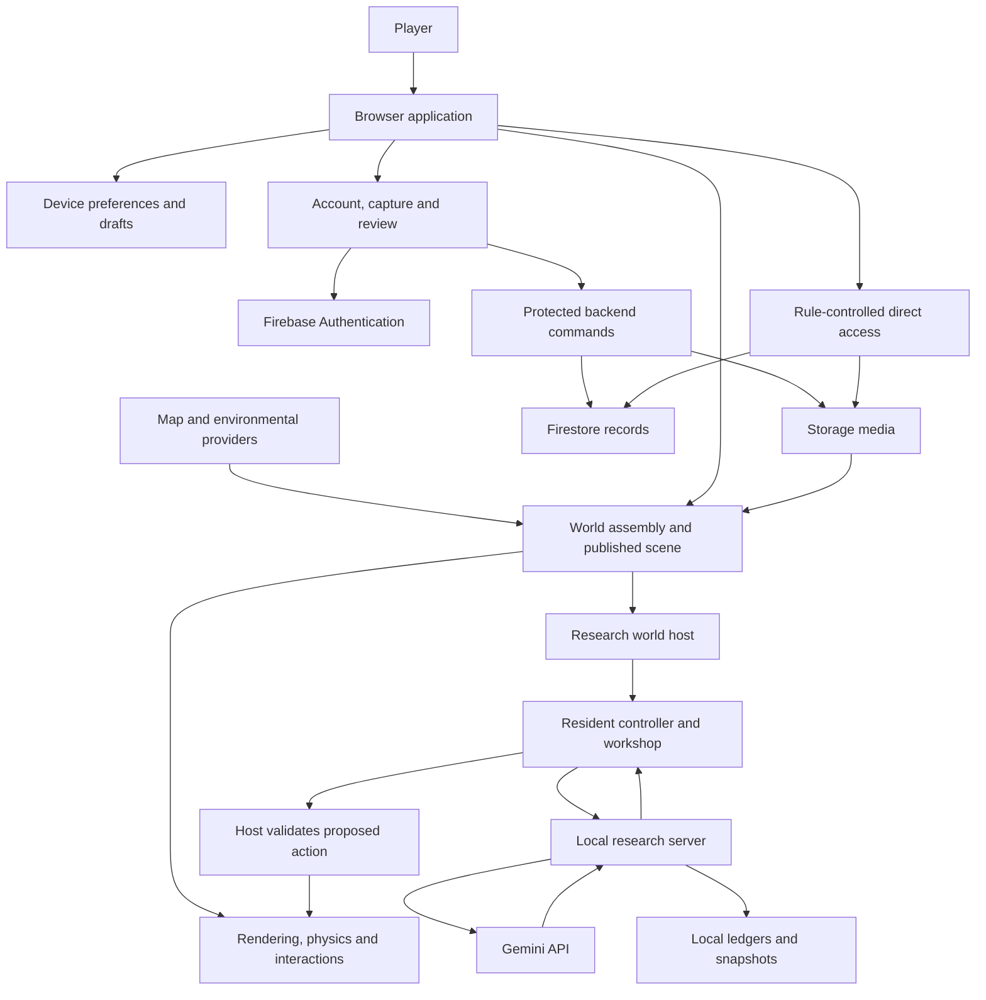

# World Explorer 3D — system, architecture and work report

**Report date:** September 11, 2026
**Source reviewed:** `9eb0bd5a`, branch `steven/research-embodied-society`, product version 5.2.0
**Scope:** Current source, recorded repair evidence and the completed live Gemini pilot. This is not a new production audit or a certification that every advertised feature works.

## 1. What you have today

World Explorer 3D is a browser game that assembles real geographic data into a playable location. Its existing systems cover travel, buildings and interiors, photo contributions, inventory, discovery, virtual property, construction, accounts and multiplayer. It also contains ocean, planetary and space environments. The world is loaded in bounded areas; it is not a continuously simulated full Earth.

The research branch adds **one AI-controlled resident inside the actual mapped world**. Gemini receives a structured description of the resident's situation, chooses an allowed action, and the game validates and applies that action. This is a real model connection, not a prerecorded action sequence.

The latest live run proved that Gemini could choose to gather water and a snack and that both entered the resident's inventory. It also proved the observed Pause, Resume and End behavior. It did **not** yet prove autonomous travel, eating, crafting, building, shelter use, sustained survival, multiple residents or an evolving society.

The main product has received useful reliability repairs, but its professional-release acceptance is still incomplete. The research branch has not been promoted to production. A functioning pilot and a release-ready product are different milestones.

## 2. Work completed

### Main-product repairs and cleanup

| Work | What changed | Evidence and remaining limits |
|---|---|---|
| Interior workflow | Grid room editing/reshaping, openings, saved entrance selection and wall/floor/ceiling photo placement were implemented; floor visibility and entry placement received fixes. | Prior scoped staging/owner acceptance. Not a fresh all-layout, all-device or production check. |
| Contributions and review | Account contribution components and in-world review connect drafts, submissions and approval. | Prior scoped acceptance. The overall account/admin navigation still needs a complete usability review. |
| Disk cleanup | Removed 111 identified generated build copies; retained four recognized candidates and preserved unknown source snapshots. | Recorded recovery of about 17.5 GiB. This was disk cleanup, not proof of a game memory leak. |
| Workstation protection | One task at a time; bounded saved candidates and minimum free-space checks. | Written instructions and tooling. Not an operating-system memory cap. |
| Request reliability | Removed ambiguous automatic write retries; added cancellation/deadlines and honest uncertain-result errors. | Targeted regression tests. Complete per-endpoint reconciliation is still open. |
| Submission deduplication | Owner-scoped request IDs can prevent a repeated generic contribution submission from creating duplicate effects. | Transaction-double tests. Not proof of every write endpoint or real cloud concurrency. |
| Startup recovery | Failed/timed-out script elements are cleaned up; retries have deadlines. | Fake-DOM regression tests. Broad slow-network browser acceptance remains open. |
| Account cleanup failures | Failed cleanup now propagates instead of silently reporting success. | Failure-injection tests. Complete resumable account deletion is still unfinished. |
| Release checks | PR checks include retained contracts; release configuration includes additional capture and Storage-rule gates; CI dependency setup and failure artifacts improved. | Local PR verification passed 333 contracts plus source checks. Clean remote CI execution and required branch protection remain unverified. |
| Deployment default | Functions deployment shortcut explicitly selects staging. | Source inspected. Production deployment still requires separate authorization. |

The detailed repair record is [Release repair program](RELEASE_REPAIR_PROGRAM.md). It takes precedence over unrevised “open defect” wording in the original September 10 audit.

### Embodied research implementation

| Component | What was built |
|---|---|
| Research specification | Archived and indexed the supplied requirements, separated stages, and incorporated survival, tools and construction into the plan. |
| Resident body | A separate actor using existing walking, physics and character systems, with bounded movement commands and isolated controls. |
| Mapped-world host | Attaches the actor to the real loaded Earth scene; validates ground, collision, reach, line of sight and a bounded research area. |
| Needs and inventory | Food/water/rest condition rules, finite supplies, inventory capacity and resource custody using existing game models. |
| Workshop | Gathering, consumption, timed crafting, tool wear, materials held during crafting, storage and construction mechanics. |
| Construction projection | Research constructions use existing Block geometry/collision while remaining separate from the player's saved constructions. |
| Run controller | One resident, one pending model decision, Pause/Resume/End, bounded time/calls, action validation and checkpoints. |
| Model server | Local server with real OpenAI, Groq and Gemini adapters. Gemini is the selected and live-tested provider; the others are not established as live-tested here. |
| Operator controls | Local key setup, connection check, start/pause/end controls, status, needs and last action. |
| Evidence | Persisted model ledger, workshop snapshots and run checkpoints; a compact committed record of the successful Gemini run. |

An early scripted rehearsal was replaced as the launch path after you rejected it. Historical rehearsal evidence is retained as history; it does not count as live AI evidence.

Live testing exposed and fixed an overlay blocking world entry, cleanup failing to restore the human state, and model replies mixing fields from different actions. Gemini now receives a schema defining exactly one action shape. Raw structured actions and validated commands are recorded separately. Google service failures are reported rather than replaced with scripted decisions. There is no automatic paid fallback.

## 3. Whole-system inventory

“Exists” below means implemented source is present. It does not mean each feature passed a fresh end-to-end test.

| Layer or system | Responsibility | Principal source owners |
|---|---|---|
| Public site and entry | Introduction, policies, destination selection and app launch | `index.html`, `app/index.html`, `app/js/app-entry.js`, `app/js/modules/` |
| Runtime and rendering | Scene, frame scheduling, quality, lifecycle and cleanup | `app/js/runtime/`, `engine/`, `shared-context.js` |
| Earth assembly | Terrain, roads, buildings, water, land cover and published world identity | `app/js/world/`, `terrain/`, `earth-core/`, `geospatial/` |
| Environmental information | Weather, sky, places and selected live data layers | `app/js/live-earth/`, `weather/`, `sky/`, `places/` |
| Movement | Walking, cars, aircraft, drones, boats, collision and cameras | `app/js/walking/`, `physics/`, `plane/`, `boat-mode/`, `transport/` |
| Player and resources | Character, condition, Backpack, supplies and Explorer Wallet | `app/js/player/`, `character/`, `economy/`, `urban-sandbox/` |
| Living world | Pedestrians, traffic, reactions and supported local services | `app/js/living-world/`, `urban-sandbox/` |
| Discovery and activities | Journal, Field Guide, companions, geology, fishing and rankings | `app/js/discovery/`, `fishing/`, activity directories, `leaderboards/` |
| Property | Virtual ownership, listings, addresses and Maryland parcel context | `app/js/real-estate/`, `functions/property-authority.js` |
| Interiors and capture | Photos, room plans, surfaces, entrances, revisions and publication | `app/js/interiors/`, `reality-capture/`, backend capture modules |
| Construction | Local and supported room Blocks, placement and collision | `app/js/block-builder/`, `editable-world/`, `creator/` |
| Multiplayer | Rooms, presence, chat, invitations and supported shared objects | `app/js/multiplayer/`, Firestore rules and backend handlers |
| Other environments | Ocean, planets, space travel and expedition state | `app/js/ocean/`, `planetary/`, `space/`, `solar-system/`, `universe/`, `expedition/` |
| Input and accessibility | Keyboard/touch controls, dialogs, guidance and presentation preferences | `app/js/controls/`, `ui/`, `hud/`, `ar/` |
| Account and review | Identity, contribution history, authorized review and moderation | `account/`, `js/auth-ui.js`, `js/admin-dashboard.js` |
| Shared API and services | Authenticated commands, database/media access, billing and analytics | `js/function-api.js`, Firebase modules, `functions/`, security rules |
| Research extension | Resident, perception, action authority, needs, workshop and supervision | `app/js/experiments/embodied-society/` |
| Research server | Private model access, local API, ledgers and snapshots | `scripts/embodied-society/` |
| Delivery and verification | Hosting artifacts, environment selection, tests and CI | `scripts/`, `config/`, `.github/workflows/`, `tests/` |

Current bounded scan: **705 tracked browser `.js`/`.mjs` files excluding vendor code**, including nine research modules; **11 research test files**. Counts measure source size, not quality or independent features. The older [source appendix](SYSTEM_INVENTORY_REFERENCE.md) indexes the September 10 baseline; its 696-module count predates this research addition.

Technology: browser JavaScript modules, Three.js/WebGL, Firebase Authentication, Firestore, Storage and Cloud Functions; Node 22 backend; esbuild tooling; Node tests, Playwright and Firebase emulator checks. Browser CDN dependencies also exist, so the npm dependency list alone is incomplete as a supply-chain inventory.

## 4. Architecture: how the pieces connect

The browser runs the visible world and most active simulation. Firebase supplies account identity and shared data services. Backend commands must check their own permissions; they cannot assume client database rules protect administrative writes.

The world assembly pipeline converts provider data into geometry and semantics consumed by rendering, collision and interaction. Those consumers must agree about coordinates, building identity and entrances. Many past visible bugs arise where individually plausible subsystems disagree at these boundaries.

The research server is an additional local component. It serves a research version of the existing app, disables Firebase account/analytics initialization in that served version, and keeps the provider key on the server. It does not replace the normal app's source configuration or create a production AI service.

### Building editing to visible publication

Select mapped building → create/edit draft → upload media and save revision → submit → authorized review → publish approved representation → refresh world → enter through saved entrance.

Each arrow is an integration contract. A saved draft is not approval; an approved exterior does not automatically publish an interior. A passing editor test cannot prove the complete chain. The professional release test must follow the same building and revision through every step, including permission and failure cases.

### A resident decision

1. The host observes the resident's actual position, nearby permitted resources, inventory, needs and recent outcomes.
2. The controller saves a checkpoint and asks the local server for a decision.
3. The server checks the call allowance and spacing, records the request and contacts Gemini.
4. Gemini returns one structured action. It does not receive raw shell or unrestricted game access.
5. The adapter validates the format; the host checks the action against actual world state and authority.
6. An accepted action changes the body or workshop. Its result becomes evidence and part of the next observation. Ordinary rejected actions can become feedback; malformed/provider failures stop or fail the run as specified.

This is genuine model-driven action selection within a designed game. The model currently receives structured observations, not continuous visual perception through a human-like camera. Its recent memory is bounded to 20 outcomes; this is not a durable lifetime memory system.

## 5. State, persistence and authority

| State | Where it lives | Meaning and limit |
|---|---|---|
| Active world and physics | Browser memory | Lost/rebuilt when the scene closes; not the authoritative account save. |
| Device preferences and capture drafts | localStorage / IndexedDB | Local recovery, not automatically cross-device or backed up. |
| Login identity | Firebase Auth | Identity deletion alone is not complete data deletion. |
| Shared product records | Firestore | Structured account, room, property and contribution data; access rules and backend checks matter. |
| Photos and derivatives | Cloud Storage | Separate from capture metadata and approval state. |
| Research body, inventory, needs and jobs | Isolated browser research state with local snapshots | Separate from normal player progress and production services. |
| Provider calls and run checkpoints | `output/embodied-society-live/<runId>/` | Bounded persisted evidence; not a full append-only scientific archive. |
| Provider credential | Local server memory in the tested setup | Not committed or placed in client game configuration; stopping the server discards it. |

Research snapshots use atomic file replacement and restrictive permissions. Nevertheless, loading a stopped run back into a working resident is **not implemented**. A checkpoint file is not the same thing as tested restart recovery. Complete external world inputs are also not archived: locking the active world's identity prevents changes during a run but does not establish reproducible world replay.

The authority layer derives reach and permissions from the host rather than trusting claims in a model command. However, this is a single-operator local experiment. A Git branch and a loopback server are not an operating-system security sandbox. Autonomous software editing, arbitrary tool use and public access require additional isolation.

## 6. What was actually verified

| Evidence | Recorded result | What it proves |
|---|---|---|
| Repair PR checks | 333 retained contracts plus source/import checks passed in earlier work | Those specific checks passed at their recorded source checkpoint. Not rerun for this report. |
| Latest research suite | 59 passed, zero failed/skipped/cancelled, across 11 files | Tested logic and mocked integrations: materials, needs, body/host boundaries, snapshots, controller, model schemas and local API behavior. |
| Real mapped-world load | Baltimore became ready at about 83 seconds in the recorded bounded check | That location loaded on this machine in that run. Not a loading-time guarantee or worldwide benchmark. |
| Real Gemini run | Three completed provider responses: one connection probe plus two resident decisions | Actual provider communication and two applied gathering decisions in the real mapped world. |
| Pause/Resume/End | Paused clock remained at 23 simulated seconds during observation; resumed; ended without final error; human restored visually | Those lifecycle controls worked in this run. |
| Production/device/operations | No new verification for this report | No new release, cloud-security, mobile or operational certification. |

**Successful live run:** `free-1789158460096-09fbef`, Gemini `gemini-3.1-flash-lite`.

- Gathered one `trail-water` at tick 0.
- Gathered one `route-snack` at tick 36.
- Ended at 3,892 frames, approximately 64.9 simulated seconds.
- No autonomous movement, consumption, crafting or building was tested in that run.
- The connection probe consumed a provider call but applied no world action.
- Browser/server were closed after testing. No billing change was made.

See the [committed live evidence](../research/embodied-society/evidence/gemini-live-2026-09-11.json). Failed provider attempts remain part of the history, including Google 503 responses and earlier schema rejection. They were not relabeled as successes. The 59 research tests and 333 earlier application tests are different executions; do not present their sum as a current whole-product pass.

## 7. Current operating limits

The free pilot defaults to 20 total provider calls, at least 60 seconds between requests, and 2,048 maximum output tokens per request. Connection checks share that allowance. The controller is bounded to at most 900 simulated seconds. These are prototype limits, not a promise of continuous operation.

The research area is currently a 40-metre region with declared finite starter supplies and approved building cells. Materials and recipes are designed affordances: fiber, cord, branches, stone, an axe, timber, planks, workstations, storage and construction kits. These let us test useful tool chains; they do not establish that the agent can invent arbitrary technology.

Actual shelter recognition is not wired into the mapped host, and transfer consent is disabled there. A visually placed roof is not yet proof that rest or weather protection works. While waiting for a model response, the serialized simulation waits too; wall-clock time and simulated time are different measurements.

The observed Google project was on the Free tier. The local `$0` configuration is not a Google billing enforcement mechanism, and free service availability is not guaranteed. Keys are not retained by the tested setup, so a new server session requires private setup again. See [Free-start instructions](EMBODIED_AI_FREE_START.md).

## 8. What is still wrong or incomplete

| Priority | Gap | Why it matters | Completion evidence needed |
|---|---|---|---|
| High | Full release gates are not yet demonstrated on clean CI with required-check enforcement. | Green local checks can still miss broken user journeys. | Fresh remote pipeline, enforced checks and useful artifacts on failure. |
| High | Account deletion and multiplayer admission/privacy remain incomplete. | Users could receive incomplete deletion or inconsistent room access/capacity behavior. | Durable deletion jobs; minimal prejoin data; atomic admission; negative and concurrency tests. |
| High | End-to-end building publication and account/admin usability remain open. | Separate working screens can still create a confusing or broken product. | One signed-in edit-to-published-interior journey, failure cases and a coherent return path. |
| High for research | Survival/construction has not been exercised by live AI. | Gathering twice does not prove the intended experiment. | Real movement, consumption, tool production, material use, placement and useful constructed objects. |
| High for research | Shelter, durable recovery and reproducibility are incomplete. | Residents cannot yet have a credible continuous life or reliably repeatable experimental conditions. | Verified shelter effects, restart recovery, archived inputs and traceable run versions. |
| Medium | Shared mutable context and large controllers create hidden dependencies. | Small changes can break unrelated features or transitions. | Incremental explicit interfaces and regression coverage at each boundary. |
| Medium | Documentation carries old status labels beside newer evidence. | Readers can mistake historical failures for current defects, or plans for finished features. | One current status summary linked to dated evidence; historical material clearly labeled. |
| Before public use | Operations and target-device checks remain unverified. | Backups, permissions, alerts, costs, accessibility and long-session performance cannot be inferred from source. | Cloud inventory, restore exercise, device/network tests and measured resource behavior. |

The research machine ledger was reconciled during research publication preparation: its summary now identifies verified live gathering and incomplete survival. Historical verification entries remain dated. See the research data inventory for scoped call counts; no lifetime account-wide spend is asserted.

These are familiar problems in accumulated AI-assisted development: local tests mistaken for integration, source presence mistaken for completion, guards implemented only in the client, duplicate state ownership, and documentation that advances faster than evidence. They are reasons for disciplined repair, not a reason to discard the working app and rewrite everything.

## 9. Professional next steps

1. **Finish a single-resident survival acceptance run.** Prove movement to a resource, gathering, consumption and visible need recovery. Then prove the axe/material/workstation/build chain with real Gemini decisions. Record both failures and successful effects; do not script the sequence and call it autonomy.
2. **Make constructions useful.** Wire actual shelter/rest validation and test reachable storage/workstations, collisions and permissions. Success means the object changes the resident's capabilities, not merely that a mesh appeared.
3. **Make runs recoverable and scientifically traceable.** Support restart, versioned observation/action contracts, complete input manifests, preserved event history and independent outcome measurements. Clearly disclose recipes, starter resources and other information supplied to the model.
4. **Only then expand population.** Add isolated durable memories and communication before two residents, then bounded four/eight-resident trials. Test transfers, cooperation and resource contention without assigning a predetermined social story.
5. **Keep maintainer tools and spectators behind separate gates.** Software experimentation needs real OS isolation and an independent evaluator. Public observation should consume an exported view or visitor fork that cannot silently change the research world.
6. **Complete the main-product release repair program independently.** Account/security, connected publication, coherent navigation, remote CI, device testing and operations remain required before professional production release.

For each step, define the behavior to prove, the failure cases, the source/run identity and the saved evidence before running it. On this 8 GiB Mac, keep one bounded task active and move the heavy release matrix to a suitable CI machine. This report required only source/evidence reads and small documentation writes; no world, emulator, build, provider request or deployment was launched.

## 10. Supporting records

- [Base product description](PROJECT_DESCRIPTION.md), [system inventory](SYSTEM_INVENTORY.md), [architecture map](ARCHITECTURE_MAP.md) and [source appendix](SYSTEM_INVENTORY_REFERENCE.md): detailed September 10 product baseline.
- [Release repair program](RELEASE_REPAIR_PROGRAM.md): completed first repair batch and remaining release criteria.
- [Original audit](audits/2026-09-10/README.md) and [test evidence](audits/2026-09-10/tests-and-evidence.md): historical findings, including interrupted checks and cleanup.
- [Research plan](EMBODIED_AGENT_SOCIETY_EXPERIMENT.md): staged research vision and subsequent implementation updates.
- [Research implementation ledger](../research/embodied-society/implementation-status.json): component/evidence history, with the stale summary fields noted above.
- [Live Gemini evidence](../research/embodied-society/evidence/gemini-live-2026-09-11.json): compact record of the demonstrated result.
