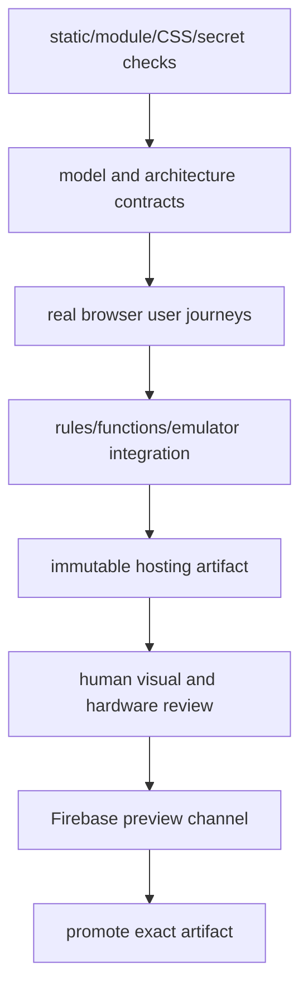

# World Explorer 3D — Test and Release Map

Status: authoritative verification/release inventory for version 4.3.0 release source inspected 2026-08-17.

## 1. Current release verdict

**Local development line; not approved for production promotion.** Production remains on the verified 4.2.1 rollback. The current 4.3.0 urban-sandbox branch has focused installed-Chrome and emulator evidence, but its new authority functions are not deployed and user/device acceptance remains open.

The earlier 2.02 GB editable-world high-water path is resolved on the local memory-remediation branch by targeted edits and authoritative terrain release. Production remains on 4.2.1; target-device acceptance is still required before a replacement release.

No Git commit, push, preview deployment or production promotion is part of this inventory work.

## 2. Verification layers



No layer substitutes for the next. A source test cannot prove the hashed artifact. A screenshot cannot prove rules. A headless state assertion cannot prove visible bridges or correct animal scale.

## 3. Test inventory baseline

The repository currently contains 138 automated test files and 180 top-level script files. `package.json` exposes focused commands plus composite gates.

### Static and source integrity

| Command/family | Responsibility |
| --- | --- |
| `test:css` | stylesheet syntax/integrity and shell references |
| `test:module-versions` | versioned ES-module URL consistency across current module graph |
| `test:maintainability` | module size/structure guard and advisories |
| `audit:reachability` | strict hosting source reachability |
| `audit:assets` | strict public asset reachability and size ownership |
| secret scan workflow | Gitleaks on pushes, PRs and manual dispatch |

### Runtime architecture and lifecycle

| Suite family | Principal evidence |
| --- | --- |
| Earth core boundaries | module ownership and forbidden coupling |
| world-load request/location/session/coordinator/snapshot | immutable identity, states, cancellation, atomic publication |
| provider cancellation/outage | timeout, abort and circuit behavior |
| runtime kernel | phase order, fixed-step, failures and system snapshot |
| lifecycle scope/session lifecycle | timers/listeners/RAF cleanup and destination transitions |
| platform services/gameplay registry | lazy service and one-active-plugin contracts |
| movement query bounds/startup workload | no movement provider streaming and bounded first-play work |

### Earth data and visible world

| Suite family | Principal evidence |
| --- | --- |
| ground provider/artifact/datum/catalog/runtime | accepted-ground source, manifest and consumer authority |
| terrain/WorldCover/far-field | cancellation, seams, source contract, fixed horizon and outage mode |
| district/transport compiler | normalization, networks, surfaces and junctions |
| bridges/ramps/tunnels | structure model, conflicts, ownership, portal and journey evidence |
| building/hydrology/landmarks | provenance, geometry, scheduling, coverage, water ownership |
| regional structures/global matrix | visible continuity across representative cities |
| installed-browser structure journeys | actual bridge/tunnel/landmark visibility and traversal |

### Player movement and UI

| Suite family | Principal evidence |
| --- | --- |
| drive input/speed/travel controllers | normalized control and physical scale |
| fixed-world travel/sustained diagnostics | no provider reload and hitch/memory evidence |
| mobile controls | touch behavior in Chromium and WebKit dimensions |
| plane/interior lifecycle | entry/exit ownership |
| globe/geolocation/loading | title selection and transition UI |
| title planetary | Moon/Mars/Space launch actions |
| space controls/physics/visuals | spacecraft control and catalog presentation |
| Ocean global bathymetry | underwater terrain source/fallback |

### Gameplay, Discovery and AR

| Command | Evidence |
| --- | --- |
| `test:gameplay-plugins` | registration/start/update/stop isolation |
| DeFlock model/multiplayer/browser/live smoke | mapped/fallback objectives, trusted room claims and visible journey |
| Live GPS model/browser | filtering, consent, fixed-world boundary and UI |
| builder/editor/activity/multiplayer suites | content ownership, rooms and synchronization |
| `test:world-discovery` | catalog, pacing, detector, context, persistence/progression contracts |
| `test:discovery-visuals` | model/mesh/triangle/material and scale budgets |
| `test:discovery-backend` | trusted claims/trading function behavior |
| `test:world-discovery-browser` | detector-to-Collection, field observation, companion, AR fallback and mobile journey |
| `test:ar-platform` | capabilities, eligibility, privacy and lifecycle contracts |

### Account, backend and trust

| Command/family | Evidence |
| --- | --- |
| `test:rules` / Firestore security tests | unauthorized, self, room role, admin and collection constraints |
| `test:functions-runtime` | Node.js 22 function exports/runtime contracts |
| `test:operational-endpoints` | privileged endpoint behavior |
| account service/admin/onboarding/browser | account/admin structure and user journey |
| multiplayer integration | emulator-backed multi-client state |
| local-data safety | primary/backup and malformed-data handling |

### Build and deployment

| Command | Purpose |
| --- | --- |
| `build:hosting` | create content-hashed `dist/` for a selected Firebase public config |
| `verify:hosting` | verify hashes, manifests, HTML rewriting and artifact contents |
| `test:hosting-browser` | boot generated artifact in browser |
| `test:local-candidate` | candidate identity contract |
| `test:production-readiness` | semantic production configuration checks |
| `test:production-gate` | release evidence/gate orchestration |
| `test:release-evidence` | tie evidence to candidate identity |
| `test:release-candidate` | candidate checks |
| `runtime:verify` | broad runtime gate |
| `release:verify` | largest production verification and visual evidence preparation |

## 4. Verification performed for the current recent implementation

The following results were observed in the current working source before this report was finalized. Browser entries exercised the rendered application rather than syntax-only substitutes:

| Check | Result |
| --- | --- |
| World Discovery contract | pass |
| Discovery visual/model budgets | pass |
| AR platform contract | pass |
| Discovery backend contract | pass |
| Functions runtime on Node.js 22 | pass; expected exports present |
| Account/admin/onboarding contract | pass |
| CSS integrity | pass |
| module-version consistency | pass across 488 checked targets at run time |
| maintainability guard | pass with nonblocking advisories |
| production-readiness semantic contract | pass |
| `git diff --check` | pass before canonical documentation additions |
| reachability and strict asset audits | pass; 550/550 reportable files, 94 reachable assets and 27 dynamic PBR assets; no orphans |
| Firestore rules | pass, 70/70 emulator assertions including accounts, admin claims, rooms, chat, edits, Discovery inventory and trades |
| multiplayer integration | pass, two independent authenticated browser sessions and 8/8 room/presence/movement/chat/edit assertions |
| installed-Chrome account/admin journey | pass signed-out, user, admin gate, diagnostics-off, responsive and tutorial states |
| installed-Chrome Discovery journey | pass; detector/excavation, field observation, Guide/Progress, dog, bird, AR and mobile; City Pigeon 0.241 m high at 1.513 m clearance |
| human inspection of Discovery screenshots | pass; field subject and companions are unobstructed, fully framed and shown with the play panel collapsed |
| Baltimore/San Francisco/Monaco engineered transport | pass visible JFX, Bay Bridge, Fort McHenry and Yerba Buena tunnel structures plus 113 Monaco tunnels and 486 portal instances |
| planetary/ocean/session lifecycle | pass Moon/Earth/Mars/Space transitions, GEBCO bathymetry and 10 Space + 10 Ocean ownership cycles |
| title memory release | pass locally; 533.7 MB loaded to 153.8 MB released, zero terrain/far/accepted-ground/elevation ownership, reload at 568.3 MB |
| heavy Living/Editable World journey | pass locally; 112 entrances, moving population, persisted suppression/restore, no full reload, 729.0 MB to 728.2 MB post-GC edit envelope |
| urban vehicle/equipment/responder journey | local installed-Chrome gate; exact vehicle enter/drive/exit, nine-family promotion contract, NPC talk/take/impact, semantic prop impact, civic witnesses, location-aware responder dispatch/search/contact/return, collapsed desktop/touch inventory and responsive UI; production/user acceptance remains open |
| urban room authority | pass locally: pure concurrent transaction contract plus two independent Auth clients against Firestore/Functions emulators; single vehicle owner, owner-only plausible motion, release/reclaim, shared server-computed condition and direct-write denial |
| rapid cross-location replacement | pass locally in installed Chrome; superseded Baltimore work aborted, Monaco alone published, provider ledgers returned to zero, terrain concurrency bounded at 12, no duplicate URLs or console errors |
| 2026-08-18 blocker repair | pass locally: Baltimore/New York curated dimensions join generalized footprints (21/41 mapped high-rises); Monaco/Miami/Tokyo mapped-density outage fallback; Everglades accepted-ground flat-datum horizon; Tahoe/Panama explicit boat arrival and Holland Tunnel explicit land arrival; immutable vegetation publication; exterior camera/companion framing |
| full worldwide visual evidence | one 40-location installed-Chrome run completed; its three findings were repaired and passed focused rendered reruns; all 40 generated frames were inspected and approved in a SHA-256-bound manifest |
| production artifact | 4.3.0 clean-source production candidate build, identity verification and bundled browser boot pass; exact final identity is recorded in `dist/build-manifest.json` |
| legacy bundled-Chromium matrices | inconclusive: fixed-world travel and editor-multiplayer harnesses stalled without a failing assertion; equivalent installed-Chrome focused journeys pass |
| deployed preview | pass at Firebase channel `v4-3-0-59332cb`; production-configured globe/title shell visually inspected with zero captured errors |
| operational endpoints | pass against the deployed preview; approved `adsb-lol` provider returned five observations |

These are focused results, not a substitute for `release:verify` on the final candidate.

The final repair source is deliberately not release-approved yet. The gate still
requires a clean committed identity, regenerated runtime/matrix evidence, the
ten-minute real-input drive, hands-on user acceptance, and physical
phone/tablet/integrated-GPU review. No preview was deployed from this repair.

## 5. Open blockers and required disposition

### REL-001 — Unreachable tracked assets (closed)

The 15 obsolete landing/gameplay files plus five newly tracked but superseded release-media files were removed from the working source and retained in a recoverable local archive. The strict source and asset audits now pass without exclusions or weakened rules.

### REL-002 — Companion browser contract acceptance (closed)

The Discovery journey now verifies airborne behavior, visibility, a 0.241 m rendered City Pigeon and 1.513 m clearance, then completes successfully. Runtime telemetry records clearance from the same accepted/fallback surface used to place the companion.

### REL-003 — Final-candidate memory evidence (local repair; device gate open)

The project previously reported Chrome process use around 1.4 GB and a 2.02 GB JavaScript high-water mark during full edit/reload. The local repair reduces dense New York live heap to 533.7 MB, releases all world terrain ownership at title, and keeps a Baltimore edit flat at 729.0 MB to 728.2 MB without a provider reload. Rapid Baltimore-to-Monaco replacement and the Earth/Moon/Space/Ocean session lifecycle also pass. The remaining release evidence is:

- sustained drive/walk;
- the complete Earth → Space/Ocean/AR → Earth round trip on target devices;
- no duplicated renderer, RAF, provider payload or world root;
- screenshots/state/heap observations tied to candidate hash.

### REL-004 — Discovery visual acceptance (closed)

Discovery targets now use the shared accepted walk/terrain surface authority and reject building collisions. The installed-Chrome journey collapses the Journal for play-scale captures and human review confirms the field subject, dog and airborne bird are fully framed without the earlier foreground building occlusion.

### REL-005 — Preview operational endpoints (closed)

The production-configured immutable candidate was deployed to Firebase preview channel `v4-3-0-59332cb`. `test:operational-endpoints` passed through its hosting rewrite and returned five live observations from the approved `adsb-lol` provider.

### REL-006 — Legacy bundled-browser harness reliability

`test:fixed-world-travel-browser` and `test:editor-multiplayer` did not terminate under the bundled SwiftShader browser and were stopped without a failing assertion. Installed-Chrome travel, world-cancellation, title lifecycle, building-edit persistence, Firestore rules and independent two-client multiplayer journeys pass. The old harnesses must be time-bounded or migrated; they are not counted as successful release evidence.

## 6. Required representative user journeys

| Journey | Acceptance |
| --- | --- |
| landing → Baltimore walk/drive | current media/copy, atomic load, usable HUD and surface |
| New York/San Francisco transport | well-known bridges/regional continuity visible and traversable |
| Monaco tunnel | portal, shell, floor, lighting and camera containment visible |
| globe/custom/open-ocean/polar | correct domain without inappropriate land queries |
| walk → detector → excavation → Collection | held tools, visible reveal, Journal/Guide/Collection correctness |
| wildlife photo | visible subject, Journal/Guide evidence, no owned Collection item |
| companion dog/cat/bird | credible scale, distinct model, bird flight height, mode visibility policy |
| AR | preview, eligibility, 3D fallback; camera/XR where hardware supports; clean exit |
| builder/editable world | add/suppress/restore locally; base provider identity preserved |
| two-client room | join/presence/chat/shared content and role enforcement |
| account/admin | unauthenticated, ordinary user, unauthorized and authorized admin states |
| Earth → Moon/Mars/Space/Ocean → Earth | correct renderer/session cleanup and retained Earth identity |
| mobile | launch, move, collapse panels, map/field actions, safe-area layout |

## 7. CI ownership

| Workflow | Trigger | Gate |
| --- | --- | --- |
| PR and Stable Verification | PR, manual; push to `stable` | `verify:pr` for PR/manual; `runtime:verify` for stable |
| Full Release Verify | manual | Node 22, Python 3.13, Java 21, Playwright Chromium, `release:verify` |
| Secret Scan | push, PR, manual | Gitleaks full history checkout |
| GitHub Pages public explainer | push to `stable`, manual | assembles/deploys `github-pages` public site |

Firebase Hosting production is separate from GitHub Pages. `firebase.json` serves generated `dist/`, rewrites protected APIs to Functions, and applies revalidation/immutable cache policy.

## 8. Immutable artifact and promotion flow

```text
reviewed source baseline
  -> clean focused gates
  -> runtime:verify / release:verify
  -> build:hosting --firebase-env <environment>
  -> verify:hosting + hosting browser test
  -> candidate manifest with source commit and content hashes
  -> Firebase preview channel
  -> manual visual/device/data-provider review
  -> promote the exact same artifact
```

Production must not be rebuilt after preview approval. HTML/JS/CSS revalidate; hashed media and location data receive immutable caching. Runtime build identity and evidence must match the candidate being promoted.

## 9. Minimal next gate for user testing

The user asked to test after major code and focused tests, before exhaustive optimization. The shortest responsible handoff is:

1. use the current local source preview for exploratory user testing;
2. address any usability, visual or performance findings from that hands-on pass;
3. review and commit the accepted working tree, then create the immutable candidate;
4. repeat the memory journey on intended Chrome/device targets and record the acceptance decision;
5. deploy the exact artifact to a Firebase preview channel and run privileged operational-endpoint plus final visual/device/provider checks;
6. promote only that reviewed artifact after explicit approval.

This sequence lets the user evaluate the integrated experience now while preserving the immutable candidate, preview and hardware checks required for production.

## 10. Release sign-off record template

```text
Version:
Commit:
Working tree clean: yes/no
Firebase environment:
Artifact manifest/hash:
Focused suites:
Runtime verify:
Release verify:
Asset/reachability audits:
Rules/functions:
Desktop browser journey:
Mobile browser journey:
Memory round-trip evidence:
Provider degradation evidence:
Human visual reviewer/date:
Preview URL:
Exact artifact promoted: yes/no
Known accepted limitations:
```

Until every required field for the intended release is backed by evidence, the state is a test candidate, not a production deployment.
