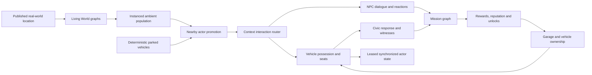

# World Explorer Urban Sandbox Plan

Status: active implementation plan  
Branch: `steven/urban-sandbox-foundation`  
Production: unchanged on the verified 4.2.1 rollback

## Implementation state — 2026-08-17

- Phase 1: implemented and locally verified in installed Chrome on desktop and
  390×844 touch. User/device acceptance is still required.
- Phase 2: exact ambient-car promotion now supports all nine traffic families,
  including vans, delivery vans, box trucks and buses. Off-camera vehicle
  demotion and player-actor traffic avoidance remain open.
- Phase 3: ten pedestrian archetypes, bounded close-range promotion, contextual
  talk/take reactions, mapped or junction-derived traffic controls, deterministic
  roadside waste baskets and inspectable street furniture are implemented.
  Driver/passenger states and traffic-signal behavior remain open.
- Phase 4: the witnessed-event and civic-attention lifecycle is implemented;
  purpose-built responder dispatch, pursuit and outcomes remain open. The
  placeholder legacy Police Chase is not used as a shortcut.
- Interactive equipment baseline: implemented locally with five quick slots,
  held-item visuals, ammunition/charges/cooldowns, flashlight, melee, fictional
  pulse-sidearm and concussion-charge impacts against NPCs, vehicles and props.
  It is deliberately session-local until authenticated progression and
  multiplayer authority are implemented.
- Phases 5–8: planned, not implemented by this milestone.
- Deployment: not authorized; production remains unchanged.

## Product direction

World Explorer should gain the embodied freedom, systemic city reactions,
vehicle ownership, mission continuity and long-term progression associated with
a polished urban open-world sandbox without becoming a copy of another game's
fiction, UI, characters, missions or assets. Real places, field exploration,
travel, discovery, creation and cooperative play remain the identity.

The player is one continuous person in one published location. Walking,
entering a vehicle, driving, leaving it, meeting a character, beginning a
mission, receiving a consequence and saving a reward must be state transitions
inside that world—not unrelated menu modes or world reloads.

## Non-negotiable architecture

1. The fixed Earth publication remains the only map/provider owner.
2. Urban systems derive from the published road, building, entrance, POI and
   Living World graphs and never load providers because an actor moved.
3. Ambient traffic and pedestrians remain pooled/instanced at distance.
4. Only nearby relevant actors are promoted into interactive entities. Budgets
   start at three interactive vehicles on mobile and six on desktop.
5. A promoted actor has a stable world-scoped identity and one lifecycle owner.
6. Entering a vehicle transfers the existing player controller to that exact
   vehicle. It does not spawn a replacement car or reload the world.
7. Occupied, saved, mission-owned or recently abandoned vehicles cannot be
   demoted or disappear.
8. UI is contextual and normally absent. One interaction prompt and one compact
   objective/status surface replace permanent feature panels.
9. Multiplayer never trusts a client to award ownership, money, mission rewards
   or consequence changes. Room vehicle motion may be client-authored only under
   an explicit lease validated by the backend.
10. Every phase has desktop, touch, lifecycle, memory and rendered-frame gates.

## System map

## Phase 1 — Embodied vehicle vertical slice

Deliver:

- deterministic parked vehicles near a safe arrival;
- stable vehicle IDs, type, color, dimensions, condition and world pose;
- high-quality bounded close-range vehicle visuals;
- a shared contextual-interaction router;
- walk-to-door prompt, enter transaction and controller handoff;
- low-speed safe exit on either side with ground/building clearance;
- exact vehicle retained in the world after exit;
- no world-load sequence, provider request or terrain rebuild during entry/exit;
- keyboard and touch actions;
- state exposed through `render_game_to_text`.

Acceptance journey:

> Start Baltimore on foot, approach a parked car, enter it, drive, stop, exit,
> walk around the same retained vehicle and re-enter it. Its ID, style, color,
> pose and condition remain stable and the world-load sequence never changes.

## Phase 2 — Ambient-to-interactive promotion

- expose bounded Living World agent snapshots without leaking render internals;
- promote a nearby traffic vehicle with its exact lane pose and variant;
- hide only that source instance while promoted;
- transfer driver/passenger state and pause lane ownership;
- return an eligible empty actor to the pool only outside view and beyond a
  hysteresis radius;
- add parked-vehicle density derived from parking/road semantics;
- add basic traffic collision avoidance around player-owned actors.

## Phase 3 — Character and city reactions

- persistent nearby NPC identity and archetype;
- idle/walk/run/driver/passenger/enter/exit/reaction animation states;
- driver yield, stop, flee, protest and report behaviors;
- pedestrian awareness cones, hearing radius and short-term memory;
- traffic signals, crossing priority and emergency yielding;
- contextual dialogue and small location-aware requests.

## Phase 4 — Civic response

- typed events for collision, reckless driving, trespass and vehicle taking;
- witness validation rather than automatic omniscient detection;
- alert levels, dispatch delay, search area, pursuit and cooldown;
- police/security/ranger responders selected by location context;
- escape, warning, ticket, surrender and recovery outcomes;
- migrate the current Police Chase into this event system.

The user explicitly requested combat/equipment on 2026-08-17. The local baseline
uses fictional, non-gory game equipment and a shared condition/reaction model.
Age/tone policy, moderation, audio, deeper animation, authenticated ownership and
server-authoritative multiplayer impacts remain release gates; a room client is
not allowed to award equipment or publish damage as trusted state yet.

## Interactive equipment and object actions

- one contextual prompt supplies Talk, Take, Enter, Inspect and Use rather than
  a second permanent gameplay panel;
- equipment opens on demand with `I`, supports slots `1`–`5`, and is collapsed
  by default; touch gets one small Gear affordance plus contextual action buttons;
- the equipped flashlight, baton, fictional pulse sidearm or concussion charge
  is attached to the existing character hand rather than floating in the world;
- a single bounded impact contract applies condition changes and blast falloff to
  promoted NPCs, exact vehicles and street furniture;
- witnessed theft, assault, discharge and explosion events feed the same civic
  response lifecycle as vehicle taking and reckless driving;
- no real-world weapon brands, construction instructions or copied GTA assets,
  characters, interface or fiction are used.

## Phase 5 — Missions and continuity

- staged mission graph: offered, accepted, active objective, recovery, failed,
  completed and rewarded;
- contacts and dialogue;
- vehicle recovery/delivery, passenger transport, survey, investigation,
  search-and-rescue, street race and cooperative expedition objectives;
- compact objective HUD, world marker and map support;
- checkpoint/recovery that never requires restarting the whole world;
- one authored Baltimore chain proving the complete loop.

## Phase 6 — Economy, garages and ownership

- one clear Explorer credit/reputation model;
- garage/service POIs and safe vehicle storage;
- owned, borrowed, mission and ambient vehicle policies;
- repair, recovery and restrained customization;
- outfits/equipment, organizations and location reputation;
- authenticated persistence plus anonymous local continuity.

## Phase 7 — Social sandbox

- passengers and seat ownership;
- room vehicle leases and interpolation;
- cooperative missions and shared rewards;
- garages and saved vehicles visible under explicit permissions;
- moderation, abuse limits and authoritative transaction tests;
- voice remains separate and is not implied by room presence.

## Phase 8 — Production depth and polish

- multiple close-range vehicle families with distinct handling;
- vehicle damage presentation, repair and audio;
- improved NPC rigs, facial direction, gestures and crowd variety;
- emergency vehicles, taxis, buses and service interactions;
- controller remapping, accessibility and difficulty policies;
- target-device budgets, sustained-play memory plateaus and telemetry;
- tutorial that teaches one connected first expedition instead of every menu.

## Release gates

No phase is complete on source assertions alone. Required evidence includes:

- installed-Chrome rendered entry/drive/exit screenshots;
- desktop keyboard and 390×844 touch journeys;
- stable `render_game_to_text` state matching the frame;
- exact-vehicle identity and no-pop assertions;
- collision-safe entry/exit and invalid-speed rejection;
- zero world reload/provider work during local interactions;
- title/location-change disposal and forced-GC memory envelopes;
- multiplayer emulator tests before synchronized ownership is enabled;
- user acceptance before preview or production deployment.
