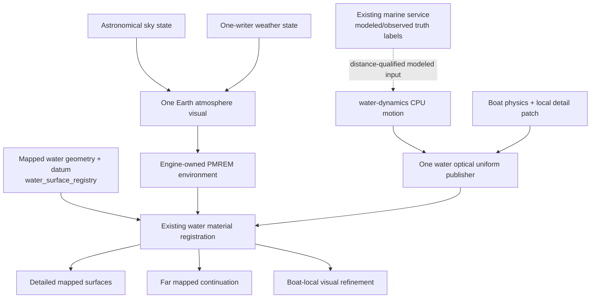

# Water and Sky Realism — R&D and Implementation Plan

**Status:** Phase A implemented and locally gated; awaiting user acceptance before deployment  
**Date:** 2026-08-18  
**Release constraint:** preserve a same-day deployable candidate on Three.js r128  
**Primary rule:** improve presentation without creating a second water world, sky
state, weather state, marine provider, renderer loop, or geometry owner.

## 1. Decision

The requested improvement is feasible on the current architecture and on Three.js
r128. It does **not** require replacing mapped water, boat physics, the astronomical
clock, weather providers, terrain, or the underwater Ocean environment.

The safe design is one shared **Earth water presentation coordinator** layered onto
the existing authoritative water surfaces. It owns shared optical resources and
uniform publication only. It does not own geographic coverage or simulation.

The existing astronomical state remains the only Earth sky/time authority. Its
visual output will be upgraded from a flat background color to one atmospheric
sky mesh and one derived PMREM environment. Weather remains the only weather-state
writer and supplies bounded visual parameters to that sky.

The first releasable slice is:

1. one atmospheric Earth sky driven by existing sun/time/weather state;
2. one regenerated PMREM environment derived from that same state;
3. analytical per-pixel water normals, correct viewing-angle response, and less
   emissive water across existing detailed, waterway, far-field, and boat-patch
   materials;
4. quality-tier policy and diagnostics;
5. unchanged geometry, navigation, buoyancy, terrain masks, and environment loops.

A shared planar scene reflection and screen-depth refraction are later gates in
this same plan, but they must not be smuggled into the release without passing the
GPU and seam tests below. The r128 `Water` example is a reference implementation,
not a component to instantiate once per mapped polygon.

## 2. Current authority map

| Responsibility | Current authority | Keep/change |
| --- | --- | --- |
| Detailed water footprints, holes, datum, classification | `world/water-surface-registry.js`, `world/load-landuse-pass.js`, `world/waterway-ribbon.js` | Keep exactly one registry and the existing geometry |
| Regional/horizon water coverage | `terrain/far-field-water.js` plus mapped-water terrain mask | Keep; far water remains a clipped/generalized visual continuation |
| Terrain under mapped water | `terrain/water-terrain-mask.js` and far-field ownership mask | Keep; elevation may position/shape a mapped bed but never invent water |
| Water motion model and CPU sampling | `water-dynamics.js` | Keep as the deterministic motion authority; extend its inputs, not its ownership |
| Boat buoyancy, pose, wake strength, and detail patch | `boat-mode/water-query.js`, `boat-mode/surface-effects.js`, `boat-mode/runtime-dynamics.js` | Keep CPU behavior; microscopic optical ripples remain visual-only |
| Water material registration/update | `world/water-materials.js`, `waterWaveVisuals`, `updateWaterWaveVisuals()` | Promote this existing path into the single optical coordinator |
| Astronomical time, sun, Moon, phase | `sky/astronomical-state.js` | Keep as sole sky-state writer |
| Weather state/presentation | `weather/state-service.js`, `weather.js` | Keep as sole weather writer; publish visual inputs to sky/water |
| Existing environment lighting | `engine/quality.js`, `engine/scene-bootstrap.js` | Replace uniform-blue PMREM generation in this owner; do not add another environment-map manager |
| Mode/render loop | runtime kernel and environment lifecycle | Keep; no water or sky `requestAnimationFrame` loop |
| Underwater Ocean | `ocean.js` and Ocean lifecycle adapter | Out of scope except transition regression; it remains a separate, mutually exclusive environment |
| Marine model/observations | existing `geospatial/marine.js` provider registry | Reused by one non-blocking water-environment adapter; no second marine fetcher |

### Confirmed non-duplication invariants

- `water_surface_registry` remains the only detailed water publication authority.
- Detailed water owns the inner mapped location. Far mapped water owns only the
  regional continuation established by the existing clipping/mask contracts.
- The boat patch is a camera/boat-local **visual refinement**, not a navigable
  water source and not a second geographic surface.
- Only the runtime kernel advances Earth water visuals. No material, reflection,
  or sky component may start its own animation loop.
- Earth, Moon, Mars, Space Flight, and underwater Ocean remain lifecycle-isolated.
- `weather-state-service` remains the only writer of active/live weather fields.
- The renderer/quality owner remains the only owner of the scene environment map.

## 3. R&D findings

### 3.1 Why the current water reads as painted

The current material patch displaces vertices and adds diffuse/emissive bands.
Most mapped polygons and the far regional mesh do not have enough tessellation
for small waves to affect their normals. Their base materials also use fixed blue
and relatively strong emissive values. The PMREM input is a uniformly colored
sphere, so physically based specular response cannot show horizon, sun, weather,
or twilight variation. Only the boat patch has a dense 128 by 128 grid.

### 3.2 Compatible techniques on r128

Three.js r128 already supplies the required primitives:

- the official r128 `Water` addon demonstrates one planar reflection target,
  oblique clipping, animated normal sampling, Fresnel response, and recursion
  avoidance;
- the official r128 `Sky` addon implements a Preetham-style atmospheric shader;
- r128 `PMREMGenerator.fromScene()` creates the filtered CubeUV environment used
  by `MeshStandardMaterial` at different roughness levels;
- the current app already uses `onBeforeCompile`, PMREM, sRGB output encoding,
  ACES tone mapping, and `MeshStandardMaterial`.

The project must stay on r128 for this release. Current Three.js examples and
current `MeshPhysicalMaterial` features cannot be assumed to exist in r128.

### 3.3 Approaches rejected by the R&D

| Approach | Decision | Reason |
| --- | --- | --- |
| Instantiate official `THREE.Water` for every polygon | Reject | Creates a reflection camera/target and extra scene render per surface; breaks material pooling and multiple-datum ownership |
| Add a giant rectangular ocean plane | Reject | Reintroduces known false-water/moat regressions and bypasses mapped coverage |
| Add another sky scene/state machine | Reject | Competes with astronomical/weather ownership and mode transitions |
| Use elevation alone to infer water/depth | Reject | Violates the mapped-water contract and can flood inland low terrain |
| Make all mapped polygons dense wave meshes | Reject | Large CPU/GPU/memory cost, worsens holes and LOD seams, and is unnecessary for small optical ripples |
| Turn all water transparent and enable full transmission | Reject for first release | Sorting, overdraw, bridge/pier artifacts, and lack of a stable scene-depth contract make this unsafe today |
| Couple work to a Three.js upgrade | Reject | Multiplies shader-chunk, encoding, loader, post-processing, and addon migration risk |
| Feed NOAA tide datum directly into geometry height | Reject | Station datum is not automatically the same as the world/DEM datum; doing so can detach water from shorelines and structures |

### 3.4 Baseline evidence

The pre-change Baltimore browser run published 114 registered water areas and 49
terrain meshes. Twenty interior probes retained 0.465–0.600 world units of bed
separation. No renderer change may reduce the water registry count, change the
published datum, or remove that physical bed.

The legacy hydrology screenshot gate also revealed a stale assertion: it requires
an optional mapped museum vessel even when the current OSM/provider result has no
such feature. The replacement visual gate will still validate any vessel that is
present, but will not make provider-variable optional content a prerequisite for
testing the water renderer.

## 4. Target architecture

### 4.1 One water optical contract

Every registered water material receives the same uniform schema:

- wave time and the existing primary/secondary/swell/ripple amplitudes;
- analytical world-space wave slope for fragment normals;
- water kind and optical profile;
- sky zenith/horizon/sun colors and sun direction;
- daylight, twilight, cloud, precipitation, and haze factors;
- quality tier and optional shared-reflection availability;
- optional shoreline/depth evidence, with explicit `unknown` fallback.

Materials may vary by bounded profiles (`harbor`, `channel`, `lake`, `coastal`,
`open_ocean`) but may not allocate independent cameras, render targets, normal
textures, or timers.

### 4.2 Geometry motion versus optical motion

- Detailed mapped areas/waterways/far context keep their existing meshes and
  datum. Large-scale vertex displacement is bounded so sparse triangles cannot
  create ramps, cracks, or exaggerated seams.
- The boat patch remains the only dense local geometry displacement surface.
- All visible water gets fragment-level analytical normals. This supplies small
  ripples and highlights without tessellation.
- The CPU sampler remains authoritative for boat heave/pitch/roll. The shader
  may add optical ripples that never alter collision or buoyancy.

### 4.3 Sky and environment contract

The atmosphere is a visual child of the current Earth sky owner:

- sun direction comes from `astronomical-state.js`;
- turbidity/overcast/haze come from the current weather visual profile;
- manual day/sunrise/sunset/night modes continue to work;
- Moon, stars, clouds, fog, readability floors, and environment transitions keep
  their existing owners;
- PMREM regeneration occurs only when a quantized sky/weather signature changes,
  never per frame;
- exactly one previous PMREM render target is disposed when replaced.

### 4.4 Real-data boundary

The visible result must state its truth honestly:

- water footprints/classification: mapped OSM/Shortbread provenance;
- water surface/bed: current world datum and DEM-derived rules;
- sun/Moon: calculated astronomical state for selected coordinates and time;
- weather: Open-Meteo modeled/current conditions or explicit manual preset;
- marine waves/current: Open-Meteo Marine modeled guidance when its selected sea
  grid cell is within the 35 km rendering guard; otherwise the explicitly
  procedural fallback remains active;
- water level: NOAA CO-OPS observed at a station, only when station/datum and
  freshness are retained;
- tide: NOAA harmonic prediction, never labeled observation.

The same singleton marine service used by Live Earth now feeds a bounded,
non-blocking water-environment adapter. It publishes modeled wave height/period
as evidence and derives renderer controls without changing the source values.
Cells farther than 35 km are retained as evidence but rejected as rendering
input, preventing an inland lake from borrowing offshore conditions. NOAA level
and prediction data remain evidence-only and cannot move geometry.

### 4.5 Measurement truth and bathymetry contract

No visual parameter is allowed to masquerade as a measurement. The runtime uses
an explicit evidence contract with separate fields for geometry, depth,
waves/current, and water level:

| Field | Allowed truth labels | Numeric rule |
| --- | --- | --- |
| Water footprint | `mapped`, `unknown` | Geometry can define coverage, never depth |
| Bathymetric depth | `measured`, `modeled`, `derived`, `unknown` | `unknown` always carries `depthMeters: null` |
| Waves/current | `modeled`, `unknown` in the current provider | Retain valid/fetched time and direction convention |
| Water level | `observed`, `predicted`, `modeled`, `unknown` | Kept separate from depth; cannot move geometry without a proven datum transform |

The source-specific findings are:

- **GEBCO is usable global bathymetric evidence, not a universal survey.** Its
  global grid has 15 arc-second nominal spacing and an assumed mean-sea-level
  vertical datum. It is a compiled terrain model containing both measured and
  interpolated/predicted cells. Because the current WMS point response does not
  return the Type Identifier (TID) class, WorldExplorer labels those samples
  `modeled`, never `measured`, and retains `navigationSafe: false`.
- **The WMS release name is not hard-coded as “latest.”** The service layer is
  `GEBCO_LATEST_2`; the GEBCO service page currently describes 2024-backed WMS
  calls while the downloadable 2025 grid is a separate release. Runtime evidence
  therefore records `service-layer-current` until metadata proves a release.
- **The bundled reef grid is local, not worldwide.**
  `ocean-bathymetry-great-barrier-reef.json` is an 81×81 GEBCO 2020-derived grid
  obtained through OpenTopodata for one Great Barrier Reef box. Its bounds,
  spacing, provider, dataset, and query time are retained in evidence.
- **The underwater seabed is a presentation blend.** Ocean mode blends the
  bathymetric elevation with a procedural reef/canyon surface. The raw
  bathymetry evidence is exposed separately from
  `presentationMode: procedural-bathymetry-blend`; blended world Y is never
  reported as measured depth.
- **Mapped harbor, lake, and river polygons usually have unknown depth.** Their
  footprints and surface datum retain their mapped/DEM contracts, but absent
  hydrographic evidence their numeric depth remains `null`.
- **Shoreline bed clearance is not bathymetry.** The terrain-mask rule that
  lowers the visual bed by up to 0.6 world units prevents z-fighting and raised
  shoreline slabs. It is explicitly rejected as a depth source.
- **NOAA water level is not water depth.** Station observations retain station,
  datum, quality, and time. Predictions remain labeled predictions. Neither may
  be applied to geometry until station and world/DEM datums have a validated
  transform.
- **Open-Meteo marine values are model guidance.** Wave direction is where waves
  come from; current direction is where flow heads to. Those conventions are
  stored explicitly before future conversion to the existing motion model.

The same-day optical release may use water-kind profiles when depth is unknown,
but diagnostics must label that path `<water-kind>-unknown-depth` and
`numericDepthUsed: false`. Actual depth attenuation is enabled only when a
qualified evidence record contains a non-null bathymetric depth.

## 5. Implementation phases and gates

### Phase A — shared optical foundation (same-day release candidate)

**Changes**

- Add one reusable r128-compatible atmospheric material/mesh under `sky/` and
  construct it from `engine/scene-bootstrap.js` as part of the existing sky.
- Extend `sky/astronomical-state.js` and `weather.js` to publish quantized visual
  inputs to that mesh, without writing each other's state.
- Replace the uniform-blue PMREM generator in `engine/quality.js` with a gradient/
  atmosphere-derived environment owned and disposed by that module.
- Extend `world/water-materials.js`/`water-dynamics.js` with analytical fragment
  normals, Fresnel-guided tint, sun glitter, reduced emissive contribution, and
  tiered optical strength.
- Apply the same material contract to detailed areas, waterways, far water, and
  the existing boat patch.
- Add a compact diagnostic snapshot; no new user-facing control is required.
- Publish the measurement-evidence snapshot. Unknown depth may select a bounded
  visual profile but cannot supply numeric attenuation distance.
- Reuse the existing marine provider registry asynchronously. Apply only
  distance-qualified modeled wave guidance; provider delay/failure cannot block
  world publication or boat entry.

**Pass conditions**

- one atmosphere mesh; one environment map target; zero new loops;
- one shader-registration path and no per-water render targets;
- no change to water registry IDs/counts, terrain mask, datum, boat candidates,
  boat CPU motion, world-load sequence, or active environment;
- low tier performs no additional scene render and uses reduced normal detail;
- no shader compilation or WebGL errors in installed Chrome;
- visible day, sunset, overcast/rain, and night differences in water reflection;
- water is not bright blue at night and no longer glows from fixed emissive color.

### Phase B — one high-tier planar reflection (feature-gated)

**Changes**

- One engine/runtime-owned reflection controller, registered before the main
  render phase; no `requestAnimationFrame`.
- Select at most one dominant visible near-water datum based on camera distance,
  projected coverage, and valid plane orientation.
- Reuse one half-resolution render target and mirror camera.
- Hide all water presentation meshes during the reflection render, disable XR
  and shadow auto-update, restore renderer target/viewport/state in `finally`.
- Update at a capped cadence only when the camera/sky/world signature changes.
- Materials at other datums use PMREM only.

**Entry gate**

- Phase A passes first.
- Desktop-high p95 frame time must stay within 20% of baseline and GPU memory
  must plateau across location reloads.
- No bridge/pier clipping, recursive water, missing HUD, or post-processing state
  corruption in Baltimore, London, San Francisco, and Monaco.

**Automatic fallback**

- disabled on low/mobile;
- disabled when the dominant plane cannot be proven;
- medium defaults to PMREM unless measured headroom is available;
- any context loss or render-target error disables the controller for the session.

### Phase C — depth, shoreline, and interaction optics (not inferred)

**Changes**

- Publish a bounded shoreline-distance/depth-evidence texture from the existing
  mapped-water/terrain-mask owner, not a second shoreline geometry pass.
- Use the actual scene-depth pipeline only after compatibility with composer,
  SSAO, pixel ratio, resize, and transparent ordering is proven.
- Drive absorption, shallow color, sediment tint, foam, and refraction from
  evidence with an explicit unknown fallback.
- Use qualified GEBCO evidence for broad open-ocean depth attenuation where
  applicable. Do not extend it into harbor/river/lake precision it does not have.
- Reuse boat wake/foam values; never add a second wake simulation.

**Entry gate**

- No shoreline field is created at 4096² per body. It must be shared/bounded and
  included in the existing memory snapshot.
- Waterways, islands/holes, elevated lakes, ocean sea level, vessels, piers,
  tunnels, and bridge supports pass waterline views.

### Phase D — optional marine forcing

**Changes**

- Consume `geospatial/marine.js`; do not add endpoints.
- Convert wave height/period/direction into bounded targets for the existing
  motion profile and smooth between observations/models.
- Manual sea-state control remains an explicit override.
- Store provider, truth type, valid/observed/fetched time, and fallback reason in
  the boat/water diagnostic snapshot.

**Safety rules**

- Marine fetch never blocks initial world publication or boat entry.
- A station water level does not move world geometry until datum conversion is
  explicitly proven for that location.
- Stale/unavailable data fades to the existing modeled sea-state defaults.

## 6. Quality policy

| Capability | High | Medium | Low/mobile |
| --- | --- | --- | --- |
| Atmospheric sky | Full | Full | simplified uniform count |
| Atmosphere-derived PMREM | Quantized updates | Quantized updates | small static/phase update |
| Analytical water normals | Full primary + secondary + ripples | reduced ripple strength | primary/ripple subset or reduced strength |
| Fresnel/sun glitter | Full | Full | bounded approximation |
| Geometry displacement | Boat patch + bounded large waves | boat patch + bounded | boat patch reduced; mapped surfaces stable |
| Planar reflection | one shared target after Phase B gate | off by default | off |
| Scene-depth refraction | after Phase C gate | simplified after gate | off |
| Foam/wakes | existing plus evidence-driven | existing simplified | existing bounded |

Quality changes update existing uniforms/resources. They do not create a second
set of water meshes or a second sky.

## 7. Verification matrix

### Static/module gates

- JavaScript parse and module URL/version consistency.
- Hydrology integration and fixed-horizon architecture.
- Weather one-writer and runtime-kernel ownership.
- New water/sky contract test: one atmosphere owner, one environment target,
  one material registry, no water-owned animation loop, no per-surface targets.
- Production readiness, strict reachable modules/assets, and `git diff --check`.

### Installed-Chrome visual scenarios

| Location | Required views/conditions | Main risk |
| --- | --- | --- |
| Baltimore Inner Harbor | low waterline + aerial; day, sunset, rain, night; boat wake | dark harbor color, skyline/sun response, vessels/piers if present |
| San Francisco Bay | waterline/aerial; clear day and sunset | long highlights, bridge continuity, far/detailed seam |
| Monaco | coast/harbor; day and night | duplicate/striped far water regression |
| London Thames | low river view; overcast and night | narrow-water optical scale, bridge clipping |
| Lake Tahoe | waterline/aerial; clear and cloudy | elevated inland datum, calmer profile, shoreline continuity |
| Atlantic open ocean | boat view; moderate/rough; day/night | horizon, patch-to-far blend, no land plane |
| Inland dry control | Baltimore-independent inland city | no invented water and no sky/terrain gap |

### Interaction/lifecycle scenarios

- enter boat, accelerate, turn, stop, exit; compare CPU surface envelope with
  visible patch and preserve safe shore exit;
- manual sea-state calm/moderate/rough and weather live/manual modes;
- day → sunset → night → sunrise → live without leaked PMREM targets;
- high → medium → low → high quality without duplicate resources;
- Earth → Moon → Earth and Earth → underwater Ocean → Earth;
- two location reloads and title release with resource counts plateauing;
- desktop and 390×844 mobile viewport.

### Visual rejection conditions

- rectangular water plane/moat, horizon cut, aerial stripes, z-fighting, raised
  shoreline slab, disappearing islands/holes, or land rendered through water;
- bright emissive blue at night, flat single-color sky reflection, sun highlight
  opposite the astronomical sun, or weather and sky disagreeing;
- boat patch edge/ring, wake detached from boat, boat below the visual surface;
- bridge/pier/vessel clipping, transparent-sort halos, black shader surfaces;
- frame-time regression above the phase budget or increasing render-target count
  after repeated updates/reloads.

## 8. Rollback and release policy

- Each phase is independently revertible. Phase A does not change source water
  geometry or simulation data, so disabling its optical uniforms restores the
  previous material behavior.
- Phase B and C remain off unless their own browser/performance gates pass.
- A failed atmosphere/PMREM creation falls back to the existing background color
  and a single static environment; it must not stop the game.
- No deployment or production promotion occurs as part of implementation without
  explicit user approval. A local test URL is provided after all accepted gates.

## 9. Primary references

- Three.js r128 Water source: <https://github.com/mrdoob/three.js/blob/r128/examples/js/objects/Water.js>
- Three.js r128 Sky source: <https://github.com/mrdoob/three.js/blob/r128/examples/js/objects/Sky.js>
- Three.js r128 PMREMGenerator source: <https://github.com/mrdoob/three.js/blob/r128/src/extras/PMREMGenerator.js>
- Three.js migration guide (r128 compatibility boundary): <https://github.com/mrdoob/three.js/wiki/Migration-Guide>
- NOAA CO-OPS Data API: <https://api.tidesandcurrents.noaa.gov/api/prod/>
- Open-Meteo Marine API already declared by the project: <https://open-meteo.com/en/docs/marine-weather-api>
- GEBCO 2025 Grid product and limitations: <https://www.gebco.net/data-products-gridded-bathymetry-data/gebco2025-grid>
- GEBCO Web Map Service: <https://www.gebco.net/data-products/gebco-web-services/web-map-service>
- GEBCO multi-resolution data: <https://www.gebco.net/data-products/gridded-bathymetry-data/multi-res>
