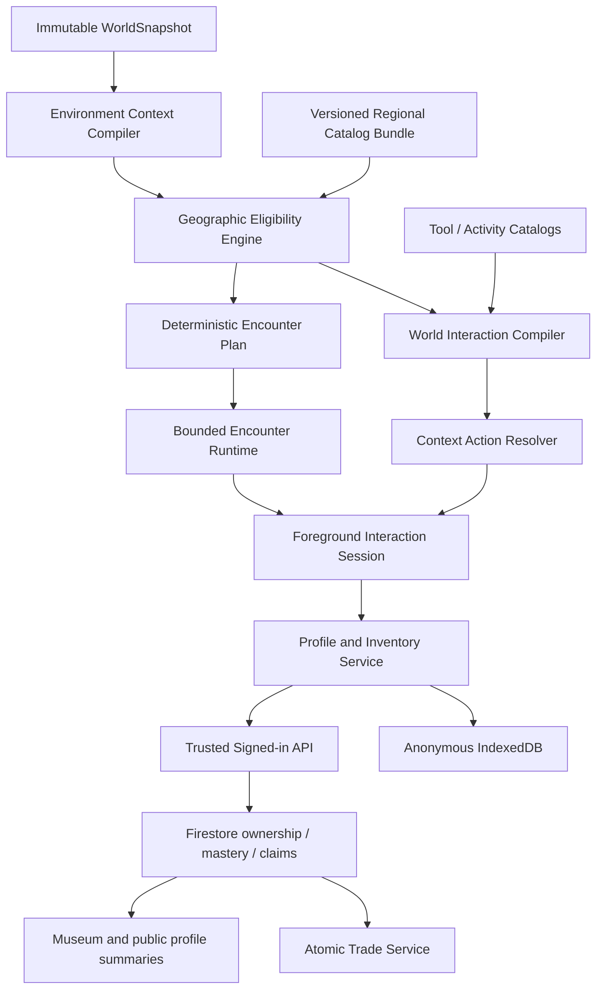

# World Discovery and Interaction Platform — Architecture/R&D Report

Date: 2026-08-16
Status: architecture gate complete; production implementation not started
Scope: integrated planning for World Interaction/Exploration Progression and World Discovery/Wildlife/Companions/Collections/Trading

## 1. Decision

Proceed with one integrated platform, conditionally, in staged vertical slices.

The platform must preserve the existing fixed-world architecture:

```text
Immutable WorldSnapshot
  -> derived EnvironmentContextPublication
  -> derived GeographicEligibilityPublication
  -> derived WorldInteractionPublication
  -> bounded deterministic EncounterPlan
  -> proximity-virtualized presentation and interaction sessions
```

None of these derived publications may mutate provider records, accepted ground,
the compiled transport surface, or the immutable `WorldSnapshot`. Ordinary player,
NPC, companion, or Live GPS movement must cause zero world-data provider queries.

The two requested expansions are not separate products. The Geographic Encounter
Engine answers what is plausible; the World Interaction Layer answers what can be
done; the collection/profile platform records the durable result. Wildlife,
specimens, tools, metal detecting, fishing, photography, companions, jobs, museum
displays, and regional goals use those shared contracts.

The first production proof remains one complete metal-detecting and virtual-
excavation slice. Broad wildlife, jobs, farming, sonar, diving, and other systems
must not be added superficially before that slice validates the architecture.

All content introduced under this plan is free. A single entitlement service owns
future commercial policy, and the default product flag is:

```js
explorationEconomy.mode = 'free_testing'
```

No gameplay module may contain its own `isPaid`, plan, Stripe, purchase, energy,
loot-box, or paid-capacity check.

## 2. Planning inputs and audit method

This report combines both user specifications available on 2026-08-16 with the
current repository at branch `steven/living-editable-world`, commit `8410cdb`.
The second attached specification ends in the middle of Phase 28 after the Items
inventory heading. Every available requirement is included; no missing tail was
invented.

Repository evidence included:

- `docs/SYSTEM_INVENTORY.md`;
- `docs/LIVING_EDITABLE_WORLD_ARCHITECTURE_RND.md` and its implemented results;
- fixed-world request/session/snapshot/publication owners;
- Living World and Editable World source and tests;
- activity discovery/editor/runtime;
- fishing, Flower Challenge, Ocean fish/shark presentation, DeFlock, and Live GPS;
- account, creator profile, local persistence, Firestore rules, Cloud Functions,
  rooms, analytics, mobile controls, and release scripts.

Current external source terms were checked on 2026-08-16. Source decisions below
are product architecture decisions, not legal advice; every imported dataset still
requires a machine-readable manifest and release review.

## 3. Current system audit

### 3.1 World and environmental authority

| Area | Current owner/evidence | Audit result for this platform |
| --- | --- | --- |
| Fixed Earth identity | `earth-core/world-load-request.js`, `living-world/model.js` | Reuse `WorldIdentity`; request sequence is transient and must never be a save key. |
| Atomic world state | `earth-core/world-snapshot.js`, `world/world-snapshot-adapter.js` | Reuse publication gate. Snapshot layer records currently contain compact compiler summaries, not all usable feature records. |
| Runtime feature collections | `world/collection-registry.js`, shared `ctx` | Roads, buildings, land use, water, vegetation, POIs, and historic sites are available after publication. A canonical derived environment adapter is required so new gameplay does not read ad hoc globals. |
| Living World | `living-world/*` | Reuse its stable seed, lifecycle, 10 Hz bounded simulation, pedestrian graph, quality tiers, and derived-publication boundary. Add wildlife as a sibling derived population, not inside traffic code. |
| Editable World | `editable-world/*`, room world modifications | Reuse `WorldModificationSet` for fictional pits, camps, farms, trail cameras, museums, and construction. Never edit authoritative Earth. Catalog must explicitly add these new safe object types later. |
| Terrain/elevation | accepted-ground, terrain and surface contracts | Reuse sampled elevation, relief, slope, and material semantics. There is no geology layer yet. |
| WorldCover/biome | `terrain/worldcover-*`, `earth-core/biome-profile.js` | Useful coarse habitat evidence, but current biome classifier is deliberately broad and cannot by itself establish species, minerals, or fossils. |
| Land use | OSM/Shortbread compilation | Reuse farmland, forest, parks, industrial, residential, commercial, sand, rock, wetland, and related semantics. Preserve mapped/inferred provenance. |
| Hydrology/ocean | mapped water registry, water-body contract, GEBCO bathymetry | Reuse water kind, shoreline, navigation candidates, depth context, and Ocean transition. River/lake/coastal/open-ocean eligibility must be explicit. |
| Weather/time/sky | weather state service, astronomical sky | Reuse as bounded modifiers. Weather/time may influence presentation and some likelihoods but must not override geographic invalidity. |
| POIs/history | `pois`, `historicSites`, activity catalog | Useful for contextual history and urban actions. Generated narratives must remain separate from factual POI text. |
| Protected/private context | current OSM tags where retained | Incomplete. Add a conservative access/sensitivity policy; do not describe it as legal navigation. |

Important gap: the immutable `WorldSnapshot` proves coherent layer ownership but
its canonical records are compact layer summaries. Stage A must introduce one
`EnvironmentContextPublication` built at publication time from the accepted
snapshot plus the already-compiled runtime collections. New systems must consume
that immutable adapter instead of reaching independently into `ctx`.

### 3.2 Existing discovery and activity systems

| System | What exists | Reuse/generalization decision |
| --- | --- | --- |
| Activity Discovery | Generated/creator/room activities, category browser, map markers, local completion records | Keep the public activity browser. Generalize objectives/anchors into reusable contract primitives for jobs and multi-stage hunts; do not call it the Geographic Encounter Engine. |
| Activity editor | Routes, checkpoints, collectibles, trigger/hazard zones, fishing zones, docks, validation, test mode | Reuse authoring and objective primitives after schema versioning. Environmental eligibility is new and must not be authored as an unsupported factual claim. |
| Gameplay plugins | One foreground plugin with start/update/stop/save/leaderboard | Keep for exclusive missions/contracts. Context actions, equipped tools, Living World, companions, and Live GPS must be ambient services so they can coexist. |
| DeFlock | Deterministic mapped objectives, local progress, trusted multiplayer claims, natural copy, safety boundary | Reuse its provenance, local-vs-room authority, immutable claim, and lifecycle patterns. Do not merge surveillance records into natural-history catalogs. |
| Flower Challenge | One procedural flower marker, timer, local/optional leaderboard | Retire as a separate discovery authority after compatibility migration. Re-express as a botanical activity using the shared encounter plan. |
| Fishing | 14 hard-coded species, latitude bands, water kinds, rarity/strength, fight loop, 120-entry local catch history, leaderboard | Preserve the polished fight loop and visuals. Replace species eligibility/identity and catch persistence through the shared catalog/profile adapters. Existing latitude ranges are placeholders, not authoritative worldwide distribution. |
| Ocean wildlife | Decorative procedural fish schools and one shark | Keep as visual ambience until catalog-backed. It currently uses unseeded generic appearances and must not be presented as exact species. |
| Wildlife/geology/fossils/plants | No general catalogs or encounter engine | New capability required. |
| Photography | Photo-point contribution type only | New capture/scoring/collection system required; reuse camera, visibility, raycast, and contribution separation. |
| Jobs/contracts | No general jobs engine | Build later from objective/contract primitives, not separate engines per job. |

### 3.3 Player, companion, inventory, profile, and trading

| Area | Current state | Required decision |
| --- | --- | --- |
| Player actor | One procedural Field Navigator with walking animation | Keep hero actor. Companion follows the one active walking actor. |
| NPC animation | Pooled lightweight Living World pedestrians/vehicles | Reuse pooling and archetype concepts, not the hero mesh or full player physics. |
| Companion ownership | None | Unique `CompanionInstance` records; many owned, exactly one active presentation. |
| Field Guide | None | New aggregate discovery index keyed by canonical catalog ID and catalog version. |
| Inventory/specimens | Fishing catch history and unrelated room artifacts only | New instance inventory. Do not overload room artifacts or building-editor objects. |
| Player profile | Private `users/{uid}` account fields plus separate public creator profile and explorer leaderboard | Create a dedicated explorer profile domain. Do not append mutable gameplay totals to billing/account documents or creator stats. |
| Progression | Challenge scores/completions and leaderboards; no coherent progression | New milestone/mastery model; no generic RPG XP or spend currency in the first release. |
| Trading | Friends/invites exist; no secure item exchange | New server-authoritative escrow/transaction service. Never implement direct client ownership swaps. |
| Museum/display | Room artifacts and editable structures exist, but no owned-item display references | Add personal display layouts that reference owned instance IDs; room displays remain scoped modifications plus validated display references. |

### 3.4 Persistence, multiplayer, analytics, and moderation

- Local storage already has many independent bounded stores. A potentially large
  permanent inventory should use a new versioned IndexedDB database, not another
  unbounded localStorage array. localStorage may hold only a compact manifest,
  migration marker, tutorial state, favorites, and export/backup metadata.
- Signed-in profile records need server-authoritative mutations. Existing client-
  writable user documents are limited to account fields and are not suitable for
  inventory or mastery.
- Room state supports transactions, listeners, role checks, bounded artifacts,
  activities, editable-world modifications, and trusted DeFlock claims. Reuse the
  patterns, not the collections. Shared encounter claims need their own bounded
  room subcollection and trusted transaction.
- Existing analytics is centralized and lazy but exports only session tracking.
  Add one sanitized feature-event API. Never log exact GPS coordinates, private
  inventory payloads, companion names, trade contents, or room geometry.
- Moderation currently covers contributions, overlays, rooms, and chat. Catalog
  ingestion needs source/license validation; trading needs fraud/audit tools;
  creator-authored treasure/history content needs the existing review boundary.

### 3.5 Rendering, assets, mobile, and release

- Existing procedural models and catalog-backed landmarks prove bounded model
  generation, while Three.js loaders and lifecycle scopes support reusable assets.
- Natural-history content needs representation tiers: exact model, catalog
  archetype with declared generalized representation, or icon/Field Guide art.
  A generic model must never be labeled as an exact species.
- Shared effects should own detector pulses, dust, brush, pan wash, specimen
  reveal, shutter, sonar, and audio cues. Avoid per-item materials and one-off loops.
- Mobile already has normalized touch actions and responsive panels. New tools use
  the same action layer, a compact bottom sheet, and one thumb-accessible quick tool
  control. Desktop-only hover is not an interaction requirement.
- Existing immutable candidate, installed-Chrome, performance matrix, provider
  outage, movement-query, module identity, Firestore emulator, multiplayer, and
  release verification systems remain mandatory.

## 4. What would be duplicated by a naive implementation

The following are explicitly rejected:

- a wildlife query every time the player walks into a new cell;
- separate spawn engines for animals, plants, minerals, fossils, detector targets,
  beach items, fish, and treasure;
- a second biome, water, terrain-height, road, or location identity model;
- a universal interaction menu listing every activity everywhere;
- tool ownership fields scattered through activity modules;
- a second inventory inside fishing, companions, museum, or trading;
- using `users/{uid}` billing/profile fields as a client-writable score bag;
- using room artifacts as tradeable owned specimens;
- using the one-active gameplay plugin for ambient companions or context actions;
- unique AI, mesh, material, animation loop, or pathfinder per species;
- direct writes for valuable items or trades from browser clients;
- exact sensitive occurrence coordinates in the game, analytics, or public profile;
- movement-triggered external provider calls;
- representing procedural finds as surveyed facts.

## 5. Integrated architecture



### 5.1 `EnvironmentContextPublication`

Compiled once per accepted fixed world. It is immutable, bounded, and disposable.

```js
{
  type: 'EnvironmentContextPublication',
  schemaVersion,
  requestId,
  sequence,
  worldIdentity,
  coverage,
  cells: [{
    cellId,
    center,
    elevationBand,
    reliefBand,
    slopeBand,
    landCoverWeights,
    landUseTags,
    urbanDensityBand,
    waterContext,
    shorelineContext,
    exposedSurfaceContext,
    buildingRoadParkContext,
    accessSensitivity,
    poiContext,
    provenance
  }],
  temporal: { month, seasonModel, localTimeBand, weatherBand },
  diagnostics
}
```

Cells are a deterministic eligibility index, not visible tiles and not streaming
chunks. They are generated during post-publication derivation and may be used for
proximity lookup without provider work.

### 5.2 Versioned catalogs

Catalog families:

- wildlife;
- domestic animals;
- plants and fungi;
- rocks, minerals, gems, ores/metals;
- fossils;
- fictional/historically informed finds;
- tools;
- activities;
- recipes/display pieces;
- regional goals.

Every catalog entry carries:

```js
{
  id, catalogFamily, catalogVersion, contentVersion,
  names, taxonomy,
  eligibilityRules,
  temporalRules,
  interactionIds,
  representation,
  behaviorArchetype,
  animationCapabilities,
  companionPolicy,
  tradePolicy,
  safetyPolicy,
  encounterRarityModel,
  collectionImportance,
  sourceRefs: [{ providerId, recordId, datasetId, license, attribution, retrievedAt }]
}
```

Import validation rejects missing stable IDs, source/license metadata, invalid
eligibility predicates, unsupported representation claims, and unsafe trade or
companion policy. Catalog additions must not require editing runtime conditionals.

### 5.3 `GeographicEligibilityPublication`

The shared engine evaluates domain-specific rules against environment cells and a
versioned regional catalog bundle. It emits eligibility and evidence, not spawns.

```js
{
  type: 'GeographicEligibilityPublication',
  worldIdentity,
  catalogBundleVersion,
  eligible: [{
    catalogId,
    domain,
    cellIds,
    suitabilityBand,
    limitingFactors,
    evidenceClass,
    sourceRefs,
    sensitiveLocationPolicy
  }]
}
```

Evidence classes are:

1. `observed_regionally` — a source-supported occurrence generalized to a safe
   region; never a claim that the entity is at the game coordinate;
2. `range_supported` — a licensed distribution source covers the region;
3. `habitat_plausible` — regional validity plus compatible local context;
4. `procedural_game_encounter` — the exact encounter is generated gameplay.

Every visible encounter is ultimately labeled `procedural_game_encounter` and may
also cite the stronger supporting classes. Minerals and fossils use geological
equivalents. Conservation status, encounter frequency, specimen quality,
historical interest, and collection importance remain separate fields.

### 5.4 `WorldInteractionPublication`

The interaction compiler answers what actions are eligible in each cell:

```js
{
  type: 'WorldInteractionPublication',
  worldIdentity,
  eligibilityVersion,
  categories: [{ activityId, cellIds, suitabilityBand, reasons, restrictions }],
  diagnostics
}
```

It combines environmental eligibility with virtual access/safety policy. It never
asserts a legal right to physically enter, collect, dig, fish, fly, or operate a
vehicle. Live GPS is merely an optional movement input; all activities are fully
completable by virtual movement.

### 5.5 Deterministic encounter plan

The plan seed combines stable world identity, catalog bundle version, activity ID,
and deterministic cell/slot ID. It does not use request sequence, `Date.now()`, or
unseeded `Math.random()`.

The plan contains a bounded set of logical slots. Only nearby presentations are
activated from pools. Collection changes a durable claim state, not the base plan,
so revisiting a world cannot move an unresolved target or duplicate a claimed
unique instance. Catalog upgrades are explicit migrations, never silent reseeds.

### 5.6 Context actions and foreground sessions

`ContextActionResolver` merges:

- current cell and nearby encounter;
- equipped/favorite tools;
- player/room permissions;
- active travel mode;
- interaction-session state;
- safety and sensitivity policy.

It returns a short ordered action list. A field may offer Detect, Survey, and Track;
an outcrop may offer Inspect, Scan, and Use Rock Hammer; a river may offer Fish or
Pan Virtual Sediment. Unsupported actions do not appear disabled in a giant list.

Exactly one short `InteractionSession` owns active tool input and feedback. It is
separate from the exclusive mission plugin, so detecting can coexist with Free
Explore, Live GPS, or DeFlock unless a specific mission explicitly blocks it.

## 6. Activity suitability model

Suitability uses named evidence bands (`ineligible`, `marginal`, `suitable`,
`strong`) and explainable factors. Numeric weights are internal model coefficients
selected only after fixture simulation; they are not player-facing truth.

| Activity | Required/positive context | Exclusions or altered behavior |
| --- | --- | --- |
| Metal detecting | open virtual ground, beach, field, suitable park/open urban space, historically informed context | no deep water/interior; protected, archaeological, private, or uncertain access context changes to observation/education and never implies physical permission |
| Geology/prospecting | mapped geological unit or licensed regional occurrence, exposed rock/soil, relief/outcrop; waterways only for plausible placer abstraction | no exciting mineral merely from player rank; weak evidence yields common rock study, not precious material |
| Fossil hunting | age/lithology/formation and fossil occurrence context, sedimentary exposure | no dinosaur fossils from generic terrain; sensitive/protected sites emphasize documentation/reconstruction |
| Beachcombing | coastline or valid shoreline cell | no inland beach table; weather/tide may modify presentation after geographic eligibility |
| Foraging | eligible plant/fungi region plus habitat and season | always virtual; never food-safety advice; no edible recommendation |
| Wildlife tracking | eligible taxa plus habitat, water/elevation, broad activity period | clues can appear without a modeled animal; protected species are observe/photograph only |
| Photography | visible subject or supported landscape/weather/astronomy objective | scoring measures game framing/visibility, never professional or survey accuracy |
| Fishing | appropriate water type plus catalog-backed geographic eligibility | reuse fight loop; no cross-biome fallback to arbitrary global species |
| Sonar/diving | valid boat/ocean context, water depth and Ocean environment | game visualization only; never navigation/safety equipment |
| Farming/forestry/camping | suitable editable local/room land and permission | earthwork, logging, fire, and planting affect only `WorldModificationSet` |
| Astronomy | sky visibility; latitude, time, weather, existing ephemeris | cloud/light conditions affect observation; no new astronomy truth engine |
| Urban/history/jobs | urban density, roads, buildings, POIs, historic evidence | fictional narrative clearly separated from factual history; reuse contract primitives |

Unknown data is not the same as unsuitable. The engine records `evidence_missing`
and offers low-risk universal activities such as landscape photography, mapping,
weather observation, navigation, or fictional creator activities so sparse worlds
remain playable without fabricating natural history.

## 7. Tool architecture and free-testing entitlement

### 7.1 Tool catalog

```js
{
  id,
  category,
  actionCapabilities,
  supportedDepthBands,
  sensingProfile,
  informationCapabilities,
  interactionModifiers,
  masteryTrack,
  tutorialId,
  presentationId,
  acquisition: {
    acquisitionType: 'progression',
    entitlementCategory: 'core_free',
    cosmeticOnly: false,
    futureStoreEligible: false
  }
}
```

Tools change capabilities, information, convenience, or interaction technique—not
arbitrary reward multipliers.

### 7.2 Entitlement boundary

Only `ExplorationEntitlementService` answers whether a catalog capability is
available. In `free_testing` it returns granted for every functional tool and
activity. Future monetization may replace policy at this boundary, but owned items,
saved records, tests, and gameplay code do not change shape.

Permissible future commercial research is documented separately and must favor
cosmetics, organization, display space, creator convenience, and supporter value.
Gameplay-effecting paid depth/power is presumed high-risk and is not recommended
without free-progression telemetry and explicit approval.

### 7.3 Virtual excavation bands

Depth is a game affordance, not real excavation guidance:

| Band | Interaction meaning | Representative tool capability |
| --- | --- | --- |
| Surface | visible/loose virtual material | hand scoop, brush, pan |
| Shallow | careful small-area reveal | trowel, sieve |
| Moderate | larger ordinary virtual dig | shovel |
| Deep | targeted powered virtual sample | auger/core sampler |
| Heavy | large editable-world operation | excavator |

The UI uses these semantic bands. It must not invent centimeters or claim a real
burial depth unless a deliberately fictional game estimate is clearly labeled.

The excavator is deferred until the editable-world terrain-modification contract
exists. It must be a controllable equipment/vehicle representation that performs
bounded heavy encounter and construction operations. It never deforms authoritative
Earth terrain.

## 8. Progression R&D decision

### 8.1 Why progression exists

Progression provides a readable long-term record, teaches systems gradually,
reveals new methods and information, and rewards returning to varied regions. It
must not turn basic world interaction into a grind or inflate numbers without a
change in play.

### 8.2 What progression changes

Progression may unlock:

- a new interaction method or environment;
- better classification, discrimination, or uncertainty information;
- a new virtual depth band;
- faster setup or a larger but bounded scan area;
- specialization challenges and collection curation;
- cosmetic presentation and display options.

It does not multiply sale value, fabricate rare encounters, override geology or
habitat, or make ordinary tools unusably weak.

### 8.3 No generic XP and no launch currency

Do not introduce generic character levels or a spendable Exploration Points/
Research Credits currency in the first implementation. They do not yet solve a
demonstrated product problem and would invite arbitrary prices.

Use three understandable record types:

1. **Discovery record** — what was found, observed, photographed, or completed;
2. **Discipline milestones** — varied, evidence-based accomplishments;
3. **Tool mastery** — demonstrated use of a tool's actual mechanics.

Milestones unlock functional tools for free. Mastery improves information or
handling only where a test proves that improvement is understandable.

### 8.4 Discipline model

Use five top-level disciplines, each with optional hidden/internal specialties:

- **Exploration** — fieldcraft, regions, camps, weather, astronomy, surveys;
- **Nature** — wildlife, plants/fungi, photography, angling, aquatic study;
- **Earth Science** — rocks, minerals, prospecting, fossils, virtual excavation;
- **History & Service** — historic investigation, archaeology-style education,
  urban exploration, jobs, rescue;
- **Creation** — editable worlds, farming, forestry, crafting, museums.

Driving, piloting, mariner, diver, detector, camera, and similar expertise are tool
or activity masteries, not additional top-level progress bars. This avoids showing
15–20 shallow disciplines.

### 8.5 Unlock pacing hypotheses

No numeric thresholds ship before the balancing harness. Use experience targets:

- first session: move, inspect, make one discovery, collect/record it;
- first meaningful tool improvement: observable within a 15–30 minute usability
  session, after demonstrating the entry tool rather than repeating one action;
- one-hour player: at least two complete activity loops and a visible collection;
- five-hour player: a genuine specialization choice and multiple environment types;
- 20-hour player: advanced information/depth capability without exhausting goals;
- 50-hour player: broad mastery, regional goals, displays, and social play rather
  than only larger numbers.

These are acceptance windows for deterministic simulation and user tests, not
hard-coded progression values. The harness must report time-to-capability,
repetition, inventory growth, and environment diversity before thresholds are set.

## 9. First vertical slice: metal detecting and excavation

### 9.1 Required state machine

```text
available area
 -> detector equipped
 -> first-use tutorial
 -> sweep
 -> signal/no signal with direction and strength
 -> refined target
 -> classification estimate
 -> virtual depth/tool check
 -> excavation animation
 -> reveal
 -> inspect
 -> collect or leave
 -> durable claim, collection, mastery, and profile summary
```

Cancellation, world teardown, tool change, environment transition, provider
failure, and multiplayer claim conflict are explicit outcomes.

### 9.2 Deterministic targets

A target ID contains world identity, catalog bundle version, activity version,
cell ID, and slot ID. Context chooses a plausible fictional find table; player
progress never changes a location into an implausible table. Historical context may
select a historically styled table but the item is labeled “historically informed
procedural find,” not archaeological evidence.

Protected/sensitive contexts do not become loot multipliers. They provide virtual
observation, documentation, reconstruction, or Field Guide content.

### 9.3 Tool progression in the slice

- Entry detector: coarse signal, shallow/surface eligibility, ambiguous material
  family.
- Improved detector: clearer target classification/discrimination and better
  direction/depth-band estimate.
- Advanced detector: a larger but still bounded sweep and harder eligible targets.
- Hand scoop/trowel/shovel unlock distinct semantic depth bands.

Exact unlock requirements remain fixture-driven. All are earnable and available
without purchase in free-testing mode.

### 9.4 Feedback and copy

Use shared pulse, audio-rate, dust, soil-layer, reveal, and collection effects.
Copy follows a restrained style contract:

- short, natural, specific, sentence case;
- common events sound ordinary;
- uncertainty is stated honestly;
- rare events receive emphasis without constant celebration;
- no physical digging instruction.

Examples: “Signal detected.” “The target is in the shallow virtual layer.”
“Your hand scoop cannot reach it. Equip a trowel.” “Transit-style token
collected.” “Historically informed procedural find.”

## 10. Natural history, wildlife, and companions

### 10.1 Wildlife runtime

Wildlife uses the shared eligibility and encounter plan plus a bounded Living World
population. Reusable behavior archetypes include ground grazer, small ground,
flying/perching bird, flying insect, crawler, wetland/amphibious, freshwater fish,
and marine. Each catalog entry declares a compatible archetype and representation.

Clues—tracks, calls, feathers, nests, burrows, and virtual signs—are first-class
encounters. This makes a species playable when no exact 3D model is active.

Domestic/stray eligibility is a separate catalog and urban/habitation model. It is
never labeled native wildlife.

### 10.2 Companion state

```js
{
  instanceId,
  speciesId,
  ownerUid,
  sourceCatalogVersion,
  discoveredAt,
  discoveredWorld,
  provenance,
  cosmeticSeed,
  personalitySeed,
  personalityTraits,
  trust,
  affection,
  training,
  nickname,
  tradeEligibility,
  conservationPolicy,
  revision
}
```

Many instances may be owned; exactly one `activeCompanionId` may be visible. The
active companion is a world-owned service, not part of the player mesh. Ground
companions reuse the pedestrian graph and bounded local avoidance, then recover
discreetly if stuck. No global per-frame pathfinding is allowed.

Vehicle/environment policies are explicit: passenger/carried if supported,
otherwise virtualized during driving, boat, plane, rocket, Moon, Mars, Space, or
Ocean and restored only in a compatible environment. Aquatic companions are not
placed on land; dogs do not run behind aircraft.

Protected/endangered wildlife supports discover, observe, photograph, Field Guide,
and conservation achievements. Any companion is explicitly a non-tradeable virtual
representation. Game rarity and conservation status remain separate.

Feeding is optional attachment/training feedback, not punitive hunger. Game food
rules are not veterinary advice.

## 11. Collection, profile, museum, and trading

### 11.1 Domain separation

- **Field Guide:** aggregate canonical discoveries and provenance;
- **Companions:** unique owned animal representations;
- **Specimens:** unique rocks, minerals, fossils, shells, and fictional finds;
- **Items:** food, accessories, crafted components, and consumable game props;
- **Tools:** acquisition and mastery, not mixed with specimens;
- **Museum:** display references to owned instances plus layouts;
- **Profile:** concise category summaries, records, regions, and milestones.

Instance variation may include size, weight, clarity, completeness, preservation,
color, crystal form, or condition only where catalog rules define reasonable
ranges. Precision absent from the source is labeled a game estimate.

### 11.2 Anonymous local authority

Use `worldexplorer3d-exploration-v1` IndexedDB with stores for profile, guide,
instances, tool state, encounter claims, displays, and an operation journal. Writes
are transactional, schema-versioned, bounded for technical safety, exportable, and
recoverable. Do not pressure ordinary players to delete finds to create scarcity.

Local records are valid for local play but not automatically tradeable. Account
claim/import requires a trusted validation path, catalog/source version checks,
rate limits, and duplicate detection.

### 11.3 Signed-in authority

Use dedicated collections rather than expanding billing/account records:

```text
explorerProfiles/{uid}                 # public-safe summary and active companion id
explorerProfiles/{uid}/guide/{catalogId}
explorerProfiles/{uid}/tools/{toolId}
explorerProfiles/{uid}/mastery/{trackId}
explorerProfiles/{uid}/instances/{instanceId}
explorerProfiles/{uid}/claims/{claimId}
explorerProfiles/{uid}/displays/{displayId}

trades/{tradeId}                       # private participant access, server mutation
rooms/{roomId}/encounterClaims/{claimId}
rooms/{roomId}/expeditionState/{stateId}
```

Trusted callable functions validate deterministic encounter receipts, mint unique
instances, update aggregate discovery/mastery records, activate companions, and
perform trades. Public profiles contain summaries only; private instance contents
remain owner-scoped except when deliberately offered in a trade or display.

### 11.4 Trading

Trading is deferred until server-owned inventory is proven. The atomic workflow is:

```text
draft offer -> both parties confirm current revisions -> server locks items
 -> transaction validates ownership/trade policy -> ownership swap + audit event
 -> complete or fully release locks
```

No direct client ownership update, partial swap, duplicate unique item, protected
wildlife trade, expired offer execution, or stale-revision trade is allowed.

## 12. Data-source research and decisions

### 12.1 Approved initial source strategy

| Source | Use decision | License/operational decision |
| --- | --- | --- |
| [GBIF Occurrence and Species APIs](https://techdocs.gbif.org/en/openapi/) | Primary biodiversity taxonomy plus regional occurrence evidence | Ingest offline into versioned bundles; include only source datasets explicitly licensed CC0 or CC BY for monetization-compatible reuse. Retain publisher, dataset, record, license, and DOI/citation data. Exclude CC BY-NC by default. Search is paged and capped; bulk work uses authenticated downloads, never gameplay calls. |
| [USGS mineral resources data](https://www.usgs.gov/programs/mineral-resources-program/mineral-resources-data) | Initial United States geology/mineral occurrence evidence | USGS-authored data is generally U.S. public domain, but every product manifest must check third-party material and quality metadata. MRDS records vary in age/quality and represent deposits/occurrences, not guaranteed collectible material. |
| [Paleobiology Database](https://paleobiodb.org/data1.2/) | Fossil occurrence, age, formation, lithology, and taxonomic evidence | Publicly released records are documented as CC BY 4.0; retain PBDB, contributor, and original-reference attribution and indicate transformations. Build generalized regional bundles; do not expose sensitive or misleading exact dig targets. |
| Existing OSM/WorldCover/accepted ground/GEBCO | Local habitat, access, land use, water, terrain, and exposure context | Reuse current licensed provider fabric and attribution. These sources establish environment, not species occurrence or mineral/fossil certainty. |

### 12.2 Conditional or deferred sources

| Source | Decision |
| --- | --- |
| [eBird](https://support.ebird.org/en/support/solutions/articles/48001078113) | Do not depend on direct downloads or Status and Trends for an eventual commercial product without written permission; the published terms restrict commercial use. Licensed GBIF records may be considered only through the per-dataset license filter and attribution manifest. |
| [iNaturalist](https://www.inaturalist.org/pages/developers) | Do not bulk-download through the API and do not use default CC BY-NC media/data for a monetization-ready bundle. The API asks roughly one request/second and about 10k/day. CC0/CC BY records may enter through a reviewed offline pipeline, preferably via GBIF; media licensing is checked independently per asset. |
| [IUCN Red List API](https://api.iucnredlist.org/) | Do not ship as the default conservation source; the current API forbids commercial use and recommends IBAT for commercial licensing. Keep a provider adapter disabled until appropriate permission/license exists. Unknown status remains unknown. |
| [OneGeology](https://onegeology.github.io/documentation/using.html) | Use as a discovery registry, not a universally licensed dataset. Each contributing service owns its data and may have different commercial/cache/redistribution terms. Admit only layers that pass the manifest gate. |
| Macrostrat | Technically strong candidate for geologic units, but the public code license does not by itself license all underlying aggregated data for redistribution. Require explicit data terms/permission and attribution review before production ingestion. |
| [Protected Planet API](https://api.protectedplanet.net/) | Not approved for default use because the API is not available commercially. Use retained OSM access/protected-area signals conservatively and keep a future licensed adapter. |

### 12.3 Provider policy

- No browser runtime calls to biodiversity/geology providers during movement.
- Catalog builds run offline or server-side, honor rate limits, and emit immutable
  content-addressed bundles with source manifests.
- CI and gameplay fixtures never depend on live providers.
- Exact sensitive species, fossil, archaeological, mine, private-property, and GPS
  locations are generalized or omitted.
- Provider absence lowers evidence confidence; it never invokes an AI guess.
- Every release audits commercial use, caching, redistribution, attribution,
  update frequency, source quality, spatial precision, and revocation/migration.

## 13. Safety, truth, and privacy contract

1. Every actionable discovery is virtual and completable through ordinary virtual
   movement.
2. Live GPS never requires physical digging, collecting, mining, climbing,
   trespassing, wildlife approach, fishing, boating, diving, or storm chasing.
3. Plant/fungi copy includes: “Virtual discovery. Do not use World Explorer to
   determine whether a real plant or mushroom is safe to consume.”
4. Sonar and simulated sensors are not navigational, safety, or survey equipment.
5. OSM access/private/protected signals are caution evidence, not legal advice.
6. Protected/archaeological contexts emphasize observation, documentation, and
   education rather than extraction.
7. Public text distinguishes factual source context from generated game narrative.
8. Analytics uses world/region categories and coarse context, not exact GPS or
   sensitive encounter coordinates.

## 14. UI and onboarding architecture

Top-level surfaces are separate, lazy modules:

- **Explore:** current contextual actions and nearby activity;
- **Tools:** inspect/equip/favorite/mastery/help;
- **Field Guide:** canonical natural-history discovery index;
- **Collection:** specimens, finds, items;
- **Companions:** owned instances and exactly one active selection;
- **Jobs:** later contracts;
- **Museum:** display layouts;
- **Progress:** five disciplines, regions, milestones;
- **Trade:** later secure offers.

The first session exposes only movement, Inspect, one discovery, and Collect/Record.
Tools appear when a suitable context is reached. Each tool shows one short first-use
tutorial stored by tutorial ID/version, with Help available afterward. The quick
tool control shows favorites and the equipped tool; it is not a second inventory.

## 15. Controlled implementation order

### Stage 0 — Architecture gate (this report)

Exit: ownership, provenance, persistence, security, progression, source licensing,
safety, performance, and release boundaries are documented.

### Stage A — Pure platform contracts

- environment context compiler and fixed fixtures;
- catalog schemas/import validator and source manifest;
- geographic eligibility and suitability explanations;
- interaction publication and contextual action resolver;
- deterministic encounter plan and claim IDs;
- tool catalog, free-testing entitlement service, semantic depth bands;
- local IndexedDB profile/inventory store with migrations/export;
- copy/style contract and analytics privacy contract.

Exit: downtown, suburb, field, forest, river, beach, mountain, desert, outcrop,
fossil formation, and open ocean fixtures deterministically yield appropriate
actions with no invalid cross-biome results.

### Stage B — Polished metal-detecting vertical slice

- detector sweep/refinement/classification;
- excavation tool/depth checks;
- contextual fictional find catalog;
- animation/audio/shared effects;
- inspect/collect/leave;
- Field Guide/Collection/Profile/Tool UI;
- first-use tutorials and desktop/mobile quick tool;
- anonymous persistence and revisit stability;
- signed-in trusted receipts and multiplayer immutable claim.

Exit: the full sequence in Section 9 passes virtual, Live GPS, anonymous,
signed-in, and supported multiplayer tests with inspected desktop/mobile visuals.

### Stage C — Earth science

Geology inspection, common rock/mineral specimens, panning, fossils, specimen
quality, and safe archaeology-style documentation reuse Stage A/B contracts.

### Stage D — Nature, wildlife, photography, and companions

Catalog-backed clues and bounded wildlife precede companion ownership. Add Field
Guide, camera objectives, domestic adoption, virtual wildlife companions,
archetype animation, following, care/training, and environment policies.

### Stage E — Water

Migrate/expand fishing eligibility and persistence, then beachcombing, boat sonar,
Ocean discoveries, diving objectives, marine photography, and aquatic policy.

### Stage F — History, treasure, and virtual archaeology

Reuse factual POIs and creator/moderation boundaries. Generated clues and finds are
clearly fictional or historically informed procedural content.

### Stage G — Editable land use

Farming, conservation forestry, camps, trail cameras, and later excavator/heavy
operations become scoped local/room `WorldModificationSet` content.

### Stage H — Jobs, service, weather, and astronomy

General contract primitives power transportation jobs, tours, search-and-rescue,
drone survey, weather observation, and location/time-aware sky challenges.

### Stage I — Museum, crafting, regional goals, and social systems

Restrained exploration-supporting crafting, display layouts, curated achievable
regional goals, expeditions, and server-authoritative trading.

### Stage J — Balancing and future monetization research only

Run 15-minute/1/5/20/50-hour simulations and real user tests. Publish a separate
recommendation; do not add purchase behavior.

## 16. Permanent test and measurement plan

### 16.1 Pure deterministic tests

- catalog schema, IDs, versions, source/license gate, and migrations;
- environment-context compilation and provenance;
- eligibility for every requested fixture;
- no fossils downtown without geology; no beachcombing inland; no marine species
  in freshwater; no precious minerals from generic terrain;
- deterministic encounter identity across reload and request sequence changes;
- tool capability and semantic depth state machines;
- free-testing grants all functional tools and renders no purchase UI;
- copy templates and mandatory safety text;
- rarity/conservation/quality/importance remain independent;
- inventory limits protect storage without artificial scarcity;
- companion one-active invariant and environment policies;
- progression simulation and repetition/diversity metrics.

### 16.2 Persistence and security

- IndexedDB transaction recovery, migration, backup/export, and quota failure;
- signed-in claim validation and idempotent minting;
- room claim race with exactly one winner for unique shared items;
- trade locks, stale revisions, cancellation, atomic swap, and protected-item denial;
- owner/private/public profile reads;
- account deletion coverage;
- provider failure and catalog-version migration.

### 16.3 Browser acceptance

Every implemented activity receives real installed-Chrome desktop and mobile
journeys. Stage B must visually inspect detector sweep, strong signal, tool/depth
block, dig animation, reveal, collection, tool inventory, profile update, reload,
and multiplayer conflict. `render_game_to_text` must expose current cell/actions,
equipped tool, interaction state, target signal/depth band, claim state, collection
result, and errors. `window.advanceTime(ms)` remains deterministic.

### 16.4 Regression gates

At minimum after Stage A/B changes:

- focused new model/browser/security tests;
- `test:living-editable-world-browser`;
- `test:startup-workload-browser`;
- `test:movement-query-bounds`;
- `test:gameplay-plugins`;
- `test:live-gps-model` and browser journey when integration changes;
- fishing, DeFlock, mobile, multiplayer, rules, lifecycle, module identity,
  maintainability, runtime invariants, and the generic web-game client;
- the full release verification before any candidate is proposed.

### 16.5 Performance budgets to measure, not guess

Record separately:

- derivation time after WorldSnapshot publication;
- bundle bytes and parse time;
- heap retained by context/eligibility/encounters/profile;
- logical encounter slots versus visible pooled instances;
- added draw calls, triangles, materials, audio nodes, DOM nodes;
- 10 Hz/60 Hz CPU time by service;
- provider requests after first publication (required: zero from movement);
- desktop/mobile p50/p95/p99 frame time;
- profile write count and Firestore reads/writes per activity;
- finds/hour, repeated finds/hour, inventory growth, time-to-tool, region completion.

Final numeric ceilings are selected from fixtures and installed-browser evidence,
not copied from unrelated Living World counts.

## 17. Architecture gate checklist

- [x] Existing world, Living/Editable, gameplay, persistence, UI, multiplayer,
  analytics, and release systems audited.
- [x] Discovery/Interaction overlap resolved into one architecture.
- [x] Fixed-world/no-movement-query invariant preserved.
- [x] Catalog, provenance, eligibility, interaction, encounter, tool, profile,
  companion, inventory, museum, and trade ownership defined.
- [x] Local versus signed-in versus room authority defined.
- [x] Free-testing entitlement boundary defined.
- [x] Progression rationale defined without arbitrary levels, currency, or prices.
- [x] Data-source license/operational decisions documented.
- [x] Safety, sensitive location, and analytics privacy boundaries defined.
- [x] First vertical slice and staged exit gates defined.
- [x] User approval received; the first playable Stage A–J platform pass is implemented and browser-verified.

## 18. Immediate next implementation task

The first playable build is ready for hands-on acceptance. Stage A contracts and
fixtures, the Stage B detector vertical slice, and bounded first passes through
field activities, wildlife, companions, water/history/land/service activities,
progression, museum, editable-world integration, server receipts, and protected
trade transactions are implemented. See
`docs/WORLD_DISCOVERY_IMPLEMENTATION_HANDOFF.md` for the exact test path and the
deliberately deferred production-scale data/provider work.

## 19. Post-acceptance interaction, pacing, and ambient-world correction

Hands-on review exposed two prototype assumptions that are now retired.

First, World Discovery is not a top-level game and must not be presented as a
technical dashboard. The established Exploration menu now owns one **Field Journal
& Activities** entry. Its internal information architecture is product-facing:
Explore (play now), Journal (reference and collection), Companions (care/follow),
and Expedition (rank, equipment, museum, optional online exchange). Starting a
field action minimizes the drawer; the world remains the main surface and one
small range/bearing control resumes the task. Fishing and AR are explicitly
labeled full activities, while other actions stay in-world field actions.

Second, opportunity frequency and reward progression are separate concerns.
Compatible 160 m cells now contain three deterministic detector slots and two
deterministic field-action slots. Rank exposes these in layers: the first local
pass is available immediately, a second opens after three saved records, and a
third detector pass opens after ten. Claims remain finite, stable, and
duplicate-proof. This makes a field productive without allowing one visit to
exhaust the catalog or turning rarity into arbitrary random scarcity. Non-detector
actions require locating the stable point, approaching within 24 m, holding the
observation for 1.8 seconds, and staying within a 31 m break radius.

Ambient world population uses the same correction principle. Pedestrians are
articulated, wardrobe-varied characters; traffic uses complete tapered bodies,
cabins, window bands, wheels, bumpers, and lights with distinct compact, sedan,
SUV, pickup, van, truck, taxi, and bus proportions. They remain instanced and
10 Hz. Stable per-agent time affinity, 760 m enter / 1,080 m exit hysteresis,
timed scale transitions, safe off-camera relocation, and disabled stale instance
frustum bounds replace binary cutoff/pop behavior.
