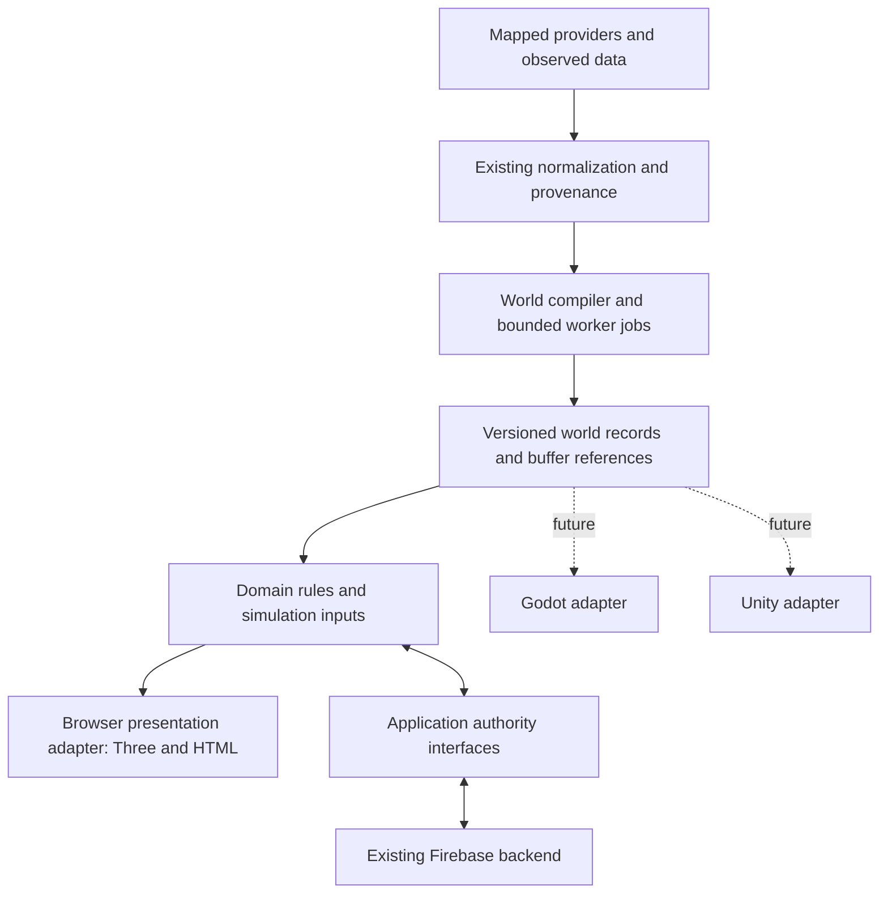

# Target architecture

Browser-first, incrementally engine-portable. This is a design, not a claim that all boundaries have been implemented.

## Preserve existing owners

`world-load-request/session` own requested location and cancellation; compiler publication owns the selected world's output. `WorldSnapshot` remains a summary until a clearly versioned richer record contract is proven. `transport-source-normalizer`, topology models, building provenance, interior layout and expedition rules remain the starting implementations. Do not add a second compiler or query layer merely to achieve clean diagram boxes.

World/session owners acquire resources and expose idempotent teardown. Rendering owns meshes/materials/texture references and GPU release. Domain records must not contain Mesh, Material, Scene, Vector3, DOM nodes, Firestore snapshots or live credentials. During transition, a mesh may reference a domain ID, but gameplay resolves that ID through the existing owner rather than rebuilding meaning from the mesh.

## Proposed record boundaries

| Contract | Required fields/invariants | Existing starting point |
| --- | --- | --- |
| Coordinate frame | ID, origin, axes/handedness, units, scale, datum/epoch where relevant; geographic coordinates separated from local render coordinates | world-load-request, geospatial/data-contract, planetary/runtime/world-address |
| Building definition | Stable source ID, provider/version, parent/part relations, footprint rings/holes, resolved height/base/levels, entrance references, provenance and inferred flags | building-provenance-model and load-building-pass computed values |
| Road network | Source identity, topology/connectivity, layer/access/direction, physical width/height units, surface/structure references | transport-source-normalizer/network/structure models |
| Terrain definition | Source/coverage/grid transform/resolution, vertical datum, elevation asset/content hash and fallback status | accepted ground/district ground selection |
| Interior definition | Building/space/revision references, floors, walls, openings, connectors and surface IDs | shared functions/interior-layout.mjs; not a new schema with independent writers |
| POI definition | POI identity, type, coordinates and explicit building relationship, source evidence | Existing semantic authority/association |
| Vehicle definition | Stable catalog ID, unit-explicit mass/speed/control parameters, collision proxy, licensed visual asset reference | physics/vehicle-config, aviation/maritime catalogs |
| Player/resources | Existing version, inventory identities/quantities, progression, equipment and receipt references | connected-player-state, backpack model, expedition/cargo rules |
| Command/result | requestId, actor context, expected revision where applicable, typed action payload; accepted/rejected/current revision/receipt | Existing economy/property/expedition APIs |

Use JSON for bounded semantic records and typed buffers for large grids/geometry. Keep runtime indexes/maps out of serialized records; reconstruct them from canonical arrays with explicit ownership. Reject non-finite coordinates and unknown unsupported major schema versions. IDs remain strings, not imprecise numeric conversions. Preserve unknown future fields where round-trip requirements apply. Do not export private source photographs or user data in a world snapshot.

## Authority interfaces

Start with existing `platform/account-service.js`, `js/*-api.js`, connected wallet/player/property wrappers and expedition shared authority. Narrow their consumer-facing contracts before moving files:

- Account: observe normalized identity, sign-in/out lifecycle; hide Firebase user objects from domain rules.
- PlayerState: read/subscribe versioned state and submit supported commands.
- Economy/Property: submit existing idempotent server commands, observe results; preserve operation IDs across retry.
- Multiplayer: room admission, leave, presence lease and revisioned shared activity; ghosts remain derived presentation.
- Capture: drafts, upload capability, submit revision, review/publish and authorized asset resolution. Entitlement never implies private-media access.

These are interfaces around current authorities, not six new databases or duplicate state stores. Domain tests can inject these interfaces; the production implementation continues using Firebase. A future native client can call the same server contract with its own authenticated platform adapter.

## Simulation and rendering

Keep local simulation coordinates near an origin and preserve geographic/astronomical coordinates separately. Do not store galaxy distances in the same float mesh coordinates used to walk a room. An engine adapter must map axes/scale explicitly and use equivalent recorded source data. Native physics facilities may consume collision/specification data, but controller tuning, time steps and network reconciliation require new validation.

Worker jobs carry requestId/generation and one bounded work item. Stale results are discarded and their buffers/resources released. Transfer ownership once; do not leave both a structured object graph and a flattened copy indefinitely. Profile preparation, queue, compute, transfer and assembly separately. Rust/Wasm must fit this same job interface if later justified; no worker/Rust parallel authority.

Keep the current renderer while extracting a representative definition boundary. A WebGPU experiment belongs behind a renderer selection boundary after a controlled Three dependency upgrade, with visual/interaction/teardown parity and feature detection. Existing shaders/loader/postprocessing code stays Three-specific.

## Instrumentation

Production contract: cheap build identity, environment/phase, numeric owner counters, bounded errors, renderer counters and capability flags. Expensive scene/geometry/material reports load and run only on explicit request. Performance sampling must not repeatedly invoke a full world snapshot. Domain state mutation is not part of the public read-only diagnostic API.

## Type strategy

Start with JSDoc/checkJs or narrow TypeScript declarations for commands, frames, resolved records and worker payloads. Then convert pure boundary modules when changing them. Preserve source maps and existing browser module/build identity rules. Do not promise native code reuse from TypeScript alone: shared schemas/golden vectors are portable, and pure logic still requires a compatible runtime or port. No full conversion, Rust package or engine installation is necessary now.
