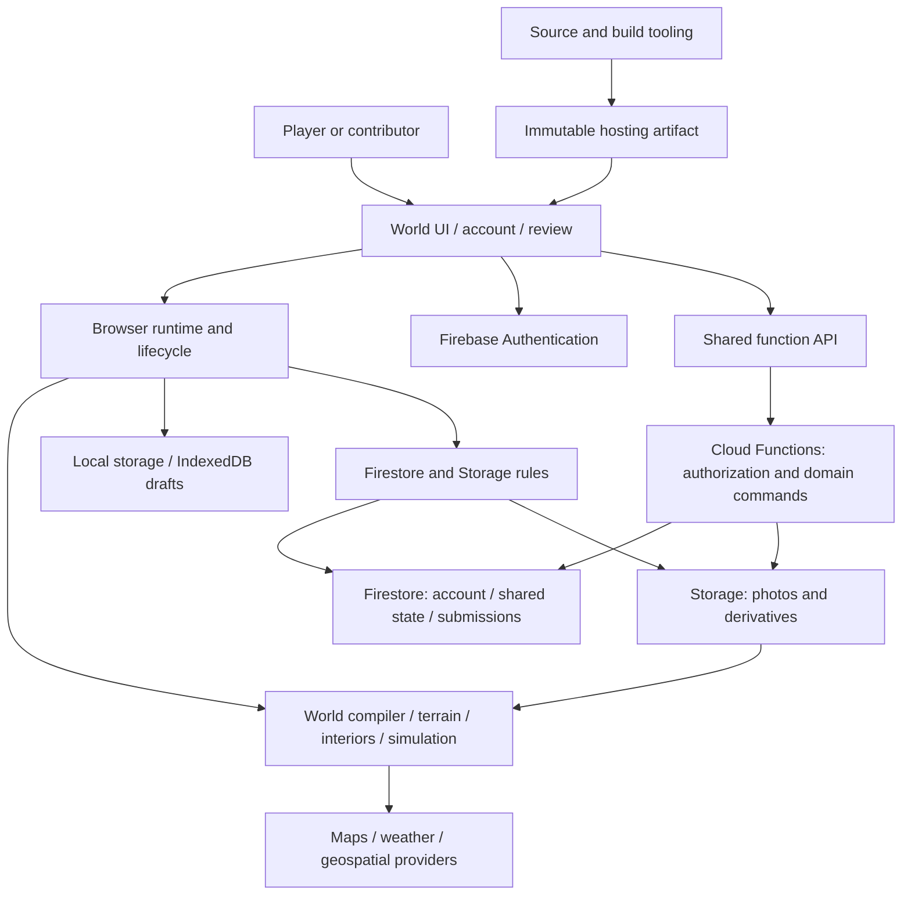

# Architecture and system inventory

Source snapshot: September 10, 2026, HEAD `53452516`. Paths below are relative to the repository. This is a subsystem inventory, not a claim that every exported function was exercised.

## How the application fits together

There are several authorities, meaning several places that decide what is true. The browser controls moment-to-moment rendering and local simulation. Backend commands and security rules control protected shared changes. Device storage holds local state and drafts. Generated scenery is not itself a saved account record. Confusing these boundaries creates disappearing progress and mismatched expectations.

## Source footprint

The inspected tracked snapshot had 1,567 files, including 1,105 code files excluding vendor code, 696 modules under `app/js`, 156 test files, 150 verification-script files and 155 npm scripts. The release configuration named 42 gates across 15 systems. These are size measurements, not quality scores.

The shared-context module creates a mutable object with no declared schema. A lightweight scan found 164 modules importing it directly and approximately 800 accessed property names in those modules. The property count is a textual approximation, not a type graph. The architectural concern is that dependencies and ownership can be implicit.

## Subsystem catalog

| System | Main source owners | State and important boundaries |
|---|---|---|
| Startup and module loading | `app/js/app-entry.js`, `modules/manifest.js`, `modules/script-loader.js` | Script readiness, startup failures, external dependencies. |
| Runtime orchestration | `app/js/runtime/kernel.js`, `lifecycle-scope.js`, `workload-policy.js`, `core-frame-systems.js`, `earth-runtime.js` | Frame work, on-demand systems, lifecycle cleanup. |
| Renderer and input | `app/js/engine/`, `controls/`, `ui/`, `hud/` | WebGL lifecycle, quality, keyboard and touch ownership. |
| Earth and terrain | `app/js/world/`, `terrain/`, `earth-core/`, `geospatial/` | Provider data compiled into bounded playable scenes; coordinate consistency. |
| Live context | `app/js/live-earth/`, `weather/`, `sky/`, `places/`; `functions/geospatial.js` | External feeds, attribution, freshness and failure handling. |
| Movement | `app/js/walking/`, `boat-mode/`, `plane/`, `transport/`, `physics/` | Collision, vehicles, spawn location, transitions and input focus. |
| Living world and urban simulation | `app/js/living-world/`, `urban-sandbox/`, `character/`; `functions/urban-sandbox.js` | Local simulation and protected shared commands. |
| Player state and economy | `app/js/player/`, `economy/`; `functions/player-state-authority.js`, `economy-authority.js` | Local backpack/condition models versus connected server authority. |
| Discovery | `app/js/discovery/`; `functions/discovery.js` | Profiles, receipts, rewards and trades. |
| Property and housing | `app/js/real-estate/`; `functions/property-authority.js` | Parcels, addresses, ownership and connected property state. |
| Interiors | `app/js/interiors/`; `functions/interior-layout.mjs` | Layout geometry, floors, ceilings, entrances, traversal. |
| Reality capture and editing | `app/js/reality-capture/`; `functions/community-reality-capture.js`, `reality-capture-patch-derivative.js`, `capture-account-cleanup.js` | Device drafts, uploaded images, submissions, review, generated derivatives, world consumption. |
| Shared rooms and social | `app/js/multiplayer/`; `firestore.rules` | Room discovery, membership, presence, poses, chat and invitation boundaries. |
| Building and creator tools | `app/js/block-builder/`, `editable-world/`, `creator/` | Local editing versus authorized published/shared changes. |
| Activities | `app/js/fishing/`, `flower-challenge/`, `deflock/`, `leaderboards/`, `activity-discovery/` | Activity rules and score publication; not every activity independently exercised. |
| Other environments | `app/js/ocean/`, `planetary/`, `space/`, `solar-system/`, `universe/`, `expedition/` | Separate environments and transitions; expedition persistent state. |
| AR | `app/js/ar/` | Capability and session handling; persistent anchors are not established here. |
| Identity and API access | `js/firebase-init.js`, `firebase-environment-policy.js`, `auth-ui.js`, `function-api.js` | Auth, environment selection, App Check plumbing and request semantics. |
| Account and review | `account/index.html`, `account-center.js`, `contribution-workspace.js`, `admin.html`, `js/admin-dashboard.js` | Permissions, contribution status, reviewer actions and coherent navigation. |
| Billing and analytics | `js/billing.js`, `analytics-service.js`, `site-analytics.js`; backend handlers | Payment/account integration and event collection; no financial-flow acceptance certification in this audit. |
| Backend | `functions/index.js` plus domain modules | HTTP endpoints, authorization, deletion, shared data commands and generated command engine. |
| Delivery and verification | `scripts/`, `config/`, `.github/workflows/`, Firebase configuration | Builds, artifact identity, release gates, environment selection and evidence. |

## Where data lives

| Location | Meaning to the owner | Required product wording or guarantee |
|---|---|---|
| Browser localStorage | Saved on this browser/device; some stores use fixed keys rather than user-specific keys. | Say when progress is local; verify account switching explicitly. |
| IndexedDB | Larger device-local drafts and photo batches. | Explain whether drafts survive sign-out and how to recover/export them. |
| Firebase Authentication | Login identity. | Removing a login alone does not remove all associated content. |
| Firestore | Shared structured records: users, rooms, contributions, ownership and other domain state. | Permissions and server commands must enforce ownership and allowed transitions. |
| Cloud Storage | Images and derived assets. | Upload completion, metadata state and published state must agree. |
| Generated runtime scene | What the player currently sees. | Confirm when an approved revision is consumed; a preview is not publication. |

A useful capture state sequence is Draft → Uploading → Submitted → In review → Published (or Rejected). Each state needs a clear owner, durable record and recovery action. The release test should trace one revision through every boundary, including returning to the updated building.

## Maintenance and operational concerns

Several handwritten controllers are large: urban runtime approximately 3,358 lines, backend index 2,797, ship interior 2,625, discovery runtime 2,414 and admin dashboard 2,202. Size is a warning about change isolation, not a defect by itself. The generated expedition command engine is intentionally generated and should not be treated as an oversized handwritten controller.

The browser uses external dependencies that are not fully represented by npm audit: Firebase SDK imports from gstatic and Three.js/addons from CDNs. The browser Firebase version and npm test dependency also differ. Pinning versions is helpful, but a browser dependency inventory and compatibility check are needed. The inspected script loader does not set integrity metadata; no Content Security Policy was found in the hosting configuration. This is a hardening gap, not a discovered vulnerability in those libraries.

Runtime diagnostics capture a bounded local set of errors. Backend logging and analytics also exist. A repository search did not establish centralized client-error ingestion, operational alerts, budget alerts, point-in-time recovery, or successful restore drills. These may be configured outside the repository; a cloud configuration review is required before claiming they are absent or adequate.

Avoid a framework rewrite as an initial repair. Introduce explicit contracts at API, persistence, review/publication and runtime-transition boundaries, using the existing modules and lifecycle machinery.
