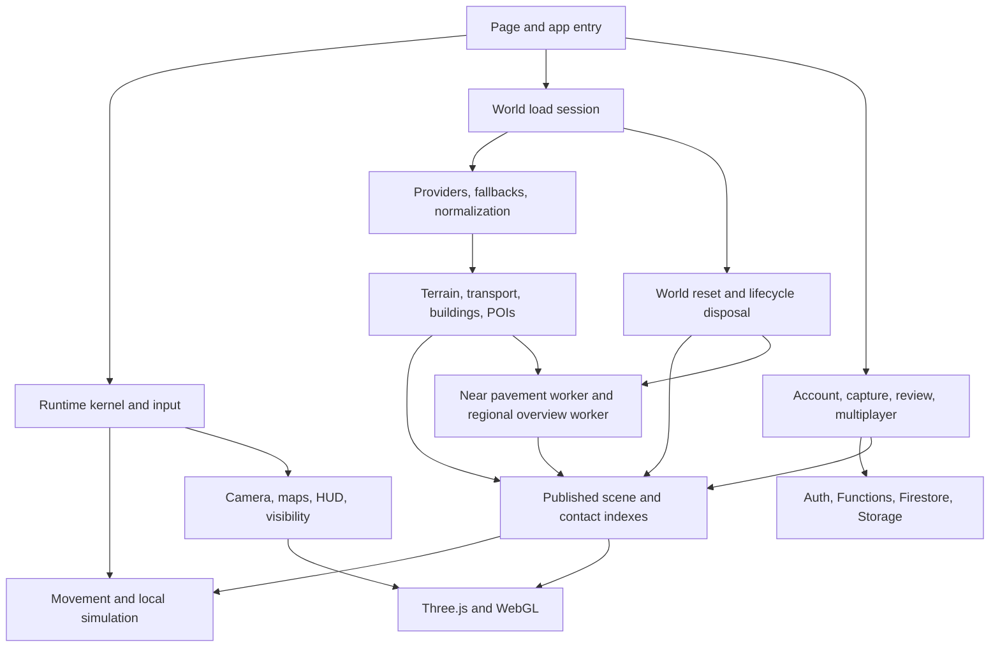

# Application performance ownership map

Companion to the [audit findings](README.md). This map records inspected responsibilities and remaining measurement needs; it does not assert that every cleanup path has been exercised. The broader product description remains in [Architecture Map](../../ARCHITECTURE_MAP.md) and [System Inventory](../../SYSTEM_INVENTORY.md).

| System and source owner | Required work and dependencies | Ownership / scheduling inspected | Audit concern or next measurement |
|---|---|---|---|
| Hosting: `scripts/hosting-artifact.mjs` | Packages pages, entries, shared modules, assets and ground release | Explicit esbuild entry list and artifact manifest | Missing street worker dependencies; packaged runtime must be tested |
| Kernel: `runtime/kernel.js`, `runtime/lifecycle-scope.js` | Orders simulation, camera, presentation and rendering | Registered systems; listener/timer/disposer scopes | Verify owners unregister on transitions; distinguish capped simulation dt from elapsed frames |
| Data/load: `world/load-roads.js`, `world/load-runtime-session.js` | Fetches and compiles a coherent selected location | Load sequence, cancellation, phase metrics, world publication | Provider retries and fallback change cost and content; record data identity |
| Transport/terrain: `world/compiler/`, `terrain/` | Road profiles, ground grading, intersections, structures and collision | Published surface revisions and geometry/contact indexes | CPU compilation, transient arrays, index lifetime and terrain publication must be profiled together |
| Pavement: `world/street-pavement-runtime.js` | Raised nearby geometry, curbs, markings, mapped paths and contact | Focus radius 384 world units; worker, cooperative conformance, staged publication, cancellation and disposal | Main-thread conformance/publication survives worker offloading; preserve terrain agreement during movement |
| Regional pavement: `world/street-overview.js` | Full loaded-location distant surface coverage | Worker compiles cells into a terrain mask; one cell per presentation tick; terminates at completion | Measure input copy, atlas upload and material synchronization; not interchangeable with near collision geometry |
| Buildings: `world/load-building-detail.js`, `world/load-building-pass.js` | Mapped identities, external appearance, collision and entry context | Selection/publication budgets; batches and building indexes | More complete selection legitimately increases work; reduce representation cost without losing identities |
| Vegetation/furniture: `world/furniture.js` and presentation focus | Ecological context, street objects and scenery | Focus/visibility updates and world collection disposal | Measure batching, buffer cost and movement-time publication before removing scenery |
| Flight/controls: `plane-mode.js`, `plane/`, `controls/` | Aircraft handling, controls, movement and camera | Existing flight source matches live; shared frame scheduler supplies updates | Distinguish lost frames from altered dynamics; sustained boundary flight missing from acceptance |
| Driving/contact: `physics.js`, `physics/road-query-policy.js` | Selects reachable road surface and handles transitions | New elapsed-time/movement/revision query policy | Changed from live; inspected call is driving, not evidence of aircraft cause |
| Living world / urban / aviation / maritime / discovery | Traffic, actors, services, airports, waterways and progression | Startup awaits several runtime initializations; world reset disposes their owners | Sequential startup already exists in live; measure each prerequisite before deferring needed behavior |
| UI, maps, weather: `runtime/core-frame-systems.js` | Navigation, controls, environment and feedback | HUD roughly 15 Hz; minimap 4 Hz in plane/5 Hz otherwise; focus about 5 Hz; weather refresh trigger 5 seconds | Effective inner work may be gated; trigger count alone is not a cost measurement |
| Reality capture: `reality-capture/nearby-refresh.js` and presentation | Reviewed photos/interiors attached to mapped buildings | One pending refresh; same-world trigger requires elapsed time and movement; reset clears presentation | Necessary feature; profile request/media/cache lifetime before changing |
| Accounts/review/backend: account entry points and `functions/` | Identity, protected edits, publication and shared data | Separate pages, Auth/Firestore/Storage and command boundaries | Not production-write tested here; preserve authorization/idempotency and complete publish-to-world journey |
| Local persistence, Blocks, progression | Retained player/draft/game-created content | Domain stores rather than scene as sole authority | Do not clear user data to reduce memory; test unload/reload and persistence independently |
| Ocean/planetary/space: environment and scene owners | Distinct world modes, traversal and state | Environment ownership and mode-specific lifecycle | Release Earth allocations without losing journey/cargo state; repeated transitions remain unmeasured |
| Reset: `world/load-reset.js`, `world/release-location-models.js`, `terrain/mesh-lifecycle.js` | Retires prior scene and authority | Runtime disposal, worker cancellation, cache clear, geometry/material/owned texture disposal | Need repeated-cycle retained-owner evidence; removal from scene alone is insufficient |

## Dependencies that constrain optimization

Road presentation, terrain grading, collision and building placement form a coupled surface system. Deferring one without a coherent publication boundary can create floating surfaces, invisible collision or misplaced entrances. Workers can prepare independent geometry, but the accepted terrain revision and coordinate/unit convention must travel with each result. Old results must be rejected after a location or surface revision change.

Near geometry and distant terrain coverage are two representations with distinct purposes. Their overlap/exclusion and readiness must be explicit. A failed near build cannot silently erase the only accepted pavement representation. A distant visual mask does not establish walkable contact.

Lifecycle infrastructure already exists. Extend or correct the actual owner rather than adding another timer, background loop, cache or fallback with no disposal authority. `shared-context.js` is widely used mutable shared state; replacing it wholesale during a performance repair would broaden regression risk. Introduce explicit boundaries at the measured hot path first.

## Memory accounting required for the next pass

Record source feature objects, compiler staging arrays, worker copies, geometry attribute/index buffers, contact indexes, textures, material/program counts, and retained caches separately. Include one load peak, steady street state, moving flight state, menu teardown and repeated reload. Use object retainers for leaks and renderer/resource accounting for GPU-side ownership. Avoid double-counting shared typed-array buffers or assuming browser heap equals total application memory.

The 3.3 GB browser figure reported by the owner remains a symptom to reproduce, not proof that any particular subsystem is redundant.
