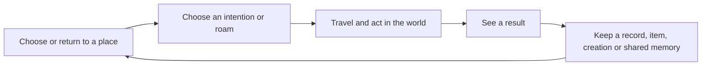

# World Explorer 3D: game design and player experience review

September 30, 2026 · reviewed source `e784ea3` · live runtime `711fe93`

## Verdict

World Explorer has enough systems to become a distinctive sandbox. Its strongest identity is **explore real places, make them your own, and share what you do there**. The current presentation makes that identity difficult to see: travel modes, field science, property, arcade challenges, civic action, building, contributions and ship management compete for attention before a player has a reason to care about any of them.

The primary problem is not the number of features by itself. It is the absence of a consistently presented relationship between **where I am, what I can do here, what changes when I do it, and why I would return**. Some of those relationships already exist in code. They need to become the player's experience.

Recommendation: make the next product milestone a coherent Earth sandbox session. Keep free travel and advanced environments available, but stop expanding the catalog until a newcomer can independently complete, understand, save and revisit one satisfying outing. This is a recommendation about presentation and release focus, not an instruction to erase existing work or force everyone through a campaign.

## Evidence and limits

This is a system-level design review, not a claim to have freshly played every feature or measured enjoyment. Evidence used:

- **Current source inspection:** the title/globe and HUD markup; menu hierarchy; First Journey and Current Journey; discovery goals, event/progression models and storage; activity catalog and completion; wallet, commerce and health; housing/storage; interaction routing; ship research and supporting system maps.
- **Previously captured browser evidence, visually inspected in this review:** current release mobile walking, London Field Guide, mobile fishing result and entered Earth interior; existing ship bridge and research bench screenshots. The Earth captures visibly identify 5.4 / `711fe93` where a version is displayed. Ship captures are supporting historical evidence, not a newly reproduced production session.
- **Fresh live read:** production build manifest still reports `5.4.0+711fe93aa54e.8d08d47f2ff10556.production`.
- **Inventory/document review:** PROJECT_DESCRIPTION, ROADMAP, SYSTEM_INVENTORY, character design, and release gate catalog. Older 5.1/5.2/5.3 statements are historical context, not proof of current absence or failure.
- **Not performed:** new WebGL session, physical-phone playtest, audio listening, economy simulation, usability study, or complete replay of cloud services. Existing functional gates do not establish discoverability, fun or retention. No gameplay code or production settings were changed.

The review covers the main player-facing system families and supporting account/creator surfaces. Detailed handling, every NPC behavior, every destination and every possible interaction still need observation during the focused acceptance work below. Design judgments are distinguished from confirmed source behavior.

## The ten highest-impact findings

### 1. The introduction ends before the player experiences a payoff — critical

**Confirmed:** First Journey teaches movement, one nearby interaction, then choosing an adventure. It can finish on opening Explorer/Backpack, changing travel mode, entering building, or selecting an activity. It does not require a completed result and a return visit. See [tutorial.js](../../app/js/tutorial/tutorial.js), especially `presentCurrentStage`, `tutorialOnEvent` and `onExplorerSectionOpened` (roughly lines 244–393).

**Player effect:** “I know how to open the game’s features” is mistaken for “I understand how to play.” The final instruction expands into driving, fieldwork, building, water, aircraft and space precisely when a newcomer needs a concrete next step.

**Fix:** retain the short controls introduction, then offer one optional, location-valid outing that ends in a visible result. Show where that result lives and one useful continuation. Do not mark the outing complete merely because a menu opened. A returning player gets Continue, not repeated onboarding.

### 2. Navigation reflects subsystems more than player intentions — critical

**Confirmed:** Explore contains Today & Nearby, Live GPS, two named challenges and places. Travel mixes the map, vehicle changes, environment changes, several space entry routes and recovery. Backpack contains inventory, Journal, Guide, skills and companions. Real Estate owns Quick Build. See [app/index.html](../../app/index.html), lines 1194–1280.

**Player effect:** someone asking “what can I do nearby?” or “how do I build something?” must predict the developer's category. “Explore” also appears on the launch globe and discovery entry; “Community Board” is substantially a rankings surface. There are useful shortcuts, but their labels do not consistently explain their destinations.

**Fix:** give Nearby one canonical activity list, Map one travel destination, Backpack a direct inventory destination, and Build a clear creation entry. Keep contextual vehicle controls. Use a secondary menu for records, social, settings and advanced features. Decide this once across desktop and mobile; do not add another competing dashboard.

### 3. Guidance is strongest inside specialist systems, weaker across ordinary play — high

**Confirmed:** Current Journey derives space and field journeys, deliberately avoids duplicating discovery-owned prompts, and suppresses transient ambient suggestions on mobile. Space already has phase-specific goals and ship routes. This is useful infrastructure, not a missing quest engine. See [current-journey.js](../../app/js/tutorial/current-journey.js).

**Design gap:** the reviewed shared guidance does not provide the same continuity for a selected home/building project, shopping intention, or ordinary town outing. Players can enter a system and lose their larger intention.

**Fix:** extend the existing selected-activity presentation to the player's chosen project. One tracked intention at a time, with destination, next physical action, cancel/resume and result. Continue respecting prompt ownership; never stack multiple objective cards. Free roaming remains a legitimate state with no mandatory task.

### 4. Results and rewards are connected unevenly — high

**Confirmed:** general activity completion records an Explorer event, completion count and best time; first completion supplies a points value. Flower completion writes a ranking, telemetry, status and temporary HUD result in its own handler. The character mapping separately recognizes selected field, building and travel events. See [activity runtime](../../app/js/activity-discovery/runtime.js), `markCompleted`; [flower challenge](../../app/js/flower-challenge.js), `completeChallenge`; [character progression](../../app/js/character/progression.js).

**Interpretation:** these paths have different result contracts. This is not proof that every activity lacks Journal integration, but it is evidence that a common player-facing payoff cannot be assumed.

**Fix:** audit each activity's actual event→record→reward chain. Every featured activity must say what happened, what changed, where it was saved and what is possible next. A score is appropriate for a race; a specimen belongs in the pack; a building visibly persists. Do not pay arbitrary currency for every button press or invent a second progression ledger.

### 5. Economy scale weakens everyday decisions — high

**Confirmed:** connected wallet and backend define 1,000,000 starting credits. Commerce defines water at 4, a snack at 6, first aid at 18 and medical treatment at 450. Food/water here restore health; this is not evidence of a general hunger/thirst simulation. See [wallet](../../app/js/economy/connected-wallet-authority.js), [backend economy](../../functions/economy-authority.js), [commerce](../../app/js/urban-sandbox/commerce-model.js).

**Implication:** at these starting values, ordinary consumables are negligible expenditures. Property may justify a larger currency scale, but that does not automatically make buying supplies interesting. Water at 4 is 0.0004% of the starting balance.

**Fix:** first decide what money is for. Recommended: meaningful optional gear, property and personalization, with basic exploration affordable. Measure earning and spending through real sessions before setting prices. Preserve existing balances and ownership. Do not “fix” this by silently reducing savings, creating a second wallet, or adding hunger merely to consume supplies. Items such as a battery pack that presently expose only Inspect should be presented as trade goods until they have a usable function.

### 6. Progression has more vocabulary than the early experience needs — high

**Confirmed:** overall Explorer ranks and tool thresholds coexist with seven attributes, nine character specialties, equipment proficiencies and companion progression. Tool goals use Explorer points at 8 and 20; character progress has its own repetition factors and milestones. “Pathfinder” also names both an Explorer rank and a spacecraft. See [explorer goals](../../app/js/discovery/explorer-goals.js), [event ranks](../../app/js/discovery/explorer-events.js), [character catalog](../../app/js/character/catalog.js).

**Fix:** show one immediate, understandable gain and one next capability. Keep depth in the profile, reveal a specialty when used, and explain an upgrade through its practical effect. Reconcile current unlock rules with older character design promises before revising them. Avoid another XP layer. Use an unambiguous ship/rank label in navigation.

### 7. “My persistent life” has inconsistent save boundaries — critical for trust

**Confirmed:** the Fieldwork interface explicitly says full Journal/Guide/companions/local history stay in this browser; eligible signed-in receipts cover only part of the state. Local and room building have different persistence. Housing already includes a primary home and storage: it would be incorrect to say homes do nothing. See [app/index.html](../../app/index.html), line 763; [profile store](../../app/js/discovery/profile-store.js); [housing model](../../app/js/real-estate/housing-model.js).

**Player effect:** account login can create a stronger expectation of continuity than the app actually guarantees. A sandbox depends on knowing that your work remains yours.

**Fix:** show a compact save destination at meaningful saves: This device, Your account, or This room. Offer recovery/export where needed. Prioritize reliable cross-device continuity for the primary loop before claiming a universal persistent life. Promote existing home storage and a dependable return route into an understandable reason to revisit; do not build a duplicate housing system.

### 8. The world often explains opportunities through panels before showing their purpose — high

**Observed:** a mobile walking capture devotes substantial space to minimap, coordinates, weather, an Observe panel, controls and five navigation buttons. The caught-fish Guide view quickly becomes a long list of missing geology/field entries. The examined visitor-center interior presents stairs and an elevator, but little visible indication of the place's purpose.

**Interpretation:** information exists, but visual attention is not consistently directed toward the action or the reward. One screenshot cannot prove all interiors are empty or all panel states crowded.

**Fix:** make nearby usable objects readable through form, placement, concise contextual prompts and state change. After catching a fish, lead with the fish and its value to this outing. Default maps to the selected objective and relevant opportunities. Offer map detail on demand. Contextualize the driving-style MPH/BRK/BOOST display when walking or inside buildings.

### 9. Core fantasy and side activities are presented at similar importance — high

**Confirmed:** DeFlock and flower hunting have prominent menu entries; free flight, ship boarding and direct Moon entry sit alongside everyday travel. Photo contribution, property and fieldwork serve substantially different motivations.

**Design judgment:** a peaceful real-place explorer, competitive arcade game, action sandbox and ship-management adventure can coexist, but they should not all define a newcomer's first minute.

**Fix:** make exploration, creation and shared places the primary promise. Keep flower races and Paint Town as optional local/room challenges. Place DeFlock in an explicitly chosen themed activity. Treat civic/combat escalation as a deliberately entered play style or clearly described room rules. Keep advanced space journeys discoverable under travel, with a clear return path and honest readiness label. Do not delete these systems merely to simplify the home screen.

### 10. Presentation quality changes sharply between systems — medium/high

**Observed:** the ship bridge has a dedicated objective and route treatment; the inspected research bench capture uses small native-looking buttons and dense technical text. Earth Guide and inventory use different information structures. These differences make subsystems feel separately assembled.

**Fix:** establish one action/result/panel vocabulary: consistent button hierarchy, close/back behavior, typography, focus handling, touch sizing, failure messages and save feedback. Let science retain accurate units in detail views while explaining the immediate player decision first. Review sound and animation in a real session; source contains audio hooks, so an “audio is absent” claim would be unsupported.

## Whole-app disposition

“Core” means prominent and polished; “optional” means preserved and discoverable through context. These are design recommendations, not claims that optional features are broken.

| System family | Current role/evidence | Recommended role and work |
|---|---|---|
| Landing, globe, search, favorites, recents | Chooses real destinations; many launch possibilities | Core. Continue last outing and offer a curated suggested start plus anywhere search. Explain bounded destination changes. |
| Walking, camera, interaction | Foundation for every grounded action; shared context router | Core. Consistent reach, prompt, cancel and recover. Preserve recent smoothness fixes; no speculative FPS project. |
| Car, drone, plane, boats, airports | Freedom and alternate views of the same place | Core travel tools. Make entry/exit and mode changes explicit; use optional scenic routes rather than forcing racing. |
| Map, POIs, historic places | Rich geographical context and navigation | Core. Filter for usable places and selected intention; separate information-only markers from activities. |
| World scenery, terrain, traffic, pedestrians | Gives places atmosphere | Core support. Prioritize traversable, readable nearby spaces and purposeful encounters over additional world size. |
| Interiors, shops, service locations | Entry, commerce and recovery | Connect. Featured interiors need a visible function and exit. Do not imply every mapped door is a rich authored location. |
| Health, supplies, medicine, vehicle condition | Costs and recovery; health authority exists | Support. Explain causes and recovery; keep downtime short. No mandatory survival expansion without a design reason. |
| Equipment and quick slots | Shared tools and actions | Core. Direct access, clear equipped state and usable verbs; distinguish collection from tools and sale-only goods. |
| Fieldwork, leads, geology, ecology | Strong place-specific repeatable actions | Core activity family. Recommend a few locally valid opportunities and preserve uncertainty about real-world evidence. |
| Journal, Field Guide, life lists | Memory, collection and knowledge | Core records. Show acquired results first; unfinished catalog entries belong behind an explicit collection view. |
| Character, skills, traits, qualifications | Long-term capability | Secondary depth. Introduce through play; explain benefit before stat vocabulary. |
| Companions | Attachment, travel and care | Core optional companion. Show current useful behavior and care reason; avoid a second early management tutorial. |
| Fishing, diving, ocean | Coherent place→equipment→action→catch/survey loop | Keep. Strong candidate for an accessible complete outing; promote only where water access is usable. |
| Flower Sprint | Quick timed challenge with leaderboard | Optional event. One stable name across title, menu and results; tie to a place/room and show completed record. |
| Paint Town | Competitive/shared territory activity | Optional room event with clear start/end and participation rules; distinguish temporary claims from property ownership. |
| DeFlock Hunt | Distinct virtual camera activity | Optional themed challenge, not a default explanation of the whole game. Preserve fictional-action explanation. |
| Generated races, walks, roof/drone/boat routes | Activity catalog can generate multiple routes | Optional. Validate reachable starts, route feasibility and finish before recommending. A generated description is not quality proof. |
| Credits, trade, upgrades | Shared economic authority | Connect. Consistent scale, source/sink purpose, visible practical benefit; preserve existing player wealth. |
| Property, primary home, storage | Existing ownership and belongings anchor | Core aspiration. Make home useful and returnable before foregrounding market detail. Claiming real estate should not be a prerequisite to basic creative play. |
| Quick Build, Blocks, editable world | Persistent player expression | Core. Rename entry around Build; placement, undo, permissions and saved result should be evident. Reuse existing ownership/storage. |
| Photos, facade/home editor, capture/survey | Differentiator: improve a real place | Advanced creation. Guided building selection→draft→preview→submit→status, with privacy and approval visible. Keep specialist editing out of first-session requirements. |
| Rooms, chat, friends, invites, shared vehicles/builds | Social container and shared actions | Core optional play together. Join a place with a purpose; show who is present and what is shared. Do not promise all local actions synchronize. |
| Rankings, memory markers, sharing | Competition, expression and return invitations | Supporting. Name rankings Rankings; make shared links lead to the intended place/activity rather than generic setup. |
| Planets, rovers, samples, atmospheric worlds | Extension of exploration into other environments | Advanced destinations. Reuse the same preparation, action, result and return vocabulary. |
| Free Space Flight, Wayfinder, Pathfinder | Travel and piloting fantasy | Optional major branch. Explain how direct travel differs from flying a journey and how to return to Earth. |
| Solis Reach, Expeditions, crew, research, resources | Deep connected specialist game | Preserve, focus separately. Route guidance is promising; full visible procedures and cohesive station UI precede wider promotion. |
| Live GPS, AR, live-data overlays | Optional real-world/sensor context | Utilities. Contextual entry and capability explanation; no requirement for normal sandbox play. |
| Account, privacy, contributions, billing, moderation | Supports identity, creator workflow and trust | Supporting surfaces. Clear return to game and save/publication state. Keep real-money support distinct from game credits. Detailed account UX still requires its own walkthrough. |
| Controls, accessibility, settings, audio | Cross-cutting usability | Core support. Same intent on keyboard/touch; meaningful focus and readable prompts; verify audio and real devices during the focused slice. |

## The proposed game structure

**Player promise:** “Pick a real place. Explore it, find things worth keeping, create something of your own, and return with friends.”

Three equally legitimate motivations sit inside that promise: discovery, expression and social play. A player can also simply drive or fly. Rewards should acknowledge those choices rather than making every route feed compulsory science work.

Use the existing map, activity catalog, Journal/event store, Backpack, property and room authorities. The integration work is to connect the selected intention and its result across those systems. Adding another home dashboard, quest database, currency or inventory would reproduce the current fragmentation.

### Suggested navigation

- **Nearby:** at most three initial recommendations; more activities available on request. Each says what you do, distance/route, estimated duration, required equipment, solo/shared and likely result. These are proposed limits, not current behavior.
- **Map:** where you are, selected route, saved places/home, world boundaries and destination travel. Advanced environments live here rather than occupying multiple equally prominent travel entries.
- **Backpack:** opens inventory directly. Journal/Guide/Profile remain clearly named record destinations accessible from it or the secondary menu, without another nested “open Backpack” step.
- **Build:** creation tools and saved projects; property requirements appear only when relevant.
- **Menu:** friends/rooms, records shortcuts, settings, controls, account and advanced tools. In a room, a compact social indicator is visible during play.

Desktop may use labeled shortcuts; mobile can collapse infrequent destinations. Keep one main context action, a small map, relevant condition feedback and optional tracked intention visible while playing. Do not cover the world with every system's status at once.

### A concrete first 15 minutes

This is a proposed experience, not a current feature claim.

1. **Arrival:** Continue, Start exploring, or Join a friend. A new player may accept a suggested accessible Earth location or choose anywhere. Offer readable exploration lighting without pretending it is current real local time.
2. **First action:** learn movement and use one visible object. Show at most three locally verified suggestions: a short place/discovery outing, a drive to a viewpoint, or a small building project. No forced purchase or account wall for basic roaming.
3. **Chosen outing:** select the discovery outing in this example. One destination and next action stay visible; existing equipment is equipped with an explanation. Let the player abandon it without penalty.
4. **Payoff:** perform the actual observation/collection procedure. Show the finding, what was learned/acquired, where it was saved and any actual capability progress. Keep collection versus observation honest.
5. **Ownership:** let the player find that result again in the pack/Journal. Offer an existing home/storage or saved-place continuation where supported; do not invent a free property grant as a shortcut.
6. **Return reason:** offer one related action, a different nearby activity, or an invitation to share the place. On reload, restore enough context to continue and accurately identify which state persisted.

Parallel drive/build paths need equally concrete endings: arrive and retain the route/place record; or place, undo, save and revisit a creation. Freedom remains throughout. The first session demonstrates the sandbox instead of presenting its entire manual.

## What is missing, what is excessive, what stays

**Missing at the product level:** a visible primary loop, a completed introductory payoff, one selected intention across systems, consistent result/save communication, a dependable return reason and a shared presentation standard. Some underlying mechanics already exist; do not rebuild them simply because they are poorly surfaced.

**Excessive in the early experience:** equal prominence for niche challenges; multiple space entry choices; map/status detail while walking; empty collection categories ahead of acquired results; progression terminology before its effects matter; specialist management before basic attachment to a place.

**Worth protecting:** unrestricted travel, real geography, multiple vehicles, field discovery, companions, persistent creations, existing home/storage, social rooms and user contributions. These can distinguish the game. Do not solve confusion by turning everything into a mandatory linear campaign.

**Do not add now:** another minigame family, another XP system, another currency, compulsory hunger, a full quest campaign, more planets as a substitute for purpose, or a universal world simulation rewrite. Preserve the accepted frame-rate target and fix newly demonstrated stalls only when relevant.

## Implementation order and acceptance

| Priority | Work package | Dependencies and completion standard |
|---|---|---|
| P0 | Define one navigation vocabulary and first-session loop | Reuse current owners. A newcomer can find nearby play, inventory, map, Build and return/exit without knowing internal system names. |
| P0 | Finish one Earth outing end to end | Valid start and route, actual action, visible result, accurate save destination, reload and continuation. Tutorial completion measures payoff, not panel opening. |
| P0 | Make persistence and recovery legible | Inventory current device/account/room ownership; verify save/reload and an interrupted operation for the selected loop. No loss of old progress. |
| P1 | Integrate results and selected intentions | Audit activity event mapping; one result contract and one selected objective; cancel, leave world, resume and repeat do not double-award. |
| P1 | Give home/building and social play a clear purpose | Use existing primary home/storage and room authorities; complete a saved creation and a two-player shared action with understood permissions. |
| P1 | Simplify HUD, terminology and progression presentation | Same critical actions on desktop and 390×844; no conflicting prompts; unlocked capability and current tool understandable without reading a manual. |
| P1 | Tune economic purpose | Measure real earning/spending and meaningful choices; plan migrations explicitly. Never reset balances as an incidental cleanup. |
| P2 | Polish optional activities and specialist environments | Consistent start/action/result/exit, close/back behavior, sound/animation and save feedback; promote only those meeting the same standard. |

Start with one representative Earth place that has an accessible route, useful POI, nearby field opportunity and legal building context. Validate a sparse/arbitrary destination next so the solution does not work only in the showcase. If no good nearby activity exists, say so and offer roaming or another place; do not fabricate an unreachable opportunity.

### Usability acceptance, separate from technical tests

Proposed first round: five people unfamiliar with the app, no coaching, with both desktop and actual touch-device sessions represented. This is a small directional study, not statistical proof. Ask them to:

1. Find something they want to do and begin within two minutes of a ready world.
2. Finish a meaningful action and explain what changed.
3. Locate the resulting item, record or creation and say whether it is saved on this device, account or room.
4. Recover from a wrong turn or unwanted activity without restarting the game.
5. Leave and return to the relevant place/project.
6. After 15 minutes, name something they want to do next and why.

For a first gate, target at least four of five completing the primary loop without intervention. Record wrong turns, abandoned panels and misunderstood terms, not just time. Two friends should separately prove joining the same place and correctly identifying the shared action/result. Physical-phone handling and audio need direct observation, not screenshot approval.

Technical checks then guard the changed journeys: event deduplication, no lost saves, menu/back behavior, usable route/interaction, room permissions, mode transitions and cleanup. Existing release tests remain useful, but their pass count must not substitute for the uncoached player outcome.

## Visual evidence references

- [Mobile walking HUD](../../output/release-evidence/current/performance-mobile-390x844.png): map/status/control density and duplicated action presentation to review in motion.
- [London Field Guide](../../output/release-evidence/current/regional-richness-london-desktop.png): substantial panel area and layered collection/progress vocabulary.
- [Mobile caught-fish Guide](../../output/release-evidence/current/unified-fishing-guide-catch-mobile.png): the recorded fish followed by unrelated incomplete identification categories.
- [Entered visitor-center interior](../../output/release-evidence/current/interior-entered-desktop.png): traversable interior with weak visible destination purpose in this view; not proof of every interior's content.
- [Ship bridge](../../output/verification/ship-gallery/ship-bridge.png): useful current objective and route guidance to build on.
- [Research bench](../../output/verification/ship-research/science-bench-mounted.png): inconsistent interaction-panel finish in the inspected historical capture; recheck on the selected implementation candidate.

The next meaningful milestone is a player saying, “I know what I can do here, I did something I care about, and I know how to come back to it.” That outcome should determine which existing features receive attention next.
