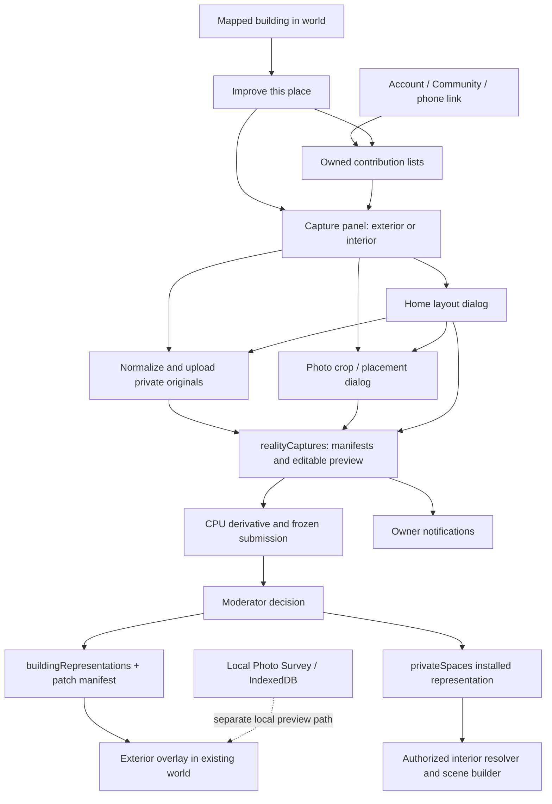

# Reality Capture: independent system audit and proposed direction

September 10, 2026. Source baseline: `3f388d31`, branch `steven/building-exteriors-local`.

## Recommendation

Retain the working exterior pipeline and shared interior geometry/compiler. Replace the fragmented editing journey with one building workspace, one photo library within that workspace, and explicit draft/review/visibility states. Redesign interior authoring around a known room, an optional plan, and unassigned space. Moving the existing grid higher does not resolve its interaction model.

This is an audit and implementation proposal, not redesign implementation or release approval. No production services, records, rules, functions, or configuration were changed. No reconstruction was launched. No cloud test records were created. Existing source and local drafts were preserved.

## Evidence and scope

- Verified the requested repository, clean starting Git status, expected branch, all eight handoff commits, worktrees, and listening servers. Port 4195 belongs to this repository (PID 82215); 4197, 4198 and 4200 also have existing listeners and were left alone. No AGENTS.md was found in the repository/checked ancestor locations.
- Read the requested verification notes and relevant recent sections of the very large ignored `progress.md`; traced current inventory, architecture map, schema consolidation, manual capture, digital home, polish and prior interior audit documents against source.
- Fresh ordinary browser: entered the requested local world, saw Michael Drive and mapped buildings, selected a building and reached “Improve this place.” The signed-out contribution/library actions did not produce an open workspace in this session. The subsequent snapshots did not show a usable sign-in action. This is a **visible symptom**, not a proven diagnosis of all browsers.
- Local browser logs repeatedly reported `appCheck/recaptcha-error`, including the approved-representation refresh path. Local standalone capture displayed Google/email sign-in. This verifies that normal local attestation is still failing in this browser, not that every staging login fails.
- Staging subsequently restored an existing signed-in session and loaded its contribution library. Read-only UI inspection opened the existing interior and published exterior; no upload, save, continuation, deletion or moderation action was performed. An initial staging App Check network error did not prevent the list from subsequently loading. The handoff hosting artifact remains a reported prior artifact, not a newly verified deployment identity.
- **Fresh real-account failure:** the interior showed seven uploaded photos and “Ready to edit.” “Open floor-plan grid” opened a setup form with no grid and the error “The mapped outline needs a unit boundary before a safe plan can be made: Living / kitchen needs space for wall thickness inside the building.” The actual screen was visually inspected. No private photo pixels or account credentials were copied into this report.
- The published exterior opened with 48 uploaded photos and “Published exterior,” but also showed “Reconstruction preview,” text describing a private result awaiting review, a one-photo minimum, and a later facade instruction requiring 20 photos. These are fresh visible contradictions on an existing record, not merely hypothetical copy concerns.
- Fresh isolated Node execution of the real layout code: drawing a rectangle from (2,2) to (6,7) inside a 10×12 m starter changed **1 room / 1 door into 5 rooms / 5 doors**. Also verified that two nearby exploration origins produce different `earth:v1:…` keys.
- Inspected the existing `output/verification/interior-layout/412-initial-entry.png`. This is **prior component evidence**, not a fresh Android screenshot. It shows the grid, but also three view buttons, two selectors, instructions and room tools; save and photos are further below. A temporary browser viewport override was reset; it is not physical-device evidence.

Evidence labels below distinguish **source-confirmed defect**, **fresh visible symptom**, **usability finding**, and **architectural risk**. No finding implies a fresh inventory of deployed private records.

## Current workflow and authorities

| Authority | Actual responsibility and boundary |
|---|---|
| Provider building, `runtime-contract.js`, `alignment.js`, `ui.js:342` | Select existing mapped identity; snapshot footprint, height and local alignment. Captures do not create another mapped building registry. Target also carries an exploration-origin-derived world ID. |
| `realityCaptures`, `community-reality-capture.js` | Owner, target, upload slots/manifest, preview revisions, current submission/review, continuation lineage, processing state. Proposed separate `reviews`/`representationRevisions` collections in older plans are not the current authority. |
| `reality-capture-authority.js`, processing module | Admission, state transitions, consent, cost restrictions, attempt/lease controls. Current admission is 8 captures per user/day and 32 globally/day; continuations copy media and consume admission when first created. |
| Storage originals and processed paths | Write-once upload slots; backend decoding/validation; generation-pinned originals and manual derivatives. Firestore stores references/metadata, not image blobs. “Original” here is the normalized upload, not necessarily the untouched camera file. |
| `privateSpaces` and member/session/one-time grants | Owner and access policy; pending versus installed capture; reviewed public grant. This remains independent of exterior publication and virtual property ownership. |
| `buildingRepresentations`, `buildingPatchManifests` | Approved exterior display records and overlap occupancy. Neither is the provider building database. |
| `interior-layout.mjs`, `authored-geometry.js`, `interiors/scene-builder.js:818` | Shared layout validation/compiler supplies surfaces, wall solids, floors, ramps and authored runtime collision. This is worth preserving; the historical claim that all interiors still use only proxy collision is stale for authored homes. |
| IndexedDB `world-explorer-reality-capture-v1` | Device recovery under UID/capture/room keys; separate survey batches and local previews. Device recovery is not account sync or permission authority. |
| `users/{uid}/notifications`, `capture-review-notice.js` | Owner activity receipts; moderator email is a separate delivery path. Neither proves push or inbox arrival. |

Returning users use complete owner-list pagination in `js/community-reality-capture-api.js:124`; building entry and mode switching search exact world/building matches before creating drafts (`ui.js:549`, `939`). Multiple matches produce a chooser. Continuation creates an idempotent new capture with copied originals and reset public-request consent (`community-reality-capture.js:193`). Phone links carry only a capture ID; the same account must resolve it. Localhost handoff correctly refuses to pretend a phone can reach the desktop (`capture-session.js:7`).

## Prioritized findings

### Immediate P1 — The real saved interior still cannot open a floor-plan grid

**Fresh authenticated staging reproduction.** The seven-photo interior reaches the error recorded above, while the parent promises that no measurements are required to open the grid. `home-layout-editor.js:224` catches starter failure and leaves the editor hidden. `interior-layout.mjs:218` builds a rectangle from the rotated footprint's bounding box, then validates it against the actual envelope; this strategy does not guarantee a valid starter inside an irregular mapped shape. The exact failing geometric constraint on this account was not inspected by extracting private record data, so that causal detail remains to verify.

This is the first representative case to retain for diagnosis with permission. Provide a valid blank editing canvas showing the mapped boundary even when a starter cannot be generated, and a visual way to identify the unit/known room. Do not require unexplained X/Z coordinates to recover. Acceptance must use this actual footprint shape (or an anonymized equivalent), not just rectangular fixture buildings. Do not bypass containment validation.

### 1. P1 — The same physical building can split across exploration origins

**Source-confirmed behavior; architectural defect relative to the requested integrated world.** `app/js/editable-world/model.js:27` constructs a world ID from the exact starting latitude/longitude. `ui.js:356` uses that in capture targets; account grouping, mode switching, exterior filtering and interior resolution require exact world matches. Fresh execution produced different keys for the supplied origin and a nearby origin.

A user approaching the same provider building from another search/GPS origin can fail to find its work in the building-scoped journey, although the all-account library still contains it. Geographic isolation must not be removed blindly: distinguish intentional private world/session scope from global physical-building identity. Add a shared target-resolution contract using existing provider IDs and explicit scope; preserve legacy references through aliases. Verify one actual building from two entry origins before migration. Provider ID replacement/split/merge reconciliation is also unverified.

### 2. P1 — Continuing an approved exterior lacks a publication replacement path

**Source-confirmed blocker; not exercised through a live moderator browser here.** Continuations retain placements under a new capture ID (`community-reality-capture.js:193`). Approval retains all patch regions except those with the *new* capture ID and rejects overlap (`:958`). It does not retire the source capture's occupied regions through continuation lineage. An overlapping improved version therefore hits `approved_patch_overlap_requires_resolution`.

Preserve the overlap protection for other contributors. Add an explicit reviewed replacement of the contributor's exact prior revision, atomically updating occupancy and active publication while keeping history. Acceptance must include original approval → continuation → changed crop → approval → another user's world refresh. The current private continuation test stops before this failure.

### 3. P1 — Account deletion does not clean up capture ownership/media

**Source-confirmed cleanup omission.** `functions/index.js:953` deletes user data across many systems, but does not include capture roots, private spaces/grants, capture media or publications; `:1746` then deletes the Auth user. The capture-specific deletion endpoint exists (`community-reality-capture.js:491`), but is not called by account deletion.

This can leave retained private media and ownership references after successful account deletion. Define the retention/withdrawal treatment of approved public contributions separately; do not casually delete installed work. Implement a durable, retryable cleanup job with tombstones, media-generation accounting and an explicit retention policy. Test only disposable emulator/staging accounts, including interruption and retry.

### 4. P1 — Ordinary entry and attestation are not accepted

**Fresh visible symptom plus confirmed local App Check failure.** The local world loaded and building selection worked, but contribution actions did not reach an editor/sign-in flow in this ordinary browser. `ui.js:978` returns after an optional sign-in notice for signed-out users; building entry similarly reports an error (`:947`). The Community action also silently returns until Earth readiness (`runtime.js:202`). These are candidate causes of dead-end experiences, not a conclusive diagnosis of the observed symptom.

Make entry stateful: loading, sign-in required, retryable service failure, and ready, with building intent preserved through authentication. Verify normal attestation on staging HTTPS and physical Android without temporary debug registration. Do not disable App Check to make acceptance green.

### 5. P1 — Drawing “a room” invents a partitioned house

**Usability finding, behavior freshly reproduced.** `layout-drawing.js:4` implements a rectangle as four full-space splits; `interior-layout.mjs:99` adds doors when splitting. One rectangle produced five rooms and five doors. The component test explicitly expects five rooms (`scripts/verification/interior-layout-ui.mjs:32`), so its pass confirms the implementation rather than the user's intended task.

Keep the compiler and mapped-envelope constraints. Redesign the interaction: one drawn room becomes one known room; leftover area remains unassigned rather than named rooms with invented openings. Distinguish “draw room” from “divide existing room.” Door placement should be a deliberate structural action with a clear connected-room preview. Suggested layouts may remain optional previews, visibly different from observed geometry.

### 6. P1 — Progressive editing becomes obstructed after photo placement

**Source-confirmed broad guard; usability problem.** `home-layout-editor.js:158` and `:194` block divisions whenever *any* room has patches, even if the edited room is elsewhere. This conflicts with improving a home room by room. Surface-ID checks already exist at `:96`, but the division guard is broader.

Calculate affected surfaces and show a preview of retained, remapped and unresolved placements. Preserve every uploaded photo. Block only edits that cannot be safely resolved, and let users return an affected placement to the photo tray. Do not solve this by telling users to finish the whole house before adding photos.

### 7. P2 — Photo reuse is split between cloud captures and local survey batches

**Confirmed product gap.** `survey-store.js:3` is localhost-only; `survey-ui.js:114` edits local previews. Its batches do not become account contributions. Account capture galleries are capture-specific, and continuations physically copy validated originals. There is no integrated account photo-inbox journey spanning these paths.

Consolidate acquisition into the building workspace, preserving local imports and their confirmed associations. Start with a building-scoped photo tray and an explicit local-batch import to the existing upload authority. Broader cross-building reuse needs ownership and reference-lifetime decisions; do not introduce global shared blob references casually. Show “on this device,” “uploading,” “saved to account,” and “needs assignment” independently.

### 8. P2 — A building workspace is still several dialog state machines

**Usability finding with source evidence.** `ui.js:731`, `home-layout-editor.js:200` and `hybrid-editor.js` open nested editors. Photo save can save the whole current layout; home save, crop save, local recovery and submission have separate status elements and keys. Exterior/interior switches may open another chooser. `hybrid-editor.js:91` even gives all in-world close buttons the accessible label “Back to Photo Survey,” including interior entry.

Use one navigation/state owner. Desktop: persistent building header and photo tray beside the world, with plan/inside views replacing the work area. Android: the same workspace as a full-screen route, one focused tool at a time and a persistent save/status bar. Browser/Android Back, Escape and close must unwind one level and restore focus, building selection, player position and camera. Keep separate undo histories only where their scope is explicit.

### 9. P2 — Interior orientation and touch accessibility remain weak

**Source-confirmed limitations; physical usability unverified.** The exterior crop editor provides compass labels; home plan drawing (`home-layout-editor.js:108`) lacks a north/street/entrance orientation reference and uses X/Z for precise geometry. SVG room polygons and corner/shared-wall handles are not keyboard-focusable controls. Numeric alternatives exist for some edits, but do not provide an equivalent direct room/wall navigation experience. A shared-wall handle radius is 0.18 world units; its screen size shrinks with building scale. Plan zoom calls `drawPlan()` without rebuilding shared-wall handles, which are appended separately by `drawSharedHandles()` during `render()`.

Keep a stable north/entrance marker, selected room/surface highlight and interior-side orientation. Use screen-sized hit targets, a keyboard-operable room/wall list, visible selection and equivalent nudge/dimension actions. Test zoomed plans, a large footprint, portrait/landscape and screen readers. The old screenshot proves initial grid visibility, not successful touch editing.

### 10. P2 — Interior selection and publication retrieval can silently truncate

**Source-confirmed bounds; frequency unknown.** `community-reality-capture.js:575` fetches 12 spaces by building before world/access filtering and returns the first eligible result. Exterior resolver similarly caps at 8 (`:658`); nearby publication queries cap at 120 per batch before world filtering (`:701`). Owner-library pagination fixes do not fix these runtime queries.

Query scope before limits, paginate where completeness matters, and define deterministic unit/representation selection. Preserve private-unit selection and grants. Test more than 12 spaces, cross-world records and multiple eligible units. No claim is made that the user's current building has reached these limits.

### 11. P2 — Privacy controls are substantial, but lifecycle proof is incomplete

**Architectural risks, not a newly proven media leak.** `storage.rules:33` denies direct reads and updates, reserves write-once originals, and denies processed reads. `firestore.rules:2026` protects owner metadata. Backend brokers short-lived signed URLs; interior policy checks remain separate from exterior approval. Token sealing exists in `reality-capture-storage-privacy.js` and is invoked during upload validation.

However, the SDK upload path and delayed validation require an audit of newly uploaded/abandoned quarantine objects for long-lived download tokens. Earlier documents record a real token problem that was repaired; this audit did not test whether a new abandoned upload recreates it. Signed URLs also remain bearer capabilities until expiry; revocation is not instantaneous for an already-issued URL. Test owner, other owner, guest, public-before-review, revoked guest, expired link, deleted account and abandoned upload. Do not call a private checkbox proof of storage privacy.

`spaceIdForCapture` still derives new space identity partly from a room label (`reality-capture-authority.js:146`), while continuations preserve an existing space ID. A rename of an existing saved layout is not proven to create a new space, but new admission with another label can. Stable unit identity should be independent of display labels. Local recovery keys are UID-scoped and origin-isolated but do not explicitly contain Firebase project ID; a future same-origin environment switch needs guarded migration.

### 12. P2 — Documentation and status words overstate or contradict the journey

**Confirmed documentation/usability issue, now also seen on real staging records.** Historical polish notes say local source uses production, whereas current config explicitly selects staging. Older architecture paragraphs describe authored room collision as unimplemented despite the current compiler path. “Ready,” “Build,” “Submit,” “Approved,” “Published,” “My captures,” and “My contributions” span different lifecycle dimensions. The published exterior simultaneously displayed pre-review/private reconstruction instructions, a one-photo start and a 20-photo facade requirement; the existing interior said “Ready to edit” before failing to show a grid. `ui.js` presentation and `photo-guide.js` need to branch on actual workflow/representation state rather than accumulate old reconstruction guidance.

Keep one dated capability/evidence ledger. Show separate axes: account save state, review state and visibility. Preserve reviewer reasons with the exact submitted revision. “Approved private interior” must never imply public entry; “published” should link to the active representation and report display failures separately. The current shared presentation helper is a useful start, not a complete status contract.

## Proposed desktop and Android journey

1. **Select a place.** Highlight the actual footprint and show a recognizable label/map context. Offer Improve and My contributions. Authentication returns to this building. A new phone user can start here without a desktop QR; lightweight capture entry must provide a clear route to building selection.
2. **Open one building workspace.** Exterior and Interior are persistent destinations. Returning users see the latest editable version, active approved version and explicit history, not a flat list of indistinguishable captures. Multiple private units require an explicit unit selection.
3. **Add or reuse photos.** Camera, device picker and existing saved photos feed one tray. Show per-photo transfer/retry state and preserve unassigned photos. Never guess an untagged photo's building or surface silently.
4. **Exterior, simple mode.** Select a highlighted side using map/compass context, choose photo, crop the visible plane, place and preview. Keep current functioning exterior geometry and derivative code.
5. **Interior, simple mode.** Confirm permission, unit/floor and entrance reference. Add one known room inside the accepted envelope, name it, then select wall/floor/ceiling in plan or inside view. Leave unknown space unassigned. A draft may be incomplete; readiness validation should highlight disconnected rooms before walkthrough/submission.
6. **Advanced tools.** Optional plan tracing with a known-length calibration, corners, precise dimensions, shared partitions, doors, stairs and additional floors. Use the same layout model as simple mode. A wrong mapped envelope needs a separate correction/reconciliation workflow; do not distort the user's room or overwrite the public footprint to force a fit.
7. **Save and resume.** One status bar says exactly what reached the account. Prefer queued account autosave with revision checks and explicit retry; retain device recovery during outages. Reopen on another device with the same photos/layout. Concurrent edits show a comparison/recovery choice, never silent replacement.
8. **Preview, then request review.** Show the exact saved revision and intended audience. Interiors stay private unless the user explicitly requests wider sharing; public access still requires approval. Private preview must remain useful without requiring publication. Review receipt includes reason and next action; corrections retain lineage.
9. **Return to the world.** Close restores context. Approved exterior replacement is atomic. Interior entry uses the selected authorized unit and the same geometry/collision compiler. Another account must verify what actually became visible.

Desktop may show the photo tray and selected surface side by side. Android uses sequential views and a persistent back/save bar; no action depends on hover, right-click, QR, desktop coordinates or a second device.

## Relevant established patterns

- **Sweet Home 3D:** linked plan/3D views, calibrated background plans and wall-attached openings fit this problem. Adopt explicit scale and connected visual feedback; do not copy its entire furniture/CAD interface or treat its suggested design as a surveyed house. [Official guide](https://www.sweethome3d.com/users-guide/).
- **magicplan:** a project photo section organized by floor-plan location supports a common photo tray with room context. Adopt location-linked photos; this is not evidence that automatic scanning will work in World Explorer's Android browser. [Official photo workflow](https://help.magicplan.app/magicplans-enhanced-photo-features).
- **Mapillary:** map-positioned upload review and distinct transfer/processing stages fit photo acquisition and honest progress. Require explicit assignment when metadata is absent. Its street-imagery publication model does not fit private interiors. [Official uploader guide](https://help.mapillary.com/hc/en-us/articles/360020825811-Mapillary-Desktop-Uploader-the-complete-guide).
- **OpenStreetMap:** a changeset gives edits a stable review/discussion context. Use exact-revision receipts and traceable correction history. Do not copy immediate public editing for private home images. [Project changeset documentation](https://wiki.openstreetmap.org/wiki/Changeset).

These are design inferences from the cited primary sources, not tested feature parity or recommendations to buy these products.

## Retain, consolidate, redesign, retire

| Decision | Scope |
|---|---|
| Retain | Exterior patches/crops, canonical footprint authority, normalization, immutable media generations, revision conflicts, private-space access checks, authored geometry/collision compiler, owner receipts, manual CPU derivatives. |
| Consolidate | Workspace navigation, status/save ownership, photo acquisition/reuse, latest/history selection, permission presentation, environment diagnostics. |
| Redesign | Room drawing, unassigned space, affected-surface recovery, unit selection, entry/auth recovery, touch/keyboard tools, reviewed replacement transaction. |
| Retire from normal UX | Local Photo Survey as a separate product, redundant view/step labels, raw X/Z setup as ordinary flow, duplicated capture lists, paid reconstruction controls. Preserve legacy batch recovery and retain reconstruction code behind development restrictions. |

## Phased implementation and acceptance

No major redesign starts until the owner has reviewed this direction.

| Phase | Dependencies and work | Measurable acceptance |
|---|---|---|
| 0 — Establish a trustworthy baseline | Inventory staging read-only, resolve ordinary HTTPS attestation/auth; record exact hosting/backend/rules identities. Preserve installed exterior and existing drafts. | Ordinary desktop and physical Android account can enter the same building without debug attestation. Verify that local requests cannot target production. Failed entry has a visible next action. |
| 1 — Correct lifecycle authorities | Resolve physical target versus world scope; specify aliases before migration. Add reviewed exterior replacement, deterministic unit lookup and retryable account cleanup. | Same mapped building from two origins reaches intended work; intentional private scopes remain isolated. Approve original and overlapping continuation atomically. More than 12 units/120 representations are handled honestly. Disposable account cleanup survives interruption and reconciles all intended records/assets. |
| 2 — One workspace and photo path | Agree latest/history rules and save contract. Integrate existing editors under one navigation owner; import preserved local batches through current uploader. | New and returning users on desktop/Android can select, upload, reuse, save, reload and switch exterior/interior without a desktop. Two buildings remain distinct. Airplane-mode interruption, expired auth and concurrent edits lose no confirmed account save and expose device-only work. |
| 3 — Progressive interior authoring | Retain compiler; introduce known-room/unassigned-space semantics and affected-placement handling. Add orientation and accessible tools. | One drawn room does not invent four more rooms/doors. Photograph room A, then add room B without deleting A's placements. Validate irregular footprint, courtyard, apartment unit, two floors, door routes and stairs. Plan, rendered geometry and collisions agree in actual traversal. |
| 4 — Full acceptance and release decision | Ordinary staged owner/moderator/visitor accounts; real photos with permission; configured delivery if email is in scope. | Complete save → second device → review → rejection/correction → approval → independent account world display. Test private denial, explicit sharing plus approval, revocation/expiry, missing asset fallback and replacement. Verify real Android camera/file picker, rotation, back, background/resume and low-memory behavior. No paid reconstruction; production promotion is a separate decision. |

Use a small task-based usability pilot before calling the redesign successful: five unfamiliar users, including Android users, locate saved work and place a photo on the intended surface without coaching; record completion, wrong-surface assignments and save-status misunderstandings. Set an initial target of at least four of five completing each core task; investigate every privacy misunderstanding regardless of aggregate score.

## Test critique and remaining limits

- `interior-layout-ui.mjs` imports an editor into a synthetic page with mocked save/photo/submission transport. It exercises real geometry and controls but bypasses world entry, normal authentication, authorization and publication. Its expected five-room rectangle is a concrete example of a passing test enshrining the wrong interaction.
- `reality-capture-ui-current.mjs` provides useful recovery/upload/account-switch coverage with doubles. It cannot establish deployed service/rules compatibility or real account continuity.
- `reality-capture-hybrid-staging.mjs` explicitly rejects production and exercises real private upload/save/CPU submission, but creates synthetic fixture identity via API, registers temporary attestation and never approves public work. It is valuable backend evidence, not the whole user journey. Automatically accepted dialogs also do not evaluate whether consent is understandable.
- Fresh isolated checks here were investigative, not a rerun of the previous passing suites. Existing authenticated staging records were inspected read-only. No physical Android, new authenticated save/upload, moderator approval, email inbox delivery, push delivery or full public world acceptance was completed in this audit.
- Staging email sender/credentials were reported missing in the latest handoff; this audit did not reread secrets/configuration. In-site receipts are distinct from email and background push. Normal Android attestation and device access remain external verification requirements.
- Storage token status, orphan counts, current deployed rules/functions, real-user duplication, provider alias changes and shared-device local-data retention still require a bounded read-only inventory and targeted non-production tests. No inference of “all secure” or “everything works” is justified.

The proposed implementation should start with lifecycle correctness and one representative end-to-end journey, then broaden to complex homes. More grid polish alone will not meet the requested product goal.
