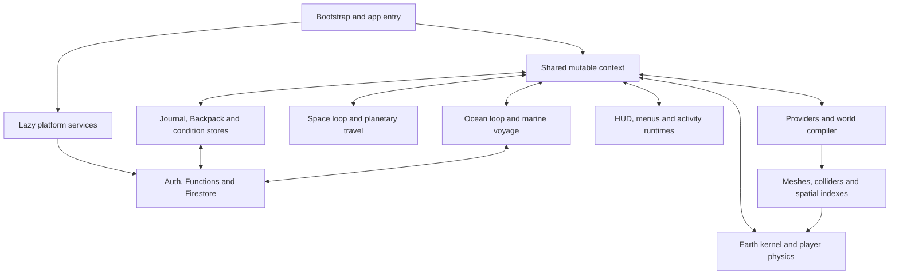
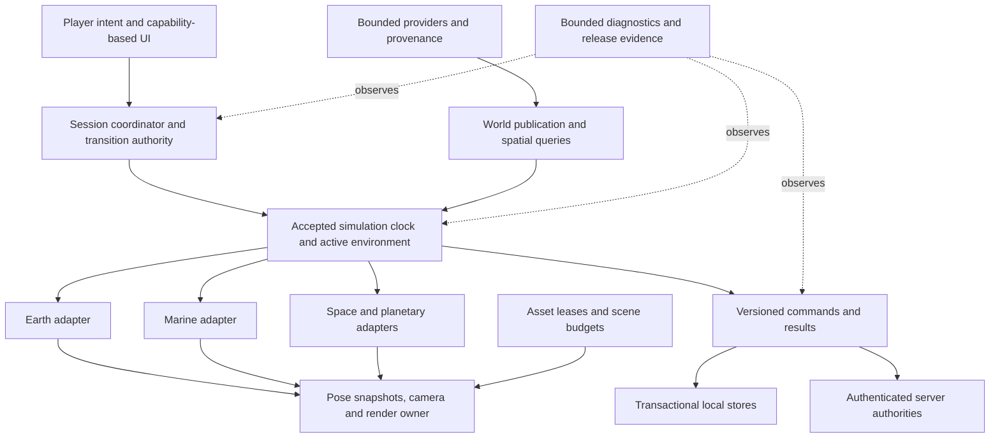

# World Explorer 3D — fresh system review

October 4, 2026 · reviewed runtime source: `919888ec31984b59f4da16c3a93936e5ded86e1f`

**The app has a substantial, reusable foundation, but it needs a period of architectural consolidation before visual expansion.** The biggest problems are dispersed state ownership, incompatible timing policies, fragile asynchronous synchronization and acceptance criteria that do not fully represent smooth, reliable play. Adding more managers, models or tests without changing those boundaries would preserve the underlying problems.

Keep the existing browser product, Three.js renderer, world compiler, curated assets, journeys and player data. Refactor the risky connections between them. An engine replacement, full rewrite, mandatory ECS conversion, or general migration to Rust/WebGPU is not supported by this review's evidence.

This is a new code-based audit and repair plan. Runtime behavior was **not changed**. Production was not deployed. The three diagnostic programs deliberately reproduce existing defects; their successful execution means the defects were demonstrated, not fixed.

Read [the finite repair sequence](POLISH-PLAN.md) and [the verification design](TEST-PLAN.md) after the findings below.

## What was examined

The fresh AST inventory parsed **957 tracked runtime JavaScript files, 214,624 lines**, across the game, shared browser services and Functions. This includes one 2,760-line generated command engine and excludes vendor directories. It is an inventory of the whole runtime surface, **not a claim that every line received manual review**. Manual tracing concentrated on boot, frame execution, ownership, travel, loading, assets, persistence, multiplayer authority, provider access and release tooling. Additional product areas were sampled at their integration boundaries.

- **167 modules import the shared context; 121 directly write to it.** The scan finds 1,135 distinct first-level member names, including computed accesses. This counts direct imported bindings; parameters, aliases and indirect method effects can add more coupling.
- Car state has direct writes in **18 modules**; walking state in 13; camera in 10; scene and renderer in eight each. These include initialization, replacement and nested-property writes, not 18 independent car physics engines.
- No cycles were found in the resolved literal static import graph. That does not remove the bidirectional dependencies carried through the mutable context.
- Nineteen runtime files exceed 1,000 lines, including the generated engine. The largest authored files mix orchestration and feature responsibilities: urban runtime 3,417 lines, Functions entry 2,786, discovery runtime 2,442 and ship interior 2,403. Size is a review signal, not itself a defect.
- The contract inventory selects 364 test files. Of those, 67 contain matching assertions, 51 read source or fixtures and 18 use VM execution. These overlap; they are not coverage percentages. All six separately owned test files passed a fresh syntax check.

Reproducible inventory and scope: [inventory.json](inventory.json), [test-inventory.json](test-inventory.json). The inventory script lives at `scripts/architecture-evaluation/system-review.mjs` and uses the existing isolated Babel tooling.

## How the product currently works

The product combines three principal exploration experiences: mapped Earth, an authored marine expedition, and space/planetary travel. Discovery, games, equipment, progression, creation and social services span those experiences. The architectural challenge is making these shared capabilities operate through the same ownership and failure rules while preserving each environment's specialized simulation.

`shared-context.js` is an untyped `Object.create(null)`. It makes dependencies importable, but does not assign exclusive ownership. `app-entry.js` explicitly relies on import order. The runtime kernel organizes phases and provides fixed steps, but the player update remains variable-step, population uses fixed steps, and Ocean/Space retain separate loops. Session coordination exists, but feature code still performs important transition side effects itself.

## Findings, in repair priority

**F01 · High · Valid shared submarine movement can be rejected after network delay. Demonstrated.**

`app/js/ocean/shared-marine-runtime.js:17` serializes every message through one promise chain. Its interval at line 96 captures poses every 2.5 seconds without in-flight backpressure. `functions/marine-expedition-authority.js:51` measures movement against server receipt times. When a delayed request releases several queued samples, their server times nearly coincide, even though the player took seconds to move between them.

The actual client queue and server reducer were executed with a controlled five-second delay and motion of only 14 units/second, below the server's 34-unit envelope. The first pose passed; the next two failed with “Submarine movement exceeds its travel envelope,” and pilot controls stopped. This is a concrete defect. It is a plausible contributor to the earlier intermittent marine failure, but this experiment does not establish that historical failure's exact cause.

The same client compares server lease expiration directly with local `Date.now()`. A client clock 60 seconds ahead stops control while the server lease remains valid. The captured server-time fields are not used to establish a clock offset.

Repair the protocol as well as the queue: separate reliable discrete commands from replaceable motion samples; bound outstanding work; reconcile after a delay or rejected pose; use server-relative lease time. Do not solve this by merely increasing speed tolerance. Evidence: [marine reproduction](marine-timing-reproduction.json).

**F02 · High · A failed condition save can discard a newer change. Demonstrated.**

`app/js/player/connected-player-state.js:20` clears `pendingCondition` before awaiting a write, then unconditionally reinstates the old change on failure. If a newer change is queued during that wait, it is overwritten. There is also no single-flight guard, so sufficiently separated changes can issue overlapping writes. The server endpoint at `functions/index.js:2159` replaces the condition document without a revision precondition.

In the controlled actual-module test, a 0.9-condition write failed after a newer 0.4 change was queued. The next write sent **0.9 again**; 0.4 was lost. Its snapshot's `pending` flag describes initial subscription readiness, not unsaved mutations. A lone failed write also has no newly scheduled retry in the catch path.

Use one mutation owner with a generation/revision, latest-value preservation, bounded retry and explicit loading/saving/failed states. Define what happens on logout, account switch and disposal. Evidence: [condition reproduction](condition-save-reproduction.json).

**F03 · High for smoothness · Camera response and simulation time are inconsistent. Partly demonstrated, partly source-derived.**

`app/js/space/runtime.js:693` applies constant per-frame camera lerp/slerp factors. The actual overview camera test left **43.4%, 18.9% and 3.6%** of its initial target distance after the same one-third second at 30, 60 and 120 updates per second. The chase camera uses the same per-frame pattern. Changing frame cadence therefore changes camera feel; physics also uses the resulting camera axes for control orientation.

Earth has another inconsistency. `main.js:94` permits two fixed steps, while `runtime/kernel.js:171` separately passes a variable delta up to 100 ms into update systems. `core-frame-systems.js:35` advances the player through `appCtx.update(frame.dt)`; `physics.js:125` subdivides that delta. `living-world/runtime.js:318` advances population through fixed updates. On a 100 ms raw frame, the configured paths can advance the player by 100 ms and population by about 33 ms. This is a source-derived timing mismatch, not a new whole-world collision measurement.

Establish one accepted simulation delta and dropped-time policy, with presentation interpolation and elapsed-time camera damping. Migrate environments individually with handling parity tests. Evidence: [camera reproduction](space-camera-reproduction.json). Browser animation must account for timestamp and display cadence; see [MDN's animation-frame guidance](https://developer.mozilla.org/en-US/docs/Web/API/Window/requestAnimationFrame).

**F04 · High architectural priority · Shared mutable state prevents clear authority boundaries. Measured.**

The context counts above show why changes have a wide impact. A function can read another subsystem's internal objects or call an optional context method without declaring whether that capability is required, ready, suspended or unavailable. A missing optional call can silently do nothing. Boot order and feature-specific guards carry obligations that should belong to explicit interfaces.

Start with active environment, actor pose, camera/render ownership, pause and persistence. Each needs one writer and read-only snapshots or commands for consumers. Keep a temporary compatibility facade, prohibit new context exports, and remove old writes as each owner is migrated. Splitting a large file while preserving identical cross-writes would not fix this problem.

**F05 · High architectural priority · Lifecycle and transition safety are present but uneven. Source finding.**

`session-coordinator.js:114` has a guarded transition utility, but the search found no callers outside that module; most modes use lower-level begin/commit/exit operations. It does not by itself guarantee rollback if entry fails after commit. Existing mode-specific guards must be retained while that contract is improved.

The shared marine `applyStage()` at line 29 awaits world entry and recovery without checking a session generation after each await. Its `accept()` can receive a different stage during that transition; the in-progress guard defers application without an explicit immediate catch-up at completion. `leave()` refuses while busy/transitioning, making teardown dependent on those operations completing. These are concrete code paths requiring adversarial transition tests, not a claim that a live stale-stage fault was reproduced today.

The lifecycle scope and the generation-aware platform registry are good foundations. Extend them to activity sessions and asynchronous work: create, prepare, commit, suspend, resume, dispose. Own listeners, workers, timers, subscriptions, DOM and asset leases together. Raw listener/timeout counts are **not** evidence of leaks; many are valid application-lifetime resources.

**F06 · High · Performance acceptance can pass visible stalls. Confirmed gate omission.**

`performance-retention.mjs:227` records `worstFrameMs`; the predicate at line 240 never checks it. The retained matching-source flight receipt reports 56.83 FPS and p99 33.4 ms, with a **649.9 ms worst frame** over 90 seconds. The four ground samples are only approximately five seconds each. These numbers explain how an apparently healthy frame rate can coexist with the user's complaint.

`config/performance-budgets.json` also permits 120 seconds to first playable on desktop, while `runtime/workload-policy.js:2` declares a 25-second target. The latter is not an enforced deadline. The current budgets primarily protect historical parity; they do not fully define the desired player experience. The retention allowance of 256 geometries, 64 textures and 256 MiB heap growth also needs a steady-state slope check rather than only a generous absolute allowance.

Preserve the current FPS floor; prioritize hitch count, maximum stall, input response and reliable loading. Separate initial construction from active play, and make intentional streaming waits visible and recoverable. `core-frame-systems.js:47` currently stops player simulation when nearby road detail is not ready; distinguish this deliberate safety stop from a rendering/GC stall. See the proposed measurements in [TEST-PLAN.md](TEST-PLAN.md). Long tasks block browser responsiveness; [web.dev explains how to identify and split them](https://web.dev/articles/optimize-long-tasks).

**F07 · High · “Release ready” is narrower than actual release acceptance. Confirmed.**

`scripts/verification/release-scope.mjs:74` derives `releaseReady` from current candidate/backend evidence and checkpoint completeness. It does not require physical-device acceptance, an ordinary hosted App Check journey, the fresh-player review or provider entitlement evidence. Those requirements exist separately in prose. Consequently, a green automated gate can be mistaken for a complete launch decision.

Earlier same-source evidence includes an ordinary hosted attestation failure even though the final automated candidate/backend matrices passed. This audit re-read those records; it did not rerun that hosted browser flow or establish the reason for rejection. Debug-attested automation cannot replace ordinary-browser acceptance. [Firebase recommends examining legitimate-client verification before enforcement decisions](https://firebase.google.com/docs/app-check/monitor-metrics?hl=en); disabling protection is not the proposed fix.

Create one release decision that distinguishes automated acceptance, hosted acceptance, physical/human acceptance and operational entitlement. Preserve exact artifact identity. Separately, `execution-evidence.mjs:16` binds all nonexcluded documentation and untracked audit files into the runtime fingerprint. That makes writing an audit invalidate reuse even when shipped bytes are unchanged. Introduce separately hashed runtime, test, environment and documentation inputs through an explicit reviewed manifest; never simply waive identity checks.

**F08 · Medium · Journal queries load full histories before applying small limits. Confirmed scaling issue.**

`discovery/profile-store.js:453`, `:465` and `:486` call `getAll()`, sort the entire result and then slice. `discovery/runtime.js:363` requests only 100 items/events, but still incurs full-history work. Migration also reads histories before determining whether a current character migration is already present. Larger existing saves can therefore cost much more than new-account tests reveal.

Use indexed reverse cursors and bounded pages, cache migration completion safely, and avoid refreshing unrelated projections for every UI action. Keep atomic Journal transactions, import backups and receipt outbox behavior. No actual save was modified and no long-history browser benchmark was run in this review.

**F09 · Medium, high before competitive rewards · Persistence authority is sometimes mistaken for gameplay authority. Confirmed boundaries.**

Server-only wallet writes and transactional marine controls are valuable. However, `saveExplorerPlayerCondition` accepts any authenticated condition between 0 and 1. That is account-scoped storage of a client claim, not server-validated damage/healing. The leaderboard rules at `firestore.rules:1698` and `:1961` validate identity, shape and bounds while allowing client-submitted results; they do not prove the game occurred. Marine validates a travel envelope, not reef collision on a server simulation.

Document these distinctions per field. Local sandbox state can remain client-owned. Competitive scores, transferable value and shared control need their own explicit server validation and idempotent receipts if the product promises integrity. Do not describe schema validation or App Check as proof that gameplay is authentic. This was a source trust-boundary review, not penetration testing or a complete billing/security audit.

**F10 · Medium · Type and test assurance are much smaller than their names can imply. Confirmed.**

`tsconfig.boundaries.json` checks two entry files with `checkJs:false`. The narrow boundary pilot is useful, but does not type-check the application or the context. `verify:pr` does not invoke the separate boundary type command. The sensitivity script explicitly tests one cleanup mutation; it is not a mutation score for the suite. The existing contract runner correctly labels its results component/source evidence.

Add checked contracts where real ownership changes are made: session identity, coordinate frame, pose, command/result, provider evidence and save revision. Use actual exported implementations and adversarial timings for high-risk tests. Keep structural assertions when they enforce a real constraint; do not treat counts or source spelling as behavioral coverage.

**F11 · Medium · The shipped dependency surface extends beyond the package lock. Confirmed packaging fact.**

`modules/manifest.js:3` loads pinned Three r128 scripts from external CDNs. Browser Firebase imports use 10.12.5, while the root package declares Firebase 12.9.x. `hosting-artifact.mjs:197` preserves HTTPS imports as external. An npm audit of the installed tree therefore does not establish the exact assurance of every script the player executes. This finding does not allege a known vulnerability in those versions.

Create a runtime dependency inventory covering URLs, versions, provenance and integrity/availability policy. Align or deliberately separate SDK test/runtime versions and verify the difference. Assess self-hosting required renderer dependencies, failure messaging and cold-cache behavior. An engine upgrade should be its own compatibility project with shader/material/loader/visual parity evidence, after the immediate correctness work.

**F12 · Medium · Operations and support need an application-level reliability contract. Source finding plus explicit unknowns.**

`runtime-diagnostics.js:12` keeps a bounded local error list; `js/analytics.js` mainly records consented product activity. The inspected code does not provide a complete build-tagged support receipt tying a player-visible failure to active session, mode, provider, request and last transition. Avoid collecting raw coordinates, account tokens or capture contents to solve this.

The geocoder has a sensible application-wide lease, seven-day cache and 5,000 uncached requests/day cap (`functions/place-lookup.js:31`). This is safe provider pacing, not demonstrated public-launch capacity. Concurrent uncached searches can receive 429 responses. The client provider registry already bounds requests, deadlines, shared cancellation and cache entries; preserve it. A launch plan still needs expected concurrency, degraded-mode behavior, costs/quotas, dataset expiration, and entitlement ownership. Commercial weather entitlement remains unverified in the retained release record; this audit did not inspect a paid account or make a licensing determination.

## Foundations to retain

The audit does not support treating everything as poor code. These implementations should become shared patterns:

- World load request/session identities and cancellation, provider provenance, coordinate-origin commitment and explicit road unit conversion.
- The platform service registry's generation checks and stale-load disposal.
- Journal read/write transactions, migration/import backups, server receipt outbox and game-result save/retry UI.
- Asset template leases, bounded idle cache, skeleton disposal, curated catalog provenance and existing model-budget tests.
- Server-owned economy documents, room admission transactions, authenticated rules tests and command receipt deduplication.
- Immutable hosting artifacts and distinction between component, packaged browser, emulator and live-service evidence.

Resource lifetime should remain explicit: removing an object from a Three.js scene does not release all of its GPU resources, and shared textures/materials must not be disposed prematurely. This matches the [Three.js disposal guidance](https://threejs.org/manual/pages/how-to-dispose-of-objects.html). Improve the existing lease pattern before increasing visual density.

## Coverage and remaining uncertainty

| Area | Depth in this review | Decision / further verification |
|---|---|---|
| Boot, module graph, build packaging | Whole-runtime AST inventory; manual boot/build trace | Keep ESM/lazy services; formalize dependency contracts |
| Earth driving, walking, NPCs and timing | Manual main/kernel/physics/population trace | Unify time policy; preserve handling/collision authority |
| Space and camera | Manual loop trace; actual camera math reproduction | Repair elapsed-time damping; test landing/docking/return |
| Ocean, boat, swimming and shared voyage | Deep shared-state/protocol review; sampled movement/ownership | Fix demonstrated queue/clock defects; test personal/shared recovery separately |
| World generation, roads, terrain and streaming | Manual publication/session/worker/readiness boundaries | Preserve geographic truth; budget publication and expose recoverable waits |
| Input, pause and activities | Sampled semantic input, pause clock, plugin/result interfaces | One capability/action contract; interrupt/retry tests across modes |
| Save, Journal, inventory and progression | Deep store/sync trace; actual save-race reproduction | Preserve transactional work; repair ordering, query bounds and account boundaries |
| Multiplayer and server authority | Marine deep; room/economy/rules boundaries sampled | Do not promise authoritative competition from client claims |
| Assets, renderer lifetime and visual readiness | Cache/loader/disposal/catalog review; prior receipts read | Keep leases and budgets; measure total scene cost before adding art |
| Live Earth, weather, cameras and data truth | Provider/contracts/controller boundaries sampled | Keep source age/coverage visible; validate outage, quota and entitlement |
| Creation, interiors, Capture and moderation | Inventory and integration/security-rule sampling | Full workflow fault testing required; no claim of complete geometry/security review |
| Accounts, billing, privacy and accessibility | Integration and existing gate inventory only | Dedicated specialist/behavioral acceptance still required; no new billing, legal or accessibility certification |
| Production operations | Fresh public build identities and Functions inventory | 78 production Functions enumerated; endpoint behavior/configuration not all verified |
| Tests and release process | Manual gate/CI/fingerprint review; fresh contract inventory | Close gaps above; do not equate green totals with complete release approval |

Fresh public reads confirm production still serves `5.4.0+1532bdfbb5c1.319d215f60318297.production`; the preview serves the reviewed `919888ec` candidate. These are different releases. Code findings above apply to the reviewed candidate; this review does not assert every finding exists in the older production build. See [live-inventory.json](live-inventory.json).

No browser/emulator/performance matrix was rerun for this documentation-only audit. Earlier 82/82 candidate and 3/3 backend results were checked as prior evidence, alongside their limits and recorded failure. Physical phone behavior, ordinary hosted attestation success, long-history performance, expected launch concurrency and uncoached comprehension remain unproven here.

## Architectural direction

Use a modular application with a small composition root and explicit owners. Keep specialized environment implementations behind contracts. Do not make the shared context larger.

This is a logical boundary design, not a demand for new services or renderer instances. Earth, Ocean and Space may keep separate renderers initially, provided exactly one active owner controls presentation and every inactive renderer has a defined resource policy. Migrate existing code through adapters, retaining visual content and saved data. Visual work begins after the finite acceptance boundary in the plan, with one measured reference scene per environment.
