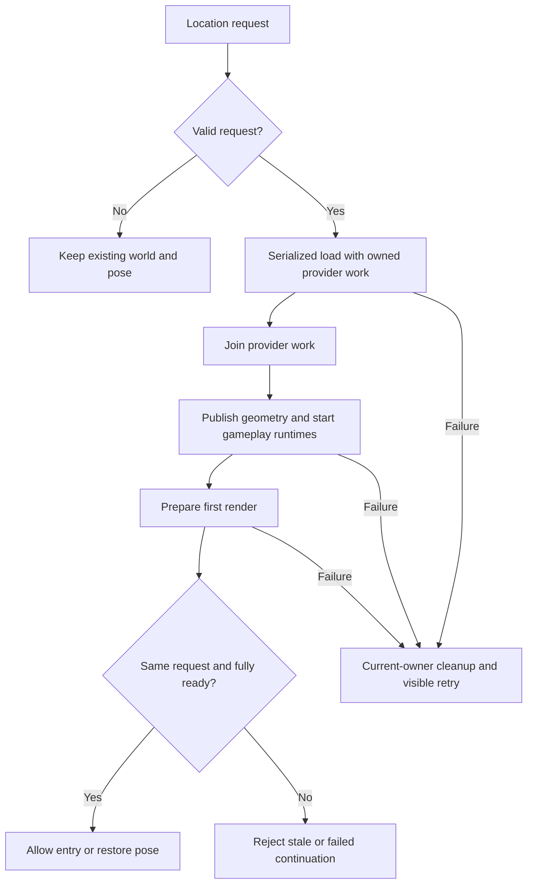

# Fresh architecture audit and implementation plan

October 6, 2026. Baseline `7f5b22c6` (runtime `86fdc6e3`). Owner request: audit code and architecture, identify underlying conflicts and loading problems, then implement a tested plan. Keep existing location work and saves; worldwide travel must eventually be optional. This audit does not authorize replacing functioning game systems or claiming completed global streaming.

## Method and limits

Fresh binding-aware Babel inventory: 989 tracked runtime JavaScript files, 217,832 lines including generated code; 167 direct shared-context imports, 121 direct writer modules and 1,136 first-level context members. No resolved static import cycles. These counts describe coupling, not correctness or measured performance. Injected/aliased context access and dynamic runtime relationships require manual tracing. `inventory-summary.json` records source identity and method; full rows are in `output/architecture-evaluation/2026-10-06-fresh/inventory.json`.

Manual source review follows startup/lazy imports → location request → provider work → terrain/transport/building publication → gameplay startup → first render → resume/exit. It also checks frame ownership/simulation timing, deferred tasks, renderer lifetime, source/cache limits, save/shared-session boundaries and verification behavior. This is a cross-system audit with targeted deep review, not a claim that every line or gameplay mode is certified.

## Findings, ordered by risk

| ID | Finding and evidence | Consequence / decision |
| --- | --- | --- |
| A1 — high | `world/load-runtime-session.js` resets the old world before rejecting an invalid request. `earth-core/world-load-request.js` coerces null/blank coordinates to zero. Actual-module reproduction erases the prior building collection, clears ready state and accepts empty coordinates. | Validate request admission before any destructive world state change; keep previous publication and player pose on rejection. Reject absent coordinate values while accepting actual numeric zero. |
| A2 — high | `earth-session.js` awaits `loadRoads()` but ignores its result/readiness. Actual consumer reproduction receives a failed result yet restores pose, draws and stamps selection loaded. Title launch has a separate, weaker failed-status check. | A single usable-world readiness decision must control resume, title and in-session globe entry, map search, GPS recenter and room entry. The completed result must identify the same request and sequence as the ready publication. Never stamp or restore a rejected/superseded world. Preserve failure identity and expose retry. |
| A3 — high | Runtime session `runProviderWork` starts tasks even after abort. No session-owned drain joins its provider operations. `load-roads.js` only terminalizes one special compiler-error class; other exceptions escape with loading ownership unresolved. | The load session owns admission, cancellation, completion and draining. All exits must drain before replacement; every unexpected failure must stop simulation and release rejected world resources through the existing owner. |
| A4 — medium | `runtime/workload-policy.js` has application-wide completion IDs and no freshness predicate. `earth-ambient-state-${sequence}` adds a permanent completed entry per location and can run after that publication has retired, forcing sky/weather refresh for a different world. | Distinguish application-once work from publication work. Skip stale publication callbacks and do not retain completed publication IDs indefinitely. |
| A5 — high, GC pause mechanism confirmed; repair open | Render and simulation are centrally ordered, but player simulation is variable-step while population uses fixed updates; source/geometry workers and background slices have separate lifetimes. Prior ordinary long test reproduces 533/650 ms pauses. Fresh actual movement correlates a 517.4 ms walking frame with 500.67 ms GC CPU and a 151 ms driving frame with 118.41 ms GC CPU. Uniform/render paths dominate sampled temporary allocations; a real WebGL typed-cache experiment increased allocations and was rejected. A unique allocator repair is not yet proven. | Do not infer that A1–A4 fix active-play stalls. Preserve frame thresholds and coverage. Capture a fresh bounded walking/driving trace with cheap timing, then isolate the dominant mechanism before another rendering rewrite. No speculative library patch. |
| A6 — high for worldwide travel | Fixed mapped region and detailed district, local x/z session poses, whole-location reset and regional/detailed collision ownership remain incompatible with unrestricted streaming. Cell-relative far transforms alone do not change that. | Keep global travel disabled. Separate geographic persistence and cell ownership are required before a functional optional mode. Preserve the existing location session and unknown save fields. |
| A7 — medium | Shared context is a broad service locator; car, walker, camera and environment state have many direct writers. Multiple readiness/failure booleans can contradict terminal session state. | Repair demonstrated lifecycle boundaries first. Further extraction should move behavior and ownership together, not just split large files or rename methods. No whole-app framework rewrite. |
| A8 — verification gap | Large passing contract totals did not exercise invalid request preservation, failed resume or admission after cancellation. The audit added real load failure and recovery. It also found that four inline async Playwright wait predicates returned truthy promises before readiness was true; installed Playwright source and a browser control reproduced the defect. Those waits now use synchronous predicates and a source guard rejects that pattern. Full diagnostics copy extensive world data and can distort timed tests. | Add fault-injection tests at actual exported boundaries and a real-browser failed-load → menu → successful-retry journey. Keep heavy diagnostics outside measured movement windows; preserve failures as evidence. |

`output/architecture-evaluation/2026-10-06-fresh/reproduction-before.json` records the A1–A3 reproductions using actual exported functions with controlled provider/renderer/UI boundaries. It is component evidence, not a browser run. Earlier failed attempts only lacked fixture setup and did not establish additional runtime defects.

## Implementation sequence and completion criteria

1. **Request admission and provider lifetime.** Validate immutable requests before reset; reject invalid inputs without replacing prior state. Track provider tasks, reject new work after cancellation/terminal state, and drain all launched work. Tests cover empty vs zero coordinates, prior-world preservation, delayed/failed providers and cancellation. No persistent schema changes.
2. **One terminal failure and usable-world decision.** Route compiler/provider/startup failures through guarded cleanup. Await finalization before leaving the load scope. Resume/title require the same ready publication; failed/superseded outcomes cannot spawn, render or mark loaded. Fault-inject actual functions and then the assembled browser; successful retry must load the full district and preserve a saved favorite.
3. **Publication-owned deferred work.** Add explicit freshness and once/repeat policy, preserve existing app startup order, and guard the ambient callback with its publication identity. Test retirement before callback, rejected predicate/task and repeated loads without unbounded completion keys.
4. **Integration and causal performance evidence.** Full PR/source/ownership checks, prescribed game client, actual failure/retry and existing city-preservation journeys. Preserve the previous artifact before packaging. Audit ordinary movement with a bounded trace; distinguish lifecycle correctness from hitch acceptance. Do not publish a production claim based on component checks or one smooth window.

## Current status

The four-step audit plan above is complete for the demonstrated loading defects and the causal diagnostic. A1–A4 and the identified A8 verification defects are implemented and tested. A2 includes all identified Earth entry consumers and rejects a successful result from an older request. Active-play performance and unrestricted worldwide streaming remain open; this is not a full product release clearance.

Local runtime checkpoint: **9579cd62**. Artifact: **5.4.0+9579cd62ae62.a9ec3bf5ff67cacf.staging**, 612 verified files, 188 runtime bundles and 84 accepted-ground files. Asset-manifest SHA256: `304d55287078e43aa8f5ee744d328d959ae426b29f74c0b375d25999c5e70263`. Documentation-only checkpoints do not change these packaged bytes. GitHub, public preview, production and player records were not changed. Existing location content, prior artifacts and all four saved candidates remain preserved.

### Implemented ownership rules

- Validate an immutable location request before reset or cancellation. Invalid coordinates cannot clear the current world or cancel a valid in-flight request.
- A load session owns its launched provider operations. Cancellation closes admission; every exit joins outstanding provider work before replacement or disposal. A stale failure cannot dispose the newer world.
- Terminal failure stops play, releases the rejected world through the existing resource owner and returns to the location selector with a visible retry message. The Explore prompt appears only after successful entry.
- Readiness requires one matching runtime, committed publication and completed request, with both geometry and gameplay ready. Title, resume, search, GPS and room consumers use that rule before spawning, restoring a pose or stamping a location loaded.
- Publication callbacks verify their owner is still current and do not accumulate permanent completion IDs. Existing application startup ordering is preserved.

### Verification ledger

Evidence levels are intentionally separate. Passing components do not certify hosted identity, physical devices or every gameplay mode.

| Check | Result and scope | Evidence |
| --- | --- | --- |
| Full PR chain on final runtime | **PASS — 2,024/2,024 contracts**, dependency, source, ownership, boundary types, inventory and sensitivity. Focused actual-export lifecycle/consumer/session set: 17/17. | `/tmp/we3d-lifecycle-identity-pr.log`, `/tmp/we3d-lifecycle-identity-focused.log` |
| Before-repair reproductions | Invalid admission destroyed the prior collection; blank coordinates became zero; provider work started after abort; failed resume restored/stamped; older successful result was accepted against a newer ready world. | `output/architecture-evaluation/2026-10-06-fresh/reproduction-before.json`, `stale-ready-before.json` |
| Final packaged browser journey | **PASS — all 11 checks, five successful worlds plus injected failure/retry.** Custom Baltimore → lower presentation quality reload → preset Baltimore → Hollywood → Baltimore. All four Baltimore visits keep **49,023 buildings / 18,758 roads**; Hollywood keeps 34,999 / 18,832. Favorites, ready state, live frames, renderer, resources and input repeat isolation pass. Invalid live admission preserves publication, generation, pose and counts. | `output/verification/architecture-result-identity-final/report.json`; gameplay and failed-menu screenshots inspected |
| Packaged saves and rollback | **PASS — final candidate → 37a12d11 fallback → final candidate.** Journal upgrade, original/newer records, unknown fields, equipment/ammo and unrelated pending account data preserved in disposable storage. All 79 reviewed runtime/configuration differences pinned. | `output/release-evidence/current/migration-rollback/report.json`; three Journal screenshots inspected |
| Prescribed game client | **PASS — three drive/turn/idle bursts**, no error files; gameplay states and images inspected. This is a short control check, not sustained performance acceptance. | `output/verification/architecture-result-identity-game-client/` |
| Packaging | **PASS — build and content-byte verification.** | `/tmp/we3d-lifecycle-identity-build.log`, `/tmp/we3d-lifecycle-identity-artifact.log` |
| Movement diagnosis | **COMPLETE; stalls reproduced.** Two 90-second ordinary-keyboard/RAF routes under CPU/allocation/GC instrumentation, with the existing coverage and zero outstanding providers at the end. | `output/architecture-evaluation/2026-10-06-movement/report.json` and CPU/allocation summaries |
| Uniform-storage experiment | **REJECTED.** Actual M1 WebGL, baseline → temporary Float64 caches → restored original, each 90 seconds; source/artifact never patched. All 5,525 eligible initialized float caches tested, same 67 programs and the existing coverage. | `output/architecture-evaluation/2026-10-06-uniform-storage/report.json`, summaries, images and preserved `experiment.mjs` |

The installed-browser wait control is retained at `output/architecture-evaluation/2026-10-06-fresh/wait-predicate-reproduction.json`: an async false predicate was accepted, a synchronous false predicate timed out, and the corrected real transition waited for readiness.

Earlier failed evidence is retained: the first journey had an unattributed marine cancellation, a focused fixture restored its document before GPS cleanup, and an async browser wait raced actual failure completion. Each was diagnosed rather than reclassified as a pass. Earlier successful de3c520e five-load and ca762119 failure/retry/save evidence remains separate from the final candidate. Save evidence before the last readiness change is retained under `output/release-evidence/history/pre-result-identity-ca762119/`.

### Performance findings and remaining architecture work

The fresh trace on ca762119 records walking at 40.64 FPS with a **517.4 ms** maximum and driving at 42.18 FPS with a **151 ms** maximum. These are instrumented diagnostic results, not release benchmarks. GC accounts for most of those two pauses. Road-readiness wait counters increased by **zero** in both windows. The capture spatial selector also accounts for 80.39 ms in a separate 115.7 ms driving frame. Its source can validate the entire resident building list or rebuild its index; the sample does not distinguish those costs, so a first-build diagnosis is not established.

The final-source real WebGL storage experiment estimated **1,348.8 → 1,659.9 → 1,284.4 KiB allocated per frame** for baseline, temporary typed caches and restored original. Worst frames were **483.4 → 232.3 → 50.6 ms**. The changed caches allocated about 23% more per frame than the first baseline; the restored renderer was smoothest. This rejects that storage change and demonstrates why one smoother window cannot establish a repair. Sampling includes collected objects and estimates cumulative allocation, not resident heap. Other owner browser activity was preserved and remains an uncontrolled host variable. No forced collection occurred during these movement windows, no performance budget changed and no buildings were thinned.

Remaining work has explicit exit conditions:

1. **Active-play allocation and retention:** isolate the dominant render/object allocation and retained-graph costs, implement one measured ownership/storage repair, and repeat ordinary walking/driving with the existing coverage. Accept only with the existing stall and retention checks; the rejected uniform patch must not be promoted.
2. **Capture selection scheduling:** record validation versus rebuild costs and move proven long work off the play frame while keeping in-place building edits correct. Avoid a generation-only cache that silently misses edits.
3. **Release integration:** run the complete immutable matrix after performance passes; finish ordinary hosted sign-in/shared/save recovery, named physical devices and fresh-player acceptance. Production still lacks the current environment/place Functions and needs the reviewed coordinated backend/frontend release. Read-only inventory: `output/architecture-evaluation/2026-10-06-fresh/live-identities.json`.
4. **Optional worldwide mode:** implement geographic persistence, cell-owned terrain/roads/buildings/collisions, origin transitions and bounded eviction, followed by off/on/off compatibility and long travel. The current fixed-location boundaries and local poses are not unrestricted streaming. Existing locations and saves remain the supported mode; no partial toggle is exposed.

Shared-context coupling remains a structural liability, but the inventory found no resolved static import cycle. Future extraction should transfer behavior and lifetime ownership together and require a concrete regression/performance benefit. File splitting or a framework rewrite alone is not an acceptance criterion.

## October 7 release-admission regression

Observed ordinary Git status return a clean checkout while a fresh monitor-disabled scan found modified verification source. An isolated Git repository with a monitor that missed an edit reproduces the flaw: sourceFingerprint previously returned dirty=false and the previous accepted identity for changed game bytes. Release fingerprint Git reads now override filesystem-monitor/untracked-cache/ignore-stat settings for that invocation, retain normal ctime checks and preserve user repository settings. The new regression fails before the fix and passes after; seven focused fingerprint/artifact/traversal-contract checks pass. This strengthens release admission without changing game runtime.

The first f182 sustained run records a 450 ms walking pause and then terminates on the actual custody dialog; it is not accepted. The harness now acknowledges custody through the ordinary UI between windows, records it as failure, preserves required movement/time thresholds and can finish the independent retention checks. No failed movement window becomes a pass.
